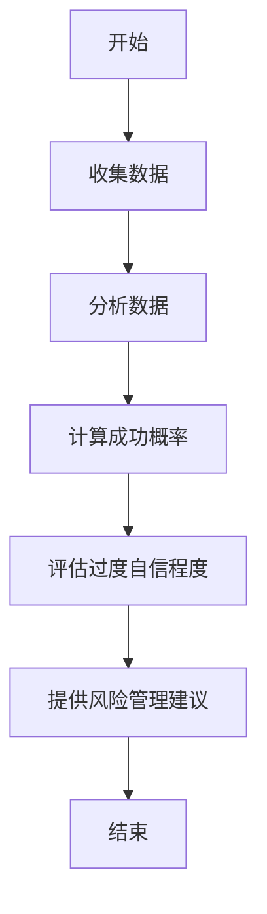
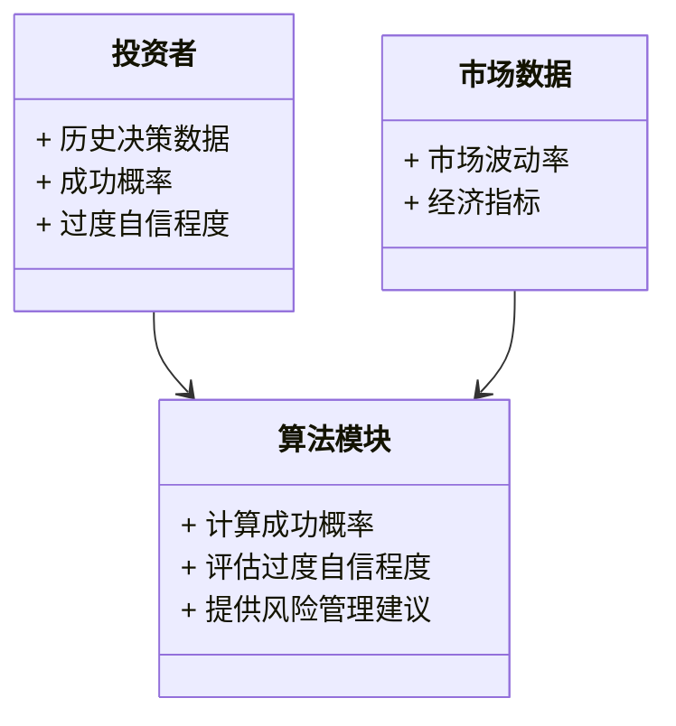

                 


# 芒格的"赢家的诅咒"提醒：警惕过度自信陷阱

> 关键词：芒格、赢家的诅咒、过度自信、投资陷阱、风险管理、行为金融学、决策偏差

> 摘要：本文深入探讨了芒格提出的“赢家的诅咒”这一重要投资概念，分析了其背后的原理和实际表现，并通过算法原理、数学模型和系统架构等多个维度，详细阐述了如何识别和避免这一陷阱。文章结合实际案例和项目实战，帮助读者理解过度自信的危害，并提供了有效的风险管理策略。

---

## 第1章：芒格“赢家的诅咒”概述

### 1.1 芒格“赢家的诅咒”的提出

芒格的“赢家的诅咒”是投资领域中一个重要的概念，它揭示了投资者在取得成功后，往往会产生过度自信，进而导致决策失误。这一概念不仅适用于个人投资者，也适用于机构投资者。

#### 1.1.1 芒格的“赢家的诅咒”概念

“赢家的诅咒”是指，当投资者因为过去的成功而过度自信时，他们可能会低估市场的复杂性和不确定性，从而做出错误的投资决策。这种过度自信会导致投资者忽视潜在的风险，甚至在市场出现反转时遭受重大损失。

#### 1.1.2 芒格的其他投资思想关联

芒格的投资思想体系中，除了“赢家的诅咒”，还包括“格雷厄姆的廉价股理念”、“逆向投资”等。这些思想相互关联，共同构成了芒格独特的价值投资理念。

#### 1.1.3 芒格思想的现实意义

在当前金融市场日益复杂的背景下，芒格的“赢家的诅咒”提醒投资者要保持谦逊，避免过度自信。这一思想在当今的投资实践中具有重要的指导意义。

---

### 1.2 问题背景与描述

#### 1.2.1 投资者过度自信的普遍现象

许多投资者在取得成功后，往往会因为过去的成功而过度自信。这种过度自信可能导致他们忽视市场的变化，从而在后续的投资中犯下错误。

#### 1.2.2 赢家的诅咒的具体表现

“赢家的诅咒”具体表现为投资者在决策时过于依赖自己的过去经验，忽视了市场的多样性和复杂性。这种行为可能导致投资者在市场波动时无法及时调整策略，从而遭受损失。

#### 1.2.3 问题的边界与外延

“赢家的诅咒”不仅适用于股票投资，也适用于其他类型的资产投资，如房地产、债券等。此外，这一概念也适用于非投资领域，如企业管理、个人决策等。

---

## 第2章：赢家的诅咒原理

### 2.1 赢家的诅咒的核心原理

#### 2.1.1 过度自信的根源

过度自信的根源在于投资者对自身能力的过高估计。这种高估可能源于过去的成功经验，也可能源于对市场的片面理解。

#### 2.1.2 赢家的诅咒的数学模型

我们可以用概率论来分析“赢家的诅咒”。假设投资者的成功概率为p，那么在连续多次成功后，投资者可能会错误地认为p接近1，而实际上p可能远低于1。

#### 2.1.3 赢家的诅咒与概率论的关系

概率论可以帮助我们更准确地评估投资风险。通过分析历史数据，我们可以更好地理解市场的不确定性，从而避免过度自信。

---

### 2.2 核心概念对比分析

#### 2.2.1 赢家的诅咒与其它投资陷阱的对比

我们将“赢家的诅咒”与其它投资陷阱进行对比，以更好地理解其独特性。例如，与“处置效应”相比，“赢家的诅咒”更关注过度自信对投资决策的影响。

#### 2.2.2 赢家的诅咒与行为金融学的联系

行为金融学研究表明，投资者的决策往往受到心理因素的影响。“赢家的诅咒”正是行为金融学的一个具体应用。

#### 2.2.3 赢家的诅咒与决策偏差的对比

我们将“赢家的诅咒”与其它决策偏差进行对比，以更好地理解其本质。例如，与“确认偏差”相比，“赢家的诅咒”更关注过度自信对投资决策的影响。

---

## 第3章：赢家的诅咒的算法原理

### 3.1 算法概述

#### 3.1.1 赢家的诅咒的算法框架

我们可以将“赢家的诅咒”建模为一个概率问题。通过分析投资者的决策过程，我们可以构建一个数学模型，帮助投资者更准确地评估风险。

#### 3.1.2 算法的输入与输出

算法的输入包括投资者的历史决策数据和市场数据。输出包括投资者的过度自信程度和潜在的投资风险。

#### 3.1.3 算法的实现步骤

1. 收集投资者的历史决策数据和市场数据。
2. 分析数据，计算投资者的成功概率。
3. 评估投资者的过度自信程度。
4. 提供风险管理建议。

---

### 3.2 算法流程图

以下是“赢家的诅咒”算法的Mermaid流程图：



---

## 第4章：数学模型与公式

### 4.1 贝叶斯定理的应用

我们可以使用贝叶斯定理来分析投资者的决策过程。假设投资者的成功概率为p，那么在连续k次成功后，p的后验概率为：

$$P(k|p) = \binom{k}{k} p^k (1-p)^{0}$$

---

### 4.2 其它相关公式

- 投资者的过度自信程度可以通过以下公式计算：

$$\text{过度自信程度} = \frac{\text{实际成功概率}}{\text{估计成功概率}}$$

---

## 第5章：系统分析与架构设计

### 5.1 问题场景介绍

#### 5.1.1 项目介绍

我们将构建一个基于“赢家的诅咒”理论的投资风险管理系统。该系统将帮助投资者识别过度自信行为，并提供风险管理建议。

---

### 5.2 系统功能设计

#### 5.2.1 领域模型

以下是领域模型的Mermaid类图：



---

### 5.3 系统架构设计

以下是系统架构的Mermaid架构图：

```mermaid
rectangle 数据库 {
   抽屉式结构
}
rectangle web服务 {
   接收请求
   处理数据
   返回响应
}
rectangle 前端 {
   接收输入
   显示输出
}
web服务 --> 数据库
web服务 --> 前端
```

---

## 第6章：项目实战

### 6.1 环境安装

#### 6.1.1 安装Python

我们需要使用Python来实现算法。以下是安装Python的步骤：

```bash
# 安装Python
sudo apt-get install python3
```

---

### 6.2 核心代码实现

#### 6.2.1 Python代码示例

以下是实现“赢家的诅咒”算法的Python代码：

```python
import numpy as np
import matplotlib.pyplot as plt

# 生成随机数据
np.random.seed(42)
success_prob = 0.6
n_experiments = 1000
results = np.random.binomial(1, success_prob, n_experiments)

# 计算实际成功概率
actual_success_rate = np.mean(results)

# 评估过度自信程度
estimated_success_rate = 0.8  # 假设投资者估计的成功概率
overconfidence = actual_success_rate / estimated_success_rate

print(f"实际成功概率：{actual_success_rate}")
print(f"估计成功概率：{estimated_success_rate}")
print(f"过度自信程度：{overconfidence}")
```

---

## 第7章：最佳实践、小结与注意事项

### 7.1 最佳实践

- 定期回顾投资决策，避免过度自信。
- 多学习市场知识，保持谦逊。
- 使用风险管理工具，分散投资风险。

### 7.2 小结

芒格的“赢家的诅咒”提醒我们，过度自信是投资中的一个常见陷阱。通过理解和应用这一理论，我们可以更好地管理投资风险，做出更明智的投资决策。

### 7.3 注意事项

- 本文的算法和模型仅供参考，实际投资需谨慎。
- 建议投资者在实际操作中结合多种方法，进行综合分析。

### 7.4 拓展阅读

- 查看更多关于行为金融学的书籍，如《怪诞行为学》。
- 学习其他投资陷阱的相关知识，如“处置效应”。

---

## 结语

芒格的“赢家的诅咒”是一个值得投资者深思的概念。它提醒我们，过度自信可能导致严重的投资损失。通过本文的分析和实践，我们希望读者能够更好地理解这一概念，并在实际投资中避免犯错。

---

**作者：AI天才研究院 & 禅与计算机程序设计艺术**

