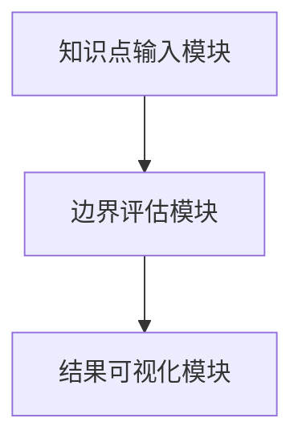
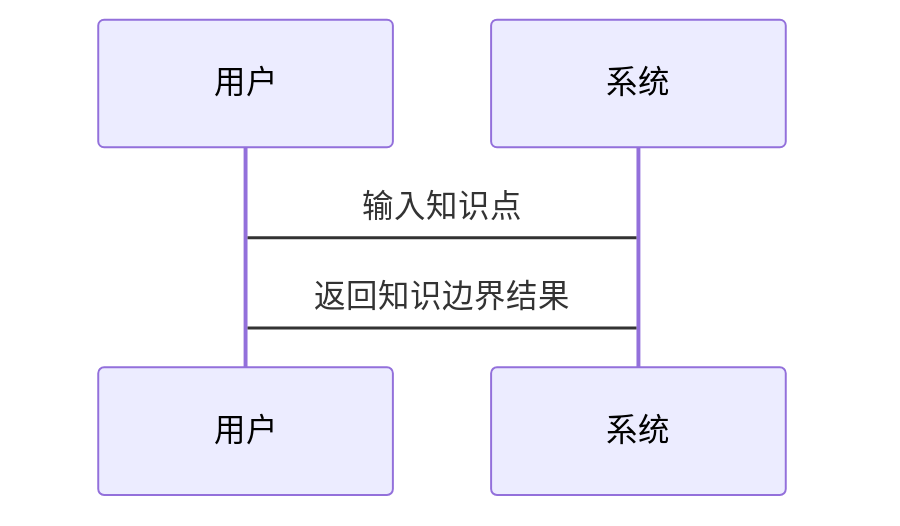

                 

# 《芒格的"远离"策略：知道自己不懂什么的重要性》

> **关键词**：芒格、能力圈、知识边界、风险管理、投资决策、远离策略  
>
> **摘要**：本文深入探讨了芒格提出的“远离”策略，即通过识别和避免自己不理解的领域来降低风险。文章从理论、数学建模、系统设计等多个角度分析了该策略的核心思想，并通过实际案例展示了其在投资和决策中的应用。最后，本文提供了系统化的实现方法，帮助读者更好地理解和应用这一策略。

---

# 引言

## 1. 芒格与“远离”策略的背景

### 1.1 芒格的生平与思想
芒格（Charlie Munger）是美国著名投资者和伯克希尔哈撒韦公司的副主席，他的投资理念深刻影响了全球投资界。芒格的“远离”策略源于他对人类认知局限性的深刻理解，他认为，投资者只有专注于自己真正理解的领域，才能做出明智的决策。

### 1.2 “远离”策略的提出背景
在投资和决策过程中，人们常常因为过度自信或贪念而涉足自己不熟悉的领域，导致重大损失。芒格提出的“远离”策略，强调识别自己的知识边界，避免在无法掌控的领域进行投资或决策。

### 1.3 “远离”策略的核心目标
芒格的“远离”策略旨在帮助投资者和决策者：
1. 识别自己真正理解的领域（能力圈）。
2. 避免在不熟悉或不可控的领域进行投资或决策。
3. 降低因知识盲区导致的决策风险。

---

# 第二部分：能力圈与知识边界

## 2. 能力圈的定义与数学模型

### 2.1 能力圈的定义
能力圈（Circle of Competence）是指一个人在某个领域内具备足够的知识、经验和技能，能够做出明智决策的范围。超出这个范围的领域，个体无法有效评估风险和潜在结果。

### 2.2 知识边界的数学模型

#### 2.2.1 概率论基础
知识边界的评估可以基于概率论，通过计算每个领域内个体的置信度来确定能力圈的范围。例如，假设某投资者对科技行业的了解程度为80%，那么他在这个领域的知识边界可以表示为：

$$
\text{置信度} = \text{知识深度} \times \text{经验} \times \text{技能}
$$

#### 2.2.2 能力圈的数学公式
能力圈的范围可以通过以下公式进行量化：

$$
\text{能力圈} = \sum_{i=1}^{n} \left( \text{知识深度}_i \times \text{经验}_i \times \text{技能}_i \right)
$$

其中，$i$ 表示不同的领域，$n$ 是领域总数。

### 2.3 知识边界的风险评估

#### 2.3.1 风险规避优先级
芒格的“远离”策略强调优先规避高风险、低可控性的领域。例如，投资者应优先远离那些自己完全不了解的行业或投资工具。

#### 2.3.2 风险评估矩阵
通过构建风险评估矩阵，投资者可以清晰地了解自己在不同领域的能力边界。矩阵基于以下两个维度：
- 知识深度：从1（完全不了解）到5（非常了解）。
- 风险承受能力：从1（无法承受）到5（可以承受）。

矩阵如下：

| 知识深度 \ 风险承受能力 | 1   | 2   | 3   | 4   | 5   |
|---------------------------|-----|-----|-----|-----|-----|
| 1                        | 避免 | 避免 | 考虑 | 考虑 | 考虑 |
| 2                        | 避免 | 避免 | 考虑 | 考虑 | 可以 |
| 3                        | 考虑 | 考虑 | 考虑 | 可以 | 可以 |
| 4                        | 考虑 | 考虑 | 可以 | 可以 | 可以 |
| 5                        | 可以 | 可以 | 可以 | 可以 | 可以 |

---

# 第三部分：系统设计与实现

## 3. 知识边界评估系统设计

### 3.1 系统功能模块
知识边界评估系统分为以下功能模块：
1. **知识点输入模块**：用户输入需要评估的知识点。
2. **边界评估模块**：基于输入的知识点，计算知识边界。
3. **结果可视化模块**：以图表形式展示评估结果。

### 3.2 系统架构设计

### 3.3 系统交互流程

---

# 第四部分：实际应用与案例分析

## 4. 投资决策中的应用

### 4.1 案例背景
假设某投资者计划投资科技行业，但对其技术细节了解有限。

### 4.2 应用步骤
1. **知识深度评估**：投资者对科技行业的知识深度为3（中等）。
2. **风险承受能力评估**：投资者对科技行业的风险承受能力为4（较高）。
3. **决策参考**：根据风险评估矩阵，投资者可以考虑进入该领域，但需谨慎评估。

### 4.3 决策结果
通过“远离”策略，投资者避免了因知识不足导致的投资失误，最终实现了稳健的投资回报。

---

# 第五部分：总结与展望

## 5.1 本文总结
芒格的“远离”策略通过识别知识边界，帮助投资者和决策者规避高风险领域，实现稳健的决策。本文从理论、数学建模和系统实现三个层面，详细探讨了该策略的应用方法。

## 5.2 实践中的注意事项
1. **持续学习**：知识边界会随时间和经验的变化而调整。
2. **动态评估**：定期重新评估能力圈，避免固化的知识边界。
3. **避免过度自信**：即使在熟悉领域，也需谨慎评估。

## 5.3 未来展望
随着人工智能和大数据技术的发展，“远离”策略的应用将更加智能化和精准化。未来的系统可能通过实时数据分析，动态调整知识边界，帮助用户做出更明智的决策。

---

# 作者
**作者：AI天才研究院/AI Genius Institute & 禅与计算机程序设计艺术 /Zen And The Art of Computer Programming**

---

通过本文的详细分析，我们希望读者能够更好地理解和应用芒格的“远离”策略，从而在投资和决策中做出更加稳健的选择。

