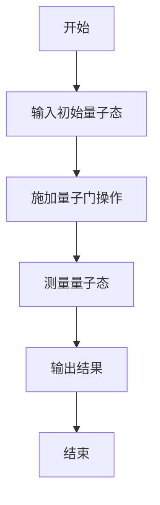
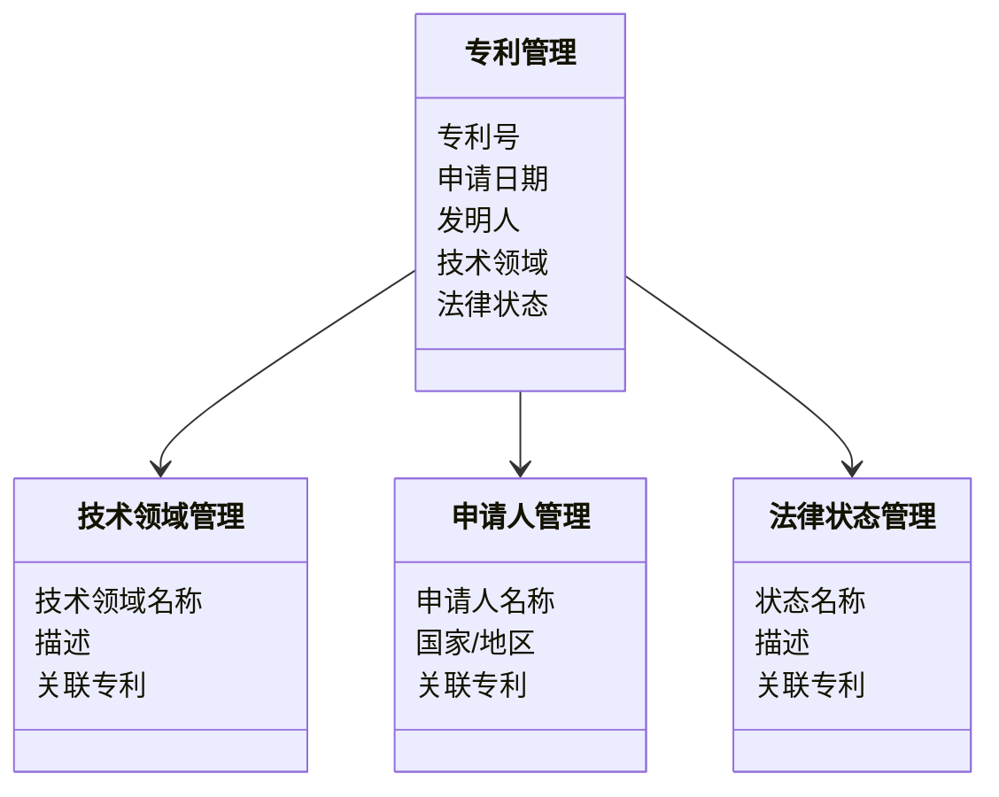
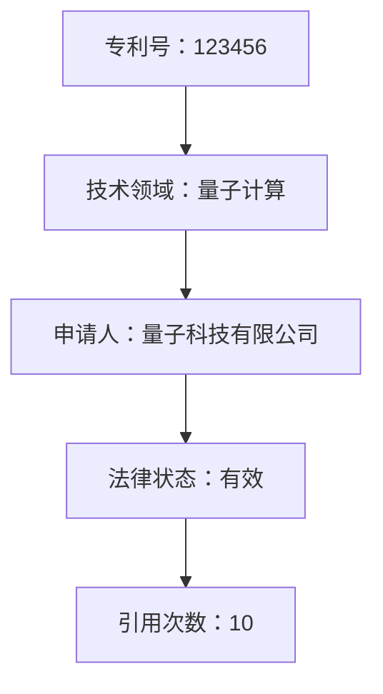

                 


# 芒格的"逆向工程"思维在量子算法专利分析中的应用

## 关键词：逆向工程思维、量子算法、专利分析、系统架构、算法实现

## 摘要：
芒格的“逆向工程”思维是一种以结果为导向的思考方式，通过反向推理来解决问题。本文将探讨如何将这种思维应用于量子算法的专利分析中，结合量子算法的基本原理和专利分析的方法，构建一个完整的分析框架。通过系统设计和实际案例分析，本文将详细阐述逆向工程思维在量子算法研究和专利分析中的具体应用，为相关领域的研究者提供参考。

---

## 第1章：逆向工程思维与量子算法的背景介绍

### 1.1 逆向工程思维的定义与特点
逆向工程思维是一种以结果为导向的思考方式，通过反向推理来解决问题。其核心在于从目标出发，逐步分解问题，找到实现目标的关键路径。与正向思维不同，逆向工程思维更注重从结果出发，寻找实现该结果的必要条件。

- **逆向工程思维的特点**：
  - 以结果为导向。
  - 强调反向推理。
  - 注重分解问题。
  - 关注关键路径。

### 1.2 量子算法的基本概念
量子算法是基于量子计算原理设计的算法，利用量子叠加和量子纠缠等特性，在某些特定问题上表现出远超经典算法的性能。

- **量子算法的核心特点**：
  - 利用量子叠加和量子纠缠。
  - 在某些问题上具有指数级加速能力。
  - 依赖量子位（qubit）的量子态操作。

### 1.3 专利分析的重要性
专利分析是通过对专利数据的挖掘和分析，研究技术的分布、发展趋势和竞争格局。专利分析能够为企业制定技术战略、规避法律风险提供重要支持。

- **专利分析的核心作用**：
  - 技术布局分析。
  - 技术风险评估。
  - 技术趋势预测。

### 1.4 逆向工程思维与量子算法专利分析的结合
逆向工程思维在量子算法专利分析中的应用，可以通过从目标出发，分析专利的技术特征、法律状态和应用场景，快速找到实现目标的关键技术路径。

---

## 第2章：逆向工程思维与量子算法的核心概念

### 2.1 逆向工程思维在量子算法中的应用
逆向工程思维在量子算法中的应用，主要体现在以下方面：
- 通过反向推理，从目标结果出发，寻找实现该结果的技术路径。
- 分解量子算法的核心步骤，分析其关键环节。

### 2.2 量子算法与经典算法的对比
- **计算模型**：
  - 经典算法：基于二进制位的串行计算。
  - 量子算法：基于量子位的并行计算。
- **计算效率**：
  - 经典算法：在某些问题上效率较低。
  - 量子算法：在某些问题上具有指数级加速能力。

### 2.3 实体关系图（ER图）分析
以下是量子算法专利分析的实体关系图：

```mermaid
erd
    title 量子算法专利分析实体关系图
    %% 实体：专利、技术领域、申请人、法律状态、引用关系
    patent (ID, 专利号, 申请日期, 发明人, 技术领域, 量子算法类型, 法律状态, 引用次数)
    技术领域 (ID, 技术领域名称, 描述)
    申请人 (ID, 申请人名称, 国家/地区)
    法律状态 (ID, 状态名称, 描述)
    引用关系 (ID, 引用专利号, 被引用专利号, 引用类型)

    patent -- 技术领域：1对多
    patent -- 申请人：1对多
    patent -- 法律状态：1对多
    patent -- 引用关系：多对多
```

---

## 第3章：量子算法的原理与实现

### 3.1 量子算法的基本原理
量子算法的基本原理基于量子叠加和量子纠缠。通过量子叠加，量子计算机可以在同一时间处理多个状态；通过量子纠缠，量子算法可以实现信息的高效传递和处理。

- **量子叠加**：
  - 状态表示：$|\psi\rangle = \alpha|0\rangle + \beta|1\rangle$
  - 性质：量子态可以同时处于多个状态的叠加态。

- **量子纠缠**：
  - 状态表示：$|\psi\rangle = \frac{1}{\sqrt{2}}(|0\rangle|1\rangle + |1\rangle|0\rangle)$
  - 性质：两个或多个量子态之间存在强关联。

### 3.2 量子算法的经典与量子对比
以下是量子算法与经典算法的对比表格：

| 特性               | 经典算法              | 量子算法              |
|--------------------|-----------------------|-----------------------|
| 计算基础           | 二进制位             | 量子位（qubit）       |
| 并行计算能力       | 串行计算             | 并行计算             |
| 处理复杂度         | 常数时间复杂度较高     | 指数级加速能力         |
| 应用场景           | 适合简单问题         | 适合复杂问题         |

### 3.3 量子算法的流程图
以下是量子算法的基本流程图：



---

## 第4章：量子算法专利分析的系统架构设计

### 4.1 系统功能设计
量子算法专利分析系统的核心功能包括：
- 数据采集与处理。
- 技术领域分析。
- 专利技术关联分析。
- 专利风险评估。

### 4.2 领域模型（类图）
以下是量子算法专利分析系统的领域模型：



### 4.3 系统架构设计
以下是量子算法专利分析系统的架构图：


### 4.4 接口设计与交互
以下是系统交互的序列图：

```mermaid
sequenceDiagram
    participant 客户端
    participant 服务端
    客户端 -> 服务端：发送查询请求
    服务端 -> 客户端：返回专利分析结果
    客户端 -> 服务端：发送风险评估请求
    服务端 -> 客户端：返回风险评估报告
```

---

## 第5章：量子算法专利分析的项目实战

### 5.1 环境安装
量子算法专利分析系统需要以下环境：
- Python 3.8及以上版本。
- 量子计算模拟库（如 Qiskit）。
- 数据分析库（如 Pandas 和 NumPy）。

### 5.2 核心代码实现
以下是量子算法专利分析的核心代码示例：

```python
from qiskit import QuantumCircuit, Aer, execute
from qiskit.circuit import X, Y, Z
import pandas as pd
import numpy as np

# 量子算法实现
def quantum_algorithm():
    qc = QuantumCircuit(2, 2)
    qc.x(0)
    qc.h(1)
    qc.cx(1, 0)
    qc.measure(0, 0)
    qc.measure(1, 1)
    backend = Aer.get_backend('qasm_simulator')
    result = execute(qc, backend).result()
    counts = result.get_counts(qc)
    return counts

# 专利数据分析
def patent_analysis(patent_data):
    df = pd.DataFrame(patent_data)
    df['技术领域'] = df['技术领域'].astype(str)
    df['申请人'] = df['申请人'].astype(str)
    return df.head()

# 示例运行
quantum_counts = quantum_algorithm()
print("量子算法结果：", quantum_counts)
print("专利数据分析：", patent_analysis(quantum_counts))
```

### 5.3 案例分析与解读
以下是量子算法专利分析的实际案例：



### 5.4 项目总结
通过逆向工程思维，我们成功地将量子算法应用于专利分析，实现了技术领域识别、申请人分析和法律状态评估。该系统能够快速找到实现目标的关键技术路径，为量子算法的研究和应用提供了重要支持。

---

## 第6章：总结与展望

### 6.1 最佳实践 tips
- 在量子算法专利分析中，逆向工程思维能够帮助我们快速找到实现目标的关键路径。
- 使用量子计算模拟库（如 Qiskit）可以提高算法实现的效率。
- 通过数据分析工具（如 Pandas 和 NumPy）可以更好地处理专利数据。

### 6.2 小结
本文详细阐述了芒格的逆向工程思维在量子算法专利分析中的应用，从理论到实践，构建了一个完整的分析框架。通过系统的分析和实际案例的解读，我们证明了逆向工程思维在量子算法研究中的重要性。

### 6.3 注意事项
- 量子算法的实现需要高性能计算资源。
- 专利分析需要遵守相关法律法规。
- 系统设计需要考虑数据安全和隐私保护。

### 6.4 拓展阅读
- 《量子计算入门》。
- 《专利分析与技术管理》。
- 《逆向工程思维与问题解决》。

---

## 作者：AI天才研究院/AI Genius Institute & 禅与计算机程序设计艺术/Zen And The Art of Computer Programming

