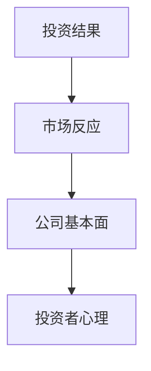
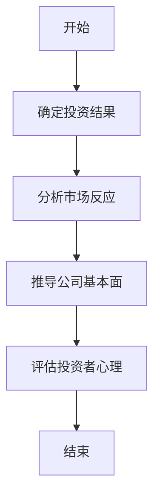
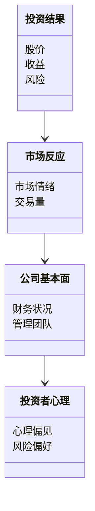
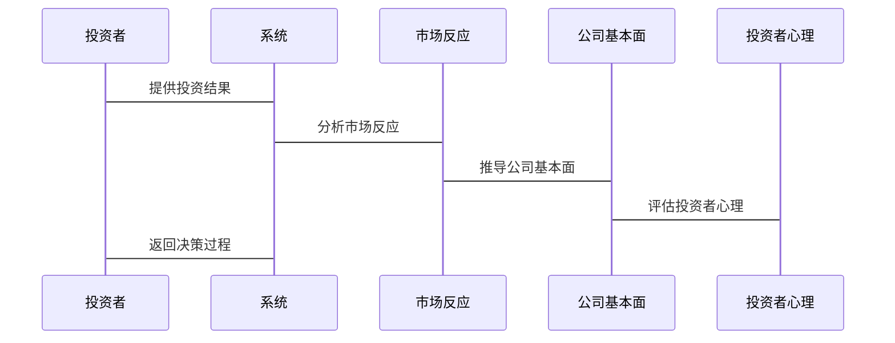

                 


# 芒格的"逆向工程"思维：从结果倒推投资决策

---

## 关键词：芒格、逆向工程、投资决策、思维模型、决策框架

---

## 摘要：  
芒格的"逆向工程"思维是一种独特的投资哲学，它通过从结果倒推决策过程，帮助投资者更好地理解投资机会和风险。本文将详细分析逆向工程思维的核心概念、算法原理、系统架构以及实际应用，结合芒格的多元思维模型和心理偏见分析，为读者提供一套系统化的投资决策框架。

---

# 第1章: 芒格与逆向工程思维的背景介绍

## 1.1 芒格的投资哲学与思维方式  
### 1.1.1 芒格的生平与投资理念  
查理·芒格是沃伦·巴菲特的长期合作伙伴，被誉为“价值投资的第二人”。芒格的投资哲学强调长期主义、安全边际和复利效应。他提倡通过逆向思维来分析问题，从结果出发，寻找投资中的“安全空间”。  

### 1.1.2 逆向工程思维的定义与特点  
逆向工程思维是一种从结果出发，反向推导原因的思维方式。其特点包括：  
- **反向思维**：从结果出发，寻找导致结果的原因。  
- **逻辑推理**：通过因果关系分析，推导出可能的决策路径。  
- **概率导向**：关注可能性较高的结果，而非确定性事件。  

### 1.1.3 逆向工程思维在投资中的应用价值  
逆向工程思维可以帮助投资者识别潜在的投资机会，评估风险，并制定合理的投资策略。通过从结果出发，投资者可以更好地理解市场的波动性和不确定性。

---

## 1.2 逆向工程思维的核心概念  
### 1.2.1 从结果倒推的逻辑框架  
逆向工程思维的核心是通过分析结果，反向推导出可能的决策过程。例如，如果一家公司的股价下跌，可以通过分析市场反应、公司基本面等因素，推断出可能的市场预期。  

### 1.2.2 投资决策中的问题背景与解决路径  
在投资决策中，逆向工程思维可以帮助投资者解决以下问题：  
- 如何识别潜在的投资机会？  
- 如何评估投资风险？  
- 如何制定合理的投资策略？  

### 1.2.3 逆向工程思维的边界与外延  
逆向工程思维的应用范围不仅限于投资领域，还可以扩展到企业管理、个人决策等领域。其边界在于对结果的可解释性和数据的充分性。

---

## 1.3 逆向工程思维的核心要素  
### 1.3.1 投资目标与结果的关系  
投资目标是决策的起点，而结果是决策的终点。逆向工程思维通过分析结果，反向推导出投资目标的实现路径。  

### 1.3.2 决策过程中的关键因素  
- **市场环境**：包括宏观经济、行业趋势等因素。  
- **公司基本面**：包括财务状况、管理团队等因素。  
- **投资者心理**：包括市场情绪、心理偏见等因素。  

### 1.3.3 逆向思维与正向思维的对比分析  
正向思维是从原因出发，推导结果；逆向思维是从结果出发，反推原因。两者结合可以提高决策的全面性和准确性。

---

## 1.4 本章小结  
本章介绍了芒格的逆向工程思维，分析了其核心概念和应用价值。通过从结果倒推决策过程，投资者可以更好地理解市场的复杂性，并制定合理的投资策略。

---

# 第2章: 逆向工程思维的核心概念与联系  

## 2.1 逆向工程思维的原理分析  
### 2.1.1 从结果出发的逻辑推理  
逆向工程思维的核心是通过分析结果，反向推导出决策过程。例如，如果一家公司股价上涨，可以通过分析市场反应、公司基本面等因素，推断出可能的市场预期。  

### 2.1.2 投资决策中的因果关系  
因果关系是逆向工程思维的核心。通过分析结果与原因之间的关系，投资者可以更好地理解市场的运作机制。  

### 2.1.3 逆向思维与概率论的结合  
逆向工程思维可以通过概率论来量化结果的可能性。例如，通过分析历史数据，推断出某种结果的概率分布。

---

## 2.2 核心概念对比表格  
### 2.2.1 正向思维与逆向思维的对比  
| **维度** | **正向思维** | **逆向思维** |  
|----------|--------------|--------------|  
| 起点     | 原因         | 结果         |  
| 推理方向 | 前向         | 后向         |  
| 应用场景 | 预测未来     | 分析过去     |  

### 2.2.2 不同投资策略的优缺点分析  
| **策略** | **优点** | **缺点** |  
|----------|----------|----------|  
| 正向思维 | 预测性强 | 确定性低 |  
| 逆向思维 | 分析深度高 | 复杂性高 |  

---

## 2.3 ER实体关系图  


---

## 2.4 本章小结  
本章通过对比分析和实体关系图，进一步明确了逆向工程思维的核心概念和应用方式。

---

# 第3章: 逆向工程思维的算法原理  

## 3.1 逆向工程思维的算法流程  
### 3.1.1 算法输入与输出  
- **输入**：投资结果（如股价、收益等）。  
- **输出**：可能的决策过程和投资策略。  

### 3.1.2 算法步骤分解  
1. 确定投资结果。  
2. 分析市场反应。  
3. 推导公司基本面。  
4. 评估投资者心理。  

### 3.1.3 算法的数学模型  
逆向工程思维可以通过概率论和统计学模型来量化结果的可能性。例如，使用贝叶斯定理进行概率计算。

---

## 3.2 算法原理的数学公式  
### 3.2.1 投资回报率公式  
$$ R = \frac{\text{投资收益}}{\text{初始投资}} $$  

### 3.2.2 风险评估模型  
$$ \text{风险} = \sqrt{\text{方差}} $$  

### 3.2.3 概率计算公式  
$$ P(A|B) = \frac{P(B|A) \cdot P(A)}{P(B)} $$  

---

## 3.3 算法流程图（mermaid）  


---

## 3.4 算法实现代码示例  
```python
def inverse_engineering思维(目标):
    结果 = 分析(目标)
    决策过程 = 逆向推理(结果)
    验证逻辑(决策过程)
    return 决策过程
```

---

## 3.5 本章小结  
本章通过算法流程和数学公式，详细阐述了逆向工程思维的实现原理和应用方法。

---

# 第4章: 投资决策的系统分析  

## 4.1 问题场景介绍  
逆向工程思维可以帮助投资者从结果出发，反向推导出决策过程。例如，分析一家公司的股价下跌原因，可以通过市场反应、公司基本面等因素进行推理。

---

## 4.2 系统功能设计  
### 4.2.1 领域模型（mermaid类图）  


---

## 4.3 系统架构设计  
### 4.3.1 系统架构图（mermaid架构图）  


---

## 4.4 系统接口设计  
- **输入接口**：投资结果（如股价、收益等）。  
- **输出接口**：决策过程和投资策略。  

---

## 4.5 系统交互图（mermaid序列图）  


---

## 4.6 本章小结  
本章通过系统分析和架构设计，展示了逆向工程思维在投资决策中的实际应用。

---

# 第5章: 逆向工程思维的项目实战  

## 5.1 环境安装  
为了实现逆向工程思维的算法，需要安装以下工具：  
- Python编程语言  
- 数据分析库（如Pandas、NumPy）  
- 图形绘制工具（如Matplotlib、Seaborn）  

---

## 5.2 系统核心实现源代码  
```python
def 分析(目标):
    # 数据分析过程
    return 数据

def 逆向推理(结果):
    # 逻辑推理过程
    return 决策过程

def 验证逻辑(决策过程):
    # 验证过程
    return 是否合理

def inverse_engineering思维(目标):
    结果 = 分析(目标)
    决策过程 = 逆向推理(结果)
    验证逻辑(决策过程)
    return 决策过程
```

---

## 5.3 代码应用解读与分析  
- **分析函数**：对投资目标进行数据分析，提取关键指标。  
- **逆向推理函数**：通过逻辑推理，推导出可能的决策过程。  
- **验证逻辑函数**：对推理结果进行验证，确保逻辑的合理性。  

---

## 5.4 实际案例分析  
假设某公司的股价近期下跌，通过逆向工程思维可以分析出以下可能原因：  
1. 市场反应：投资者情绪低落，交易量减少。  
2. 公司基本面：财务状况恶化，管理团队出现变动。  
3. 投资者心理：市场对公司的前景持悲观态度。  

---

## 5.5 本章小结  
本章通过项目实战，展示了逆向工程思维在实际投资决策中的具体应用。

---

# 第6章: 总结与展望  

## 6.1 总结  
逆向工程思维是一种强大的投资工具，它通过从结果倒推决策过程，帮助投资者更好地理解市场和投资机会。通过结合芒格的多元思维模型和心理偏见分析，投资者可以制定更加科学的投资策略。

---

## 6.2 注意事项  
- **数据的充分性**：逆向工程思维依赖于数据的充分性和准确性。  
- **逻辑的合理性**：推理过程需要符合逻辑，避免主观臆断。  

---

## 6.3 拓展阅读  
- 《芒格的"多元思维模型"》  
- 《概率论与统计学在投资中的应用》  

---

## 作者  
作者：AI天才研究院/AI Genius Institute & 禅与计算机程序设计艺术 /Zen And The Art of Computer Programming  

---

通过本文的详细分析，读者可以深入理解芒格的逆向工程思维，并将其应用于实际投资决策中。

