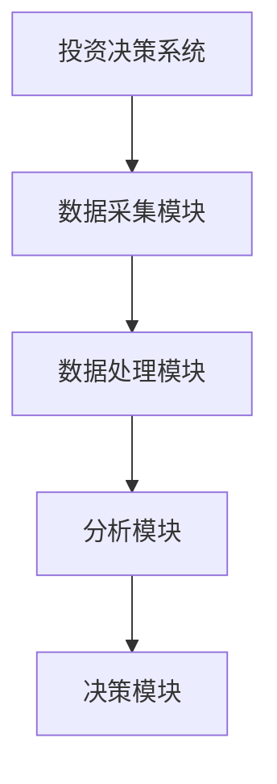

                 


# 芒格的逆向思维：在投资中的应用

> 关键词：逆向思维，投资策略，芒格，击穿点，安全边际，倒推法，格栅理论

> 摘要：本文详细探讨了芒格的逆向思维在投资中的应用，从理论基础到实战案例，结合技术分析和系统设计，全面解析了如何利用逆向思维进行有效的投资决策。

---

## 第1章 引言

### 1.1 逆向思维的背景与重要性

逆向思维是一种不同于传统正向思维的思维方式，它通过从目标倒推，找到解决问题的关键路径。在投资领域，芒格的逆向思维尤其显著，他强调从企业的内在价值出发，寻找市场低估的标的。

### 1.2 投资中的常见问题

传统投资方法往往依赖市场的短期波动，容易受到市场情绪的影响。逆向思维则帮助投资者跳出市场的噪声，专注于企业的基本面和长期价值。

---

## 第2章 核心概念解析

### 2.1 击穿点

#### 2.1.1 击穿点的定义

击穿点是指一个企业的内在价值与市场价格出现显著差异的点，此时市场低估了企业的价值，为投资者提供了买入的机会。

#### 2.1.2 击穿点的特征

- **低估值**：市场价格低于内在价值。
- **高确定性**：企业的基本面稳定，风险可控。
- **逆向机会**：在市场恐慌时更容易出现击穿点。

#### 2.1.3 击穿点的计算

击穿点可以通过比较企业的内在价值和市场价格来判断：

$$
\text{击穿点} = \text{内在价值} / \text{市场价格} > 2
$$

### 2.2 安全边际

#### 2.2.1 安全边际的定义

安全边际是指在价格低于内在价值的基础上，给予一定的折扣空间，以应对市场的不确定性。

#### 2.2.2 安全边际的计算公式

$$
\text{安全边际} = \text{内在价值} \times \text{安全系数}
$$

其中，安全系数通常为 1.5 至 2 之间，以确保足够的安全空间。

### 2.3 逆向思维与传统投资策略的对比

| 对比维度       | 逆向思维         | 传统投资策略       |
|----------------|------------------|--------------------|
| 投资逻辑       | 从内向外看       | 从外向内看         |
| 风险控制       | 重视安全边际     | 依赖市场趋势       |
| 时机选择       | 寻找市场低估点     | 追踪市场热点       |

---

## 第3章 理论基础

### 3.1 倒推法

#### 3.1.1 倒推法的定义

倒推法是指从目标的终点出发，反向分析实现目标的路径和方法。

#### 3.1.2 倒推法的应用步骤

1. 确定目标。
2. 分析实现目标的关键因素。
3. 制定实现路径。
4. 执行并调整。

#### 3.1.3 倒推法在投资中的应用

- 识别企业的长期竞争优势。
- 分析企业的财务状况。
- 评估企业的未来盈利能力。

### 3.2 格栅理论

#### 3.2.1 格栅理论的定义

格栅理论是指通过构建跨学科的知识框架，帮助投资者更好地理解企业的内在价值。

#### 3.2.2 格栅理论的构成

- **经济基础**：企业的商业模式和盈利模式。
- **财务状况**：企业的资产负债表、利润表和现金流。
- **行业地位**：企业在行业中的竞争地位。
- **管理团队**：企业的管理层能力和战略决策。

#### 3.2.3 格栅理论的优势

- 多维度分析，降低投资风险。
- 交叉验证，提高分析准确性。

---

## 第4章 投资策略

### 4.1 寻找击穿点

#### 4.1.1 击穿点的寻找方法

1. 评估企业的内在价值。
2. 对比市场价格。
3. 确定安全边际。

#### 4.1.2 实例分析

假设某企业的内在价值为 $100，市场价格为 $50，安全系数为 2，则：

$$
\text{安全边际} = 100 \times 2 = 200
$$

此时，市场价格 $50 << 内在价值 $100，存在显著的击穿点。

### 4.2 安全边际的应用

#### 4.2.1 安全边际的动态调整

随着市场环境的变化，安全边际需要定期调整。例如，经济下行时，应适当提高安全系数。

---

## 第5章 系统分析

### 5.1 投资决策系统架构



### 5.2 系统接口设计

- **数据接口**：从数据库获取企业财务数据。
- **分析接口**：计算内在价值和安全边际。
- **决策接口**：生成投资建议。

### 5.3 系统功能模块

- **数据采集模块**：收集企业的财务数据。
- **数据处理模块**：清洗和整理数据。
- **分析模块**：计算内在价值和安全边际。
- **决策模块**：生成投资策略。

---

## 第6章 项目实战

### 6.1 环境与工具安装

#### 6.1.1 工具选择

- 数据库：MySQL 或 PostgreSQL。
- 开发语言：Python。
- 分析工具：Pandas、NumPy。

#### 6.1.2 数据源获取

从财经网站或数据库获取企业的财务数据。

### 6.2 核心算法实现

#### 6.2.1 内在价值计算

$$
\text{内在价值} = \sum_{t=1}^{n} \frac{\text{现金流}_t}{(1 + r)^t}
$$

其中，r 是折现率，n 是预测的年数。

#### 6.2.2 安全边际计算

$$
\text{安全边际} = \text{内在价值} \times \text{安全系数}
$$

### 6.3 代码实现

```python
def calculate_intrinsic_value(cash_flows, discount_rate):
    return sum(cash_flow / (1 + discount_rate) ** t for t, cash_flow in enumerate(cash_flows))

def calculate_margin_of_safety(intrinsic_value, safety_coefficient):
    return intrinsic_value * safety_coefficient

# 示例
cash_flows = [100, 120, 150]
discount_rate = 0.1
safety_coefficient = 2

intrinsic_value = calculate_intrinsic_value(cash_flows, discount_rate)
margin_of_safety = calculate_margin_of_safety(intrinsic_value, safety_coefficient)

print(f"内在价值: {intrinsic_value}")
print(f"安全边际: {margin_of_safety}")
```

---

## 第7章 小结

芒格的逆向思维是一种强大的投资工具，它帮助投资者在市场混乱中找到价值。通过寻找击穿点和计算安全边际，投资者可以更好地控制风险，实现长期稳定的收益。

### 最佳实践 tips

1. **持续学习**：不断更新知识框架，保持对市场的敏感性。
2. **保持耐心**：逆向思维需要时间积累，耐心等待击穿点的出现。
3. **风险管理**：合理控制仓位，避免过度集中投资。

---

作者：AI天才研究院/AI Genius Institute & 禅与计算机程序设计艺术 /Zen And The Art of Computer Programming

