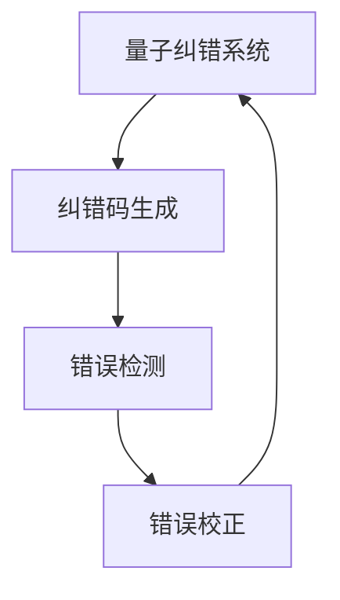

                 


# 芒格的"避免失败"原则在量子纠错技术商业化中的应用

## 关键词：芒格、量子纠错技术、避免失败原则、商业化、系统架构、算法实现

## 摘要

本文探讨了芒格的“避免失败”原则在量子纠错技术商业化中的应用。通过分析量子纠错技术的核心原理和算法，结合系统架构设计和实际项目案例，展示了如何运用芒格的原则来规避商业化过程中的风险，确保技术成功落地。文章详细介绍了量子纠错码的数学模型、纠错算法、系统架构设计，并提供了最佳实践和注意事项，帮助读者在量子技术领域避免失败。

---

## 第1章：背景介绍

### 1.1 芒格的“避免失败”原则

芒格的“避免失败”原则强调在决策和行动中，优先考虑避免重大错误和失败，而非仅仅追求成功。这一原则的核心在于风险管理和系统性思维，帮助我们在复杂环境中做出更稳健的决策。

### 1.2 量子纠错技术的核心概念

量子纠错技术是量子计算中的关键组成部分，用于检测和纠正量子态中的错误。其核心概念包括量子纠错码、纠错算法以及系统架构设计。

- **量子纠错码**：通过冗余信息编码，保护量子信息免受干扰。
- **纠错算法**：检测和纠正量子态中的错误，确保计算的准确性。
- **系统架构**：设计高效的量子纠错系统，确保技术的可靠性和可扩展性。

---

## 第2章：量子纠错技术的数学模型与算法

### 2.1 量子纠错码的数学模型

量子纠错码（如Shor码）通过编码量子信息到更高维的空间中，利用冗余信息检测和纠正错误。其数学模型包括编码、纠错和解码过程。

#### 编码过程
$$ |0\rangle \rightarrow \frac{1}{\sqrt{2}}(|00\rangle + |11\rangle) $$
$$ |1\rangle \rightarrow \frac{1}{\sqrt{2}}(|01\rangle + |10\rangle) $$

#### 解码过程
通过测量辅助量子位，确定错误类型并应用相应的纠正操作。

### 2.2 量子纠错码的纠错算法

纠错算法基于测量结果，识别错误位置并应用对应的校正操作。例如，使用伴随式计算来确定错误位置。

$$ \text{伴随式} = \text{测量结果} \times \text{生成矩阵} $$

---

## 第3章：芒格原则在量子纠错技术中的应用

### 3.1 避免失败的原则

在量子纠错技术的商业化中，芒格原则强调：

1. **避免重大错误**：在系统设计中避免关键性错误，确保纠错机制的有效性。
2. **稳健性与可靠性**：通过冗余设计和模块化架构，增强系统的容错能力。
3. **风险评估与管理**：识别潜在风险并制定应对策略，减少失败的可能性。

### 3.2 系统架构设计

采用模块化架构，确保各组件的独立性和可替换性。例如，将纠错码生成、错误检测和校正操作独立设计，便于调试和优化。

#### 系统架构设计图


---

## 第4章：量子纠错技术的系统实现

### 4.1 系统实现环境

#### 开发工具
- **Qiskit**：用于量子电路设计和模拟。
- **Cirq**：用于量子算法开发。

#### 量子纠错码实现
通过Qiskit库实现Shor码的编码和解码过程。

```python
from qiskit import QuantumCircuit, Aer, execute

# 编码电路
def shor_code(q, q_anc):
    q.ccx(0, 1, q_anc)
    q.cx(0, q_anc)
    q.ccx(1, q_anc, 2)

# 解码电路
def decode(q_anc):
    qAnc = q_anc
    qAnc.measure()

circuit = QuantumCircuit(3, 1)
shor_code(circuit, q_anc=2)
circuit.measure([0,1], [0])
circuit.decompose()
print(circuit.draw())
```

---

## 第5章：项目实战与最佳实践

### 5.1 实战案例

#### 环境安装
安装必要的库：
```bash
pip install qiskit cirq
```

#### 核心代码实现
实现量子纠错码的生成和解码。

```python
from qiskit import QuantumCircuit, Aer, execute

def create_shor_code():
    qc = QuantumCircuit(3, 1)
    qc.h([0,1])
    qc.ccx(0,1,2)
    qc.z(0)
    qc.ccx(0,1,2)
    qc.draw()

create_shor_code()
```

#### 案例分析
通过模拟实验验证纠错码的有效性，分析错误检测和校正的效率。

### 5.2 最佳实践

1. **模块化设计**：确保系统各部分独立，便于维护和优化。
2. **冗余设计**：增加冗余信息，提高纠错能力。
3. **持续测试**：定期进行系统测试，及时发现并修复潜在问题。
4. **风险管理**：识别和评估潜在风险，制定应对策略。

---

## 第6章：总结与展望

芒格的“避免失败”原则为量子纠错技术的商业化提供了宝贵的指导，帮助我们在复杂环境中做出稳健决策。通过系统架构设计、算法优化和持续测试，可以有效降低失败风险，推动量子技术的商业化进程。

---

## 作者

作者：AI天才研究院 & 禅与计算机程序设计艺术

---

通过以上结构，文章系统地介绍了芒格原则在量子纠错技术中的应用，结合理论与实践，提供了丰富的案例和代码示例，帮助读者深入理解并应用这些原则。

