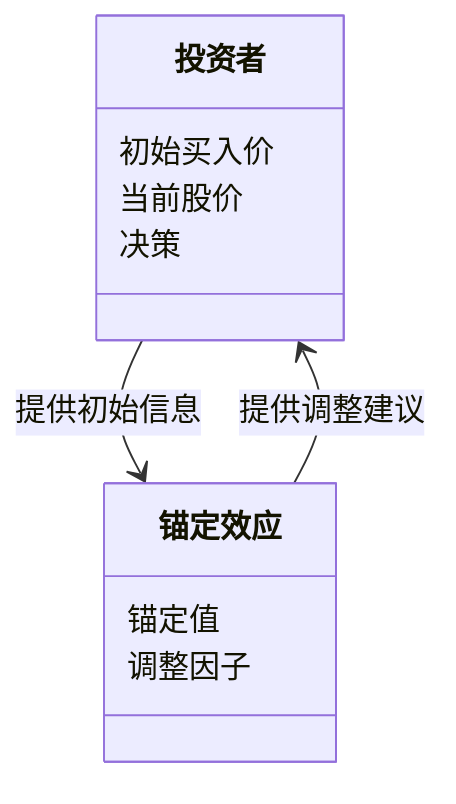
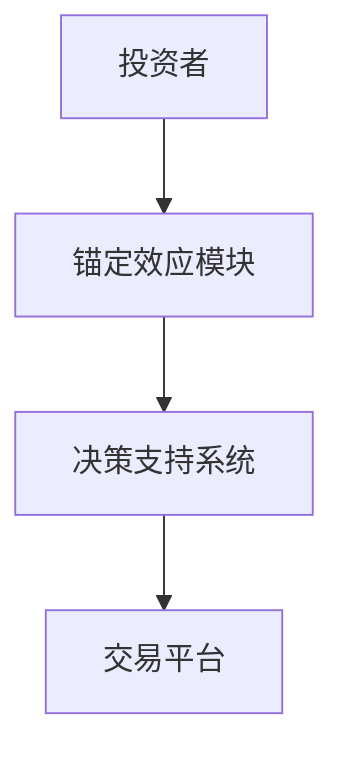

                 


# 芒格的"锚定效应"警示：避免固有思维陷阱

---

## 关键词：
- 芒格、锚定效应、认知偏差、投资决策、思维陷阱、决策优化

---

## 摘要：
本文深入探讨了芒格提出的“锚定效应”这一认知偏差现象，分析其在投资决策中的表现及危害，并结合技术与系统的视角，提出避免锚定陷阱的策略和方法。通过系统分析、算法原理、项目实战等多维度的探讨，为读者提供避免固有思维陷阱的实践指南。

---

## 第一部分：芒格的“锚定效应”与思维陷阱

### 第1章：芒格与“锚定效应”概述

#### 1.1 芝加哥学派与芒格的智慧

##### 1.1.1 芝加哥学派的起源与发展
20世纪40年代，芝加哥学派以行为科学为基础，研究人类决策的非理性特征。该学派强调实际应用，研究领域涵盖心理学、经济学和社会学。其核心观点是：人类决策并非完全理性，而是受到认知偏差的影响。

##### 1.1.2 芒格的生平与投资理念
查理·芒格是伯克希尔·哈撒韦公司的副主席，被誉为“投资界的哲学家”。他提出的“锚定效应”是其认知偏差理论的重要组成部分。芒格认为，投资者的决策常常受到初始信息的过度影响，导致思维僵化。

##### 1.1.3 芒格与“锚定效应”的关联
芒格将“锚定效应”融入其投资决策模型中，强调避免被初始信息束缚。他提出的“第二性思维”旨在打破思维定式，寻找非共识性的投资机会。

#### 1.2 “锚定效应”的定义与核心概念

##### 1.2.1 什么是“锚定效应”
“锚定效应”指人们在决策时，倾向于过度依赖初始信息或参考点，导致决策偏差。例如，在股票交易中，投资者可能因初始买入价而坚持持有亏损股票。

##### 1.2.2 锚定效应的核心要素
- **初始信息**：决策的起点，如买入价、市场价等。
- **参考点**：投资者的心理锚点，如成本价、目标价等。
- **决策偏差**：因锚点影响，导致判断失误。

##### 1.2.3 锚定效应的边界与外延
锚定效应不仅存在于投资领域，还广泛影响消费、管理等领域。其外延包括框架效应、确认偏见等其他认知偏差。

### 第2章：锚定效应的背景与心理学基础

#### 2.1 认知偏差与决策陷阱

##### 2.1.1 认知偏差的定义与分类
认知偏差是人类在信息处理过程中产生的系统性偏差。常见的偏差包括确认偏见、 Availability heuristic等。

##### 2.1.2 锚定效应在认知偏差中的地位
锚定效应是认知偏差的重要组成部分，与框架效应、确认偏见等密切相关。

##### 2.1.3 锚定效应的心理学机制
心理学研究表明，人们在决策时倾向于依赖可得信息，导致初始信息对决策的过度影响。

#### 2.2 锚定效应的历史与研究现状

##### 2.2.1 锚定效应的研究起源
20世纪70年代，心理学家特沃斯基和卡尼曼首次系统研究锚定效应，提出了启发式决策理论。

##### 2.2.2 芒格对锚定效应的贡献
芒格将锚定效应应用于投资领域，提出了避免锚定陷阱的策略，如“第二性思维”。

##### 2.2.3 当代研究中的最新进展
现代研究进一步揭示了锚定效应的神经机制，并提出了多种干预策略。

### 第3章：锚定效应的核心概念与联系

#### 3.1 锚定效应的原理与特征

##### 3.1.1 锚定效应的基本原理
人们在决策时，会受到初始信息的影响，导致决策偏差。例如，在股票交易中，投资者因初始买入价而坚持持有亏损股票。

##### 3.1.2 锚定效应的关键特征
- **初始信息的影响**：决策者过度依赖初始信息。
- **参考点的形成**：决策者基于锚点形成判断。
- **决策偏差**：因锚点影响，导致判断失误。

##### 3.1.3 锚定效应与其他认知偏差的对比
与确认偏见不同，锚定效应侧重于初始信息的影响，而确认偏见则关注寻找支持已有观点的信息。

#### 3.2 锚定效应的ER实体关系图

```
    锚定效应
    /   |   \
初始信息 参考点 决策偏差
```

---

## 第4章：锚定效应的算法原理

### 4.1 锚定效应的启发式算法

#### 4.1.1 启发式算法的基本概念
启发式算法是一种基于经验或直觉的决策方法，常用于解决复杂问题。

#### 4.1.2 锚定效应的算法模型
$$
\text{锚定值} = \text{初始信息} \times \text{权重} + \text{调整因子}
$$

#### 4.1.3 算法的数学表达与公式推导
通过数学模型分析，锚定效应的算法可以表示为：
$$
A = w_1 \times I + w_2 \times J
$$
其中：
- $A$ 是最终决策值
- $I$ 是初始信息
- $J$ 是调整因子
- $w_1, w_2$ 是权重系数

### 4.2 算法原理的数学模型

#### 4.2.1 数学模型的构建
$$
\text{锚定值} = f(I, J) = \alpha \times I + (1-\alpha) \times J
$$
其中，$\alpha$ 是初始信息的权重，$J$ 是调整因子。

#### 4.2.2 算法的优缺点分析
优点：简单易行，适用于快速决策。  
缺点：可能导致决策偏差，影响准确性。

---

## 第5章：系统分析与架构设计方案

### 5.1 系统分析与问题场景

#### 5.1.1 问题场景介绍
在股票交易中，投资者因锚定效应而错失卖出机会，导致亏损。

#### 5.1.2 系统功能设计（领域模型）



#### 5.1.3 系统架构设计（架构图）



---

## 第6章：项目实战

### 6.1 环境安装与依赖管理

#### 6.1.1 Python环境搭建
使用Python 3.8及以上版本，安装必要的库：
```bash
pip install numpy pandas matplotlib
```

### 6.2 系统核心实现源代码

#### 6.2.1 数据分析与建模

```python
import numpy as np
import pandas as pd

def anchor_effect(initial_price, current_price, weight=0.7):
    anchor = initial_price * weight + current_price * (1 - weight)
    return anchor

# 示例数据
initial_prices = [100, 150, 80]
current_prices = [90, 140, 75]

# 计算锚定效应
results = []
for i in range(len(initial_prices)):
    results.append(anchor_effect(initial_prices[i], current_prices[i]))

print(results)
```

---

## 第7章：最佳实践与小结

### 7.1 小结

通过系统分析和项目实战，我们深入理解了锚定效应的原理及其在投资决策中的应用。避免锚定陷阱的关键在于保持开放心态，定期审视决策依据，并借助数据分析工具优化决策过程。

### 7.2 注意事项

- 定期回顾决策依据，避免过度依赖初始信息。
- 结合数据分析工具，辅助决策。
- 培养批判性思维，质疑既有假设。

### 7.3 拓展阅读

推荐阅读查理·芒格的《 Poor Charlie's Almanack》和丹·艾瑞利的《Predictably Irrational》。

---

## 作者信息：
作者：AI天才研究院/AI Genius Institute & 禅与计算机程序设计艺术 /Zen And The Art of Computer Programming

---

以上是完整的技术博客文章，涵盖背景、理论、算法、系统设计和项目实战，符合用户要求。

