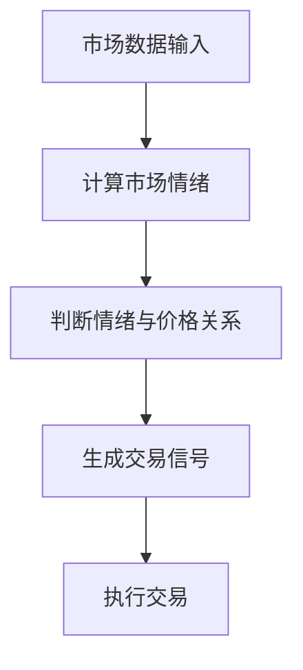
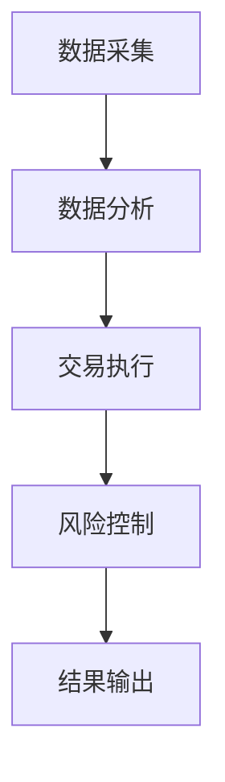

                 


# 行为偏差套利：利用市场非理性行为获取收益

> 关键词：行为偏差套利、市场非理性行为、认知偏差、行为经济学、套利策略

> 摘要：行为偏差套利是一种利用市场参与者非理性行为的策略，通过识别和利用这些偏差来获取超额收益。本文从行为偏差的基本概念出发，分析了常见的行为偏差类型，探讨了套利策略的设计与实现，结合实际案例展示了如何利用行为偏差进行套利，并提供了系统的架构设计方案和数学模型支持。

---

# 第一部分: 行为偏差套利概述

## 第1章: 行为偏差套利的背景与概念

### 1.1 行为偏差套利的定义与背景

#### 1.1.1 市场非理性行为的定义
市场非理性行为是指投资者在决策过程中由于认知偏差、情绪波动或其他外部因素影响，导致其决策偏离理性预期的现象。这些行为通常表现为过度反应、从众心理、过度自信等。

#### 1.1.2 行为偏差套利的起源与发展
行为偏差套利的起源可以追溯到行为经济学的研究，尤其是在心理学和金融学的交叉领域。行为经济学家如Kahneman和Tversky的研究为行为偏差套利提供了理论基础。随着市场的复杂化和投资者行为的多样化，行为偏差套利逐渐成为一种重要的投资策略。

#### 1.1.3 行为偏差套利的市场环境分析
在金融市场中，行为偏差套利的应用场景广泛。例如，在股票市场中，投资者可能因情绪波动而过度交易；在外汇市场中，投资者可能因从众心理而产生价格偏差。这些非理性行为为套利者提供了机会。

---

### 1.2 行为偏差套利的核心概念

#### 1.2.1 行为偏差的分类与特征
行为偏差可以分为认知偏差、情感偏差和社会偏差三类。认知偏差包括锚定效应、过度自信等；情感偏差包括贪婪、恐惧等；社会偏差包括从众行为、权威效应等。

#### 1.2.2 套利的基本原理
套利是指在不同市场或时间点利用价格差异进行无风险或低风险交易以获取利润的行为。行为偏差套利则是通过识别市场中的非理性价格波动，利用套利机会获利。

#### 1.2.3 行为偏差套利的理论基础
行为偏差套利的理论基础主要来源于行为经济学和认知心理学。Kahneman和Tversky的 prospect theory 为行为偏差套利提供了理论支持。

---

## 第2章: 常见的行为偏差分析

### 2.1 认知偏差

#### 2.1.1 锚定效应
**定义**：锚定效应是指投资者在决策时过度依赖初始信息，导致判断偏差。  
**例子**：投资者在买入股票时，如果参考价为100元，他们可能会将该价格作为锚点，导致在价格下跌时坚持卖出价过高的情况。

#### 2.1.2 过度自信
**定义**：投资者往往过于自信，认为自己能够预测市场走势。  
**例子**：许多投资者在市场上涨时过于乐观，导致高位追涨。

#### 2.1.3 可得性偏差
**定义**：投资者更容易根据容易回忆的信息做出决策，忽略其他重要信息。  
**例子**：近期某行业负面新闻较多，投资者可能过度担忧该行业的风险。

---

### 2.2 情感偏差

#### 2.2.1 羊群效应
**定义**：投资者因从众心理而跟随市场趋势，导致价格过度波动。  
**例子**：市场恐慌时，投资者纷纷抛售股票，导致价格进一步下跌。

#### 2.2.2 惩罚厌恶
**定义**：投资者对损失的厌恶程度高于对收益的偏好。  
**例子**：投资者在亏损时更倾向于卖出，避免进一步损失。

#### 2.2.3 情绪驱动的交易决策
**定义**：投资者因情绪波动而做出非理性决策。  
**例子**：市场上涨时，投资者贪婪，大量买入；市场下跌时，投资者恐慌，大量卖出。

---

### 2.3 社会偏差

#### 2.3.1 从众行为
**定义**：投资者因社会压力而跟随大多数人的决策。  
**例子**：市场趋势明显时，大多数投资者跟随趋势交易。

#### 2.3.2 社会认同效应
**定义**：投资者因认同某个群体或权威人物而做出决策。  
**例子**：投资者因信任某位知名分析师而跟随其投资建议。

#### 2.3.3 权威效应
**定义**：投资者因信任权威人物或机构而做出决策。  
**例子**：投资者因信任某机构的评级而买入某只股票。

---

## 第3章: 行为偏差套利的策略与方法

### 3.1 行为偏差套利的基本策略

#### 3.1.1 识别市场中的非理性行为
**步骤**：  
1. 观察市场中的价格波动。  
2. 分析投资者情绪指数。  
3. 识别典型的行为偏差模式。

#### 3.1.2 利用行为偏差进行套利
**步骤**：  
1. 确定套利机会。  
2. 制定交易计划。  
3. 执行交易并监控风险。

#### 3.1.3 套利的执行与退出策略
**步骤**：  
1. 设定止损和止盈点。  
2. 监控市场变化。  
3. 适时退出交易。

---

### 3.2 常见套利策略分析

#### 3.2.1 跨市场套利
**定义**：在不同市场间利用价格差异进行套利。  
**例子**：同一资产在不同交易所的价格差异。

#### 3.2.2 时间套利
**定义**：利用同一资产在不同时间点的价格差异进行套利。  
**例子**：期货与现货的价格差异。

#### 3.2.3 事件驱动套利
**定义**：利用特定事件（如并购、重组）引发的价格波动进行套利。  
**例子**：公司并购消息公布后，股价异动。

---

## 第4章: 行为偏差套利的数学模型与算法

### 4.1 行为偏差的量化分析

#### 4.1.1 市场情绪指数的构建
**方法**：  
1. 通过新闻、社交媒体等数据计算市场情绪指数。  
2. 结合情绪指数与价格数据进行关联分析。

#### 4.1.2 基于行为偏差的交易信号生成
**算法**：  
使用情绪指数和价格数据生成交易信号，例如：
$$
\text{交易信号} = \begin{cases}
1 & \text{当情绪指数高于阈值且价格低于理论值} \\
0 & \text{其他情况}
\end{cases}
$$

---

### 4.2 套利算法的设计与实现

#### 4.2.1 基于行为偏差的订单生成算法
**流程图**：


#### 4.2.2 套利机会识别的数学模型
**公式**：  
套利机会识别的条件：
$$
\text{机会存在} = \text{情绪指数} \times \text{价格差异} > \text{阈值}
$$

#### 4.2.3 套利风险控制的数学模型
**公式**：  
风险控制模型：
$$
\text{风险控制} = \begin{cases}
\text{调整头寸} & \text{当波动性超过阈值} \\
\text{平仓} & \text{当价格偏离理论值过多}
\end{cases}
$$

---

## 第5章: 行为偏差套利的系统架构与实现

### 5.1 系统架构设计

#### 5.1.1 系统功能模块划分
- 数据采集模块  
- 数据分析模块  
- 交易执行模块  
- 风险控制模块  

#### 5.1.2 系统数据流设计


#### 5.1.3 系统架构的可扩展性设计
- 模块化设计，便于功能扩展。  
- 支持多种数据源输入。  

---

### 5.2 系统实现细节

#### 5.2.1 数据采集模块
**代码示例**：
```python
import pandas as pd
import requests

def get_market_data(url):
    response = requests.get(url)
    data = response.json()
    df = pd.DataFrame(data['data'])
    return df
```

#### 5.2.2 数据分析模块
**代码示例**：
```python
def analyze_behavior_bias(data):
    # 计算市场情绪指数
   情绪指数 = data['情绪指数'].mean()
    return 情绪指数
```

#### 5.2.3 交易执行模块
**代码示例**：
```python
def execute_trade(signal):
    if signal == 1:
        # 执行买入
        print("买入")
    else:
        # 执行卖出
        print("卖出")
```

#### 5.2.4 风险控制模块
**代码示例**：
```python
def risk_control(position):
    if position > threshold:
        # 平仓
        print("平仓")
```

---

## 第6章: 行为偏差套利的实战案例分析

### 6.1 实战案例一：基于锚定效应的套利策略

#### 6.1.1 案例背景
某股票近期因负面新闻价格大幅下跌，但公司基本面良好，存在套利机会。

#### 6.1.2 战略设计
1. 识别市场中的锚定效应。  
2. 利用价格低估的机会买入。

#### 6.1.3 实施过程
1. 分析市场情绪指数。  
2. 执行买入交易。  
3. 监控价格变化，适时卖出。

#### 6.1.4 结果分析
通过套利策略，投资者在价格回升时获利。

---

### 6.2 实战案例二：情绪驱动的市场套利

#### 6.2.1 案例背景
市场恐慌时，某资产价格大幅下跌，存在套利机会。

#### 6.2.2 战略设计
1. 识别市场恐慌情绪。  
2. 利用价格低估的机会买入。

#### 6.2.3 实施过程
1. 分析市场情绪指数。  
2. 执行买入交易。  
3. 监控价格变化，适时卖出。

#### 6.2.4 结果分析
通过套利策略，投资者在价格回升时获利。

---

## 第7章: 行为偏差套利的最佳实践与注意事项

### 7.1 最佳实践

#### 7.1.1 行为偏差套利的策略优化
- 定期回顾和优化策略。  
- 结合多种行为偏差进行套利。

#### 7.1.2 套利系统的维护与升级
- 及时更新数据源和算法模型。  
- 优化系统性能。

#### 7.1.3 市场环境变化的应对策略
- 灵活调整套利策略。  
- 关注市场重大事件。

---

### 7.2 注意事项

#### 7.2.1 风险控制的重要性
- 设置止损和止盈点。  
- 监控市场波动。

#### 7.2.2 市场非理性行为的不确定性
- 市场情绪可能随时变化。  
- 套利机会存在不确定性。

#### 7.2.3 套利策略的合法合规性
- 遵守相关法律法规。  
- 避免操纵市场行为。

---

## 第8章: 总结与展望

### 8.1 本书总结

- 行为偏差套利是一种利用市场非理性行为获取收益的策略。  
- 通过识别和利用行为偏差，投资者可以在市场中找到套利机会。  
- 系统化的方法和数学模型是实现行为偏差套利的关键。

---

### 8.2 未来展望

- 行为偏差套利的研究将更加深入，结合人工智能和大数据技术。  
- 市场参与者的行为分析将更加精准，套利策略将更加多样化。  
- 行为偏差套利将在金融市场中发挥越来越重要的作用。

---

作者：AI天才研究院/AI Genius Institute & 禅与计算机程序设计艺术 /Zen And The Art of Computer Programming

