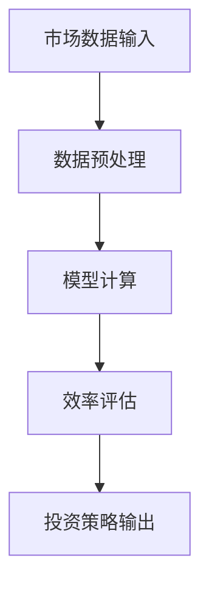

                 


# 詹姆斯蒙蒂尔的效率市场假说批评

---

## 关键词
效率市场假说、蒙蒂尔模型、金融市场、投资策略、市场效率

---

## 摘要
本文深入分析了詹姆斯·蒙蒂尔对效率市场假说的批评，并提出了蒙蒂尔模型作为一种修正方案。通过对比传统效率市场假说与蒙蒂尔模型的核心差异，详细阐述了蒙蒂尔模型的算法原理、数学模型和系统架构设计方案。文章还通过实际案例分析，展示了蒙蒂尔模型在金融投资中的应用，最后总结了最佳实践和注意事项，为读者提供了全面的视角和深入的见解。

---

## 第一部分：效率市场假说的背景与基础

### 第1章：效率市场假说的起源与核心观点

#### 1.1 效率市场假说的定义与起源
效率市场假说是金融学中的一个基础理论，由尤金·法玛在20世纪60年代提出。该假说认为，金融市场的价格已经反映了所有可获得的信息，因此投资者无法通过分析公开信息获得超额收益。这一假说分为三种形式：强有效市场假说、弱有效市场假说和半强有效市场假说。

- **强有效市场假说**：市场的价格反映了所有可能的信息，包括内部信息。
- **弱有效市场假说**：市场的价格反映了历史交易数据。
- **半强有效市场假说**：市场的价格反映了所有公开可用的信息。

#### 1.2 效率市场假说的核心观点
效率市场假说的核心观点是市场是理性的，价格反映了所有相关信息，因此投资者无法通过技术分析或基本分析获得超额收益。这一假说在学术界和金融实践中都有广泛的应用，但蒙蒂尔对这一假说提出了批评。

#### 1.3 蒙蒂尔对效率市场假说的批评
蒙蒂尔是一位著名的对冲基金经理，他认为效率市场假说过于简化了市场的复杂性。蒙蒂尔指出，市场并不总是有效，特别是在短期和中期，市场可能会受到投资者情绪、市场结构和外部事件的影响。

---

### 第2章：效率市场假说的核心概念与联系

#### 2.1 效率市场假说的原理
效率市场假说的原理是基于市场信息的充分反映。法玛提出，市场的效率来源于信息的充分流动和价格的及时调整。然而，蒙蒂尔认为这一假说忽视了市场的非理性行为和信息不对称。

#### 2.2 蒙蒂尔对效率市场假说的修正
蒙蒂尔提出了一种修正的市场效率模型，强调市场的不完全效率和投资者行为的影响。蒙蒂尔模型认为，市场在短期和中期可能存在效率不足的情况，特别是在市场情绪波动较大的情况下。

#### 2.3 对比表格：效率市场假说与蒙蒂尔模型的核心差异
以下是效率市场假说与蒙蒂尔模型的核心差异对比：

| **核心要素** | **效率市场假说** | **蒙蒂尔模型** |
|--------------|------------------|----------------|
| 市场效率     | 市场是完全有效   | 市场是不完全有效 |
| 信息反映     | 价格反映所有信息 | 价格反映部分信息 |
| 投资者行为   | 投资者理性       | 投资者情绪影响 |
| 时间框架     | 长期有效         | 短期和中期影响 |

---

## 第三部分：蒙蒂尔模型的算法原理与数学模型

### 第3章：蒙蒂尔模型的算法原理

#### 3.1 蒙蒂尔模型的算法流程
蒙蒂尔模型的算法流程如下：

1. **数据收集**：收集市场数据，包括价格、成交量、市场情绪等。
2. **数据预处理**：对数据进行清洗和标准化处理。
3. **模型计算**：计算市场效率指数，评估市场的效率水平。
4. **投资策略输出**：基于市场效率指数，制定投资策略。



#### 3.2 蒙蒂尔模型的数学公式
蒙蒂尔模型的核心公式是市场效率指数的计算：

$$
\text{市场效率指数} = \frac{\text{市场波动率}}{\text{信息流速度}}
$$

其中，市场波动率表示市场的不确定性，信息流速度表示信息传播的速度。

---

## 第四部分：系统分析与架构设计方案

### 第4章：系统分析与架构设计

#### 4.1 系统功能设计
蒙蒂尔模型的系统功能设计包括以下几个模块：

1. **数据收集模块**：收集市场数据，包括价格、成交量、市场情绪等。
2. **模型计算模块**：计算市场效率指数，评估市场的效率水平。
3. **结果展示模块**：展示市场效率指数和投资策略。

#### 4.2 系统架构设计
以下是系统的架构设计图：


---

## 第五部分：项目实战

### 第5章：项目实战

#### 5.1 环境安装
需要安装以下环境和工具：

- Python 3.8+
- Pandas库
- NumPy库
- Matplotlib库

#### 5.2 核心代码实现
以下是蒙蒂尔模型的核心代码实现：

```python
import pandas as pd
import numpy as np
import matplotlib.pyplot as plt

# 数据收集模块
def collect_data():
    # 示例数据，实际应用中需要从数据库或API获取
    data = pd.DataFrame({
        '价格': [100, 105, 98, 102, 104],
        '成交量': [1000, 800, 1200, 900, 1100]
    })
    return data

# 数据预处理模块
def preprocess_data(data):
    # 数据标准化处理
    data['标准化价格'] = (data['价格'] - data['价格'].mean()) / data['价格'].std()
    data['标准化成交量'] = (data['成交量'] - data['成交量'].mean()) / data['成交量'].std()
    return data

# 模型计算模块
def calculate_efficiency(data):
    # 计算市场波动率
    volatility = data['价格'].std()
    # 计算信息流速度
    info_flow_speed = data['成交量'].mean()
    # 计算市场效率指数
    efficiency_index = volatility / info_flow_speed
    return efficiency_index

# 结果展示模块
def display_results(efficiency_index):
    plt.figure(figsize=(6, 4))
    plt.bar('市场效率指数', efficiency_index)
    plt.title('市场效率指数')
    plt.show()

# 主函数
def main():
    data = collect_data()
    processed_data = preprocess_data(data)
    efficiency_index = calculate_efficiency(processed_data)
    display_results(efficiency_index)

if __name__ == "__main__":
    main()
```

#### 5.3 案例分析
通过上述代码，我们可以计算出市场效率指数，并制定相应的投资策略。例如，如果市场效率指数较高，投资者应避免短期交易；如果市场效率指数较低，投资者可以寻找套利机会。

---

## 第六部分：最佳实践

### 第6章：最佳实践

#### 6.1 小结
蒙蒂尔对效率市场假说的批评揭示了市场不完全效率的特性，尤其是在短期和中期。蒙蒂尔模型通过引入市场波动率和信息流速度的概念，为投资者提供了一种新的分析工具。

#### 6.2 注意事项
- 在实际应用中，需要结合市场环境和投资者行为进行调整。
- 数据质量和信息流速度是模型计算的关键，需要确保数据的准确性和及时性。

#### 6.3 拓展阅读
- 《蒙蒂尔投资哲学》
- 《金融市场与行为经济学》

---

## 结语

作者：AI天才研究院 & 禅与计算机程序设计艺术

---

通过本文的分析，我们深入探讨了蒙蒂尔对效率市场假说的批评，并提出了蒙蒂尔模型作为一种修正方案。希望读者能够通过本文对效率市场假说和蒙蒂尔模型有更深入的理解，并能够在实际投资中灵活应用这些理论。

