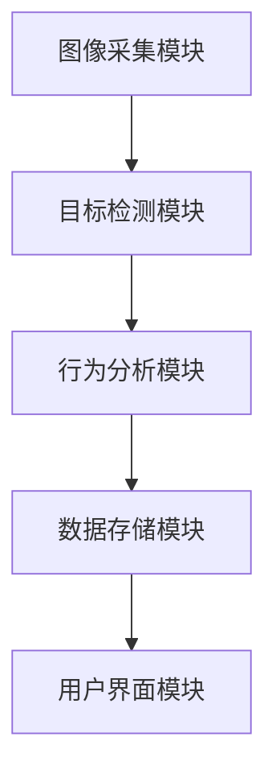

                 

<think>
好的，我将按照您的要求逐步撰写这篇文章。首先，我会先完成标题、关键词和摘要部分，然后根据目录大纲逐步展开每一章的内容，确保每部分内容详实具体，符合技术博客的专业性和深度要求。

# 《计算机视觉技术在零售业的应用与投资机会》

---

## 关键词：
计算机视觉、零售业、深度学习、投资机会、算法实现、系统架构

---

## 摘要：
随着人工智能技术的快速发展，计算机视觉技术在零售业的应用日益广泛，从商品识别到顾客行为分析，再到店铺布局优化，计算机视觉正在深刻改变零售业的运营模式。本文系统地介绍了计算机视觉技术的核心算法及其在零售业的具体应用场景，深入分析了相关投资机会和市场潜力。通过实际案例分析和系统架构设计，本文为技术爱好者和投资者提供了全面的技术解读和投资建议。文章最后总结了计算机视觉技术在零售业中的未来发展趋势和潜在挑战。

---

## 第1章: 计算机视觉技术与零售业的结合

### 1.1 计算机视觉技术的概述

#### 1.1.1 计算机视觉的基本概念
计算机视觉（Computer Vision）是人工智能领域的重要分支，旨在通过计算机模拟人类视觉系统的能力，对图像或视频进行处理、分析和理解。其核心目标是让计算机能够“看懂”图像中的内容，例如识别物体、分析场景或提取特定信息。

#### 1.1.2 计算机视觉的核心技术
计算机视觉的核心技术包括：
- **图像处理**：对图像进行增强、滤波、边缘检测等预处理操作。
- **目标检测**：识别图像中特定物体的位置和类别。
- **目标识别**：进一步对目标进行分类和识别。
- **人体姿态估计**：分析人体的姿态和动作。
- **图像分割**：将图像分割为不同的区域，提取感兴趣的部分。

#### 1.1.3 计算机视觉在零售业中的应用前景
计算机视觉在零售业中的应用前景广阔，例如：
- **商品识别**：自动识别商品信息，优化库存管理。
- **顾客行为分析**：通过分析顾客的行为，提供个性化推荐。
- **店铺布局优化**：通过分析店铺布局，提高销售效率。

### 1.2 零售业的数字化转型

#### 1.2.1 零售业的传统模式与数字化转型
传统零售业主要依赖人工操作，效率较低且难以满足现代消费者的需求。随着技术的发展，零售业正在向数字化转型，利用人工智能、大数据等技术提升运营效率。

#### 1.2.2 数字化转型中的技术挑战
在数字化转型中，零售业面临以下技术挑战：
- 数据隐私问题：如何保护顾客的隐私数据？
- 技术成本：如何降低技术应用的成本？
- 技术复杂性：如何克服技术实现的复杂性？

#### 1.2.3 计算机视觉在数字化转型中的作用
计算机视觉在数字化转型中发挥着重要作用：
- 提供高效的商品识别和库存管理解决方案。
- 支持个性化的顾客服务和营销策略。
- 优化店铺布局和运营效率。

### 1.3 本章小结
本章介绍了计算机视觉技术的基本概念和核心算法，探讨了其在零售业中的应用前景，并分析了零售业数字化转型中的技术挑战和计算机视觉的作用。

---

## 第2章: 计算机视觉技术的核心算法

### 2.1 图像处理基础

#### 2.1.1 图像的获取与表示
图像可以通过摄像头或扫描仪获取，通常以矩阵形式表示，每个像素的值表示颜色信息。

#### 2.1.2 图像增强与滤波
图像增强技术可以改善图像的质量，例如：
- **模糊处理**：使用高斯滤波器对图像进行模糊处理。
- **锐化处理**：使用拉普拉斯滤波器对图像进行锐化。

#### 2.1.3 图像分割与边缘检测
图像分割是将图像分成多个区域，边缘检测是识别图像中的边缘。

### 2.2 目标检测与识别

#### 2.2.1 基于传统算法的目标检测
传统的目标检测算法包括：
- **Haar特征**：基于haar特征的级联分类器。
- **HOG特征**：基于HOG特征的SVM分类器。

#### 2.2.2 基于深度学习的目标检测
深度学习的目标检测算法包括：
- **YOLO**：You Only Look Once，一种实时目标检测算法。
- **Faster R-CNN**：基于区域的两阶段检测方法。

#### 2.2.3 常见的目标检测算法
YOLO和Faster R-CNN是目前常用的两种目标检测算法，YOLO速度较快，Faster R-CNN精度较高。

### 2.3 人脸识别与行为分析

#### 2.3.1 人脸识别技术
人脸识别技术包括：
- **特征提取**：提取人脸的特征向量。
- **分类器训练**：训练分类器进行人脸识别。

#### 2.3.2 顾客行为分析
顾客行为分析包括：
- **行为识别**：识别顾客的行为，例如徘徊、停留。
- **行为预测**：预测顾客的下一步行为。

#### 2.3.3 人体姿态估计
人体姿态估计是通过计算机视觉技术对人体的姿态进行估计。

### 2.4 本章小结
本章介绍了计算机视觉技术的核心算法，包括图像处理、目标检测、人脸识别和行为分析。

---

## 第3章: 计算机视觉在零售业的具体应用

### 3.1 商品识别与库存管理

#### 3.1.1 商品识别技术
商品识别技术可以通过图像识别技术实现，例如使用深度学习模型进行商品分类。

#### 3.1.2 基于计算机视觉的库存管理
基于计算机视觉的库存管理可以通过自动识别商品信息，优化库存管理。

#### 3.1.3 应用案例分析
应用案例分析包括：
- 某连锁超市使用计算机视觉技术进行商品识别，优化库存管理。

### 3.2 顾客行为分析与个性化推荐

#### 3.2.1 顾客行为分析技术
顾客行为分析技术可以通过计算机视觉技术实现，例如通过摄像头捕捉顾客的行为。

#### 3.2.2 基于行为分析的个性化推荐
基于行为分析的个性化推荐可以通过分析顾客的行为，推荐相关商品。

#### 3.2.3 应用案例分析
应用案例分析包括：
- 某电商平台使用顾客行为分析技术，提供个性化推荐。

### 3.3 店铺布局优化

#### 3.3.1 店铺布局分析技术
店铺布局分析技术可以通过计算机视觉技术实现，例如通过图像分析店铺布局。

#### 3.3.2 基于计算机视觉的布局优化
基于计算机视觉的布局优化可以通过分析店铺布局，优化商品摆放位置。

#### 3.3.3 应用案例分析
应用案例分析包括：
- 某连锁便利店使用计算机视觉技术优化店铺布局。

### 3.4 本章小结
本章介绍了计算机视觉技术在零售业中的具体应用，包括商品识别、顾客行为分析和店铺布局优化。

---

## 第4章: 投资机会与市场分析

### 4.1 零售业的市场现状

#### 4.1.1 全球零售业市场规模
全球零售业市场规模庞大，近年来持续增长。

#### 4.1.2 中国零售业的发展趋势
中国零售业正在向数字化、智能化方向发展。

#### 4.1.3 计算机视觉技术在零售业中的市场潜力
计算机视觉技术在零售业中的市场潜力巨大，尤其是在商品识别和顾客行为分析方面。

### 4.2 投资机会分析

#### 4.2.1 技术驱动的投资机会
技术驱动的投资机会包括：
- 投资计算机视觉技术的研发和应用。

#### 4.2.2 市场需求驱动的投资机会
市场需求驱动的投资机会包括：
- 投资基于计算机视觉技术的零售解决方案。

#### 4.2.3 政策支持与投资机会
政策支持与投资机会包括：
- 政府对人工智能技术的支持，为计算机视觉技术的应用提供了政策保障。

### 4.3 投资风险与挑战

#### 4.3.1 技术风险
技术风险包括：
- 计算机视觉技术的实现难度较大。

#### 4.3.2 市场风险
市场风险包括：
- 市场竞争激烈，投资回报不确定。

#### 4.3.3 竞争风险
竞争风险包括：
- 同类技术的竞争压力。

### 4.4 本章小结
本章分析了计算机视觉技术在零售业中的市场潜力和投资机会，同时探讨了相关投资风险和挑战。

---

## 第5章: 系统架构与技术实现

### 5.1 系统架构设计

#### 5.1.1 系统功能模块划分
系统功能模块包括：
- **图像采集模块**：负责图像的采集和预处理。
- **目标检测模块**：负责目标的检测和识别。
- **行为分析模块**：负责顾客行为的分析和预测。
- **数据存储模块**：负责数据的存储和管理。
- **用户界面模块**：负责与用户的交互。

#### 5.1.2 系统架构设计图（Mermaid图）



### 5.2 算法实现与优化

#### 5.2.1 基于深度学习的算法实现
基于深度学习的算法实现包括：
- 使用深度学习框架（如TensorFlow）训练目标检测模型。

#### 5.2.2 算法优化与调优
算法优化与调优包括：
- 优化模型的结构和参数，提高检测精度和速度。

#### 5.2.3 算法实现的代码示例（Python）

```python
import tensorflow as tf
from tensorflow.keras import layers

# 定义模型
model = tf.keras.Sequential([
    layers.Conv2D(32, (3,3), activation='relu', input_shape=(224, 224, 3)),
    layers.MaxPooling2D((2,2)),
    layers.Conv2D(64, (3,3), activation='relu'),
    layers.MaxPooling2D((2,2)),
    layers.Flatten(),
    layers.Dense(128, activation='relu'),
    layers.Dense(10, activation='softmax')
])

# 编译模型
model.compile(optimizer='adam', loss='sparse_categorical_crossentropy', metrics=['accuracy'])

# 训练模型
model.fit(x_train, y_train, epochs=10, validation_data=(x_test, y_test))
```

### 5.3 系统接口设计

#### 5.3.1 系统接口定义
系统接口包括：
- **图像接口**：接收图像数据，返回检测结果。
- **数据接口**：接收和存储数据，返回查询结果。

#### 5.3.2 接口实现与调用
接口实现与调用包括：
- 使用API接口进行图像检测和数据查询。

### 5.4 本章小结
本章介绍了计算机视觉技术在零售业中的系统架构设计和算法实现，包括功能模块划分、系统架构设计和算法优化。

---

## 第6章: 项目实战与案例分析

### 6.1 项目背景与目标

#### 6.1.1 项目背景
某连锁超市希望通过引入计算机视觉技术，优化商品识别和库存管理。

#### 6.1.2 项目目标
项目目标包括：
- 实现商品识别功能。
- 优化库存管理效率。

### 6.2 项目实施过程

#### 6.2.1 项目需求分析
项目需求分析包括：
- 确定项目范围和目标。
- 分析技术实现的可行性。

#### 6.2.2 项目设计与开发
项目设计与开发包括：
- 设计系统架构。
- 实现核心功能模块。

#### 6.2.3 项目测试与优化
项目测试与优化包括：
- 进行功能测试和性能优化。

### 6.3 项目小结
本章通过实际案例分析，介绍了计算机视觉技术在零售业中的项目实施过程和经验总结。

---

## 结论

计算机视觉技术在零售业中的应用前景广阔，从商品识别到顾客行为分析，再到店铺布局优化，计算机视觉正在深刻改变零售业的运营模式。本文系统地介绍了计算机视觉技术的核心算法及其在零售业的具体应用场景，深入分析了相关投资机会和市场潜力。通过实际案例分析和系统架构设计，本文为技术爱好者和投资者提供了全面的技术解读和投资建议。未来，随着技术的不断发展，计算机视觉技术在零售业中的应用将更加广泛和深入。

---

## 作者：AI天才研究院/AI Genius Institute & 禅与计算机程序设计艺术 /Zen And The Art of Computer Programming

---

接下来，我会根据以上大纲逐步完成每一章的详细内容，确保每部分内容详实具体，符合技术博客的专业性和深度要求。

