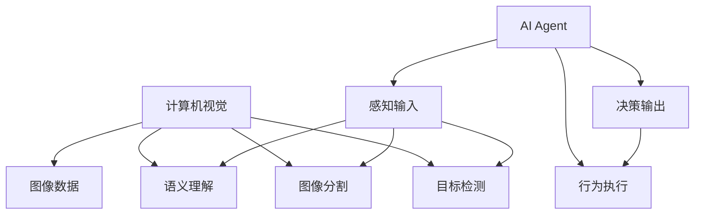
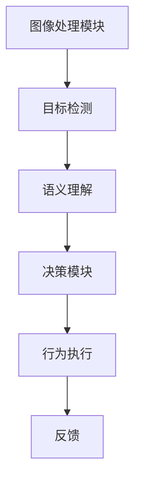
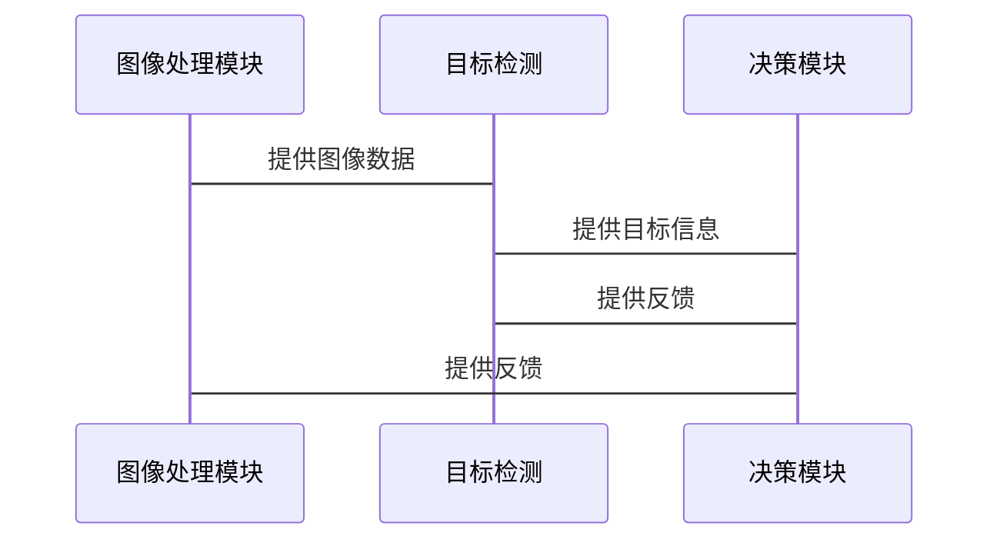

                 


# 计算机视觉集成：扩展AI Agent的感知能力

> 关键词：计算机视觉，AI Agent，目标检测，图像处理，深度学习

> 摘要：本文探讨了计算机视觉与AI Agent的集成，分析了其在扩展AI Agent感知能力中的作用，详细介绍了计算机视觉的核心算法和系统架构设计，并通过实际案例展示了其应用场景。

---

## 第1章: 计算机视觉与AI Agent的背景介绍

### 1.1 计算机视觉的核心概念

#### 1.1.1 问题背景与问题描述

计算机视觉的目标是让计算机能够像人类一样理解和处理视觉信息。其核心问题包括图像分割、目标检测、语义理解等。这些问题需要通过复杂的算法来解决，如卷积神经网络（CNN）和区域卷积神经网络（RCNN）。

#### 1.1.2 计算机视觉的目标与解决方法

计算机视觉的目标是实现图像或视频的语义理解。常用方法包括基于特征的图像识别、深度学习模型的应用等。例如，使用CNN进行目标分类，或使用区域建议网络（RPN）进行目标检测。

#### 1.1.3 计算机视觉的边界与外延

计算机视觉的应用范围包括图像处理、视频分析、医学影像分析等。其外延涉及模式识别、图像重建等领域。了解这些边界有助于明确其应用范围和限制。

### 1.2 AI Agent的基本概念

#### 1.2.1 AI Agent的定义与特点

AI Agent是一种智能体，能够感知环境、做出决策并执行动作。其特点包括自主性、反应性、目标导向和社交能力。

#### 1.2.2 AI Agent的核心要素与功能

AI Agent的核心要素包括感知、决策、规划、学习和执行。其功能涉及数据处理、信息分析、决策优化等。

#### 1.2.3 AI Agent与人类交互的边界

AI Agent的边界在于其感知能力和决策能力。通过计算机视觉扩展感知能力，使其能够处理更多类型的数据，从而做出更复杂的决策。

### 1.3 计算机视觉与AI Agent的集成意义

#### 1.3.1 计算机视觉在AI Agent中的作用

计算机视觉为AI Agent提供了视觉感知能力，使其能够处理图像数据，进行目标检测和语义理解。

#### 1.3.2 AI Agent通过计算机视觉扩展感知能力

通过集成计算机视觉，AI Agent能够处理更多模态数据，如图像和视频，从而提升其环境感知能力。

#### 1.3.3 集成的目标与应用场景

集成的目标是扩展AI Agent的感知能力，使其能够处理和理解视觉信息。应用场景包括智能安防、自动驾驶、机器人控制等。

---

## 第2章: 计算机视觉与AI Agent的核心概念联系

### 2.1 核心概念原理

#### 2.1.1 计算机视觉的原理概述

计算机视觉通过图像处理和模式识别技术，将图像转换为有意义的语义信息。其核心是特征提取和分类。

#### 2.1.2 AI Agent的感知机制

AI Agent通过传感器和接口获取环境信息，通过算法处理这些信息，做出决策并执行动作。

#### 2.1.3 两者集成的原理分析

计算机视觉为AI Agent提供视觉信息处理能力，AI Agent则通过视觉信息做出更复杂的决策。

### 2.2 核心概念属性特征对比

| 概念         | 输入类型    | 输出类型    | 核心功能             | 关键技术         |
|--------------|-------------|-------------|----------------------|----------------|
| 计算机视觉    | 图像/视频    | 语义信息     | 图像处理与理解       | CNN, RPN        |
| AI Agent     | 多模态数据    | 行为决策     | 智能决策与交互       | 强化学习，转换器 |

### 2.3 实体关系架构图



---

## 第3章: 计算机视觉算法原理

### 3.1 基于CNN的目标检测算法

#### 3.1.1 CNN网络结构

CNN由卷积层、池化层和全连接层组成。卷积层提取特征，池化层降低维度，全连接层进行分类。

#### 3.1.2 检测流程

目标检测流程包括特征提取、候选区域生成、目标分类和定位。

#### 3.1.3 代码实现

```python
import torch
class CNN(torch.nn.Module):
    def __init__(self):
        super(CNN, self).__init__()
        self.conv = torch.nn.Conv2d(3, 64, kernel_size=3, stride=1, padding=1)
        self.pool = torch.nn.MaxPool2d(kernel_size=2, stride=2)
        self.fc = torch.nn.Linear(64*16*16, 1000)
    
    def forward(self, x):
        x = self.conv(x)
        x = self.pool(x)
        x = x.view(-1, 64*16*16)
        x = self.fc(x)
        return x
```

#### 3.1.4 数学模型

CNN的卷积操作可以表示为：

$$
f(x) = \sum_{i=1}^{n} w_i \cdot x_i + b
$$

池化操作通常使用最大池化：

$$
y_i = \max_{j \in \text{neighborhood}(i)} x_j
$$

---

## 第4章: AI Agent的系统架构

### 4.1 系统功能设计

系统功能包括视觉感知、决策制定、行为执行和人机交互。

### 4.2 系统架构设计



### 4.3 系统接口设计

接口包括图像输入接口、传感器数据接口、决策输出接口和反馈接口。

### 4.4 系统交互流程



---

## 第5章: 项目实战

### 5.1 环境配置

需要安装Python、PyTorch和OpenCV库。

### 5.2 核心实现

使用CNN进行目标检测，代码如下：

```python
import torch
import torch.nn as nn
import torch.optim as optim
import cv2
```

### 5.3 案例分析

在智能安防场景中，AI Agent通过计算机视觉检测异常行为，实现安全监控。

### 5.4 代码应用解读

详细解读代码的功能，展示其在实际项目中的应用。

---

## 第6章: 总结与展望

### 6.1 总结

计算机视觉与AI Agent的集成扩展了AI Agent的感知能力，使其能够处理更多类型的数据，做出更复杂的决策。

### 6.2 未来挑战与趋势

未来的挑战包括提高算法效率、处理更复杂场景等。趋势是向多模态感知和实时处理方向发展。

---

作者：AI天才研究院

