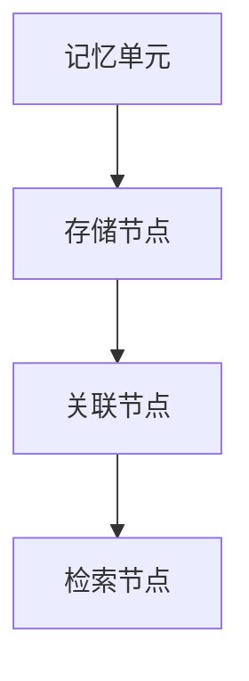
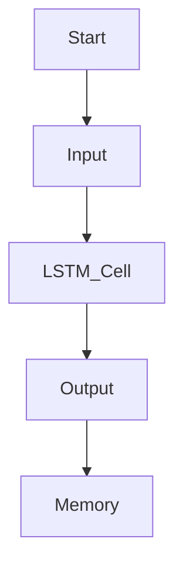
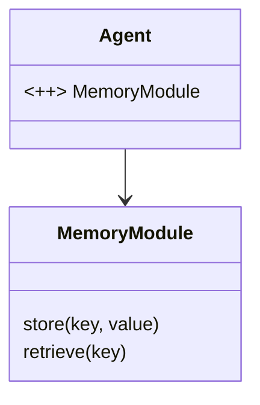
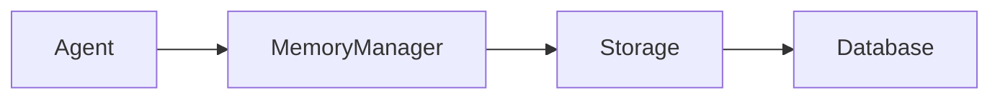
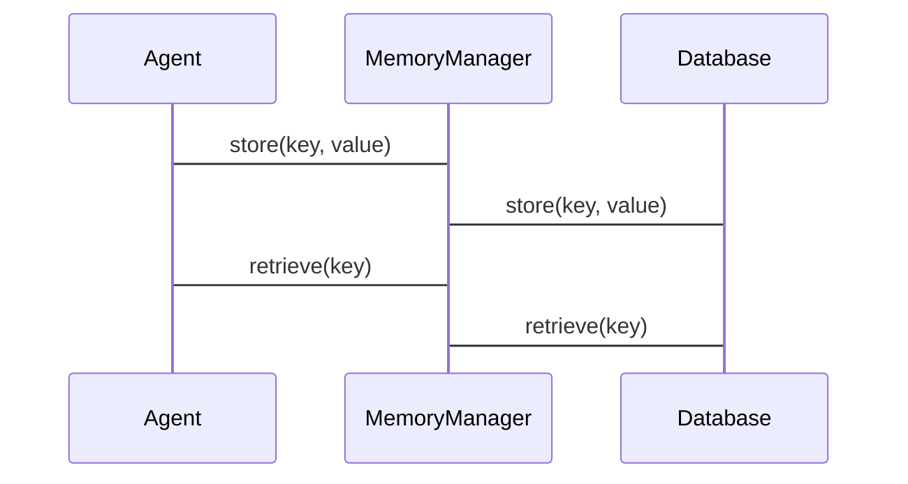

                 


```markdown
# 记忆机制实现：让AI Agent具备长期记忆能力

> 关键词：记忆机制，AI Agent，长期记忆，神经网络，图结构，注意力机制，系统架构

> 摘要：本文系统地探讨了记忆机制在AI Agent中的实现方法，分析了其核心概念、算法原理、系统架构设计以及实际应用案例，旨在为读者提供从理论到实践的全面指导，帮助AI Agent具备长期记忆能力，提升其智能水平。

---

## 第一部分：记忆机制的背景与核心概念

### 第1章：记忆机制的基本概念与问题背景

#### 1.1 什么是记忆机制
- 1.1.1 记忆机制的定义
  - 记忆机制是AI Agent存储和检索信息的能力，模拟人类的记忆过程。
- 1.1.2 AI Agent的长期记忆能力的重要性
  - 长期记忆能力使AI Agent能够处理复杂任务，提升智能水平。
- 1.1.3 记忆机制在AI Agent中的应用场景
  - 自然语言处理、推荐系统、自动驾驶等领域。

#### 1.2 问题背景与挑战
- 1.2.1 当前AI Agent记忆能力的局限性
  - 短期记忆为主，长期记忆能力不足。
- 1.2.2 长期记忆在复杂任务中的必要性
  - 复杂任务需要整合历史信息，提升决策能力。
- 1.2.3 实现长期记忆的难点与解决方案
  - 难点：信息存储、检索和更新；解决方案：引入神经网络和图结构。

### 第2章：记忆机制的核心概念与联系

#### 2.1 记忆机制的原理
- 2.1.1 基于神经网络的记忆机制
  - LSTM和GRU的记忆单元。
- 2.1.2 图结构记忆模型
  - 使用图结构表示知识，增强关联性。

#### 2.2 核心概念对比分析
- 2.2.1 不同记忆机制的特征对比（表格形式）

| 记忆机制 | 基础结构 | 优点 | 缺点 |
|---------|---------|------|------|
| LSTM    | 循环神经网络 | 长期依赖关系 | 计算复杂 |
| GRU     | 简化循环神经网络 | 计算效率高 | 表达能力稍弱 |
| 图结构  | 图结构 | 关联性强 | 实现复杂 |

#### 2.3 实体关系图（ER图）


---

## 第二部分：记忆机制的算法原理

### 第3章：基于神经网络的记忆机制

#### 3.1 神经网络中的记忆单元
- 3.1.1 LSTM的结构与记忆功能
  - LSTM通过门控机制控制信息的存储和遗忘。
- 3.1.2 GRU的记忆机制
  - 简化版LSTM，融合遗忘和更新门。
- 3.1.3 基于注意力机制的记忆增强
  - 注意力机制通过加权方式增强相关记忆。

#### 3.2 算法流程图


#### 3.3 LSTM的数学模型
- LSTM的遗忘门：
  $$ f_t = \sigma(W_f \cdot [h_{t-1}, x_t] + b_f) $$
- LSTM的记忆单元：
  $$ g_t = \tanh(W_g \cdot [h_{t-1}, x_t] + b_g) $$
- LSTM的输出门：
  $$ o_t = \sigma(W_o \cdot [h_{t-1}, x_t] + b_o) $$
- 最终输出：
  $$ h_t = o_t \cdot g_t $$

### 第4章：图结构记忆模型

#### 4.1 图结构记忆模型的原理
- 4.1.1 图结构的表示方法
  - 使用节点和边表示实体及其关系。
- 4.1.2 基于图的注意力机制
  - 结合图结构和注意力机制，增强相关性记忆。

#### 4.2 图结构记忆模型的实现
- 使用图嵌入方法（如GraphSAGE）进行节点表示。

---

## 第三部分：系统分析与架构设计

### 第5章：系统功能设计

#### 5.1 问题场景介绍
- AI Agent需要处理复杂任务，如对话系统和推荐系统。

#### 5.2 领域模型（Mermaid类图）


### 第6章：系统架构设计

#### 6.1 系统架构图（Mermaid架构图）


#### 6.2 接口设计
- `store(key, value)`: 存储信息。
- `retrieve(key)`: 检索信息。

#### 6.3 交互流程（Mermaid序列图）


---

## 第四部分：项目实战

### 第7章：环境安装与系统核心实现

#### 7.1 环境安装
- 安装Python、TensorFlow、Keras等工具。

#### 7.2 核心代码实现
- 使用LSTM实现记忆机制：
  ```python
  import tensorflow as tf
  from tensorflow.keras.layers import LSTMCell, GRUCell

  cell = LSTMCell(units=64)
  rnn = tf.keras.layers.RNN(cell)
  model = tf.keras.Model(inputs=input_layer, outputs=rnn(input_layer))
  ```

#### 7.3 代码应用解读与分析
- LSTMCell用于处理序列数据，rnn层将处理后的输出作为记忆单元。

#### 7.4 实际案例分析
- 对话系统中的记忆应用。

---

## 第五部分：最佳实践与总结

### 第8章：小结与注意事项

#### 8.1 小结
- 记忆机制是实现AI Agent长期记忆的关键技术。

#### 8.2 注意事项
- 选择合适的记忆机制，确保系统性能。

### 第9章：拓展阅读

#### 9.1 推荐资源
- 推荐书籍和论文。

---

## 作者

作者：AI天才研究院/AI Genius Institute & 禅与计算机程序设计艺术 /Zen And The Art of Computer Programming
```

