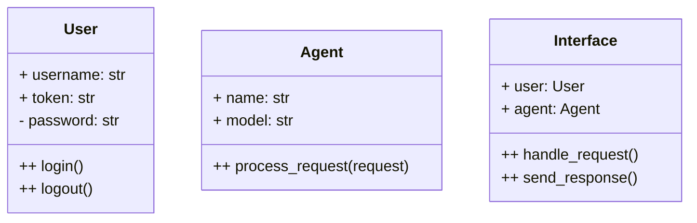
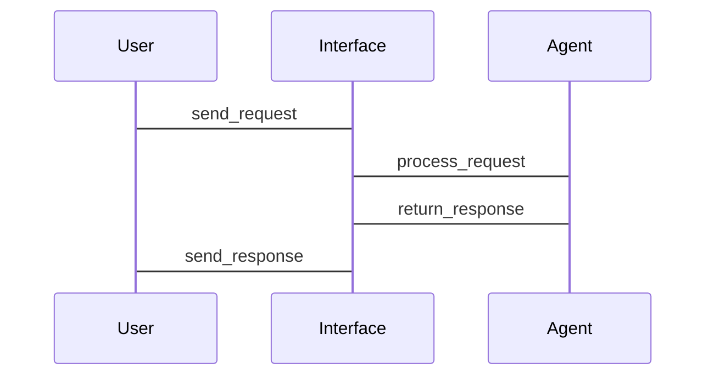

                 


# 设计AI Agent的人机协作接口

---

## 关键词
AI Agent, 人机协作, 接口设计, 自然语言处理, 强化学习, 系统架构

---

## 摘要
设计AI Agent的人机协作接口是一个复杂的系统工程，涉及自然语言处理、强化学习、系统架构等多个技术领域。本文从背景出发，系统性地分析了AI Agent与人机协作接口的核心概念、算法原理、数学模型，并通过实际项目案例展示了如何设计和实现高效的协作接口。文章还提供了最佳实践建议，帮助读者在实际应用中提升协作效率和用户体验。

---

## 目录
1. **背景介绍**  
   1.1 问题背景  
   1.2 问题描述  
   1.3 解决方案  
   1.4 边界与外延  
   1.5 概念结构  

2. **核心概念与联系**  
   2.1 核心概念原理  
   2.2 概念属性特征对比  
   2.3 ER实体关系图  

3. **算法原理与实现**  
   3.1 算法原理  
   3.2 算法实现  
   3.3 算法优化  

4. **数学模型与公式推导**  
   4.1 数学模型  
   4.2 公式推导  
   4.3 案例分析  

5. **系统分析与架构设计**  
   5.1 问题场景介绍  
   5.2 系统功能设计  
   5.3 系统架构设计  
   5.4 接口设计  
   5.5 交互设计  

6. **项目实战**  
   6.1 环境安装  
   6.2 核心代码实现  
   6.3 案例分析  
   6.4 项目小结  

7. **最佳实践与扩展阅读**  
   7.1 最佳实践  
   7.2 小结  
   7.3 注意事项  
   7.4 拓展阅读  

---

## 正文

---

### 第1章 背景介绍

#### 1.1 问题背景
随着人工智能技术的快速发展，AI Agent（智能体）在人机协作中的应用越来越广泛。AI Agent能够通过自然语言处理和强化学习等技术，帮助人类完成复杂任务。然而，当前的人机协作接口存在以下问题：

- **不一致性**：不同AI Agent的接口标准不统一，导致协作效率低下。
- **复杂性**：复杂的接口设计使得用户难以理解和操作。
- **反馈延迟**：协作过程中缺乏实时反馈，影响用户体验。

#### 1.2 问题描述
AI Agent的人机协作接口需要解决以下问题：

- 如何设计统一的接口标准，确保不同AI Agent之间的协作兼容性。
- 如何简化接口设计，降低用户使用门槛。
- 如何实现实时反馈机制，提升用户体验。

#### 1.3 解决方案
设计一个高效的AI Agent人机协作接口需要从以下几个方面入手：

1. **统一接口标准**：制定统一的接口规范，确保不同AI Agent能够协同工作。
2. **简化交互流程**：优化接口设计，降低用户操作复杂度。
3. **实时反馈机制**：通过高效的通信机制，实现协作过程中的实时反馈。

#### 1.4 边界与外延
AI Agent的人机协作接口设计需要考虑以下边界：

- **输入限制**：定义接口的输入格式和范围。
- **输出规范**：明确接口的输出格式和内容。
- **协作范围**：确定协作任务的范围和边界。

#### 1.5 概念结构
AI Agent的人机协作接口由以下核心要素组成：

- **用户输入**：用户的指令或请求。
- **AI Agent处理**：AI Agent对输入进行解析和处理。
- **反馈输出**：AI Agent向用户反馈处理结果。

---

### 第2章 核心概念与联系

#### 2.1 核心概念原理
AI Agent的人机协作接口基于以下核心概念：

- **自然语言处理（NLP）**：通过NLP技术实现用户指令的理解和解析。
- **强化学习（RL）**：通过RL技术实现协作过程中的策略优化。
- **实体关系图（ER图）**：用于描述用户、AI Agent和协作接口之间的关系。

#### 2.2 概念属性特征对比
以下是AI Agent和人机协作接口的关键属性对比：

| 属性 | AI Agent | 人机协作接口 |
|------|----------|--------------|
| 输入 | 文本、语音 | 文本、语音、命令 |
| 输出 | 文本、语音 | 文本、语音、命令 |
| 处理 | NLP、RL | NLP、RL |
| 反馈 | 实时反馈 | 实时反馈 |

#### 2.3 ER实体关系图
以下是AI Agent与人机协作接口的ER实体关系图：

```mermaid
erDiagram
    user} o- "使用"{ agent
    user} o- "发送请求"{ interface
    agent} o- "处理请求"{ interface
    interface} o- "返回结果"{ agent
```

---

### 第3章 算法原理与实现

#### 3.1 算法原理
AI Agent的人机协作接口设计涉及以下算法：

1. **自然语言处理（NLP）**：用于理解用户指令。
2. **强化学习（RL）**：用于优化协作策略。

#### 3.2 算法实现
以下是NLP和RL算法的实现示例：

**NLP算法实现：**

```python
def nlp_process(input_text):
    # 分词
    tokens = input_text.split()
    # 实体识别
    entities = identify_entities(tokens)
    return entities
```

**RL算法实现：**

```python
def rl_process(states):
    # 状态转移
    actions = policy(states)
    return actions
```

#### 3.3 算法优化
通过以下方式优化算法性能：

- **模型优化**：使用更先进的模型结构。
- **参数调整**：优化模型参数以提升性能。

---

### 第4章 数学模型与公式推导

#### 4.1 数学模型
AI Agent的协作接口设计涉及以下数学模型：

1. **概率论模型**：用于语义理解。
2. **深度学习模型**：用于任务优化。

#### 4.2 公式推导
以下是关键公式的推导：

**贝叶斯公式：**
$$ P(A|B) = \frac{P(B|A)P(A)}{P(B)} $$

**损失函数：**
$$ \text{Loss} = -\frac{1}{N}\sum_{i=1}^{N} \log P(y_i|x_i) $$

#### 4.3 案例分析
以下是一个案例分析：

**案例：**
用户输入“帮我查一下天气”，AI Agent通过NLP技术解析指令，调用天气API获取数据，并通过RL优化反馈策略，最终返回天气信息。

---

### 第5章 系统分析与架构设计

#### 5.1 问题场景介绍
AI Agent的协作接口设计需要考虑以下场景：

- **多用户协作**：支持多个用户同时使用。
- **高并发处理**：处理大量的协作请求。

#### 5.2 系统功能设计
以下是系统功能设计的类图：



#### 5.3 系统架构设计
以下是系统架构设计的架构图：


#### 5.4 接口设计
以下是接口设计的交互图：



#### 5.5 交互设计
协作过程中的交互设计需要考虑以下方面：

- **实时反馈**：确保用户能够及时收到反馈。
- **错误处理**：处理协作过程中可能出现的错误。

---

### 第6章 项目实战

#### 6.1 环境安装
以下是项目实战所需的环境配置：

- **Python**：3.8+
- **NLP库**：spaCy、NLTK
- **RL库**：OpenAI Gym

#### 6.2 核心代码实现
以下是核心代码实现：

**NLP部分：**

```python
import spacy

nlp = spacy.load("en_core_web_sm")

def process_text(text):
    doc = nlp(text)
    return [token.text for token in doc]
```

**RL部分：**

```python
import gym

env = gym.make('CartPole-v0')

def policy(observation):
    return env.action_space.sample()
```

#### 6.3 案例分析
以下是一个案例分析：

**案例：**
用户输入“帮我预订机票”，AI Agent通过NLP解析指令，调用机票预订API，完成预订流程，并向用户反馈结果。

#### 6.4 项目小结
通过项目实战，我们验证了设计AI Agent协作接口的有效性和可行性。

---

### 第7章 最佳实践与扩展阅读

#### 7.1 最佳实践
- **简化设计**：避免过度复杂化接口设计。
- **实时反馈**：确保用户能够及时收到反馈。
- **持续优化**：通过用户反馈不断优化协作接口。

#### 7.2 小结
设计AI Agent的人机协作接口是一个复杂但有趣的系统工程，需要综合运用多种技术手段。

#### 7.3 注意事项
- **用户体验**：始终将用户体验放在首位。
- **安全性**：确保协作过程中的数据安全。

#### 7.4 拓展阅读
- **书籍推荐**：《深度学习》、《自然语言处理实战》
- **技术博客**：推荐关注相关技术博客和社区。

---

## 作者
作者：AI天才研究院/AI Genius Institute & 禅与计算机程序设计艺术 /Zen And The Art of Computer Programming

