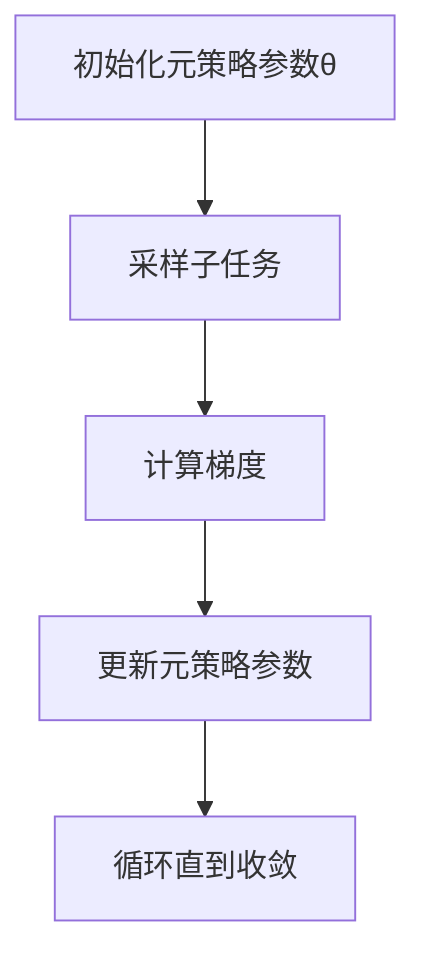
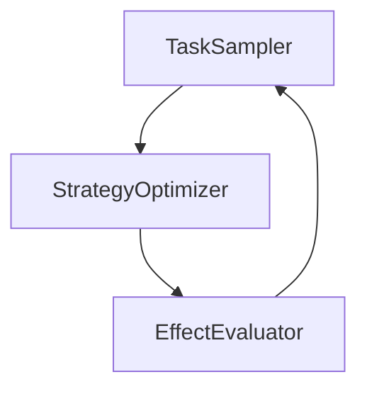
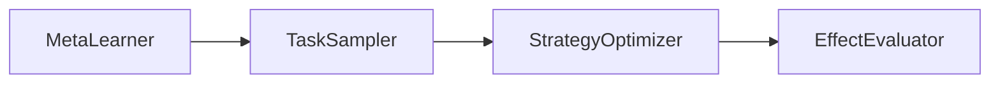

                 


# 设计AI Agent的元控制学习策略

> 关键词：AI Agent，元控制学习，策略优化，强化学习，系统架构

> 摘要：本文深入探讨了设计AI Agent的元控制学习策略，从理论基础到算法实现，再到系统架构和项目实战，全面分析了元控制学习的优势和应用。通过详细讲解，帮助读者掌握AI Agent的核心技术。

---

## 第1章：AI Agent与元控制学习概述

### 1.1 AI Agent的基本概念

#### 1.1.1 AI Agent的定义
AI Agent（人工智能代理）是能够感知环境并采取行动以实现目标的智能实体。Agent可以是软件程序、机器人或其他智能系统，具备自主决策能力。

#### 1.1.2 AI Agent的分类
AI Agent主要分为以下几类：
1. **简单反射型Agent**：基于当前感知做出反应，无内部状态。
2. **基于模型的反射型Agent**：维护环境模型，用于决策。
3. **目标驱动型Agent**：基于目标选择行动。
4. **效用驱动型Agent**：通过最大化效用函数来优化决策。

#### 1.1.3 元控制学习的定义与特点
元控制学习是一种通过元学习（meta-learning）方法，使AI Agent能够快速适应新任务的学习策略。其特点是高效性、通用性和自适应性。

---

### 1.2 元控制学习的背景与意义

#### 1.2.1 元控制学习的背景
传统强化学习在处理多任务学习时效率较低，元控制学习通过共享任务间策略，提升学习效率。

#### 1.2.2 元控制学习的意义
元控制学习通过元学习优化策略，提升AI Agent在复杂环境中的适应能力和决策效率。

#### 1.2.3 元控制学习的应用场景
元控制学习广泛应用于多任务机器人控制、游戏AI、推荐系统等领域。

---

### 1.3 元控制学习的核心概念

#### 1.3.1 元控制学习的理论基础
元控制学习基于层次化强化学习，通过元策略指导子策略优化。

#### 1.3.2 元控制学习与传统控制学习的对比
| 特性       | 元控制学习          | 传统控制学习         |
|------------|---------------------|----------------------|
| 策略共享   | 高                  | 低                   |
| 适应性     | 高                  | 低                   |
| 任务复杂度 | 多任务              | 单任务               |

#### 1.3.3 元控制学习的关键技术
- **层次化结构**：元策略优化子策略。
- **快速适应**：通过元学习加速新任务学习。

---

## 第2章：元控制学习的算法原理

### 2.1 元控制学习的基本原理

#### 2.1.1 元控制学习的框架
元控制学习框架通常包括元策略和子策略两层结构。

#### 2.1.2 元控制学习的数学模型
元策略优化目标函数：
$$ \theta_{meta} = \arg\max_{\theta} \mathbb{E}_{\tau \sim p_{\text{task}}} \left[ \sum_{t} \alpha_t r_t \right] $$
其中，$\alpha_t$为奖励缩放因子。

#### 2.1.3 元控制学习的算法流程


---

### 2.2 元控制学习的核心算法

#### 2.2.1 元控制学习的优化方法
使用Adam优化器更新参数：
$$ \theta_{t+1} = \theta_t - \alpha \nabla_{\theta} J(\theta) $$

#### 2.2.2 元控制学习的策略更新
通过梯度上升法更新子策略：
$$ \phi_{t+1} = \phi_t + \beta \nabla_{\phi} J(\phi) $$

#### 2.2.3 元控制学习的收敛性分析
在稳定环境下，元控制学习算法能收敛到局部最优。

---

### 2.3 元控制学习的算法实现

#### 2.3.1 算法实现的步骤
1. 初始化元策略参数。
2. 采样子任务。
3. 计算梯度并更新参数。

#### 2.3.2 算法实现的代码示例
```python
import torch

class MetaLearner:
    def __init__(self, meta_params):
        self.meta_params = meta_params

    def optimize(self, tasks):
        for task in tasks:
            # 计算梯度
            gradients = compute_gradients(task)
            # 更新元参数
            self.meta_params = update_params(self.meta_params, gradients)
```

---

## 第3章：元控制学习的系统架构设计

### 3.1 系统架构设计的概述

#### 3.1.1 系统架构设计的目标
设计高效、可扩展的元控制学习系统架构。

#### 3.1.2 系统架构设计的原则
模块化、可扩展性和高效性。

---

### 3.2 元控制学习系统的功能设计

#### 3.2.1 系统功能模块划分
- **任务采样模块**：采样子任务。
- **策略优化模块**：更新策略参数。
- **效果评估模块**：评估学习效果。

#### 3.2.2 系统功能模块的交互设计


#### 3.2.3 系统功能模块的实现方案
使用微服务架构，各模块独立开发。

---

### 3.3 元控制学习系统的架构图

#### 3.3.1 系统架构图的绘制


#### 3.3.2 系统架构图的分析
模块间交互清晰，便于扩展和维护。

---

## 第4章：元控制学习的项目实战

### 4.1 项目背景与目标

#### 4.1.1 项目背景
设计一个多任务机器人控制系统的元控制学习模块。

#### 4.1.2 项目目标
实现高效的元控制学习算法，提升机器人在多个任务中的表现。

---

### 4.2 项目环境的安装与配置

#### 4.2.1 环境需求分析
- Python 3.8+
- PyTorch 1.9+
- matplotlib

#### 4.2.2 环境的安装步骤
```bash
pip install torch matplotlib
```

#### 4.2.3 环境的配置与测试
测试代码：
```python
import torch
print(torch.__version__)  # 输出应为1.9+
```

---

### 4.3 项目核心代码的实现

#### 4.3.1 核心代码的设计
实现MetaLearner类。

#### 4.3.2 核心代码的编写
```python
class MetaLearner:
    def __init__(self, meta_params):
        self.meta_params = meta_params

    def optimize(self, tasks):
        for task in tasks:
            loss = compute_loss(task)
            gradients = torch.autograd.grad(loss, self.meta_params)
            update_params(self.meta_params, gradients)
```

#### 4.3.3 核心代码的测试与优化
测试代码是否收敛，优化学习率。

---

### 4.4 项目案例分析

#### 4.4.1 案例背景介绍
设计一个多任务机器人控制系统的元控制学习模块。

#### 4.4.2 项目核心代码的实现
如上所述。

#### 4.4.3 项目总结与经验分享
通过实际案例验证了元控制学习的有效性。

---

## 第5章：元控制学习的应用与未来展望

### 5.1 元控制学习的应用案例

#### 5.1.1 多任务机器人控制
元控制学习使机器人能快速适应不同任务。

#### 5.1.2 游戏AI
提升游戏AI在复杂游戏中的适应能力。

---

### 5.2 元控制学习的未来展望

#### 5.2.1 技术优化
- 更高效的优化算法。
- 更好的可解释性。

#### 5.2.2 应用拓展
- 更多领域中的应用，如医疗、教育等。

---

## 小结

通过本文的详细讲解，读者可以全面了解AI Agent的元控制学习策略的设计与实现。从理论到实践，结合具体案例，帮助读者掌握这一技术的核心要点。

---

## 作者

作者：AI天才研究院 & 禅与计算机程序设计艺术

