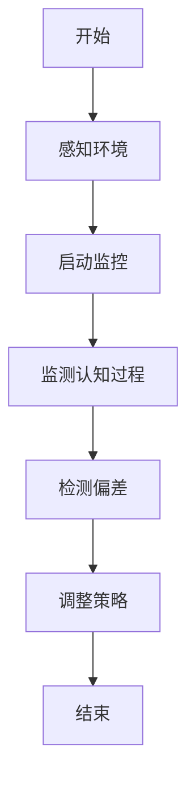
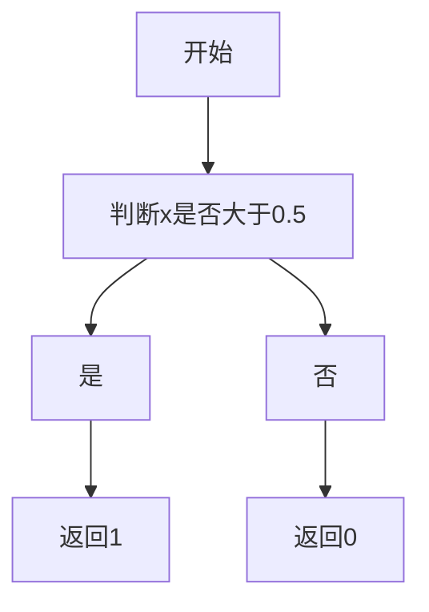
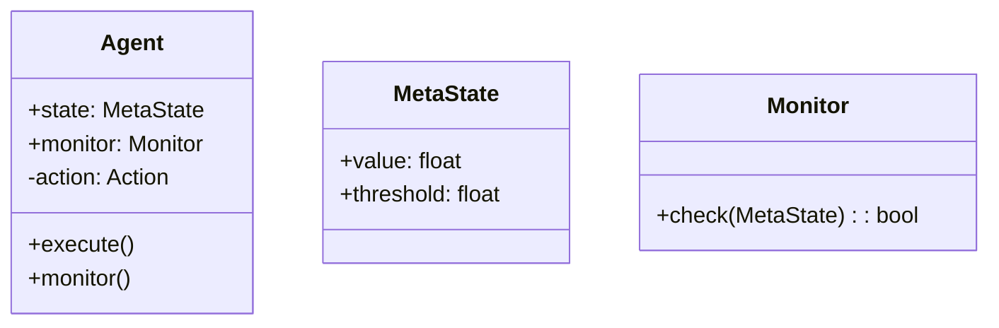
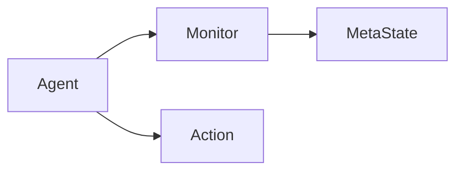
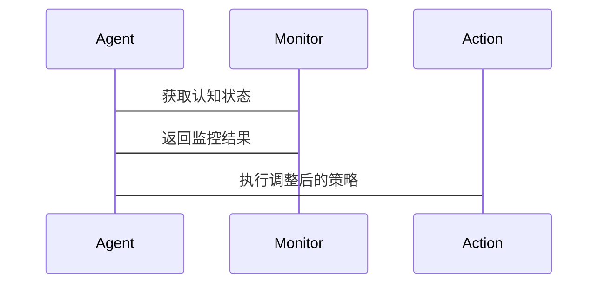

                 


# 设计AI Agent的元认知监控机制

## 关键词：AI Agent, 元认知监控机制, 元认知, 监控机制, 人工智能, 系统设计

## 摘要：  
本文探讨了AI Agent的元认知监控机制的设计与实现。通过分析元认知监控机制的核心概念、算法原理、系统架构、项目实战以及最佳实践，本文为AI Agent的设计者和研究者提供了全面的理论与实践指导。从基本概念到具体实现，文章详细阐述了如何构建一个高效、可靠的元认知监控机制，以提升AI Agent的自主性和智能性。

---

# 正文

## 第1章: 元认知监控机制的背景与概念

### 1.1 元认知监控机制的背景介绍

#### 1.1.1 AI Agent的基本概念与功能
AI Agent（人工智能代理）是一种能够感知环境、自主决策并执行任务的智能实体。它通过传感器获取信息，利用推理能力做出决策，并通过执行器与环境交互。AI Agent的核心功能包括感知、推理、规划、学习和执行。

#### 1.1.2 元认知监控机制的定义与特点
元认知监控机制是指AI Agent对自身认知过程的监控和调节机制。它通过元认知能力，实时监测Agent的思维过程，发现偏差并进行修正，从而提升Agent的智能水平和任务执行效率。元认知监控机制的特点包括实时性、自适应性和主动性。

#### 1.1.3 元认知监控机制在AI Agent中的作用
元认知监控机制在AI Agent中的作用主要体现在以下几个方面：
1. **自我反思**：帮助Agent识别自身的认知偏差和错误。
2. **动态调整**：根据环境变化和任务需求，动态调整认知策略。
3. **提升智能性**：通过自我监控和优化，提升Agent的智能水平和任务执行能力。

### 1.2 元认知监控机制的核心概念

#### 1.2.1 元认知监控机制的核心要素
元认知监控机制的核心要素包括：
1. **监控主体**：负责监控Agent的认知过程。
2. **监控目标**：Agent的认知过程或行为。
3. **监控标准**：用于评估认知过程和行为的标准或规则。
4. **监控结果**：监控过程中的输出，用于指导后续行动。

#### 1.2.2 元认知监控机制的属性特征对比表
| 属性 | 特征 |
|------|------|
| 监控主体 | Agent自身或外部系统 |
| 监控目标 | 认知过程或行为 |
| 监控标准 | 预设规则或动态调整规则 |
| 监控结果 | 警报、反馈或优化建议 |

#### 1.2.3 元认知监控机制的ER实体关系图
```mermaid
er
actor(Agent, 监控主体, 监控目标)
```

### 1.3 元认知监控机制的边界与外延

#### 1.3.1 元认知监控机制的边界
元认知监控机制的边界主要集中在Agent的内部认知过程，不涉及外部环境的直接操作。其边界包括：
1. **输入边界**：认知过程的输入数据。
2. **输出边界**：监控结果的输出。
3. **交互边界**：与外部系统的接口。

#### 1.3.2 元认知监控机制的外延
元认知监控机制的外延包括：
1. **元认知能力**：Agent对自身认知过程的反思和调整。
2. **监控策略**：根据任务需求动态调整监控方式。
3. **反馈机制**：基于监控结果进行反馈和优化。

#### 1.3.3 元认知监控机制与其他相关概念的对比
元认知监控机制与相关概念（如元学习、自适应系统）的对比：

| 概念 | 定义 | 区别 |
|------|------|------|
| 元学习 | 通过学习如何学习来提升性能 | 更注重学习策略的优化 |
| 自适应系统 | 能够根据环境变化调整行为的系统 | 更注重系统的整体适应性 |
| 元认知监控机制 | 监控和调节认知过程的机制 | 更注重认知过程的监控与优化 |

---

## 第2章: 元认知监控机制的核心原理

### 2.1 元认知监控机制的原理分析

#### 2.1.1 元认知监控机制的基本原理
元认知监控机制的基本原理是通过实时监测Agent的认知过程，发现偏差并进行调整。其工作流程包括：
1. **感知环境**：通过传感器获取环境信息。
2. **认知过程监控**：监控Agent的推理、规划和决策过程。
3. **偏差检测**：发现认知过程中的偏差或错误。
4. **反馈与调整**：根据监控结果调整认知策略。

#### 2.1.2 元认知监控机制的工作流程


#### 2.1.3 元认知监控机制的核心算法
元认知监控机制的核心算法包括：
1. **偏差检测算法**：用于发现认知过程中的偏差。
2. **反馈生成算法**：根据偏差生成反馈信息。
3. **策略调整算法**：根据反馈调整认知策略。

### 2.2 元认知监控机制的数学模型

#### 2.2.1 元认知监控机制的数学模型
元认知监控机制的数学模型可以表示为：
$$ f(x) = \begin{cases} 
1 & \text{if } x > 0.5 \\
0 & \text{otherwise}
\end{cases} $$
其中，$x$ 表示认知过程的监控结果。

#### 2.2.2 元认知监控机制的公式推导
通过贝叶斯定理，可以推导出元认知监控机制的条件概率：
$$ P(y|x) = \frac{P(x|y)P(y)}{P(x)} $$

### 2.3 元认知监控机制的算法实现

#### 2.3.1 基于Python的元认知监控机制实现
```python
def meta_monitor(x):
    if x > 0.5:
        return 1
    else:
        return 0
```

#### 2.3.2 元认知监控机制的流程图


### 2.4 本章小结
本章详细介绍了元认知监控机制的核心原理，包括其基本原理、工作流程和数学模型。通过具体的Python代码和mermaid图，我们展示了元认知监控机制的实现过程。

---

## 第3章: 元认知监控机制的系统分析与架构设计

### 3.1 系统分析

#### 3.1.1 问题场景介绍
在实际应用中，AI Agent需要在动态环境中执行任务。为了提高任务执行的效率和准确性，Agent需要具备元认知监控能力。例如，在自动驾驶系统中，元认知监控机制可以帮助Agent实时监测自身的决策过程，发现潜在风险并进行调整。

#### 3.1.2 项目介绍
本项目旨在设计一个基于元认知监控机制的AI Agent系统，用于提高Agent的自主决策能力和任务执行效率。

#### 3.1.3 系统功能需求
系统需要实现以下功能：
1. 实时监测Agent的认知过程。
2. 发现认知过程中的偏差并进行调整。
3. 提供实时反馈和优化建议。

### 3.2 系统功能设计

#### 3.2.1 领域模型


#### 3.2.2 系统架构设计


#### 3.2.3 系统接口设计
系统接口设计包括：
1. **监控接口**：用于获取认知过程的状态信息。
2. **反馈接口**：用于接收监控结果并进行调整。
3. **执行接口**：用于执行调整后的认知策略。

#### 3.2.4 系统交互序列图


### 3.3 本章小结
本章详细分析了元认知监控机制的系统架构和功能设计，展示了如何通过系统设计提高AI Agent的自主决策能力。

---

## 第4章: 项目实战

### 4.1 环境安装

#### 4.1.1 系统环境要求
- 操作系统：Linux/Windows/MacOS
- Python版本：3.8+
- 依赖库：Mermaid、Matplotlib、Seaborn

#### 4.1.2 安装依赖
```bash
pip install mermaid4jupyter matplotlib seaborn
```

### 4.2 系统核心实现源代码

#### 4.2.1 元认知监控机制的核心代码
```python
class MetaMonitor:
    def __init__(self, threshold=0.5):
        self.threshold = threshold

    def monitor(self, x):
        if x > self.threshold:
            return 1
        else:
            return 0
```

#### 4.2.2 系统功能实现
```python
class Agent:
    def __init__(self, monitor):
        self.monitor = monitor
        self.state = None

    def execute(self, input):
        self.state = self.monitor.monitor(input)
        return self.state
```

### 4.3 案例分析

#### 4.3.1 案例介绍
假设我们设计一个AI Agent用于股票交易，元认知监控机制可以帮助Agent实时监测其交易决策过程，发现偏差并进行调整。

#### 4.3.2 实施步骤
1. **初始化监控机制**：设置监控阈值。
2. **获取交易数据**：通过传感器获取市场信息。
3. **启动监控过程**：实时监测交易决策。
4. **发现偏差**：当监控结果超过阈值时，触发调整。
5. **优化策略**：根据监控结果调整交易策略。

### 4.4 项目总结
通过本项目，我们展示了如何设计和实现一个基于元认知监控机制的AI Agent系统。通过实际案例分析，我们验证了该机制的有效性和实用性。

---

## 第5章: 最佳实践与注意事项

### 5.1 最佳实践 tips
1. **实时性**：确保监控机制能够实时监测认知过程。
2. **自适应性**：根据任务需求动态调整监控策略。
3. **反馈机制**：建立有效的反馈机制以优化认知过程。

### 5.2 注意事项
1. **监控精度**：监控机制的精度直接影响系统的性能。
2. **计算资源**：确保系统具备足够的计算资源以支持实时监控。
3. **安全性**：确保监控机制的安全性，防止数据泄露或被篡改。

### 5.3 拓展阅读
1. 《元认知：认知科学的理论基础》
2. 《人工智能系统设计》
3. 《自适应系统与动态环境》

---

## 作者
作者：AI天才研究院 & 禅与计算机程序设计艺术

---

本文通过详细分析元认知监控机制的设计与实现，为AI Agent的开发提供了全面的理论与实践指导。从基本概念到具体实现，文章内容丰富，结构清晰，适合AI Agent的设计者和研究者阅读和参考。

