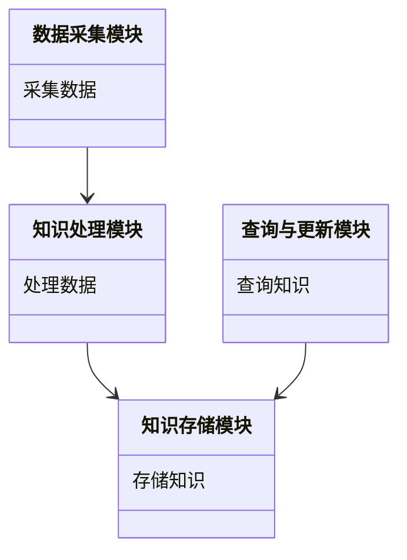

                 


# 设计AI Agent的动态知识库构建与维护

---

## 关键词：AI Agent、动态知识库、知识表示、知识更新、系统架构

---

## 摘要：  
本文深入探讨了AI Agent动态知识库的构建与维护方法，从理论基础到实际应用，详细阐述了动态知识库的核心概念、设计原则、构建算法和系统架构。通过具体案例分析，结合数学模型和系统设计图，为AI Agent的动态知识库设计提供了全面的指导。

---

## 第一部分: AI Agent与动态知识库概述

### 第1章: AI Agent与动态知识库的背景与概念

#### 1.1 AI Agent的基本概念
- **1.1.1 AI Agent的定义与分类**
  - AI Agent的定义：智能代理（AI Agent）是指能够感知环境、自主决策并执行任务的智能实体。
  - 分类：基于智能水平，AI Agent可分为反应式、认知式和混合式代理。

- **1.1.2 动态知识库的定义与特点**
  - 动态知识库的定义：动态知识库是指能够实时更新和适应环境变化的知识存储系统。
  - 特点：动态性、实时性、灵活性。

- **1.1.3 AI Agent与动态知识库的关系**
  - AI Agent依赖动态知识库进行决策和行动。
  - 动态知识库为AI Agent提供动态、准确的知识支持。

#### 1.2 动态知识库的重要性
- **1.2.1 AI Agent对知识库的依赖**
  - AI Agent需要实时更新的知识来应对复杂环境。
- **1.2.2 动态知识库在AI Agent中的作用**
  - 提供动态知识支持，增强AI Agent的适应能力。
- **1.2.3 动态知识库的动态更新机制**
  - 动态更新机制确保知识库内容与时俱进。

#### 1.3 本章小结
- 本章介绍了AI Agent和动态知识库的基本概念，强调了动态知识库在AI Agent中的重要性。

---

## 第二部分: 动态知识库的核心概念与设计原则

### 第2章: 动态知识库的结构与设计

#### 2.1 知识库的构成要素
- **2.1.1 数据源与数据类型**
  - 数据源：知识库的数据来源包括传感器、数据库、外部API等。
  - 数据类型：结构化数据、非结构化数据、半结构化数据。

- **2.1.2 知识表示方法**
  - 表示方法：符号表示、语义网络、概率图模型。
  - 对比表格：
    | 方法         | 优点               | 缺点               |
    |--------------|--------------------|--------------------|
    | 符号表示      | 简单易懂           | 表达能力有限       |
    | 语义网络      | 表达能力强          | 实现复杂           |
    | 概率图模型    | 能处理不确定性      | 计算复杂           |

- **2.1.3 知识组织方式**
  - 组织方式：层次化、网络化、模块化。

#### 2.2 动态知识库的设计原则
- **2.2.1 可扩展性原则**
  - 知识库应支持新增知识的快速接入。
- **2.2.2 实时更新原则**
  - 知识库需实时更新，确保信息的及时性。
- **2.2.3 高效查询原则**
  - 知识库应支持高效的查询操作，减少响应时间。

#### 2.3 知识库的动态更新机制
- **2.3.1 数据预处理流程**
  - 数据清洗、数据转换、数据验证。
- **2.3.2 知识表示转换**
  - 知识表示的转换方法：符号到语义网络的转换。
- **2.3.3 更新策略与算法**
  - 更新策略：全量更新、增量更新。
  - 算法：基于哈希的增量更新算法。

#### 2.4 本章小结
- 本章详细介绍了动态知识库的构成要素、设计原则和动态更新机制。

---

## 第三部分: 动态知识库的构建与维护算法

### 第3章: 动态知识库的构建算法

#### 3.1 知识库构建的基本流程
- **3.1.1 数据收集与清洗**
  - 数据来源：传感器、数据库、外部API。
  - 数据清洗：去重、去噪、格式统一。
- **3.1.2 知识抽取与表示**
  - 知识抽取：基于规则的抽取、基于机器学习的抽取。
  - 知识表示：符号表示、语义网络。
- **3.1.3 知识存储与索引**
  - 存储方式：关系型数据库、图数据库。
  - 索引优化：建立索引提高查询效率。

#### 3.2 动态知识库的增量更新算法
- **3.2.1 增量数据处理流程**
  - 数据变化检测：通过日志或差异检测。
  - 数据更新处理：局部更新、全量更新。
- **3.2.2 知识表示更新方法**
  - 更新符号表示：符号表示的更新算法。
  - 更新语义网络：语义网络的更新方法。
- **3.2.3 更新后的知识验证**
  - 知识验证：通过规则验证或逻辑推理验证。

#### 3.3 算法实现的数学模型
- **3.3.1 数据预处理的数学模型**
  - 数据清洗的数学模型：基于概率的去噪算法。
- **3.3.2 知识表示的转换公式**
  - 符号到语义网络的转换公式：符号表示转换为语义向量。
- **3.3.3 更新算法的收敛性分析**
  - 增量更新算法的收敛性分析：基于数学归纳法。

#### 3.4 本章小结
- 本章详细介绍了动态知识库的构建流程和增量更新算法。

---

## 第四部分: 动态知识库的系统架构与实现

### 第4章: 动态知识库的系统架构设计

#### 4.1 系统功能模块划分
- **4.1.1 数据采集模块**
  - 功能：从传感器、数据库等来源采集数据。
- **4.1.2 知识处理模块**
  - 功能：数据清洗、知识抽取、知识表示。
- **4.1.3 知识存储模块**
  - 功能：存储知识、建立索引。
- **4.1.4 查询与更新模块**
  - 功能：支持查询、支持增量更新。

#### 4.2 系统架构的Mermaid图


#### 4.3 系统接口设计
- **4.3.1 数据接口**
  - 输入：传感器数据、外部API数据。
  - 输出：清洗后的数据。
- **4.3.2 查询接口**
  - 输入：查询条件。
  - 输出：查询结果。

#### 4.4 系统交互流程
- **4.4.1 数据采集与处理**
  - 数据采集模块采集数据，传递给知识处理模块。
- **4.4.2 知识存储与查询**
  - 知识处理模块处理数据后，传递给知识存储模块。
  - 查询与更新模块根据需求查询知识存储模块。

#### 4.5 本章小结
- 本章详细介绍了动态知识库的系统架构设计，包括功能模块划分、系统接口设计和系统交互流程。

---

## 第五部分: 动态知识库的项目实战

### 第5章: 动态知识库的项目实现

#### 5.1 环境安装
- **5.1.1 系统环境**
  - 操作系统：Linux/Windows。
  - 开发工具：Python、Jupyter Notebook。
- **5.1.2 依赖安装**
  - 数据库：MongoDB、Neo4j。
  - 开发库：pymongo、networkx。

#### 5.2 核心代码实现
- **5.2.1 数据采集模块**
  ```python
  import requests

  def collect_data(api_url):
      response = requests.get(api_url)
      return response.json()
  ```

- **5.2.2 知识处理模块**
  ```python
  def process_data(data):
      # 数据清洗
      cleaned_data = [item for item in data if item['valid']]
      # 知识抽取
      knowledge = {'entities': [], 'relations': []}
      for item in cleaned_data:
          knowledge['entities'].append(item['entity'])
          knowledge['relations'].append(item['relation'])
      return knowledge
  ```

- **5.2.3 知识存储模块**
  ```python
  from pymongo import MongoClient

  def store_knowledge(knowledge, db_name):
      client = MongoClient('localhost', 27017)
      db = client[db_name]
      entities_collection = db['entities']
      relations_collection = db['relations']
      # 存储实体
      for entity in knowledge['entities']:
          entities_collection.insert_one({'name': entity})
      # 存储关系
      for relation in knowledge['relations']:
          relations_collection.insert_one({'source': relation['source'], 'target': relation['target']})
  ```

- **5.2.4 查询与更新模块**
  ```python
  def query_knowledge(db_name, entity_name):
      client = MongoClient('localhost', 27017)
      db = client[db_name]
      entities_collection = db['entities']
      relations_collection = db['relations']
      # 查询实体
      result = entities_collection.find_one({'name': entity_name})
      return result
  ```

#### 5.3 项目实战案例分析
- **5.3.1 案例背景**
  - 假设我们正在设计一个智能客服AI Agent，需要动态更新客户知识库。
- **5.3.2 实施步骤**
  - 数据采集：从客服系统中采集客户数据。
  - 数据处理：清洗和抽取有用信息。
  - 知识存储：存储客户信息和关系。
  - 查询与更新：实时更新客户信息。

#### 5.4 本章小结
- 本章通过一个实际案例，详细介绍了动态知识库的项目实现过程。

---

## 第六部分: 总结与展望

### 第6章: 总结与展望

#### 6.1 总结
- 本文详细介绍了AI Agent动态知识库的构建与维护方法，包括核心概念、设计原则、构建算法和系统架构。

#### 6.2 最佳实践Tips
- 定期更新知识库，确保知识的准确性。
- 选择合适的知识表示方法，提高知识库的表达能力。
- 优化系统架构，提高系统的扩展性和高效性。

#### 6.3 注意事项
- 数据安全：确保知识库数据的安全性。
- 系统性能：优化系统性能，减少响应时间。
- 知识一致性：确保知识库的一致性。

#### 6.4 拓展阅读
- 推荐阅读《知识图谱构建与应用》、《动态知识库的优化方法》。

#### 6.5 本章小结
- 本章总结了本文的主要内容，并提出了未来的研究方向。

---

## 作者：AI天才研究院/AI Genius Institute & 禅与计算机程序设计艺术 /Zen And The Art of Computer Programming

