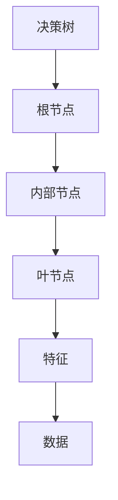
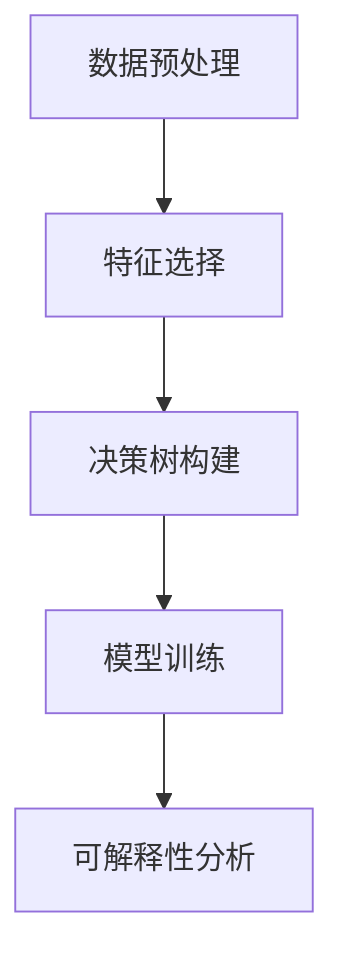

                 


# 设计AI Agent的可解释决策树

---

## 关键词：
- AI Agent
- 可解释性
- 决策树
- 信息增益
- 系统架构

---

## 摘要：
本文将详细介绍如何设计具备可解释性的AI Agent决策树。通过分析决策树的结构、算法原理以及系统架构，探讨如何在AI代理中实现透明和可解释的决策过程。文章结合理论与实践，从数学模型到实际案例，深入剖析可解释决策树的核心要素及其在AI代理中的应用。

---

# 目录

---

## 第一章: AI Agent与可解释决策树概述

### 1.1 AI Agent的基本概念
- 1.1.1 什么是AI Agent
- 1.1.2 AI Agent的类型
- 1.1.3 AI Agent的决策机制

### 1.2 可解释性的重要性
- 1.2.1 为什么需要可解释性
- 1.2.2 可解释性在AI Agent中的作用
- 1.2.3 可解释性与决策树的关系

### 1.3 本章小结

---

## 第二章: 决策树的基本原理

### 2.1 决策树的结构
- 2.1.1 根节点、叶节点和内部节点
- 2.1.2 决策树的生长过程
- 2.1.3 决策树的优缺点

### 2.2 决策树的算法
- 2.2.1 ID3算法
- 2.2.2 C4.5算法
- 2.2.3 其他决策树算法

### 2.3 决策树的可解释性
- 2.3.1 决策树的可视化
- 2.3.2 决策树的规则提取
- 2.3.3 决策树的可解释性评估

### 2.4 本章小结

---

## 第三章: 决策树的核心概念与联系

### 3.1 决策树的核心概念
- 3.1.1 特征选择
- 3.1.2 信息增益
- 3.1.3 决策树的分裂标准

### 3.2 决策树与其他算法的联系
- 3.2.1 决策树与随机森林
- 3.2.2 决策树与支持向量机
- 3.2.3 决策树与神经网络

### 3.3 决策树的ER实体关系图


### 3.4 本章小结

---

## 第四章: 决策树算法的数学模型与公式

### 4.1 ID3算法的数学模型
- 4.1.1 信息熵的计算
$$ H(S) = -\sum_{i=1}^{k} p_i \log_2 p_i $$
- 4.1.2 信息增益的计算
$$ \text{信息增益}(D, A) = H(D) - H(D|A) $$

### 4.2 C4.5算法的数学模型
- 4.2.1 信息增益率的计算
$$ \text{信息增益率}(D, A) = \frac{\text{信息增益}(D, A)}{\text{熵}(A)} $$

### 4.3 决策树的分裂标准
- 4.3.1 使用信息增益的分裂
- 4.3.2 使用信息增益率的分裂
- 4.3.3 使用基尼指数的分裂
$$ G(D, A) = \sum_{i=1}^{n} p_i (1 - p_i) $$

### 4.4 本章小结

---

## 第五章: 系统分析与架构设计

### 5.1 项目背景与目标
- 5.1.1 项目背景
- 5.1.2 项目目标
- 5.1.3 项目范围

### 5.2 系统架构设计
- 5.2.1 系统架构图


### 5.3 功能模块设计
- 5.3.1 数据预处理模块
- 5.3.2 特征选择模块
- 5.3.3 决策树构建模块
- 5.3.4 可解释性分析模块

### 5.4 系统接口设计
- 5.4.1 输入接口
- 5.4.2 输出接口
- 5.4.3 调用接口

### 5.5 系统交互流程
```mermaid
graph LR
    User->Start
    Start->DataPreprocessing
    DataPreprocessing->FeatureSelection
    FeatureSelection->DecisionTreeConstruction
    DecisionTreeConstruction->ExplainabilityAnalysis
    ExplainabilityAnalysis->End
```

### 5.6 本章小结

---

## 第六章: 项目实战——可解释决策树的实现

### 6.1 环境安装与配置
- 6.1.1 Python安装
- 6.1.2 需要的库（scikit-learn、pandas、numpy）

### 6.2 数据准备
- 6.2.1 数据集获取
- 6.2.2 数据清洗
- 6.2.3 数据预处理

### 6.3 代码实现
- 6.3.1 导入库
- 6.3.2 数据加载与预处理
- 6.3.3 模型训练
- 6.3.4 模型可视化
- 6.3.5 可解释性分析

### 6.4 代码示例
```python
from sklearn.tree import DecisionTreeClassifier
from sklearn.model_selection import train_test_split
from sklearn.metrics import accuracy_score
import pandas as pd
import graphviz

# 数据加载
data = pd.read_csv('data.csv')
X = data.drop('target', axis=1)
y = data['target']

# 数据分割
X_train, X_test, y_train, y_test = train_test_split(X, y, test_size=0.2)

# 模型训练
model = DecisionTreeClassifier()
model.fit(X_train, y_train)

# 模型预测
y_pred = model.predict(X_test)
print("准确率:", accuracy_score(y_test, y_pred))

# 可视化决策树
from sklearn.tree import export_graphviz
export_graphviz(model, out_file='tree.dot', feature_names=X.columns)
```

### 6.5 代码解读与分析
- 6.5.1 数据预处理
- 6.5.2 模型训练
- 6.5.3 模型可视化
- 6.5.4 可解释性分析

### 6.6 项目总结
- 6.6.1 项目成果
- 6.6.2 项目不足
- 6.6.3 优化方向

### 6.7 本章小结

---

## 第七章: 总结与展望

### 7.1 全书总结
- 7.1.1 核心内容回顾
- 7.1.2 关键点总结
- 7.1.3 实践总结

### 7.2 未来展望
- 7.2.1 可解释性研究的未来方向
- 7.2.2 决策树在AI Agent中的应用前景
- 7.2.3 新算法与技术的发展

### 7.3 最佳实践 Tips
- 7.3.1 提高可解释性的建议
- 7.3.2 选择合适算法的建议
- 7.3.3 系统设计的注意事项

### 7.4 本章小结

---

## 作者：AI天才研究院 & 禅与计算机程序设计艺术

