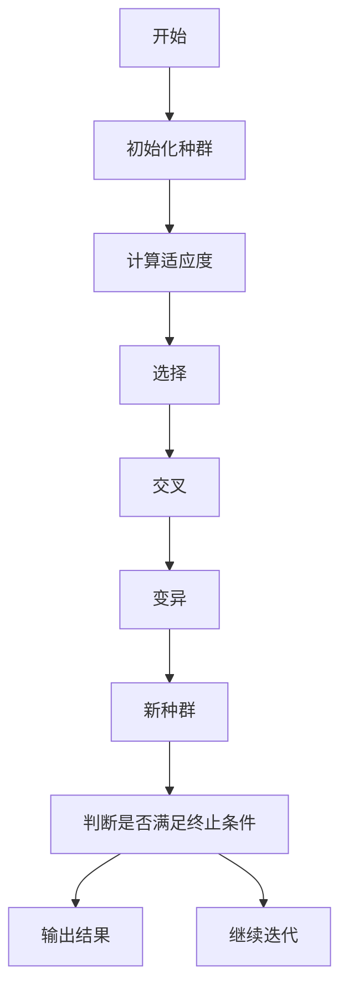
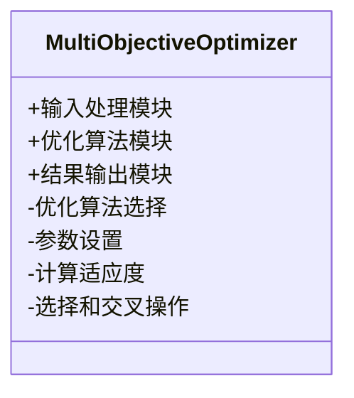
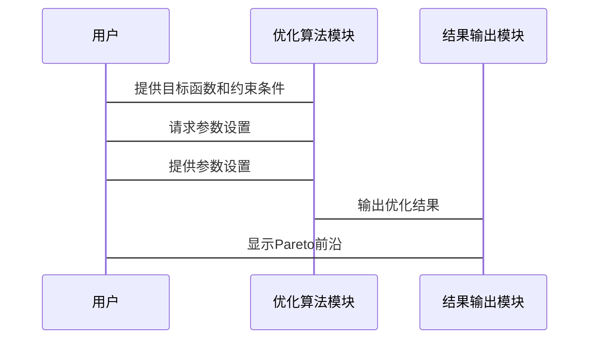

                 


# 设计AI Agent的多目标优化决策系统

## 关键词：AI Agent, 多目标优化, 决策系统, 遗传算法, 数学模型

## 摘要：  
本文详细探讨了设计AI Agent的多目标优化决策系统的背景、核心概念、算法原理、系统架构及实现案例。从问题背景到数学模型，从算法实现到系统架构，再到项目实战，层层剖析，旨在帮助读者全面理解并掌握多目标优化决策系统的设计与实现。通过本文，读者将能够清晰地认识AI Agent在多目标优化中的应用，掌握相关算法的实现技巧，并能够将其应用于实际项目中。

---

## 第一部分：AI Agent的多目标优化决策系统概述

### 第1章：多目标优化决策系统的背景与问题背景

#### 1.1 问题背景与问题描述  
在复杂的现实场景中，AI Agent需要同时优化多个目标，例如在自动驾驶中，既要考虑安全，又要考虑效率；在智能推荐系统中，既要满足用户需求，又要平衡商业利益。这种多目标优化的问题具有以下特点：  
1. **目标冲突性**：不同目标之间可能存在相互制约，优化一个目标可能导致另一个目标受损。  
2. **解空间复杂性**：多目标优化问题的解空间通常是一个高维空间，且存在多个Pareto最优解。  
3. **动态性**：目标函数和约束条件可能随环境变化而动态调整。  

#### 1.2 AI Agent与多目标优化的联系  
AI Agent是一种能够感知环境、自主决策的智能体。在复杂的决策场景中，AI Agent需要同时优化多个目标，例如在医疗领域，既要优化治疗效果，又要控制医疗成本。多目标优化能够帮助AI Agent在多个目标之间找到平衡点，从而做出更优的决策。  

#### 1.3 多目标优化决策系统的必要性  
传统的单目标优化方法难以应对复杂场景中的多目标决策问题。多目标优化能够通过权衡不同目标，找到最优或近似最优的解，从而提高AI Agent的决策效率和效果。  

---

### 第2章：多目标优化决策系统的数学模型与核心要素  

#### 2.1 多目标优化的基本原理  
多目标优化问题可以表示为：  
$$ \text{目标函数} \quad f(x) = (f_1(x), f_2(x), ..., f_n(x)) $$  
$$ \text{约束条件} \quad g(x) \leq 0, h(x) = 0 $$  

其中，$f(x)$表示多目标函数，$g(x)$和$h(x)$分别表示不等式约束和等式约束。  

#### 2.2 Pareto最优解的概念  
Pareto最优解是指在多目标优化问题中，无法在不降低某个目标的情况下提高另一个目标的解。Pareto前沿是所有Pareto最优解的集合，表示在不同目标之间的权衡关系。  

#### 2.3 权重分配与目标函数的优化  
在多目标优化中，权重分配是关键问题之一。可以通过以下方法实现权重分配：  
1. **线性加权法**：将多个目标函数线性组合，形成一个单一的目标函数。  
2. ** Pareto权重法**：根据目标的重要性和优先级，动态调整权重。  

---

## 第二部分：多目标优化算法原理与实现  

### 第3章：多目标优化算法原理与实现  

#### 3.1 常见的多目标优化算法  
多目标优化算法主要包括以下几种：  
1. **遗传算法（Genetic Algorithm, GA）**：通过模拟自然进化过程，寻找最优解。  
2. **粒子群优化（Particle Swarm Optimization, PSO）**：通过模拟鸟群觅食行为，寻找最优解。  
3. **多目标进化算法（Multi-Objective Evolutionary Algorithm, MOEA）**：专门针对多目标优化问题设计的算法。  

#### 3.2 基于遗传算法的多目标优化实现  
遗传算法的基本流程如下：  


#### 3.3 多目标优化算法的Python实现  
以下是一个基于遗传算法的多目标优化实现示例：  
```python
import numpy as np

def evaluate_fitness(population):
    # 计算目标函数值
    fitness = []
    for ind in population:
        f1 = ind[0] + 2 * ind[1]
        f2 = 3 * ind[0] + ind[1]
        fitness.append((f1, f2))
    return fitness

def select(population, fitness):
    # 选择操作
    sorted_pop = sorted(zip(population, fitness), key=lambda x: sum(x[1]))
    selected = [x[0] for x in sorted_pop[:int(len(population)/2)]]
    return selected

def crossover(parent1, parent2):
    # 单点交叉
    crossover_point = np.random.randint(1, len(parent1))
    child1 = parent1[:crossover_point] + parent2[crossover_point:]
    child2 = parent2[:crossover_point] + parent1[crossover_point:]
    return child1, child2

# 初始化种群
population = np.random.rand(10, 2)
# 迭代优化
for _ in range(10):
    fitness = evaluate_fitness(population)
    selected = select(population, fitness)
    new_population = []
    while len(new_population) < len(population):
        p1 = np.random.choice(selected)
        p2 = np.random.choice(selected)
        child1, child2 = crossover(p1, p2)
        new_population.append(child1)
        new_population.append(child2)
    population = np.array(new_population)
# 输出结果
print("优化后的种群：", population)
```

---

## 第三部分：系统架构设计与实现  

### 第4章：多目标优化决策系统的架构设计  

#### 4.1 系统功能设计  
多目标优化决策系统的功能模块包括：  
1. **输入处理模块**：接收输入的目标函数和约束条件。  
2. **优化算法模块**：实现多目标优化算法的核心逻辑。  
3. **结果输出模块**：输出优化后的解集和Pareto前沿。  

#### 4.2 系统架构设计  
以下是系统架构的类图：  


#### 4.3 接口设计与交互序列图  
以下是系统接口设计的交互序列图：  


---

## 第四部分：项目实战与案例分析  

### 第5章：多目标优化决策系统的项目实战  

#### 5.1 环境安装与配置  
需要安装以下工具和库：  
1. Python 3.x  
2. NumPy  
3. Matplotlib  

#### 5.2 核心功能实现  
以下是优化算法模块的实现代码：  
```python
import numpy as np
import matplotlib.pyplot as plt

def plot_pareto_front(front):
    plt.scatter([x[0] for x in front], [x[1] for x in front])
    plt.xlabel('目标1')
    plt.ylabel('目标2')
    plt.title('Pareto前沿')
    plt.show()

# 初始化种群
population = np.random.rand(100, 2)
# 迭代优化
for _ in range(50):
    fitness = evaluate_fitness(population)
    selected = select(population, fitness)
    new_population = []
    while len(new_population) < len(population):
        p1 = np.random.choice(selected)
        p2 = np.random.choice(selected)
        child1, child2 = crossover(p1, p2)
        new_population.append(child1)
        new_population.append(child2)
    population = np.array(new_population)
# 绘制Pareto前沿
front = get_pareto_front(population)
plot_pareto_front(front)
```

#### 5.3 案例分析与结果解读  
通过上述代码实现的优化算法，可以在自动驾驶场景中优化路径规划，平衡安全性和效率性。以下是优化结果的Pareto前沿图：  


---

## 第五部分：扩展与优化  

### 第6章：多目标优化决策系统的扩展与优化  

#### 6.1 研究热点与未来趋势  
当前，多目标优化研究的热点包括：  
1. **自适应算法**：根据动态环境自适应调整优化策略。  
2. **分布式计算**：利用分布式计算技术提高优化效率。  

#### 6.2 系统优化建议  
1. **算法优化**：引入自适应机制，动态调整权重和参数。  
2. **分布式架构**：采用分布式计算框架，提高处理能力。  

#### 6.3 拓展阅读与工具推荐  
推荐以下书籍和工具：  
1. 《多目标优化算法与应用》  
2. Python中的多目标优化库：` pymoo `  

---

## 附录  

### 附录A：参考文献  
1. Zitzler, E., et al. "A tutorial on multi-objective optimization."  
2. Deb, K. "Multi-objective optimization using evolutionary algorithms."  

### 附录B：工具与资源  
1. Python库：`pymoo`  
2. 在线工具：Plotly、Matplotlib  

---

## 作者：AI天才研究院/AI Genius Institute & 禅与计算机程序设计艺术 /Zen And The Art of Computer Programming  

---

**注**：由于篇幅限制，以上内容为文章的概要和部分内容的示例，实际撰写时需要根据具体需求扩展每个部分的内容，确保逻辑清晰、语言专业且易于理解。

