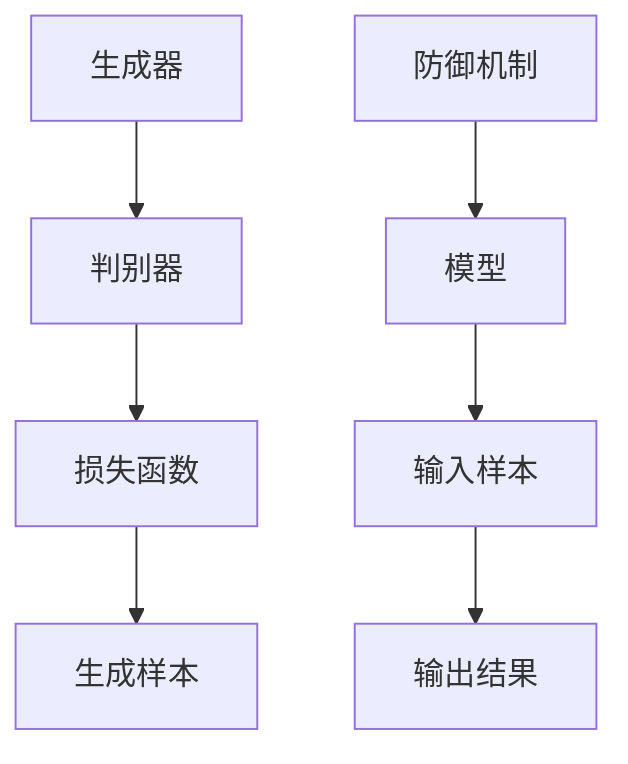

                 

# 设计AI Agent的对抗性学习防御机制

> 关键词：AI Agent, 对抗性学习, 防御机制, 生成对抗网络, 安全漏洞, 深度学习防御

> 摘要：本文详细探讨了AI Agent在对抗性学习中的防御机制设计。首先介绍了AI Agent的基本概念及其在对抗性学习中的应用背景，然后深入分析了对抗性学习的核心原理和防御机制的分类。接着，通过数学模型和算法流程图，详细讲解了对抗性学习的数学模型和防御机制的实现算法。随后，通过系统架构图和交互序列图，展示了防御机制的系统设计。最后，通过一个实际案例，详细讲解了防御机制的实现过程，并总结了设计中的关键点和未来研究方向。

---

# 第一部分: AI Agent与对抗性学习概述

# 第1章: AI Agent与对抗性学习的背景

## 1.1 AI Agent的基本概念

### 1.1.1 AI Agent的定义与特点

AI Agent（人工智能代理）是指能够感知环境、自主决策并执行任务的智能实体。AI Agent具有以下特点：

1. **自主性**：AI Agent能够在没有外部干预的情况下自主决策。
2. **反应性**：AI Agent能够根据环境的变化实时调整行为。
3. **目标导向**：AI Agent的行为通常是为了实现特定的目标。
4. **学习能力**：AI Agent能够通过学习和经验改进自身的性能。

### 1.1.2 AI Agent的应用场景

AI Agent在多个领域都有广泛的应用，例如：

1. **自动驾驶**：AI Agent用于控制车辆的行驶和决策。
2. **智能助手**：如Siri、Alexa等，能够执行用户的指令。
3. **游戏AI**：在电子游戏中，AI Agent可以控制非玩家角色的行为。
4. **推荐系统**：AI Agent可以根据用户的行为推荐相关内容。

### 1.1.3 对抗性学习的背景与问题描述

对抗性学习是一种机器学习技术，其核心思想是通过两个模型（生成器和判别器）的对抗训练来生成高质量的数据样本。然而，对抗性学习也面临一些问题，例如生成样本的质量不稳定、训练过程不稳定等。这些问题可能会影响AI Agent的性能，因此需要设计有效的防御机制来解决这些问题。

---

## 1.2 对抗性学习的定义与核心问题

### 1.2.1 对抗性学习的定义

对抗性学习是一种无监督学习技术，通常由两个神经网络模型（生成器和判别器）组成。生成器的目标是生成与真实数据相似的样本，而判别器的目标是区分真实数据和生成数据。通过交替训练生成器和判别器，可以达到生成高质量数据的目的。

### 1.2.2 对抗性学习的核心问题

在对抗性学习中，主要面临以下问题：

1. **生成样本的质量不稳定**：生成器可能生成低质量或不真实的样本，导致模型性能下降。
2. **训练过程不稳定**：对抗性学习的训练过程可能不稳定，导致生成器和判别器无法收敛。
3. **模型的鲁棒性不足**：对抗性学习生成的样本可能对模型的鲁棒性提出更高的要求。

### 1.2.3 对抗性学习与防御机制的关系

防御机制是为了解决对抗性学习中的问题而设计的策略。防御机制可以通过多种方式增强模型的鲁棒性，例如通过引入对抗训练、检测异常样本等方法，来提高模型的防御能力。

---

## 1.3 本章小结

本章主要介绍了AI Agent的基本概念及其应用场景，并详细探讨了对抗性学习的背景、定义和核心问题。通过对这些内容的了解，我们可以更好地理解对抗性学习防御机制的重要性及其应用场景。

---

# 第二部分: 对抗性学习防御机制的核心概念与原理

# 第2章: 对抗性学习的核心原理

## 2.1 生成对抗网络（GAN）的基本原理

### 2.1.1 GAN的结构与功能

GAN由生成器和判别器两个部分组成。生成器负责生成数据样本，判别器负责区分生成样本和真实样本。生成器的目标是欺骗判别器，使其无法区分生成样本和真实样本。

### 2.1.2 GAN的训练过程

GAN的训练过程包括以下步骤：

1. **初始化参数**：随机初始化生成器和判别器的参数。
2. **训练判别器**：使用真实数据和生成数据训练判别器，使其能够区分真实数据和生成数据。
3. **训练生成器**：使用生成数据训练生成器，使其生成的样本能够欺骗判别器。
4. **交替训练**：重复训练判别器和生成器的过程，直到模型收敛。

### 2.1.3 GAN的优缺点

- **优点**：GAN能够生成高质量的数据样本，具有较高的灵活性和多样性。
- **缺点**：训练过程不稳定，生成样本的质量可能不稳定，且计算资源消耗较大。

### 2.1.4 GAN的数学模型

GAN的数学模型包括生成器和判别器的损失函数：

- **判别器的损失函数**：
  $$ L_{\text{D}} = -\mathbb{E}_{x \sim p_{\text{data}}}[\log D(x)] - \mathbb{E}_{z \sim p_z}[ \log(1 - D(G(z)))] $$
  
- **生成器的损失函数**：
  $$ L_{\text{G}} = -\mathbb{E}_{z \sim p_z}[ \log D(G(z))] $$

### 2.1.5 GAN的训练过程总结

通过交替训练生成器和判别器，GAN能够生成高质量的数据样本。然而，训练过程可能不稳定，需要引入一些技巧（如标签平滑、对抗训练等）来提高训练的稳定性。

---

## 2.2 对抗性学习的防御机制原理

### 2.2.1 对抗性学习的防御目标

防御机制的目标是通过设计有效的策略，增强模型的鲁棒性，防止对抗性攻击。具体来说，防御机制可以通过以下方式实现：

1. **对抗训练**：通过引入对抗性样本，增强模型的鲁棒性。
2. **扰动检测**：检测异常样本，防止对抗性攻击。
3. **模型鲁棒性优化**：通过优化模型结构，提高模型的防御能力。

### 2.2.2 防御机制的核心原理

防御机制的核心原理是通过引入对抗性样本，增强模型的鲁棒性。具体来说，防御机制可以通过以下方式实现：

1. **对抗训练**：通过生成器生成对抗性样本，训练模型的判别器，使其能够区分真实样本和对抗性样本。
2. **扰动检测**：通过检测样本的异常特征，识别对抗性样本。
3. **模型鲁棒性优化**：通过优化模型的结构和参数，提高模型的防御能力。

### 2.2.3 防御机制的分类与对比

防御机制可以分为以下几类：

1. **基于扰动的防御**：通过在输入样本中添加扰动，增强模型的鲁棒性。
2. **基于对抗训练的防御**：通过引入对抗性样本，训练模型的判别器。
3. **基于模型鲁棒性优化的防御**：通过优化模型的结构和参数，提高模型的防御能力。

### 2.2.4 对抗性学习与防御机制的实体关系图

---

## 2.3 对抗性学习与防御机制的核心概念对比

以下是对抗性学习与防御机制的核心概念对比：

| 对比维度 | 对抗性学习 | 防御机制 |
|----------|------------|----------|
| 目标     | 生成高质量样本 | 防御对抗性攻击 |
| 模型结构 | 生成器和判别器 | 真实模型和防御策略 |
| 训练目标 | 最大化生成样本的逼真度 | 最小化对抗性攻击的影响 |

---

## 2.4 本章小结

本章主要介绍了生成对抗网络（GAN）的基本原理及其在对抗性学习中的应用。通过对GAN的结构、训练过程和数学模型的详细讲解，我们可以更好地理解对抗性学习的核心原理。同时，通过对防御机制的分类和对比，我们可以更好地理解防御机制的设计目标和实现方法。

---

接下来，我会根据您的要求，继续按照目录结构撰写后续章节的内容。如果您对上述内容有任何疑问或需要进一步的解释，请随时告诉我。

