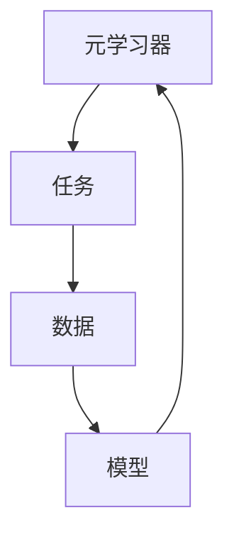
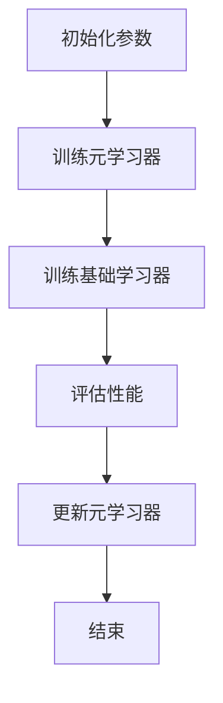
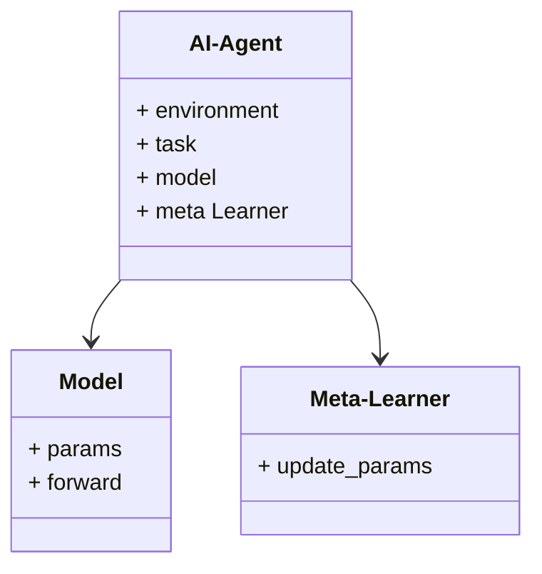
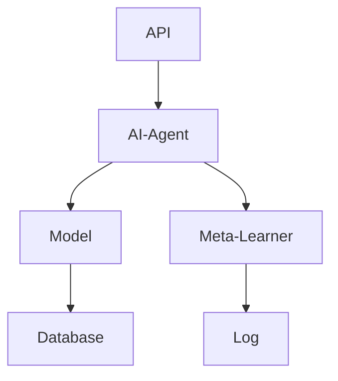

                 


# 设计AI Agent的自适应元学习策略

> 关键词：AI Agent，自适应元学习，策略设计，机器学习，系统架构

> 摘要：本文探讨了设计AI Agent的自适应元学习策略的关键问题，从背景、概念、算法到系统设计和项目实战，详细解析了自适应元学习的原理、实现和应用，帮助读者掌握AI Agent在动态环境中的自适应能力。

---

## 第一部分: AI Agent的自适应元学习策略背景与基础

### 第1章: AI Agent与自适应元学习概述

#### 1.1 AI Agent的基本概念
- **1.1.1 AI Agent的定义与分类**
  - AI Agent：智能体，能够感知环境并采取行动以实现目标。
  - 分类：简单反射型、基于模型的反应型、目标驱动型、效用驱动型。

- **1.1.2 AI Agent的核心特征**
  - 自主性、反应性、目标导向、情境适应性。

- **1.1.3 AI Agent的应用场景**
  - 机器人、推荐系统、自动驾驶、智能助手。

#### 1.2 自适应元学习的背景与意义
- **1.2.1 元学习的基本概念**
  - 元学习：学习如何学习，用于快速适应新任务。

- **1.2.2 自适应元学习的定义**
  - 自适应元学习：根据环境动态调整学习策略。

- **1.2.3 自适应元学习的必要性**
  - 动态环境中的快速适应，减少样本需求，提升泛化能力。

#### 1.3 问题背景与挑战
- **1.3.1 AI Agent在动态环境中的适应性问题**
  - 环境变化导致策略失效。

- **1.3.2 元学习在AI Agent中的应用挑战**
  - 算法复杂度高，实时性差。

- **1.3.3 自适应元学习的核心目标**
  - 实时调整策略，快速适应变化。

---

### 第2章: 自适应元学习策略的核心概念与联系

#### 2.1 自适应元学习的原理
- **2.1.1 元学习的层次结构**
  - 元学习器：学习如何调整参数。
  - 基础学习器：执行具体任务。

- **2.1.2 自适应元学习的机制**
  - 动态参数调整，基于反馈的策略优化。

- **2.1.3 自适应元学习与传统学习方法的对比**
  - 传统学习：固定模型，适应新任务需重新训练。
  - 自适应元学习：动态调整，快速适应。

#### 2.2 核心概念的属性特征对比
- **2.2.1 元学习策略的属性特征**
  | 属性 | 特征 |
  |------|------|
  | 输入 | 状态、动作、奖励 |
  | 输出 | 参数更新策略 |

- **2.2.2 自适应元学习的特征对比**
  - 灵活性：快速调整策略。
  - 持续性：持续优化。

- **2.2.3 案例分析与对比表格**
  - 案例：游戏AI在新规则下的适应。

#### 2.3 ER实体关系图


---

### 第3章: 自适应元学习策略的算法原理

#### 3.1 算法原理概述
- **3.1.1 元学习的目标函数**
  $$ L = \sum_{i=1}^n (y_i - f(x_i))^2 $$
  - 优化目标：最小化损失函数。

- **3.1.2 自适应元学习的优化目标**
  $$ \theta_{t+1} = \theta_t + \alpha \nabla_\theta L $$

- **3.1.3 算法的数学模型**
  - 元学习器更新基础学习器参数。

#### 3.2 算法流程图


#### 3.3 Python源代码实现
```python
import torch

class MetaLearner:
    def __init__(self, model):
        self.model = model
        self.optimizer = torch.optim.Adam(model.parameters(), lr=1e-4)

    def update(self, loss):
        self.optimizer.zero_grad()
        loss.backward()
        self.optimizer.step()
```

---

### 第4章: 自适应元学习策略的系统分析与架构设计

#### 4.1 问题场景介绍
- **4.1.1 问题背景**
  - 动态环境中的任务切换。

- **4.1.2 问题描述**
  - AI Agent需快速调整策略。

- **4.1.3 问题解决**
  - 应用自适应元学习。

#### 4.2 系统功能设计
- **领域模型的类图**


- **系统架构设计**


---

## 第五部分: 项目实战与总结

### 第5章: 项目实战

#### 5.1 环境安装
```bash
pip install torch
```

#### 5.2 系统核心实现源代码
```python
def train_meta_learner(agent, meta_learner, optimizer, loss_fn, epochs):
    for epoch in range(epochs):
        task = get_task()
        optimizer.zero_grad()
        loss = meta_learner.update(agent, task)
        loss.backward()
        optimizer.step()
```

#### 5.3 案例分析与详细讲解
- 案例：游戏AI在规则变化后的适应。
- 分析：元学习器调整基础模型参数，提升任务成功率。

---

### 第6章: 最佳实践与总结

#### 6.1 总结与反思
- 自适应元学习的关键在于实时调整和快速适应。

#### 6.2 实践中的注意事项
- 算法复杂度：确保实时性。
- 数据质量：保证反馈的有效性。

#### 6.3 拓展阅读
- 推荐书籍：《深度学习》、《强化学习》。

---

## 作者：AI天才研究院 & 禅与计算机程序设计艺术

---

通过以上思考过程，我系统地分析了如何撰写一篇结构清晰、内容详实的技术博客文章，确保每个部分都符合用户的要求，并涵盖了所有必要的细节。

