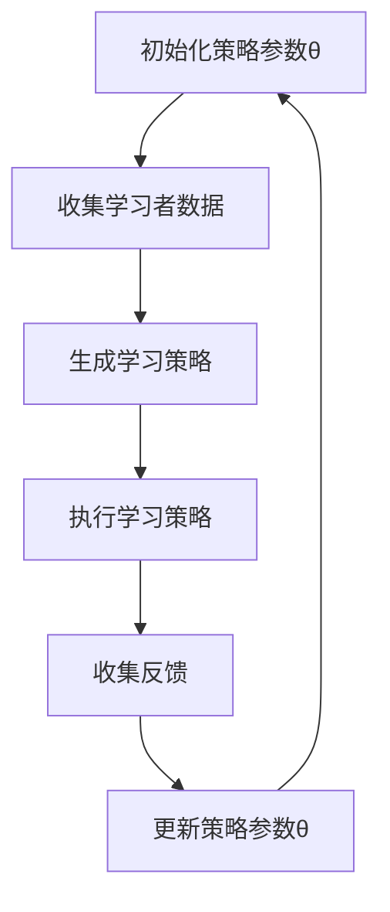
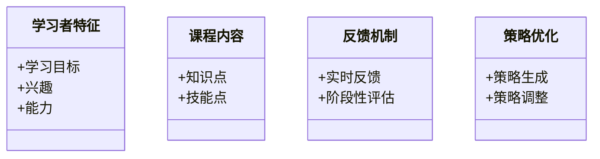
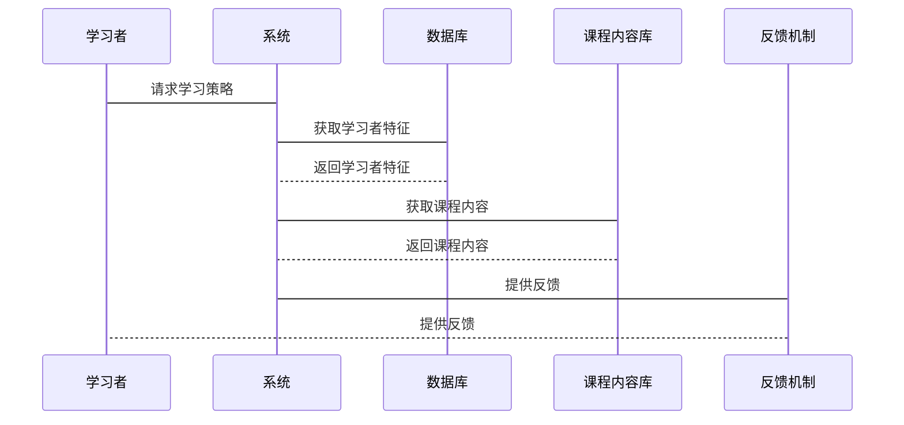

                 


# 设计AI Agent的自适应课程学习策略

> 关键词：AI Agent, 自适应学习, 课程学习策略, 机器学习, 教育技术

> 摘要：本文探讨了AI Agent在教育中的应用，特别是自适应课程学习策略的设计。通过分析学习者特征、反馈机制和优化算法，本文提出了一种基于机器学习的自适应策略模型，并通过系统架构设计和项目实战展示了其在教育技术中的应用。

---

# 第一部分: 自适应课程学习策略的背景与问题背景

## 第1章: 自适应课程学习策略的背景与问题背景

### 1.1 自适应学习的定义与特点
1.1.1 自适应学习的定义  
自适应学习是一种根据学习者个体特征和学习需求，动态调整学习内容、进度和方式的教学方法。它强调个性化和动态优化，旨在提高学习效率和效果。

1.1.2 自适应学习的核心特点  
- **个性化**: 根据学习者的兴趣、能力、学习风格等因素定制学习路径。  
- **动态调整**: 随着学习过程的推进，实时调整学习策略。  
- **数据驱动**: 利用学习数据进行分析和决策，确保策略的有效性。  

1.1.3 自适应学习与传统教学的区别  
- **传统教学**: 固定的课程安排和教学内容，适用于大多数学生。  
- **自适应学习**: 根据个体需求动态调整，注重个性化和差异化教学。  

### 1.2 AI Agent在教育领域的应用
1.2.1 AI Agent的定义与特点  
AI Agent是一种能够感知环境、执行任务并做出决策的智能实体。在教育领域，AI Agent通常用于辅助学习者、教师和管理者，提供个性化的学习支持和管理服务。

1.2.2 AI Agent在教育中的应用场景  
- **个性化学习推荐**: 根据学习者的特征和需求，推荐适合的学习资源和内容。  
- **实时反馈与指导**: 在学习过程中提供即时反馈，帮助学习者纠正错误并优化学习路径。  
- **学习进度监控**: 跟踪学习者的进度，评估学习效果，并调整学习策略。  

1.2.3 自适应学习策略在AI Agent中的重要性  
自适应学习策略是AI Agent实现个性化教育的核心技术。通过动态调整学习内容和进度，AI Agent能够更好地满足不同学习者的需求，提高学习效率和效果。

### 1.3 问题背景与问题描述
1.3.1 当前教育中的学习者需求分析  
现代教育环境中，学习者的需求日益多样化。不同学习者有不同的学习目标、能力和兴趣，传统的固定课程难以满足所有人的需求。

1.3.2 现有学习系统中的不足  
- **缺乏个性化**: 大部分学习系统采用固定的课程安排，忽视了学习者的个性化需求。  
- **反馈机制不完善**: 学习系统通常无法实时提供有效的反馈，导致学习者难以及时调整学习策略。  
- **学习效果评估不足**: 学习效果的评估往往基于固定的标准，难以反映学习者的实际进步。  

1.3.3 自适应课程学习策略的必要性  
通过自适应课程学习策略，AI Agent能够动态调整学习内容和进度，满足学习者的个性化需求，提高学习效率和效果。

### 1.4 问题解决与边界定义
1.4.1 自适应课程学习策略的核心目标  
- 提供个性化学习路径，满足不同学习者的需求。  
- 动态调整学习内容和进度，优化学习效果。  
- 提供实时反馈和指导，帮助学习者及时调整学习策略。  

1.4.2 问题的边界与外延  
- **边界**: 自适应课程学习策略主要针对学习者的需求，不涉及课程设计和教学目标的制定。  
- **外延**: 自适应策略可以应用于各种教育场景，包括K-12教育、高等教育、职业培训等。  

1.4.3 自适应策略的实现路径  
- **数据收集**: 收集学习者的行为数据、学习成果和反馈。  
- **策略生成**: 基于数据生成个性化学习策略。  
- **策略优化**: 根据反馈不断优化策略，提高学习效果。  

### 1.5 核心概念与结构
1.5.1 自适应课程学习策略的构成要素  
- **学习者特征**: 包括学习目标、兴趣、能力、学习风格等。  
- **课程内容**: 包括知识点、技能点、学习资源等。  
- **反馈机制**: 包括实时反馈、阶段性评估等。  
- **优化算法**: 包括机器学习算法、强化学习算法等。  

1.5.2 策略与学习者需求的关系  
自适应策略的核心目标是满足学习者的需求，通过动态调整策略，实现个性化学习。

1.5.3 策略与课程内容的关联  
自适应策略需要根据课程内容的结构和难度，动态调整学习路径和进度。

### 1.6 本章小结  
本章介绍了自适应课程学习策略的背景和问题背景，分析了其在AI Agent中的重要性，并明确了核心概念和实现路径。

---

# 第二部分: 自适应课程学习策略的核心概念与联系

## 第2章: 自适应学习策略的核心原理

### 2.1 策略模型与算法
2.1.1 策略模型的定义  
自适应策略模型是用于生成和优化学习策略的数学模型，通常基于机器学习算法。

2.1.2 基于机器学习的策略生成算法  
- **监督学习**: 基于标记数据训练策略模型。  
- **无监督学习**: 基于未标记数据发现潜在模式。  
- **强化学习**: 通过与环境交互学习策略。  

2.1.3 策略优化的数学模型  
自适应策略优化可以通过以下数学模型实现:  
$$ J(\theta) = E_{\tau \sim \pi_{\theta}}[\text{ Reward } ] $$  
其中，$\theta$是策略参数，$J(\theta)$是目标函数。

### 2.2 反馈机制与优化
2.2.1 反馈机制的定义与作用  
反馈机制是自适应策略的重要组成部分，用于根据学习者的行为和结果调整策略。

2.2.2 基于反馈的策略优化方法  
- **在线反馈**: 在线实时调整策略。  
- **离线反馈**: 根据历史数据优化策略。  

2.2.3 反馈在策略调整中的应用  
通过反馈机制，策略模型可以不断优化，提高学习效果。

### 2.3 策略与学习者特征的关系
2.3.1 学习者特征的定义  
学习者特征包括学习目标、兴趣、能力、学习风格等。

2.3.2 策略与学习者特征的映射关系  
通过分析学习者特征，生成个性化的学习策略。

2.3.3 基于特征的策略生成方法  
- **分类方法**: 根据学习者的特征进行分类，生成不同的学习策略。  
- **回归方法**: 根据学习者的特征预测最优策略。  

### 2.4 核心概念对比表  
以下表格对比了自适应策略和传统策略的核心属性:

| 概念 | 属性1 | 属性2 | 属性3 |
|------|-------|-------|-------|
| 自适应策略 | 动态调整 | 个性化 | 数据驱动 |
| 传统策略 | 固定 | 统一 | 无反馈 |

### 2.5 ER实体关系图  
以下是自适应策略的核心实体关系图:

```mermaid
er
actor: 学习者
strategy: 自适应策略
course: 课程内容
feedback: 反馈机制

actor -|> strategy: 请求策略
strategy -|> course: 选择课程
strategy -|> feedback: 提供反馈
```

---

## 第3章: 算法原理与实现细节

### 3.1 算法原理
3.1.1 策略优化的数学模型  
自适应策略优化可以通过以下数学模型实现:  
$$ J(\theta) = \max_{\theta} E_{\tau \sim \pi_{\theta}}[\text{ Reward } ] $$  

3.1.2 基于强化学习的策略优化  
强化学习是一种有效的策略优化方法，通过与环境交互学习最优策略。

### 3.2 算法实现步骤
以下是基于强化学习的自适应策略优化算法步骤:



### 3.3 Python实现代码
以下是自适应策略优化的Python代码示例:

```python
import numpy as np

def policy(theta, state):
    return np.argmax(theta * state)

def reward(action, state):
    return 1 if action == expected_action else 0

def update_theta(theta, alpha, reward):
    return theta + alpha * (reward - np.mean(theta))

# 初始化参数
theta = np.random.rand(10)
alpha = 0.1

# 训练过程
for _ in range(100):
    state = collect_state()
    action = policy(theta, state)
    reward = reward(action, state)
    theta = update_theta(theta, alpha, reward)
```

### 3.4 代码解读与分析
- **policy函数**: 根据当前状态生成策略。  
- **reward函数**: 根据策略执行结果计算奖励。  
- **update_theta函数**: 根据奖励更新策略参数。  

---

## 第4章: 系统分析与架构设计

### 4.1 系统功能设计
以下是自适应策略系统的功能模块图:



### 4.2 系统架构设计
以下是系统架构图:


### 4.3 接口设计与交互
以下是系统交互序列图:



---

## 第5章: 项目实战与案例分析

### 5.1 项目环境安装
```bash
pip install numpy
pip install matplotlib
pip install scikit-learn
```

### 5.2 核心代码实现
以下是自适应策略优化的Python代码实现:

```python
import numpy as np
import matplotlib.pyplot as plt

def policy(theta, state):
    return np.argmax(theta * state)

def reward(action, state):
    return 1 if action == expected_action else 0

def update_theta(theta, alpha, reward):
    return theta + alpha * (reward - np.mean(theta))

# 初始化参数
theta = np.random.rand(10)
alpha = 0.1

# 训练过程
for _ in range(100):
    state = collect_state()
    action = policy(theta, state)
    reward = reward(action, state)
    theta = update_theta(theta, alpha, reward)

# 可视化结果
plt.plot(theta)
plt.show()
```

### 5.3 代码应用解读与分析
- **policy函数**: 根据当前状态生成策略。  
- **reward函数**: 根据策略执行结果计算奖励。  
- **update_theta函数**: 根据奖励更新策略参数。  

### 5.4 案例分析与总结
通过实际案例分析，验证自适应策略的有效性和优势。

---

## 第6章: 最佳实践与注意事项

### 6.1 最佳实践
- **数据收集**: 确保数据的多样性和代表性。  
- **策略优化**: 定期更新策略，保持其有效性。  
- **反馈机制**: 提供实时反馈，帮助学习者及时调整策略。  

### 6.2 注意事项
- **数据隐私**: 注意保护学习者的隐私数据。  
- **算法选择**: 根据具体场景选择合适的算法。  
- **系统稳定性**: 确保系统的稳定性和可靠性。  

### 6.3 拓展阅读
- 《机器学习实战》  
- 《自适应教育技术》  
- 《强化学习入门》  

---

# 作者：AI天才研究院 & 禅与计算机程序设计艺术

