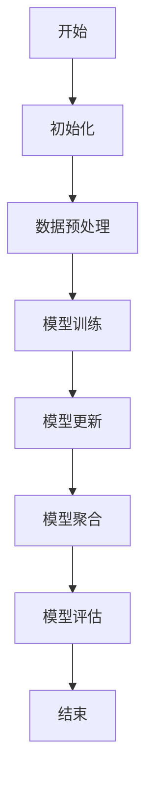
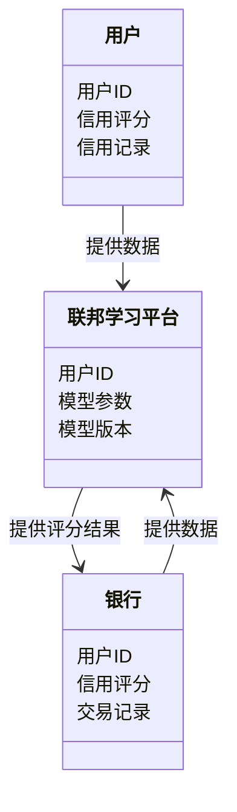
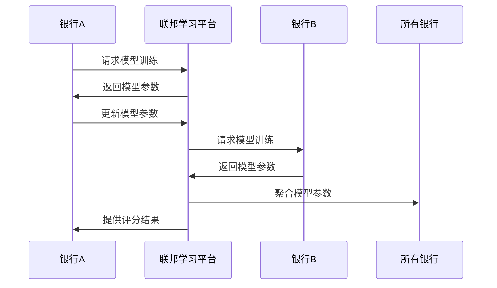

                 


# 设计基于联邦学习的跨银行信用评分系统

> 关键词：联邦学习，跨银行信用评分，数据隐私保护，机器学习，系统设计

> 摘要：本文详细探讨了基于联邦学习的跨银行信用评分系统的设计与实现。首先介绍了联邦学习的基本概念和跨银行信用评分的必要性，然后分析了联邦学习的核心原理和算法实现，接着设计了系统的架构，并通过实际案例展示了系统的实现过程，最后总结了系统设计的关键点和未来的发展方向。

---

# 第一部分: 背景介绍

## 第1章: 联邦学习与跨银行信用评分系统概述

### 1.1 联邦学习的基本概念
#### 1.1.1 联邦学习的定义
联邦学习是一种分布式机器学习技术，允许多个参与方在不共享原始数据的前提下，通过交换模型参数或梯度信息来共同训练一个全局模型。

#### 1.1.2 联邦学习的核心特点
- 数据隐私保护：数据不出域，仅交换模型参数。
- 分布式协作：多个机构协作训练模型。
- 跨邊界数据利用：在保证数据隐私的前提下，最大化数据价值。

#### 1.1.3 联邦学习与传统数据共享的区别
- 数据共享：原始数据集中到一个地方进行处理，存在数据泄露风险。
- 联邦学习：仅交换模型参数，数据仍保留在原始机构，安全性更高。

### 1.2 跨銀行信用评分系统的必要性
#### 1.2.1 跨銀行信用评分的定义
跨银行信用评分是指在不共享客户原始数据的情况下，通过联邦学习技术，联合多家银行的数据，共同训练一个信用评分模型，为客户提供统一的信用评分服务。

#### 1.2.2 跨銀行信用评分系统的应用场景
- 跨银行贷款申请：客户可以在不同银行申请贷款，银行需要参考统一的信用评分。
- 信用风险管理：银行可以通过联合信用评分模型，更准确地评估客户信用风险。
- 数据孤岛问题：解决各银行数据孤岛问题，提升模型的泛化能力。

#### 1.2.3 联邦学习在跨銀行信用评分中的作用
- 数据隐私保护：确保各银行数据不被泄露。
- 模型联合训练：提升信用评分模型的准确性和泛化能力。
- 跨机构协作：促进银行之间的数据共享与合作。

### 1.3 系统设计的背景与目标
#### 1.3.1 问题背景
随着互联网金融的快速发展，客户在不同银行的信用评分需求日益增长，但由于数据隐私和数据孤岛问题，跨银行信用评分系统难以实现。

#### 1.3.2 问题描述
现有信用评分系统通常依赖单个银行的数据，导致模型准确性和泛化能力有限。跨银行信用评分需要联合多家银行的数据，但由于数据隐私问题，数据无法集中共享。

#### 1.3.3 问题解决的思路
通过联邦学习技术，实现跨银行信用评分模型的联合训练，既保证数据隐私，又提升模型性能。

#### 1.3.4 系统的边界与外延
- 系统边界：仅涉及信用评分模型的训练和预测，不包括其他业务逻辑。
- 系统外延：可能扩展到其他金融领域的联合建模，如欺诈检测、信用评估等。

#### 1.3.5 系统的核心要素组成
- 联邦学习平台：负责模型的联合训练和管理。
- 数据提供方：各银行提供客户数据，参与模型训练。
- 模型服务方：提供信用评分服务，供银行查询客户信用评分。

---

# 第二部分: 核心概念与联系

## 第2章: 联邦学习的核心原理

### 2.1 联邦学习的原理
#### 2.1.1 联邦学习的通信机制
- 数据不出域：各参与方仅交换模型参数，不共享原始数据。
- 模型更新：各参与方本地训练模型，定期同步模型参数到中央服务器。

#### 2.1.2 联邦学习的隐私保护机制
- 差分隐私：通过添加噪声保护模型参数，防止数据泄露。
- 同态加密：对模型参数进行加密，确保数据安全。

### 2.2 联邦学习的核心概念对比
#### 2.2.1 横向联邦学习与纵向联邦学习的对比
| 特性          | 横向联邦学习      | 纵向联邦学习      |
|---------------|-------------------|-------------------|
| 数据分布方式  | 数据按行分布      | 数据按列分布      |
| 应用场景       | 同一机构的不同数据源 | 不同机构的同一数据字段 |
| 适用情况       | 数据类型相同，适合横向扩展 | 数据字段相同，适合纵向扩展 |

#### 2.2.2 联邦学习与数据共享的对比
| 特性          | 联邦学习          | 数据共享          |
|---------------|-------------------|-------------------|
| 数据处理方式  | 仅交换模型参数    | 交换原始数据      |
| 数据隐私性     | 高                | 低                |
| 安全性         | 高                | 低                |

#### 2.2.3 联邦学习与联邦计算的对比
- 联邦学习：专注于机器学习模型的联合训练。
- 联邦计算：更广泛的概念，包括数据处理、计算和建模的协作。

### 2.3 联邦学习的ER实体关系图
```mermaid
er
  actor: 银行
  actor: 用户
  actor: 评分系统
  relation: 用户数据
  relation: 评分结果
  relation: 联邦学习模型
  relation: 通信协议
```

---

# 第三部分: 算法原理讲解

## 第3章: 联邦学习算法的实现原理

### 3.1 联邦学习算法的流程


### 3.2 联邦学习算法的数学模型
#### 模型优化目标
$$ \text{minimize} \quad \sum_{i=1}^{n} f_i(w) $$

#### 损失函数
$$ L(w) = \sum_{i=1}^{n} \frac{1}{2m_i} \| y_i - w x_i \|^2 $$

#### 模型更新公式
$$ w^{(t+1)} = w^{(t)} + \eta \sum_{i=1}^{n} \nabla f_i(w^{(t)}) $$

---

# 第四部分: 系统分析与架构设计

## 第4章: 系统分析与架构设计

### 4.1 问题场景介绍
- 银行A、银行B、银行C需要联合训练信用评分模型。
- 各银行数据独立，无法共享原始数据。
- 需要一个安全、高效的平台进行联邦学习。

### 4.2 系统功能设计
#### 4.2.1 领域模型类图


#### 4.2.2 系统架构图


#### 4.2.3 系统交互流程图


---

# 第五部分: 项目实战

## 第5章: 项目实战

### 5.1 环境安装
- 安装Python和必要的库（如Flask、TensorFlow等）。
- 配置虚拟环境，安装依赖库。

### 5.2 系统核心实现源代码
```python
# 联邦学习平台代码示例
from flask import Flask, request, jsonify
import tensorflow as tf

app = Flask(__name__)

# 定义模型
model = tf.keras.Sequential([
    tf.keras.layers.Dense(64, activation='relu'),
    tf.keras.layers.Dense(1, activation='sigmoid')
])

# 编译模型
model.compile(optimizer='adam', loss='binary_crossentropy', metrics=['accuracy'])

@app.route('/train', methods=['POST'])
def train():
    # 获取模型参数
    weights = request.json['weights']
    # 更新模型
    model.set_weights(weights)
    # 模型训练
    history = model.fit(x_train, y_train, epochs=1, batch_size=32)
    # 返回新的权重
    return jsonify({'weights': model.get_weights()})

if __name__ == '__main__':
    app.run()
```

### 5.3 代码应用解读与分析
- 服务器端代码：负责接收模型参数，进行模型训练，返回新的模型参数。
- 客户端代码：各银行发送本地模型参数到服务器，接收更新后的模型参数。

### 5.4 实际案例分析
- 数据准备：各银行提供 anonymized 用户数据，如交易记录、信用记录等。
- 模型训练：联合训练信用评分模型，评估模型准确率和召回率。
- 模型部署：将模型部署到生产环境，提供评分查询服务。

### 5.5 项目小结
- 项目实现了跨银行信用评分系统的联邦学习方案。
- 系统设计合理，确保了数据隐私和模型性能。
- 通过实际案例验证了系统的可行性和有效性。

---

# 第六部分: 总结与展望

## 第6章: 总结与展望

### 6.1 最佳实践 tips
- 数据预处理：确保各银行数据格式一致，特征工程统一。
- 模型选择：根据实际场景选择合适的联邦学习算法。
- 安全性保障：采用差分隐私或同态加密技术保护模型参数。

### 6.2 小结
本文详细介绍了基于联邦学习的跨银行信用评分系统的设计与实现，通过理论分析和实际案例，验证了系统的可行性和有效性。

### 6.3 注意事项
- 确保系统安全性，防止模型参数泄露。
- 定期更新模型，保持模型的准确性和适用性。
- 处理数据漂移问题，确保模型长期稳定。

### 6.4 拓展阅读
- 《联邦学习实战：基于TensorFlow的分布式机器学习》
- 《数据隐私保护技术与应用》
- 《机器学习在金融领域的应用》

---

作者：AI天才研究院/AI Genius Institute & 禅与计算机程序设计艺术 /Zen And The Art of Computer Programming

