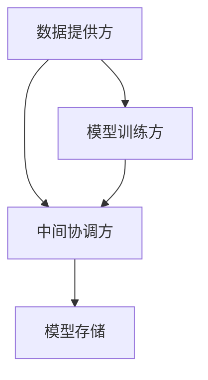
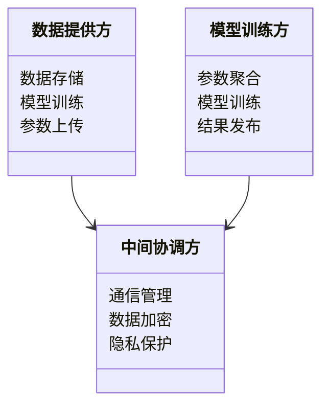
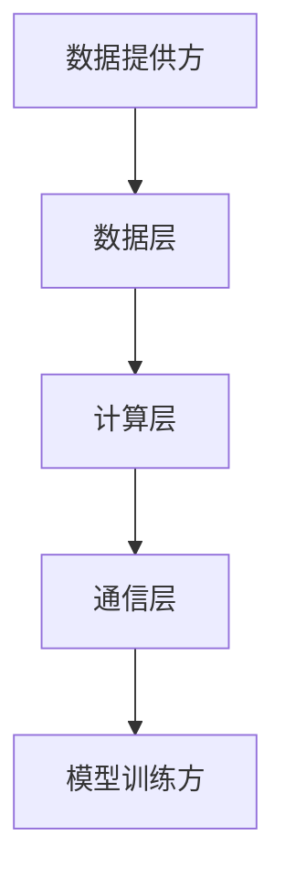

                 


# 设计基于联邦学习的隐私保护金融AI系统

> 关键词：联邦学习，隐私保护，金融AI，数据共享，安全多方计算

> 摘要：本文将详细探讨如何设计基于联邦学习的隐私保护金融AI系统。从背景介绍到核心概念，从算法原理到系统架构，从项目实战到最佳实践，全面解析如何在金融行业实现高效、安全的数据共享与AI模型训练。

---

## 第一部分: 背景介绍与核心概念

### 第1章: 联邦学习与隐私保护概述

#### 1.1 问题背景与描述

- **1.1.1 数据孤岛与隐私保护的矛盾**
  - 金融机构的数据孤岛问题：不同机构之间数据分散，难以协同建模。
  - 隐私保护的重要性：金融数据涉及用户隐私，必须严格保护。
  - 数据共享的难点：数据不能直接共享，但又需要联合建模。

- **1.1.2 金融行业对数据隐私的高要求**
  - 金融行业的数据敏感性：涉及用户隐私、交易数据等。
  - 合规性要求：如GDPR、中国的个人信息保护法等。
  - 数据共享的法律限制：如何在不违反法律的前提下进行数据共享。

- **1.1.3 联邦学习的提出与目标**
  - 联邦学习的概念：在保护数据隐私的前提下，协同训练模型。
  - 目标：实现数据可用不可见，模型可用不可控。

#### 1.2 联邦学习的核心概念与特点

- **1.2.1 联邦学习的定义与核心要素**
  - 定义：多个参与方在不共享原始数据的前提下，协同训练模型。
  - 核心要素：数据联邦、模型联邦、计算联邦。

- **1.2.2 联邦学习与传统数据共享的区别**
  - 传统数据共享：直接共享数据，存在隐私风险。
  - 联邦学习：共享模型参数，不共享数据。

- **1.2.3 联邦学习的隐私保护机制**
  - 数据加密：如同态加密、差分隐私。
  - 模型加密：如安全多方计算、区块链。

#### 1.3 本章小结

---

### 第2章: 隐私保护技术与联邦学习的关系

#### 2.1 隐私保护技术概述

- **2.1.1 同态加密**
  - 定义：允许在加密数据上进行计算，结果与明文计算结果相同。
  - 应用场景：在加密数据上进行线性回归、分类等任务。

- **2.1.2 差分隐私**
  - 定义：通过加入噪声，保护个体数据的隐私。
  - 应用场景：在数据发布中保护隐私。

- **2.1.3 联邦学习中的隐私保护技术**
  - 安全多方计算：在不泄露数据的前提下，协同计算。
  - 同态加密：保护数据隐私，同时允许模型训练。
  - 差分隐私：在模型训练中加入噪声，防止隐私泄露。

#### 2.2 联邦学习与隐私保护的结合

- **2.2.1 联邦学习如何实现数据隐私保护**
  - 数据联邦：每个机构在本地训练模型，只上传参数。
  - 模型联邦：多个机构协同训练模型，共享参数。
  - 计算联邦：通过安全多方计算，实现联合建模。

- **2.2.2 联邦学习中的隐私泄露风险分析**
  - 模型参数泄露：攻击者可能通过模型参数推断数据。
  - 通信过程中的风险：数据在传输过程中可能被截获。
  - 后门攻击：恶意机构可能在模型中植入后门。

- **2.2.3 隐私保护技术在联邦学习中的应用案例**
  - 银行间的反欺诈模型：多个银行协同训练模型，保护用户隐私。
  - 信用评分模型：多个金融机构协同训练，提高模型准确性。

#### 2.3 本章小结

---

## 第二部分: 联邦学习的核心概念与联系

### 第3章: 联邦学习的原理与核心算法

#### 3.1 联邦学习的基本原理

- **3.1.1 联邦学习的三类模式：数据联邦、模型联邦和计算联邦**
  - 数据联邦：每个机构在本地训练模型，只上传参数。
  - 模型联邦：多个机构协同训练模型，共享参数。
  - 计算联邦：通过安全多方计算，实现联合建模。

- **3.1.2 联邦学习的通信机制**
  - 参数同步：模型参数在参与方之间同步。
  - 模型聚合：将各个参与方的模型参数聚合，得到全局模型。

- **3.1.3 联邦学习的同步与异步模式**
  - 同步模式：所有参与方同时进行模型训练和同步。
  - 异步模式：参与方在不同时间进行训练和同步。

#### 3.2 联邦学习的核心算法

- **3.2.1 基于安全多方计算的联邦学习算法**
  - 安全多方计算：通过秘密分享和加密技术，实现多方协同计算。
  - 应用场景：多个机构协同训练模型，保护数据隐私。

- **3.2.2 基于加密的联邦学习算法**
  - 同态加密：在加密数据上进行模型训练。
  - 应用场景：保护数据隐私的同时，进行联合建模。

- **3.2.3 基于区块链的联邦学习算法**
  - 区块链：通过区块链技术，实现数据的可信共享和模型的可信训练。
  - 应用场景：多个机构协同训练模型，保护数据隐私和模型可信性。

#### 3.3 联邦学习算法的对比分析

- **3.3.1 不同联邦学习模式的优缺点对比**
  - 数据联邦：优点是简单易用，缺点是模型精度可能受限。
  - 模型联邦：优点是模型精度高，缺点是计算资源消耗大。
  - 计算联邦：优点是计算效率高，缺点是实现复杂。

- **3.3.2 算法复杂度与隐私保护强度的权衡**
  - 算法复杂度与隐私保护强度：复杂度越高，隐私保护越强，但计算资源消耗也越大。
  - 权衡点：根据具体场景需求，选择合适的算法模式。

- **3.3.3 算法的可扩展性与性能对比**
  - 可扩展性：计算联邦模式扩展性最好，数据联邦次之，模型联邦最差。
  - 性能：计算联邦模式性能最好，数据联邦次之，模型联邦最差。

#### 3.4 本章小结

---

### 第4章: 联邦学习的系统架构与实体关系

#### 4.1 联邦学习系统的组成与功能

- **4.1.1 数据提供方**
  - 数据提供方：拥有原始数据的机构，如银行、保险公司。
  - 功能：在本地训练模型，上传参数到协同平台。

- **4.1.2 模型训练方**
  - 模型训练方：负责模型训练和参数聚合的机构。
  - 功能：接收各个数据提供方的模型参数，进行聚合，得到全局模型。

- **4.1.3 中间协调方**
  - 中间协调方：负责协调数据提供方和模型训练方的通信。
  - 功能：管理通信协议，确保数据安全和隐私保护。

#### 4.2 联邦学习的实体关系图



---

## 第三部分: 项目实战

### 第5章: 系统分析与架构设计

#### 5.1 问题场景介绍

- **5.1.1 金融行业中的数据孤岛问题**
  - 不同金融机构之间数据分散，无法协同建模。
  - 数据隐私保护要求高，无法直接共享数据。

- **5.1.2 项目目标**
  - 实现基于联邦学习的隐私保护金融AI系统。
  - 提供高效、安全的数据共享与模型训练机制。

#### 5.2 系统功能设计

- **5.2.1 领域模型设计**
  - 数据提供方：本地数据存储、模型训练、参数上传。
  - 模型训练方：参数聚合、模型训练、结果发布。
  - 中间协调方：通信管理、数据加密、隐私保护。



#### 5.3 系统架构设计

- **5.3.1 系统架构图**
  - 数据层：本地数据存储，加密数据传输。
  - 计算层：模型训练、参数聚合。
  - 通信层：数据传输、隐私保护。



---

## 第四部分: 最佳实践

### 第6章: 项目实战与经验总结

#### 6.1 环境安装与配置

- **6.1.1 环境要求**
  - 操作系统：Linux或Windows。
  - Python版本：3.6以上。
  - 安装依赖：PyTorch、Flask、requests等。

#### 6.2 系统核心实现源代码

```python
import torch
import torch.nn as nn
import torch.optim as optim
import numpy as np

class LinearRegressionModel(nn.Module):
    def __init__(self, input_dim, output_dim):
        super(LinearRegressionModel, self).__init__()
        self.linear = nn.Linear(input_dim, output_dim)

    def forward(self, x):
        return self.linear(x)

def train_model(model, optimizer, criterion, data, epochs=100):
    for epoch in range(epochs):
        inputs = data['X']
        labels = data['y']
        outputs = model(inputs)
        loss = criterion(outputs, labels)
        loss.backward()
        optimizer.step()
        optimizer.zero_grad()
    return model.state_dict()
```

#### 6.3 代码应用解读与分析

- **6.3.1 代码解读**
  - LinearRegressionModel：定义一个线性回归模型。
  - train_model：训练模型，更新参数。
  - 优化器：使用Adam优化器，损失函数：均方误差。

- **6.3.2 实际案例分析**
  - 案例：基于联邦学习的信用评分模型。
  - 数据：多个金融机构的数据，如用户的信用历史、交易记录等。
  - 训练过程：各机构在本地训练模型，上传参数，模型训练方聚合参数，得到全局模型。

#### 6.4 经验总结

- **6.4.1 成功经验**
  - 合理选择联邦学习模式，根据具体需求选择数据联邦、模型联邦或计算联邦。
  - 使用同态加密或差分隐私，确保数据隐私。

- **6.4.2 注意事项**
  - 确保通信过程中的数据安全，防止数据泄露。
  - 定期进行模型评估，确保模型准确性和隐私保护。

---

## 第五部分: 最佳实践与总结

### 第7章: 最佳实践与总结

#### 7.1 小结

- 联邦学习是一种高效、安全的数据共享与模型训练技术。
- 在金融行业中，联邦学习可以帮助金融机构在不共享数据的前提下，协同训练模型，提高模型准确性和数据隐私保护。

#### 7.2 注意事项

- 数据隐私保护：确保数据在传输和存储过程中的安全性。
- 模型可信性：确保模型训练过程中没有后门攻击。
- 合规性：确保联邦学习系统符合相关法律法规。

#### 7.3 拓展阅读

- 《联邦学习：隐私保护下的分布式机器学习》
- 《安全多方计算：理论与应用》
- 《差分隐私：隐私保护的数学基础》

---

## 作者：AI天才研究院/AI Genius Institute & 禅与计算机程序设计艺术 /Zen And The Art of Computer Programming

---

**注：由于篇幅限制，以上为文章的目录和部分内容的示例，实际文章将根据上述结构进一步展开，确保每个部分都有详细的讲解和具体的代码实现。**

