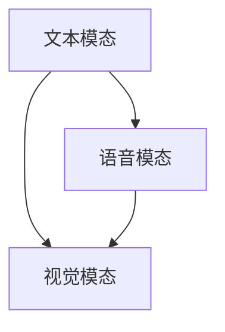
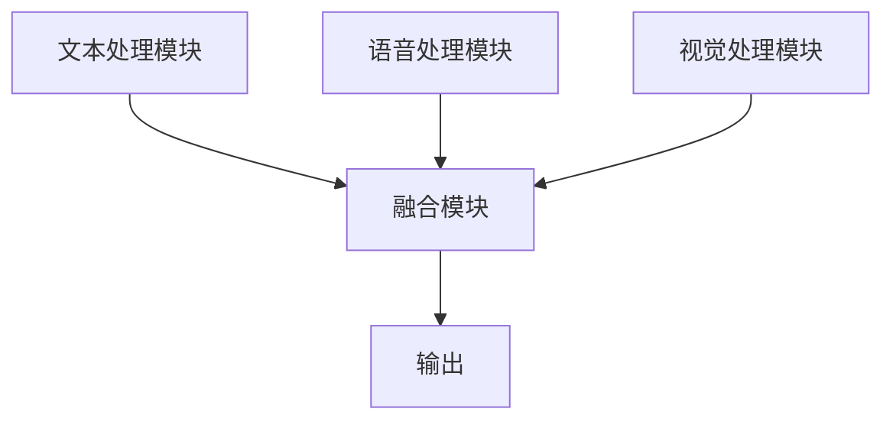
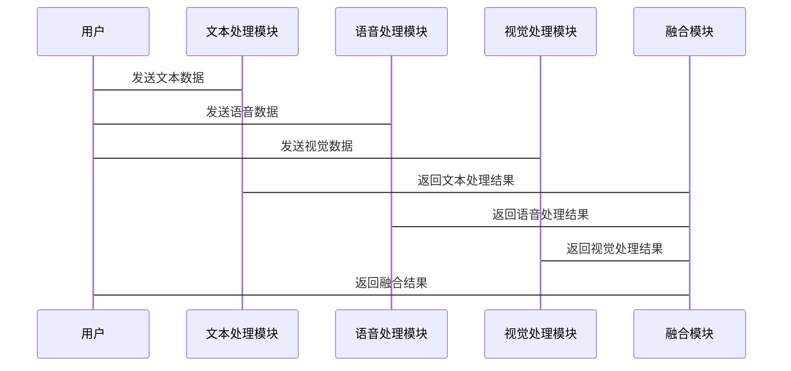

                 


# 设计多模态AI Agent：整合文本、语音与视觉能力

## 关键词：多模态AI Agent，文本处理，语音处理，视觉处理，模态融合，深度学习

## 摘要：  
随着人工智能技术的不断发展，多模态AI Agent逐渐成为研究的热点。本文将详细探讨如何整合文本、语音和视觉三种模态的能力，构建一个能够理解、推理和交互的多模态AI Agent。通过分析多模态数据的处理与融合方法，结合实际案例，本文将为读者提供一个系统化的设计方案，帮助读者理解多模态AI Agent的设计原理和实现方法。

---

# 第一部分: 多模态AI Agent的背景与概念

## 第1章: 多模态AI Agent的定义与背景

### 1.1 多模态AI Agent的定义
多模态AI Agent是一种能够同时处理多种信息形式（如文本、语音、视觉等）的智能体。它不仅能够理解输入的多种数据类型，还能通过整合这些数据，生成更准确、更丰富的输出。多模态AI Agent的核心在于其能够将不同模态的信息进行对齐、融合和推理，从而实现更复杂的任务。

#### 1.1.1 多模态AI Agent的核心概念
- **文本模态**：处理文本信息，包括自然语言理解、文本生成等。
- **语音模态**：处理语音信息，包括语音识别、语音合成等。
- **视觉模态**：处理图像或视频信息，包括目标检测、图像分割等。

#### 1.1.2 多模态AI Agent的优势与应用场景
- **优势**：
  - 提高信息理解的准确性。
  - 增强人机交互的自然性。
  - 扩展AI系统的应用场景。
- **应用场景**：
  - 智能客服：结合语音和文本进行交互。
  - 智能助手：整合视觉、语音和文本信息提供服务。
  - 智能监控：结合视觉和语音进行实时监控。

#### 1.1.3 多模态AI Agent的技术挑战
- 数据的异构性：不同模态的数据具有不同的形式和特征。
- 模态对齐的难度：如何将不同模态的数据对齐并进行有效的融合。
- 计算资源的需求：多模态处理通常需要大量的计算资源。

### 1.2 多模态AI Agent的背景
#### 1.2.1 AI Agent的发展历程
AI Agent的概念最早可以追溯到20世纪60年代。早期的AI Agent主要基于规则和知识库进行推理。随着机器学习和深度学习的发展，AI Agent的能力得到了显著提升，能够通过数据进行自我学习和优化。

#### 1.2.2 多模态技术的兴起
随着深度学习技术的发展，多模态数据处理技术逐渐成熟。研究者们开始尝试将多种模态的数据进行融合，以提高AI系统的性能和智能化水平。

#### 1.2.3 多模态AI Agent的现状与未来趋势
目前，多模态AI Agent已经在多个领域得到了应用，如智能客服、智能助手等。未来，随着AI技术的进一步发展，多模态AI Agent将在更多领域展现出其强大的能力。

---

## 第2章: 多模态AI Agent的核心概念与联系

### 2.1 多模态AI Agent的核心概念
#### 2.1.1 文本模态
文本模态主要涉及自然语言处理（NLP）技术，包括文本的预处理、编码和表示。

#### 2.1.2 语音模态
语音模态主要涉及语音信号处理技术，包括语音识别、语音合成等。

#### 2.1.3 视觉模态
视觉模态主要涉及计算机视觉技术，包括图像处理、目标检测等。

### 2.2 多模态AI Agent的核心要素
#### 2.2.1 多模态数据的整合与处理
- 数据预处理：对文本、语音、视觉数据进行清洗和标准化。
- 数据编码：将不同模态的数据转化为统一的表示形式。

#### 2.2.2 多模态模型的构建与训练
- 模型设计：设计能够处理多种模态数据的深度学习模型。
- 模型训练：利用多模态数据对模型进行训练，使其能够理解并融合不同模态的信息。

#### 2.2.3 多模态任务的定义与实现
- 任务定义：明确多模态AI Agent需要完成的具体任务。
- 任务实现：通过模型推理和决策，完成任务。

### 2.3 多模态AI Agent的实体关系图


---

# 第二部分: 多模态AI Agent的算法原理

## 第3章: 多模态数据的处理与融合

### 3.1 文本模态的处理
#### 3.1.1 文本预处理
- 分词：将文本分割成单词或短语。
- 去停用词：去除无意义的词汇，如“的”、“了”等。
- 词向量表示：将文本转化为词向量，如使用Word2Vec、GloVe等模型。

#### 3.1.2 文本编码
- 使用编码器（如Transformer）对文本进行编码，生成文本的表示向量。

#### 3.1.3 文本表示
- 将文本编码为固定长度的向量，用于后续的模态融合。

### 3.2 语音模态的处理
#### 3.2.1 语音信号处理
- 音频信号的预处理：包括降噪、分段等。
- 特征提取：提取语音的梅尔频谱、MFCC等特征。

#### 3.2.2 语音特征提取
- 使用深度学习模型（如CNN、RNN）提取语音特征。

#### 3.2.3 语音编码
- 将语音特征编码为固定长度的向量。

### 3.3 视觉模态的处理
#### 3.3.1 图像处理
- 图像预处理：包括归一化、调整尺寸等。
- 特征提取：使用CNN提取图像的特征。

#### 3.3.2 视频处理
- 视频预处理：包括分割、帧提取等。
- 视频特征提取：使用3D CNN或Transformer提取视频特征。

#### 3.3.3 视觉特征提取
- 将图像或视频的特征编码为固定长度的向量。

---

## 第4章: 多模态数据的融合算法

### 4.1 模态对齐
#### 4.1.1 模态对齐的定义
- 模态对齐：将不同模态的数据对齐到相同的语义空间。

#### 4.1.2 模态对齐的方法
- 统计方法：如CCA（Canonical Correlation Analysis）。
- 深度学习方法：如使用自适应层对齐不同模态的特征。

#### 4.1.3 模态对齐的流程
1. 对不同模态的数据进行预处理。
2. 使用对齐算法将不同模态的数据对齐到相同的语义空间。
3. 验证对齐效果。

### 4.2 注意力机制
#### 4.2.1 注意力机制的定义
- 注意力机制：用于在多模态数据融合中，关注重要的信息。

#### 4.2.2 多模态注意力机制
- 多模态注意力机制：在多模态数据融合中，同时考虑不同模态的信息。

#### 4.2.3 注意力机制的数学公式
$$
\text{Attention}(Q, K, V) = \text{softmax}\left(\frac{QK^T}{\sqrt{d_k}}\right)V
$$

### 4.3 生成模型
#### 4.3.1 生成模型的定义
- 生成模型：用于生成多模态数据，如文本、语音、图像等。

#### 4.3.2 多模态生成模型
- 多模态生成模型：同时生成多种模态的数据。

#### 4.3.3 生成模型的数学公式
$$
P(X|Y) = \prod_{i=1}^n P(x_i|Y)
$$

---

# 第三部分: 多模态AI Agent的系统设计

## 第5章: 多模态AI Agent的系统分析与架构设计

### 5.1 系统功能设计
#### 5.1.1 功能模块划分
- 文本处理模块：负责处理文本数据。
- 语音处理模块：负责处理语音数据。
- 视觉处理模块：负责处理视觉数据。
- 融合模块：负责将不同模态的数据进行融合。

#### 5.1.2 功能模块的交互流程
1. 接收输入数据。
2. 分别对文本、语音、视觉数据进行处理。
3. 将处理后的数据进行融合。
4. 输出结果。

### 5.2 系统架构设计
#### 5.2.1 系统架构图


#### 5.2.2 系统架构的实现
- 使用微服务架构，将不同模态的处理模块独立化。
- 使用消息队列进行模块之间的通信。

### 5.3 接口设计
#### 5.3.1 接口定义
- 文本处理接口：接收文本输入，返回文本处理结果。
- 语音处理接口：接收语音输入，返回语音处理结果。
- 视觉处理接口：接收视觉输入，返回视觉处理结果。

#### 5.3.2 接口实现
- 使用RESTful API进行接口设计。
- 使用JSON格式传递数据。

### 5.4 交互设计
#### 5.4.1 交互流程
1. 用户输入多模态数据。
2. 系统分别对不同模态的数据进行处理。
3. 系统将处理后的数据进行融合。
4. 系统输出结果。

#### 5.4.2 交互设计图


---

## 第6章: 多模态AI Agent的项目实战

### 6.1 环境安装
- 安装Python、TensorFlow、Keras等依赖库。
- 安装语音处理库（如SpeechRecognition）和视觉处理库（如OpenCV）。

### 6.2 核心代码实现
#### 6.2.1 文本处理模块
```python
import tensorflow as tf
from tensorflow.keras import layers

class TextProcessor:
    def __init__(self, vocab_size):
        self.vocab_size = vocab_size
        self.embedding_layer = layers.Embedding(vocab_size, 100)
    
    def process(self, text_input):
        embeddings = self.embedding_layer(text_input)
        return embeddings
```

#### 6.2.2 语音处理模块
```python
import speech_recognition as sr

class SpeechProcessor:
    def __init__(self):
        self recognizer = sr.Recognizer()
    
    def process(self, audio_input):
        text = self.recognizer.recognize AUDIO)(audio_input)
        return text
```

#### 6.2.3 视觉处理模块
```python
import cv2

class VisionProcessor:
    def __init__(self):
        self.detector = cv2.CascadeClassifier('haarcascade_frontalface_default.xml')
    
    def process(self, image_input):
        gray = cv2.cvtColor(image_input, cv2.COLOR_BGR2GRAY)
        faces = self.detector.detectMultiScale(gray)
        return faces
```

### 6.3 项目实战案例分析
#### 6.3.1 案例介绍
- 案例名称：多模态客服AI Agent
- 案例描述：整合文本、语音和视觉模态，实现智能客服功能。

#### 6.3.2 案例实现
- 实现文本对话功能。
- 实现语音识别和语音合成功能。
- 实现人脸检测和图像识别功能。

#### 6.3.3 案例分析
- 分析案例的优缺点。
- 总结案例的实现过程和经验教训。

### 6.4 项目小结
- 总结项目实现的关键点。
- 指出项目的改进方向。

---

# 第四部分: 总结与展望

## 第7章: 总结与展望

### 7.1 总结
- 多模态AI Agent是一种能够整合多种模态信息的智能体。
- 本文详细探讨了多模态AI Agent的设计原理和实现方法。

### 7.2 展望
- 未来，多模态AI Agent将在更多领域得到应用。
- 多模态数据的处理与融合技术将进一步发展。
- 多模态AI Agent的性能和智能化水平将不断提高。

---

# 作者：AI天才研究院 & 禅与计算机程序设计艺术

