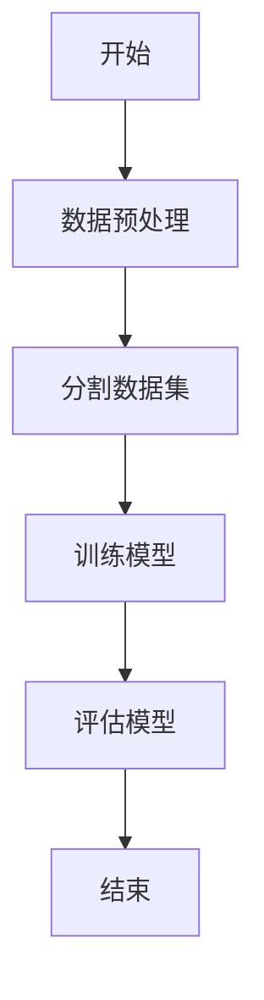
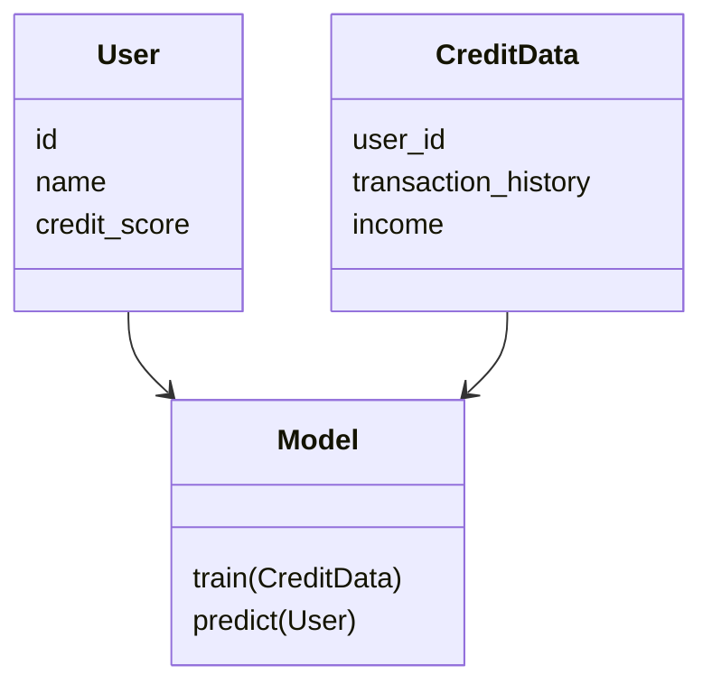
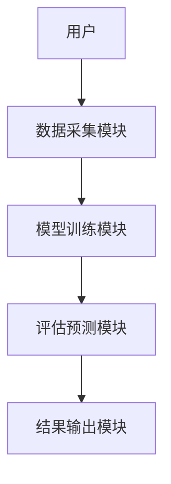
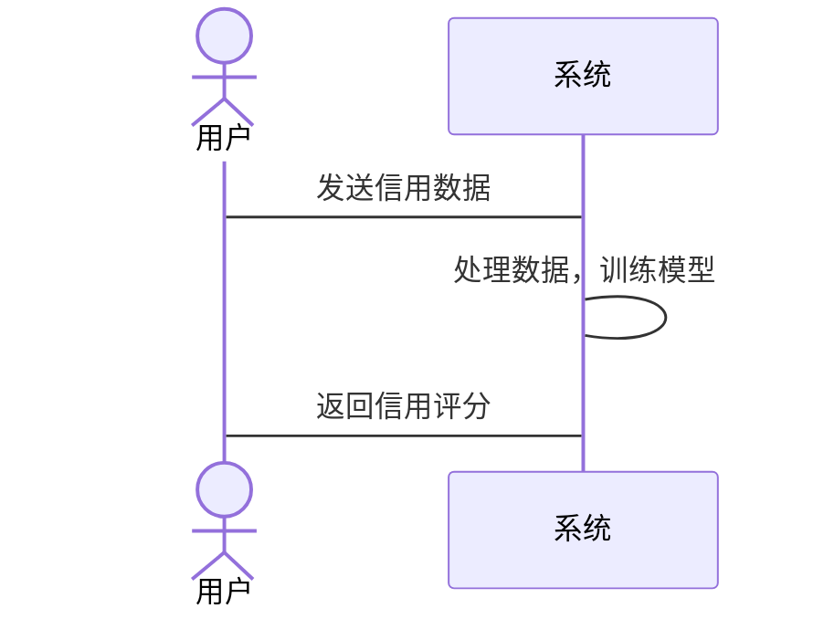

                 


# 设计智能化的个人信用评估系统

## 关键词：
- 个人信用评估、人工智能、机器学习、系统架构、信用评分模型

## 摘要：
本文详细探讨了设计智能化个人信用评估系统的各个方面，从背景介绍到项目实战，结合人工智能和机器学习技术，分析了系统的架构设计、算法原理以及实际应用案例。文章旨在帮助读者理解如何利用先进技术提升信用评估的效率和准确性，同时确保系统的安全性和合规性。

---

## 第1章: 背景介绍

### 1.1 问题背景
#### 1.1.1 传统信用评估的局限性
传统信用评估主要依赖人工审核和简单的评分模型，存在效率低、覆盖面有限、容易受主观因素影响等问题。

#### 1.1.2 人工智能在信用评估中的应用前景
随着人工智能技术的发展，利用机器学习算法对信用数据进行深度分析，能够提高评估的准确性和效率。

#### 1.1.3 智能化信用评估系统的必要性
智能化系统能够实时处理大量数据，提供更精准的信用评分，满足金融机构和个人用户的需求。

### 1.2 问题描述
#### 1.2.1 信用评估的核心问题
如何准确评估个人信用风险，同时保证评估过程的高效性和公平性。

#### 1.2.2 当前信用评估系统的主要挑战
数据量大、数据多样性、模型可解释性等问题。

#### 1.2.3 智能化信用评估系统的目标
构建一个高效、精准、可扩展的智能化信用评估系统，帮助金融机构和个人用户做出更明智的决策。

### 1.3 问题解决
#### 1.3.1 引入人工智能技术的解决方案
利用机器学习算法对信用数据进行建模和分析，提高评估的准确性和效率。

#### 1.3.2 数据驱动的信用评估方法
通过收集和分析大量信用数据，构建数据驱动的信用评估模型。

#### 1.3.3 智能化信用评估系统的架构设计
设计一个基于人工智能的系统架构，整合数据采集、模型训练、评估预测等功能。

### 1.4 边界与外延
#### 1.4.1 系统的边界定义
系统仅负责信用评估，不涉及数据的采集和存储。

#### 1.4.2 相关领域的外延
包括数据安全、法律法规、用户隐私保护等。

#### 1.4.3 系统与外部环境的交互
系统与金融机构、数据源、用户等外部实体进行交互。

### 1.5 核心概念与组成
#### 1.5.1 核心概念的定义
信用评估、人工智能、机器学习、系统架构。

#### 1.5.2 系统组成模块的介绍
数据采集模块、模型训练模块、评估预测模块。

#### 1.5.3 核心要素的结构化分析
数据、算法、系统架构是智能化信用评估系统的核心要素。

---

## 第2章: 核心概念与联系

### 2.1 核心概念原理
#### 2.1.1 信用评估的基本原理
通过分析个人的信用历史、收入状况、消费行为等，评估其信用风险。

#### 2.1.2 人工智能在信用评估中的应用原理
利用机器学习算法对信用数据进行建模和分析，提取特征并预测信用评分。

#### 2.1.3 智能化信用评估系统的整体架构
系统由数据采集、模型训练、评估预测三个主要模块组成。

### 2.2 概念属性特征对比
| 概念 | 属性 | 特征 |
|------|------|------|
| 传统信用评估 | 数据来源 | 有限的信用历史数据 |
|          | 方法 | 简单的统计分析 |
|          | 精度 | 较低，容易受主观因素影响 |
| AI驱动信用评估 | 数据来源 | 多源、多维数据 |
|          | 方法 | 复杂的机器学习算法 |
|          | 精度 | 高，能够发现数据中的隐藏模式 |

### 2.3 ER实体关系图
```mermaid
er
actor: 用户
actor --> system: 使用系统
system --> credit_report: 生成信用报告
system --> model: 使用评估模型
model --> data: 使用数据
```

---

## 第3章: 算法原理讲解

### 3.1 算法原理概述
#### 3.1.1 逻辑回归
用于分类问题，通过拟合数据生成概率模型。

#### 3.1.2 随机森林
基于决策树的集成学习方法，具有高准确性和良好的可解释性。

#### 3.1.3 神经网络
通过多层神经元模拟人脑的处理方式，能够处理复杂的非线性关系。

### 3.2 机器学习算法实现
#### 3.2.1 逻辑回归算法流程


#### 3.2.2 逻辑回归数学模型
$$ P(y=1|x) = \frac{e^{\beta_0 + \beta_1 x_1 + \dots + \beta_n x_n}}{1 + e^{\beta_0 + \beta_1 x_1 + \dots + \beta_n x_n}} $$

#### 3.2.3 逻辑回归代码示例
```python
import numpy as np
from sklearn.linear_model import LogisticRegression

# 示例数据
X = np.array([[1, 2], [3, 4], [5, 6]])
y = np.array([0, 1, 1])

# 训练模型
model = LogisticRegression()
model.fit(X, y)

# 预测
print(model.predict([[2, 3]]))  # 输出：[0]
```

### 3.3 神经网络算法实现
#### 3.3.1 神经网络数学模型
$$ a^{(l+1)} = \sigma(w^{(l)} a^{(l)} + b^{(l)}) $$
其中，$\sigma$ 是激活函数，如sigmoid函数。

#### 3.3.2 神经网络代码示例
```python
import numpy as np
import tensorflow as tf

# 示例数据
X = np.array([[0.1, 0.2], [0.3, 0.4], [0.5, 0.6]])
y = np.array([[0], [1], [1]])

# 定义模型
model = tf.keras.Sequential([
    tf.keras.layers.Dense(8, activation='relu'),
    tf.keras.layers.Dense(1, activation='sigmoid')
])

# 编译模型
model.compile(optimizer='adam', loss='binary_crossentropy', metrics=['accuracy'])

# 训练模型
model.fit(X, y, epochs=100, batch_size=32)

# 预测
print(model.predict([[0.2, 0.3]]))  # 输出：[[0.9]]
```

---

## 第4章: 系统分析与架构设计

### 4.1 系统分析
#### 4.1.1 问题场景介绍
金融机构需要快速、准确地评估个人信用风险。

#### 4.1.2 系统功能需求
数据采集、模型训练、评估预测、结果输出。

### 4.2 系统架构设计
#### 4.2.1 领域模型类图


#### 4.2.2 系统架构图


#### 4.2.3 系统接口设计
API接口：RESTful API，包括数据上传、模型训练、信用评分查询。

#### 4.2.4 系统交互序列图


---

## 第5章: 项目实战

### 5.1 环境搭建
#### 5.1.1 安装必要的库
Python、TensorFlow、Scikit-learn、Mermaid。

### 5.2 系统核心实现
#### 5.2.1 数据预处理
```python
import pandas as pd
data = pd.read_csv('credit_data.csv')
data.head()
```

#### 5.2.2 模型训练
```python
from sklearn.model_selection import train_test_split
from sklearn.ensemble import RandomForestClassifier

X_train, X_test, y_train, y_test = train_test_split(data.drop('target', axis=1), data['target'])
model = RandomForestClassifier()
model.fit(X_train, y_train)
```

#### 5.2.3 系统部署
将模型部署到云服务器，通过API提供信用评分服务。

### 5.3 案例分析
#### 5.3.1 数据分析
分析用户的历史交易记录、收入水平、还款记录等，提取关键特征。

#### 5.3.2 模型评估
评估模型的准确率、召回率、F1分数等指标。

#### 5.3.3 结果解读
根据模型输出的信用评分，生成信用报告，供金融机构参考。

---

## 第6章: 总结与展望

### 6.1 全文总结
智能化个人信用评估系统利用人工智能技术，提高了信用评估的效率和准确性，为金融机构和个人用户提供了更好的服务。

### 6.2 未来展望
随着技术的发展，信用评估系统将更加智能化、个性化，数据安全和隐私保护也将成为更重要的议题。

---

## 作者：
作者：AI天才研究院  
地址：https://github.com/AI-Genius-Institute

