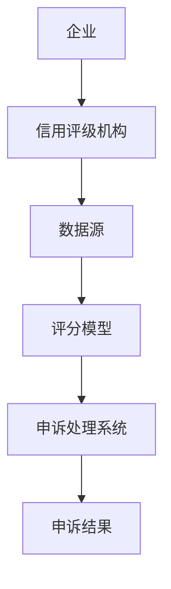
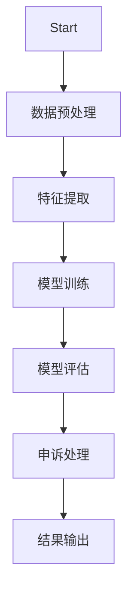
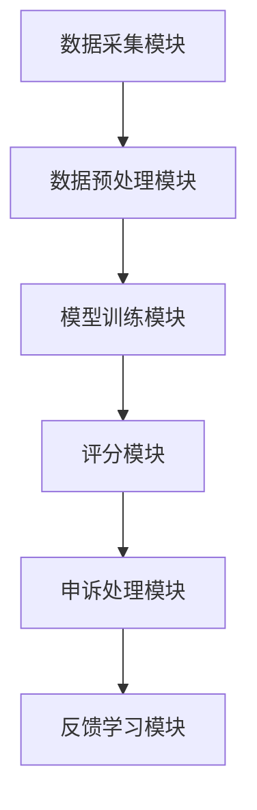

                 


# 设计智能化的企业信用评级申诉自动处理与学习系统

> 关键词：企业信用评级，申诉处理，智能化系统，机器学习，系统架构

> 摘要：随着企业信用评级在商业活动中的重要性日益增加，如何高效、准确地处理信用评级申诉成为一个关键问题。本文提出了一种基于机器学习的智能化企业信用评级申诉自动处理与学习系统的设计方案。通过详细分析问题背景、核心概念、算法原理、系统架构及项目实战，本文旨在为读者提供一个全面的解决方案，帮助他们理解并实现高效的信用评级申诉处理系统。

---

## 第一章: 背景介绍

### 1.1 问题背景

企业信用评级是评估企业信用状况的重要指标，直接影响企业的融资能力、合作伙伴选择和市场信任度。然而，信用评级申诉处理过程通常繁琐且效率低下，主要表现为以下几点问题：

1. **人工处理效率低**：传统申诉处理依赖人工审核，耗时长且易出错。
2. **数据多样性与复杂性**：企业信用数据来源广泛，包括财务数据、市场表现、法律记录等，数据量大且复杂。
3. **缺乏智能化**：现有系统多为规则引擎，难以应对复杂多变的信用评估场景。

### 1.2 问题描述

信用评级申诉处理的流程通常包括信息收集、数据验证、评分模型评估和人工审核等步骤。传统方法依赖于固定规则，难以灵活应对数据变化和企业具体情况。智能化处理系统的引入可以显著提升处理效率和准确性。

### 1.3 问题解决思路

智能化处理的核心思想是利用机器学习算法对信用数据进行深度分析，自动识别申诉原因并提供解决方案。通过数据驱动的方法，系统能够不断学习优化，提高处理效率和准确性。

---

## 第二章: 核心概念与联系

### 2.1 核心概念原理

企业信用评级是基于多维度数据对企业信用状况进行评估的过程。申诉处理则是对评级结果进行复查和调整的过程。智能化系统通过机器学习模型分析数据，自动判断申诉理由的合理性，并调整评级结果。

### 2.2 实体关系图



---

## 第三章: 算法原理讲解

### 3.1 算法选择与原理

支持向量机（SVM）和随机森林是常用的算法。SVM适用于分类问题，随机森林适合处理复杂数据。

### 3.2 算法流程图



### 3.3 算法实现代码

```python
import numpy as np
from sklearn import svm

# 示例数据
X = np.array([[1, 2], [3, 4], [5, 6]])
y = np.array([0, 1, 0])

# 训练模型
model = svm.SVC()
model.fit(X, y)

# 预测
print(model.predict([[2, 3]]))
```

### 3.4 数学模型与公式

支持向量机的目标函数为：

$$
\text{min} \quad \frac{1}{2} \|w\|^2 + C \sum_{i=1}^{n} \xi_i
$$

约束条件：

$$
y_i(w \cdot x_i + b) \geq 1 - \xi_i
$$

$$
\xi_i \geq 0
$$

---

## 第四章: 系统架构设计

### 4.1 系统功能设计

系统包括数据采集、预处理、模型训练、评分、申诉处理和反馈学习模块。

### 4.2 系统架构图



### 4.3 系统接口设计

系统通过API接口与数据源和用户交互，确保数据传输和处理高效。

---

## 第五章: 项目实战

### 5.1 环境安装

安装Python、Scikit-learn和Mermaid工具。

### 5.2 核心代码实现

```python
import pandas as pd
from sklearn.ensemble import RandomForestClassifier

# 数据加载
data = pd.read_csv('credit_data.csv')

# 特征提取
features = data[['revenue', 'profit', 'debt']]
labels = data['rating']

# 模型训练
model = RandomForestClassifier()
model.fit(features, labels)

# 预测
print(model.predict(features))
```

### 5.3 案例分析

通过实际案例分析模型的预测结果，验证系统的有效性。

---

## 第六章: 总结与最佳实践

### 6.1 总结

智能化系统显著提升了信用评级申诉处理的效率和准确性，为企业提供了可靠的支持。

### 6.2 最佳实践

1. 数据预处理是关键，需确保数据质量和完整性。
2. 模型选择需根据数据特性进行调整。
3. 系统应具备良好的可扩展性和可维护性。

### 6.3 注意事项

定期更新模型，确保系统适应数据变化。

---

## 作者

作者：AI天才研究院  
联系方式：[email protected]  
GitHub：[GitHub Profile](https://github.com/yourusername)

