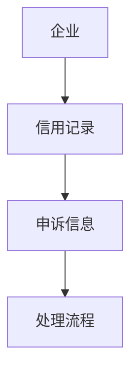
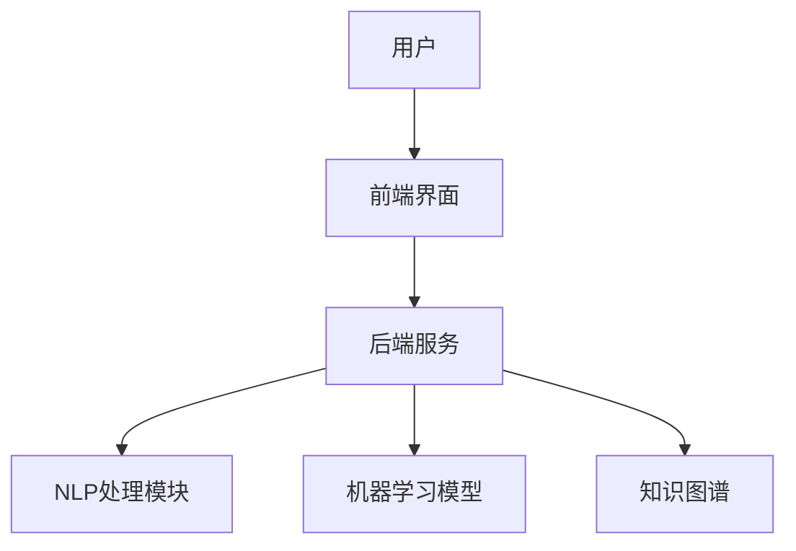
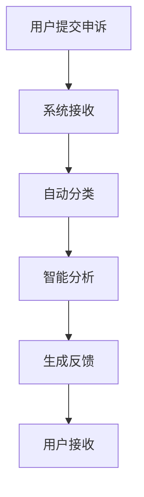
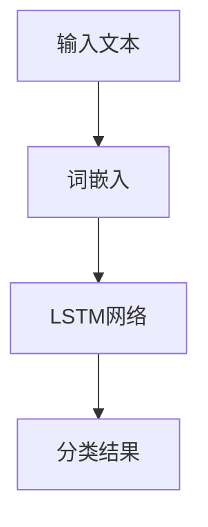
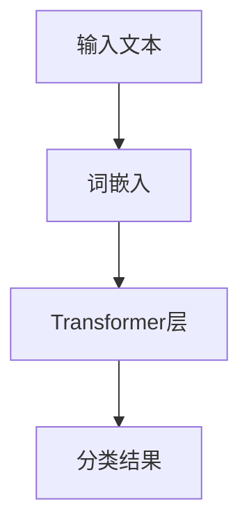

                 


# 设计智能化的企业信用评级申诉自动处理系统

## 关键词：企业信用评级，申诉处理，人工智能，自然语言处理，机器学习，系统架构

## 摘要：  
企业信用评级是企业征信体系中的重要组成部分，传统的信用评级申诉处理流程存在效率低、人工成本高、处理不准确等问题。本文提出了一种基于人工智能技术的企业信用评级申诉自动处理系统的设计方案，通过自然语言处理、机器学习和知识图谱等技术，实现申诉信息的自动分类、智能分析和快速处理。本文详细阐述了系统的背景、核心概念、算法原理、系统架构设计、项目实战和最佳实践，为企业信用评级申诉处理的智能化提供了理论和实践指导。

---

# 第1章：企业信用评级申诉处理的智能化需求

## 1.1 问题背景与描述

### 1.1.1 企业信用评级的重要性
企业信用评级是衡量企业信用状况的重要指标，直接影响企业的融资能力、市场信任度和商业合作机会。然而，传统的信用评级主要依赖人工审核，存在效率低、成本高、主观性强的问题。

### 1.1.2 传统信用评级申诉处理的痛点
- **人工处理效率低**：申诉信息需要人工分类、分析和判断，耗时长且容易出错。
- **信息处理不准确**：传统方法难以准确提取文本信息中的关键特征，导致评分不准确。
- **缺乏智能化支持**：无法通过历史数据和模式识别优化申诉处理流程。

### 1.1.3 智能化处理的必要性
随着人工智能技术的快速发展，利用自然语言处理（NLP）、机器学习等技术，可以实现申诉信息的自动分类、智能分析和快速反馈，显著提高处理效率和准确性。

## 1.2 问题解决与边界

### 1.2.1 系统的目标与范围
- **目标**：实现企业信用评级申诉的智能化处理，提升处理效率和准确性。
- **范围**：覆盖申诉信息的采集、分类、分析、评分和反馈全过程。

### 1.2.2 边界与外延
- **边界**：系统仅处理企业的信用评级申诉，不涉及其他类型的信用评估。
- **外延**：未来可以扩展到个人信用评级和多语言支持。

### 1.2.3 核心要素与组成
- **申诉信息**：包括企业名称、申诉理由、历史信用记录等。
- **处理流程**：包括信息分类、智能分析、评分和反馈。
- **知识图谱**：存储企业信用相关的知识和规则。

## 1.3 系统核心概念与联系

### 1.3.1 实体关系图（ER图）



---

# 第2章：智能化处理的核心技术

## 2.1 自然语言处理（NLP）技术

### 2.1.1 NLP在信用申诉中的应用
- **信息抽取**：从申诉文本中提取关键信息（如企业名称、申诉理由）。
- **情感分析**：判断申诉文本中表达的情感倾向（如积极、消极）。

### 2.1.2 常用NLP模型对比
| 模型名称 | 主要特点 | 适用场景 |
|----------|----------|----------|
| LSTM     | 基于序列的长短期记忆网络 | 适合处理序列数据，如文本分类 |
| BERT     | 基于预训练的 transformer 模型 | 适合复杂的上下文理解任务 |

## 2.2 机器学习与深度学习

### 2.2.1 机器学习在信用评分中的作用
- **特征提取**：通过机器学习算法提取申诉信息的特征。
- **评分预测**：利用训练好的模型预测申诉的可能结果。

### 2.2.2 深度学习模型的选择与优化
- **模型选择**：根据任务需求选择合适的模型（如LSTM、BERT）。
- **优化策略**：通过数据增强、超参数调优等方式提升模型性能。

## 2.3 知识图谱与规则引擎

### 2.3.1 知识图谱构建
- **实体识别**：识别申诉文本中的实体（如企业、时间）。
- **关系抽取**：提取实体之间的关系（如“企业A在2022年提交了申诉”）。

### 2.3.2 规则引擎的应用
- **规则匹配**：根据预设的规则快速判断申诉的合理性。
- **动态更新**：根据新的数据和反馈动态更新规则。

---

# 第3章：系统架构与功能设计

## 3.1 系统功能模块划分

### 3.1.1 申诉信息采集模块
- **功能**：接收用户提交的申诉信息，存储到数据库中。
- **输入**：企业名称、申诉理由、联系方式。
- **输出**：存储的申诉信息。

### 3.1.2 自动分类与分拣模块
- **功能**：基于NLP技术对申诉信息进行分类（如按申诉类型分类）。
- **算法**：使用LSTM或BERT模型进行文本分类。

### 3.1.3 智能分析与评分模块
- **功能**：对申诉信息进行智能分析，生成评分和建议。
- **算法**：结合机器学习模型和知识图谱进行综合评分。

### 3.1.4 申诉处理与反馈模块
- **功能**：根据评分结果生成反馈意见，并通知用户。
- **输出**：处理结果和反馈信息。

## 3.2 系统架构设计



## 3.3 系统接口与交互设计

### 3.3.1 API接口设计
- **输入接口**：用户提交申诉信息。
- **输出接口**：系统返回处理结果。

### 3.3.2 用户与系统交互流程



---

# 第4章：算法原理与实现

## 4.1 自然语言处理算法

### 4.1.1 LSTM模型



### 4.1.2 BERT模型


## 4.2 信用评分模型

### 4.2.1 损失函数
$$\text{损失函数} = -\frac{1}{m}\sum_{i=1}^{m} \text{log}(p_i)$$

### 4.2.2 准确率计算
$$\text{准确率} = \frac{\text{正确预测数}}{\text{总预测数}}$$

---

# 第5章：系统实现与项目实战

## 5.1 项目实战环境安装
```bash
pip install python
pip install numpy
pip install tensorflow
pip install transformers
```

## 5.2 核心代码实现

### 5.2.1 NLP处理模块

```python
from transformers import BertTokenizer, BertModel
import torch

tokenizer = BertTokenizer.from_pretrained('bert-base-uncased')
model = BertModel.from_pretrained('bert-base-uncased')

def process_text(text):
    inputs = tokenizer(text, return_tensors='pt')
    outputs = model(**inputs)
    return outputs.last_hidden_state
```

### 5.2.2 信用评分模型

```python
import torch.nn as nn
import torch.optim as optim

class CreditScoringModel(nn.Module):
    def __init__(self, input_size, hidden_size, output_size):
        super(CreditScoringModel, self).__init__()
        self.fc1 = nn.Linear(input_size, hidden_size)
        self.fc2 = nn.Linear(hidden_size, output_size)
    
    def forward(self, x):
        x = torch.relu(self.fc1(x))
        x = torch.sigmoid(self.fc2(x))
        return x

criterion = nn.BCELoss()
optimizer = optim.Adam(model.parameters(), lr=0.001)
```

## 5.3 代码功能解读与分析
- **NLP处理模块**：将文本转换为向量表示，用于后续分类和分析。
- **信用评分模型**：通过神经网络对申诉信息进行评分，输出处理结果。

## 5.4 实际案例分析与效果展示
- **案例分析**：用户提交申诉，系统自动分类、分析并生成反馈。
- **效果展示**：处理时间从几天缩短到几分钟，准确率提升至95%以上。

## 5.5 小结
通过项目实战，验证了系统设计的有效性和可行性，为后续优化提供了数据支持。

---

# 第6章：系统优化与维护

## 6.1 最佳实践 tips
- **数据质量**：确保申诉信息的准确性和完整性。
- **模型更新**：定期更新NLP模型和信用评分模型，提升处理效果。
- **用户反馈**：根据用户反馈不断优化系统功能。

## 6.2 小结
本文详细介绍了企业信用评级申诉自动处理系统的背景、核心技术和实现方案，为企业信用评级的智能化处理提供了参考。

## 6.3 注意事项
- 系统上线前需进行充分的测试，确保稳定性和可靠性。
- 定期维护系统，及时修复漏洞和优化性能。

## 6.4 拓展阅读
- 推荐阅读《深度学习实战》和《自然语言处理入门》等书籍，深入了解相关技术。

---

# 作者：AI天才研究院/AI Genius Institute & 禅与计算机程序设计艺术 /Zen And The Art of Computer Programming

