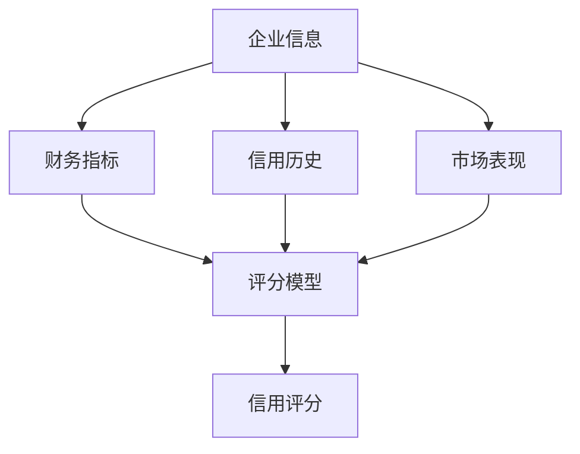
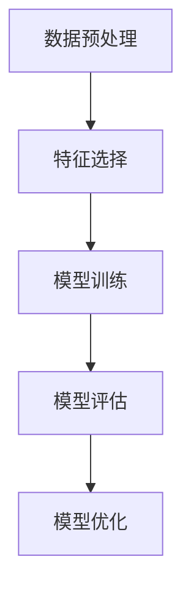
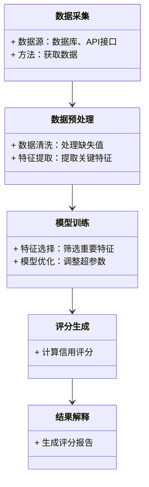
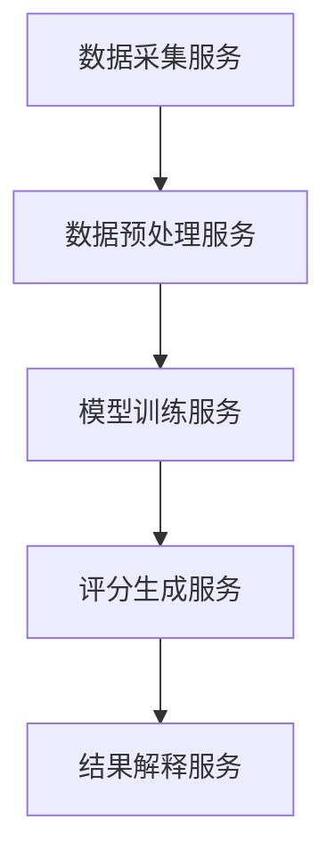
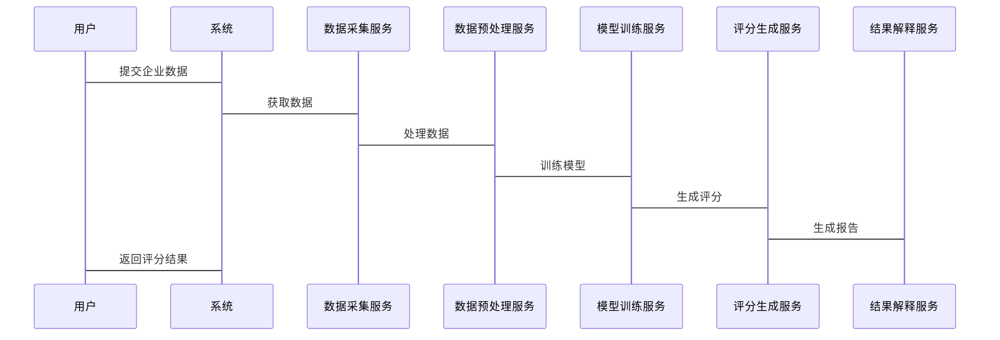

                 


# 设计智能化的企业信用评级解释系统

## 关键词：企业信用评级，人工智能，机器学习，大数据，评分模型，可解释性

## 摘要：  
在当今数字化和智能化的商业环境中，企业信用评级是金融机构评估企业信用风险的核心工具。传统的信用评级方法依赖于人工经验判断和有限的数据支持，存在效率低下、主观性强、透明度不足等问题。随着人工智能和大数据技术的快速发展，智能化的企业信用评级解释系统应运而生。本文将从背景、核心概念、算法原理、系统架构、项目实战等多方面深入探讨如何设计智能化的企业信用评级解释系统，并通过具体案例分析和代码实现，展示其在实际应用中的价值和潜力。

---

# 第一部分: 背景介绍与核心概念

## 第1章: 企业信用评级解释系统概述

### 1.1 问题背景与描述

#### 1.1.1 传统企业信用评级的局限性  
传统的企业信用评级方法主要依赖于人工经验判断和少量财务数据，存在以下问题：  
- 数据维度单一：仅依赖财务数据，无法全面反映企业的经营状况和风险。  
- 主观性强：评级结果容易受到评级人员主观判断的影响。  
- 透明度低：评级过程缺乏透明性，难以向企业解释评级结果的依据。  
- 效率低下：人工评级耗时长，难以满足金融机构对快速决策的需求。  

#### 1.1.2 智能化信用评级的需求与目标  
随着大数据和人工智能技术的发展，金融机构对智能化信用评级的需求日益迫切：  
- **需求**：通过自动化数据处理、智能模型构建和实时分析，提高信用评级的效率和准确性。  
- **目标**：设计一个智能化的企业信用评级解释系统，能够基于多维数据（如财务数据、市场数据、行业数据等）自动计算企业信用评分，并提供可解释的评级依据。  

#### 1.1.3 信用评级解释系统的核心问题  
智能化信用评级的核心问题在于如何构建一个高效、准确且可解释的评分模型，并能够为企业和金融机构提供透明的解释。  

---

### 1.2 核心概念与系统边界

#### 1.2.1 企业信用评级的核心要素  
企业信用评级的核心要素包括：  
- **财务数据**：收入、利润、资产负债率等。  
- **市场表现**：行业排名、市场份额、竞争对手分析。  
- **信用历史**：企业过往的还款记录、违约情况。  
- **管理团队**：团队经验、稳定性等。  

#### 1.2.2 系统的边界与外延  
- **边界**：系统仅专注于企业信用评分的计算和解释，不涉及评分后的决策（如贷款审批）。  
- **外延**：可扩展至个人信用评分、供应链信用评估等领域。  

#### 1.2.3 系统的核心功能与应用场景  
- **核心功能**：数据采集与处理、特征提取、模型训练、评分计算、结果解释。  
- **应用场景**：银行贷款审批、供应链金融、投资决策支持等。  

---

## 第2章: 核心概念与系统架构

### 2.1 核心概念原理

#### 2.1.1 数据来源与特征提取  
- **数据来源**：企业财务报表、市场数据、行业报告、新闻数据等。  
- **特征提取**：将非结构化数据（如新闻）转化为结构化特征（如情感分数）。  

#### 2.1.2 模型算法与评分标准  
- **模型算法**：基于机器学习的评分模型（如随机森林、梯度提升树）。  
- **评分标准**：将评分结果分为多个等级（如A+、A、B、C等）。  

#### 2.1.3 解释性与可解释性要求  
- **解释性**：评分结果需要能够被企业和金融机构理解。  
- **可解释性**：模型的决策过程需要透明，便于审计和优化。  

---

### 2.2 核心概念属性特征对比

#### 2.2.1 数据特征对比表格  
| 数据特征 | 描述 | 示例 |  
|----------|------|------|  
| 时间性 | 数据的时间跨度 | 近三年的财务数据 |  
| 完整性 | 数据的完整性 | 缺失值处理 |  
| 颗粒度 | 数据的细化程度 | 细分行业数据 |  

#### 2.2.2 模型特征对比表格  
| 模型特征 | 描述 | 示例 |  
|----------|------|------|  
| 算法类型 | 模型的算法选择 | 随机森林 |  
| 调参优化 | 模型的超参数调整 | 学习率、树深 |  

#### 2.2.3 评分特征对比表格  
| 评分特征 | 描述 | 示例 |  
|----------|------|------|  
| 评分范围 | 评分的范围 | A+、A、B、C |  
| 评分依据 | 评分的主要依据 | 财务指标、市场表现 |  

---

### 2.3 ER实体关系图  



---

# 第二部分: 算法原理与数学模型

## 第3章: 算法原理讲解

### 3.1 基于机器学习的评分模型

#### 3.1.1 模型选择与训练流程  
- **模型选择**：随机森林（Random Forest）或梯度提升树（Gradient Boosting Tree）。  
- **训练流程**：  
  1. 数据预处理（清洗、归一化）。  
  2. 特征选择（重要特征筛选）。  
  3. 模型训练（交叉验证）。  
  4. 模型评估（准确率、召回率、F1分数）。  
  5. 模型优化（超参数调整）。  

#### 3.1.2 算法流程图  



---

### 3.2 核心算法代码实现

#### 3.2.1 数据预处理  
```python
import pandas as pd
from sklearn.impute import SimpleImputer

data = pd.read_csv('credit_data.csv')
# 处理缺失值
imputer = SimpleImputer(strategy='mean')
data_imputed = imputer.fit_transform(data)
```

#### 3.2.2 模型训练  
```python
from sklearn.ensemble import RandomForestClassifier
from sklearn.model_selection import train_test_split

X_train, X_test, y_train, y_test = train_test_split(data_imputed, target, test_size=0.2)
model = RandomForestClassifier(n_estimators=100, random_state=42)
model.fit(X_train, y_train)
```

#### 3.2.3 模型评估  
```python
from sklearn.metrics import classification_report

y_pred = model.predict(X_test)
print(classification_report(y_test, y_pred))
```

---

### 3.3 数学模型与公式

#### 3.3.1 随机森林模型  
随机森林是一种集成学习算法，通过构建多个决策树并取其预测结果的平均值来提高模型的准确性和稳定性。  
- **公式**：  
  $$ y = \text{mean}(\text{decision tree}_i(x)) $$  

#### 3.3.2 梯度提升树模型  
梯度提升树是一种基于树的回归模型，通过不断优化损失函数来提高模型性能。  
- **公式**：  
  $$ y = \sum_{i=1}^{n} \text{tree}_i(x) \times \text{learning rate} $$  

---

## 第4章: 系统分析与架构设计

### 4.1 系统功能设计

#### 4.1.1 功能模块  
- **数据采集**：从多种数据源获取企业数据。  
- **数据预处理**：清洗、归一化、特征提取。  
- **模型训练**：构建评分模型并进行优化。  
- **评分生成**：计算企业信用评分。  
- **结果解释**：生成评分报告和解释性分析。  

#### 4.1.2 功能模块类图  



---

### 4.2 系统架构设计

#### 4.2.1 微服务架构  



#### 4.2.2 接口设计  
- **输入接口**：企业数据接口（REST API）。  
- **输出接口**：评分结果接口、评分报告接口。  

#### 4.2.3 交互流程图  



---

## 第5章: 项目实战

### 5.1 环境安装

#### 5.1.1 安装依赖  
```bash
pip install pandas sklearn mermaid4jupyter jupyter
```

---

### 5.2 核心代码实现

#### 5.2.1 数据预处理  
```python
import pandas as pd
from sklearn.impute import SimpleImputer

data = pd.read_csv('credit_data.csv')
imputer = SimpleImputer(strategy='mean')
data_imputed = imputer.fit_transform(data)
```

#### 5.2.2 特征选择  
```python
from sklearn.feature_selection import SelectKBest

selector = SelectKBest(k=10)
selector.fit_transform(data_imputed, target)
```

#### 5.2.3 模型训练  
```python
from sklearn.ensemble import RandomForestClassifier

model = RandomForestClassifier(n_estimators=100, random_state=42)
model.fit(X_train, y_train)
```

#### 5.2.4 评分生成  
```python
importances = model.feature_importances_
feature_names = data.columns
sorted_indices = importances.argsort()[::-1]
for i in range(len(feature_names)):
    print(f"{feature_names[sorted_indices[i]]}: {importances[sorted_indices[i]]}")
```

---

### 5.3 案例分析

#### 5.3.1 案例背景  
某企业A的财务数据和市场表现显示其盈利能力稳定，但现金流存在波动。  

#### 5.3.2 评分过程  
- 数据预处理：清洗企业A的财务数据。  
- 特征选择：提取关键财务指标（如净利润率、资产负债率）。  
- 模型训练：基于随机森林算法训练评分模型。  
- 评分生成：计算企业A的信用评分为B+。  

#### 5.3.3 评分解释  
- **评分依据**：企业A的财务指标显示其盈利能力较强，但现金流波动较大，存在一定的偿债风险。  
- **建议**：金融机构可要求企业A提供更多的财务保障措施。  

---

## 第6章: 最佳实践与小结

### 6.1 最佳实践

#### 6.1.1 数据质量管理  
- 确保数据的完整性、准确性和一致性。  

#### 6.1.2 模型可解释性  
- 在模型设计中加入可解释性机制，便于审计和优化。  

#### 6.1.3 持续优化  
- 定期更新模型，确保其适应市场变化。  

---

### 6.2 小结

智能化的企业信用评级解释系统通过结合大数据和人工智能技术，能够显著提高信用评级的效率和准确性。本文从背景、核心概念、算法原理、系统架构到项目实战，详细介绍了如何设计和实现这样一个系统，并通过案例分析展示了其实际应用价值。

---

## 作者：AI天才研究院/AI Genius Institute & 禅与计算机程序设计艺术 /Zen And The Art of Computer Programming

