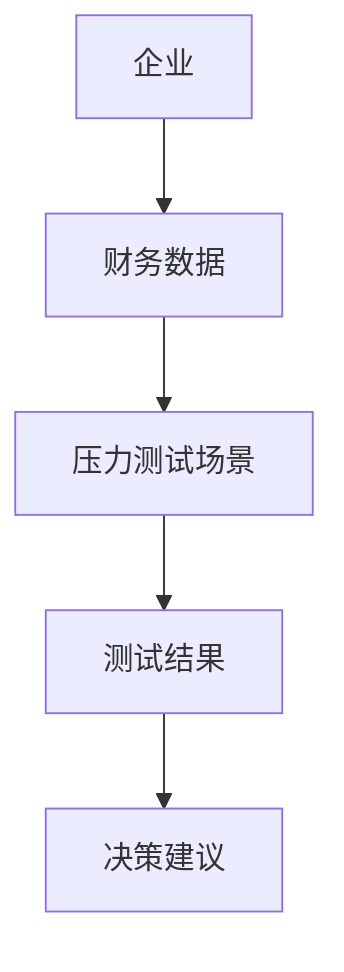
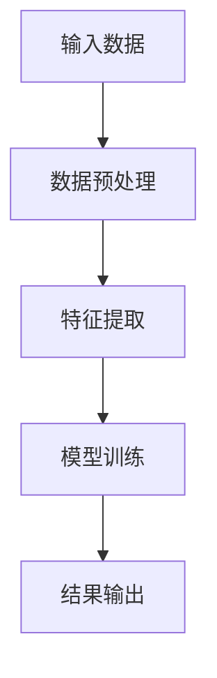
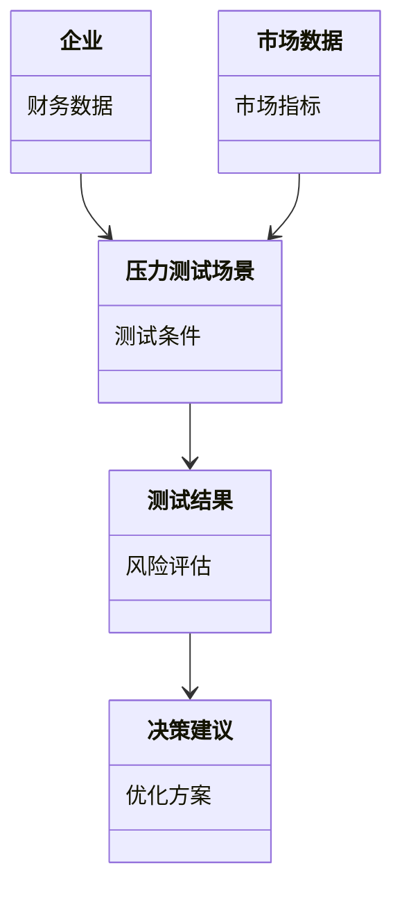
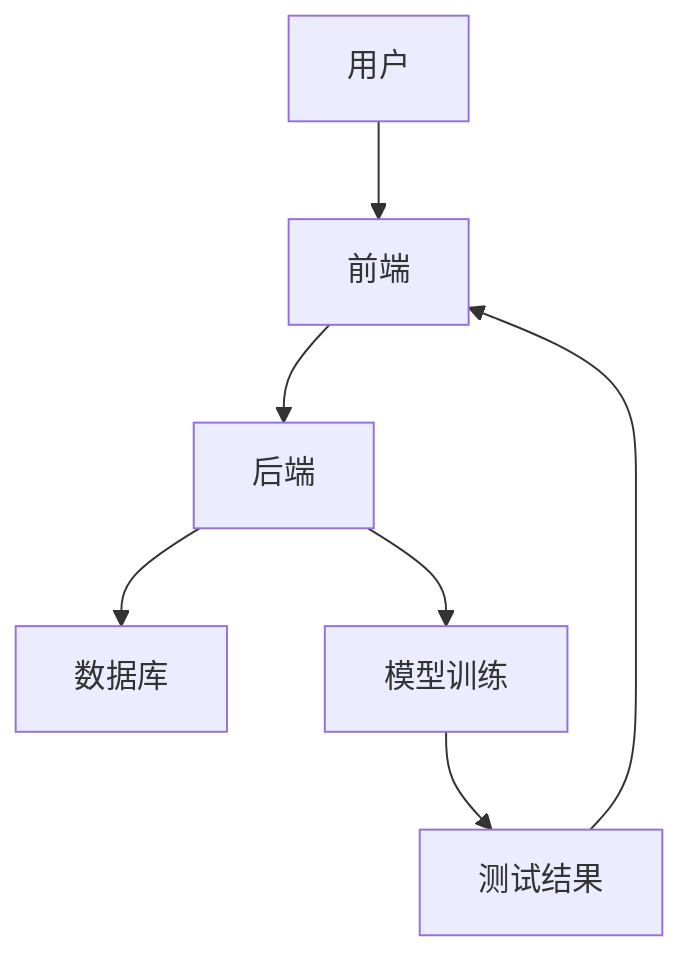
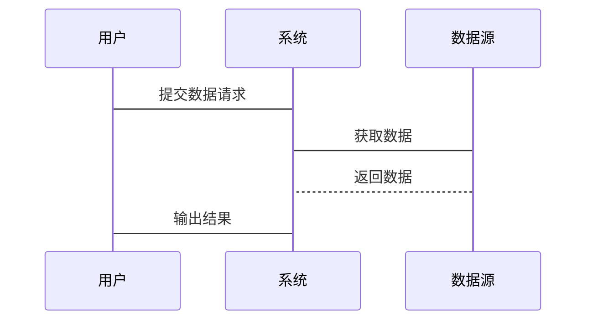

                 


# 设计智能化的企业财务压力测试系统

## 关键词：智能化、企业财务、压力测试、机器学习、数学模型、系统架构、系统设计

## 摘要：本文详细探讨了设计智能化的企业财务压力测试系统的各个方面，包括系统背景、核心概念、算法原理、系统架构设计和项目实战。通过结合数学模型和机器学习算法，提出了一种高效、精准的压力测试解决方案，解决了传统方法的局限性，为企业财务管理提供了新的思路。

---

# 第1章 企业财务压力测试系统概述

## 1.1 问题背景与问题描述

### 1.1.1 企业财务压力测试的背景
企业财务压力测试是评估企业财务健康状况的重要手段，旨在模拟极端市场条件下的财务表现，帮助企业在潜在危机中做好准备。然而，传统的压力测试方法依赖人工分析，效率低且容易出错。

### 1.1.2 传统财务压力测试的局限性
传统方法主要依赖手工计算和经验判断，存在以下问题：
- 数据处理效率低，难以应对海量数据。
- 缺乏自动化和智能化，导致结果可能存在偏差。
- 无法实时更新和调整，难以应对快速变化的市场环境。

### 1.1.3 智能化财务压力测试的需求
随着企业规模的扩大和市场环境的复杂化，智能化压力测试的需求日益迫切：
- 提高测试效率，缩短测试周期。
- 实现数据的自动化处理和分析。
- 提供更精准的预测结果，辅助决策。

## 1.2 问题解决与边界定义

### 1.2.1 智能化财务压力测试的核心目标
智能化财务压力测试的目标是通过机器学习和大数据技术，实现对财务数据的自动分析、预测和模拟，帮助企业在潜在风险中找到应对策略。

### 1.2.2 系统的边界与外延
系统的边界包括：
- 输入：企业财务数据、市场数据、历史数据等。
- 输出：压力测试结果、风险评估报告、优化建议等。
- 外延：与企业内部系统（如ERP、CRM）的集成。

### 1.2.3 核心问题的边界条件
- 数据的完整性和准确性。
- 模型的可解释性和准确性。
- 系统的实时性和高效性。

## 1.3 核心概念与系统结构

### 1.3.1 系统的核心要素组成
系统的核心要素包括：
- 数据采集模块：负责收集企业财务数据。
- 数据处理模块：对数据进行清洗和预处理。
- 模型构建模块：基于机器学习算法构建预测模型。
- 结果分析模块：生成压力测试报告和优化建议。

### 1.3.2 系统的功能模块划分
系统功能模块如下：
1. 数据采集模块：从企业财务系统中获取数据。
2. 数据预处理模块：清洗和标准化数据。
3. 模型训练模块：基于机器学习算法训练模型。
4. 压力测试模块：模拟极端市场条件下的财务表现。
5. 报告生成模块：输出测试结果和优化建议。

### 1.3.3 系统的输入输出关系
- 输入：企业财务数据、市场数据、历史数据。
- 输出：压力测试结果、风险评估报告、优化建议。

## 1.4 本章小结
本章介绍了企业财务压力测试系统的背景、核心概念和系统结构，为后续章节的详细分析奠定了基础。

---

# 第2章 智能化财务压力测试系统的核心原理

## 2.1 核心概念的原理分析

### 2.1.1 数据驱动的原理
数据驱动的原理是通过大量数据训练模型，提取数据中的特征和规律，从而实现对财务数据的准确分析。

### 2.1.2 智能算法的实现原理
智能算法（如机器学习）通过训练模型，自动发现数据中的模式和关系，从而实现对财务数据的预测和模拟。

### 2.1.3 系统的自适应机制
系统的自适应机制通过实时更新模型参数，确保系统能够适应市场环境的变化，提高测试结果的准确性。

## 2.2 核心概念的属性特征对比

### 2.2.1 系统输入特征对比表

| 特征 | 描述 |
|------|------|
| 数据量 | 大量 | 
| 数据类型 | 结构化和非结构化 |
| 数据来源 | 企业内部和外部 |

### 2.2.2 系统输出特征对比表

| 特征 | 描述 |
|------|------|
| 输出类型 | 预测值和建议 |
| 输出频率 | 实时或定期 |

### 2.2.3 系统性能特征对比表

| 特征 | 描述 |
|------|------|
| 处理速度 | 高效 |
| 准确性 | 高 |
| 可扩展性 | 好 |

## 2.3 系统的ER实体关系图



## 2.4 本章小结
本章详细分析了智能化财务压力测试系统的核心原理和系统结构，为后续的算法设计奠定了理论基础。

---

# 第3章 算法原理与实现

## 3.1 算法原理概述

### 3.1.1 压力测试的核心算法
压力测试的核心算法包括：
- 蒙特卡洛模拟：通过随机抽样模拟极端市场条件下的财务表现。
- 时间序列分析：基于历史数据预测未来财务状况。

### 3.1.2 算法的输入输出关系
- 输入：企业财务数据、市场数据。
- 输出：压力测试结果、风险评估报告。

### 3.1.3 算法的优化策略
- 参数优化：通过调整模型参数提高预测准确性。
- 并行计算：利用多核处理器提高计算效率。

## 3.2 算法的数学模型

### 3.2.1 基于概率论的数学模型
概率密度函数：
$$ P(x) = \frac{1}{\sqrt{2\pi\sigma^2}} e^{-x^2/(2\sigma^2)} $$

### 3.2.2 基于统计学的数学模型
均值计算：
$$ \mu = \frac{1}{n}\sum_{i=1}^{n}x_i $$

### 3.2.3 基于机器学习的数学模型
线性回归模型：
$$ y = f(x) + \epsilon $$

## 3.3 算法的实现流程



## 3.4 本章小结
本章详细介绍了压力测试的核心算法及其数学模型，为系统的实现提供了理论支持。

---

# 第4章 系统分析与架构设计方案

## 4.1 问题场景介绍
企业财务压力测试系统的应用场景包括：
- 企业内部的财务风险管理。
- 金融机构的信用评估。
- 政府部门的经济政策制定。

## 4.2 项目介绍

### 4.2.1 系统功能设计
功能模块包括：
1. 数据采集模块：从企业财务系统中获取数据。
2. 数据预处理模块：清洗和标准化数据。
3. 模型训练模块：基于机器学习算法训练模型。
4. 压力测试模块：模拟极端市场条件下的财务表现。
5. 报告生成模块：输出测试结果和优化建议。

### 4.2.2 领域模型


### 4.2.3 系统架构设计


### 4.2.4 系统接口设计
- 用户接口：提供数据输入和结果查看功能。
- 数据接口：与企业财务系统进行数据交互。
- 模型接口：与第三方机器学习框架（如TensorFlow）进行集成。

### 4.2.5 系统交互设计


## 4.3 本章小结
本章详细描述了系统的设计方案，包括功能设计、架构设计和接口设计，为系统的实现提供了清晰的指导。

---

# 第5章 项目实战

## 5.1 环境安装与配置

### 5.1.1 系统环境要求
- 操作系统：Linux/Windows/MacOS
- 开发工具：Python、Jupyter Notebook
- 依赖库：NumPy、Pandas、Scikit-learn、TensorFlow

### 5.1.2 安装步骤
```bash
pip install numpy pandas scikit-learn tensorflow
```

## 5.2 系统核心实现

### 5.2.1 数据预处理模块
```python
import pandas as pd

# 读取数据
data = pd.read_csv('financial_data.csv')

# 数据清洗
data = data.dropna()
data = pd.get_dummies(data)
```

### 5.2.2 模型训练模块
```python
from sklearn.linear_model import LinearRegression
from sklearn.model_selection import train_test_split

# 划分训练集和测试集
X_train, X_test, y_train, y_test = train_test_split(data.drop('target', axis=1), data['target'], test_size=0.2, random_state=42)

# 训练模型
model = LinearRegression()
model.fit(X_train, y_train)
```

### 5.2.3 压力测试模块
```python
import numpy as np

# 模拟极端市场条件
extreme_conditions = np.array([[...]])  # 具体条件根据实际数据填写

# 预测结果
predictions = model.predict(extreme_conditions)
```

### 5.2.4 结果分析模块
```python
from sklearn.metrics import mean_squared_error

# 计算均方误差
mse = mean_squared_error(y_test, model.predict(X_test))
print(f"均方误差: {mse}")
```

## 5.3 项目实战案例分析

### 5.3.1 案例背景
假设某企业面临市场波动加剧的情况，需要进行压力测试以评估其财务稳定性。

### 5.3.2 数据分析与处理
通过对历史财务数据和市场数据的分析，提取关键特征并进行标准化处理。

### 5.3.3 模型训练与测试
基于训练数据训练模型，并在测试数据上验证模型的准确性。

### 5.3.4 结果分析
根据模型预测结果，生成压力测试报告，提出优化建议。

## 5.4 本章小结
本章通过实际案例展示了系统的实现过程，验证了系统的可行性和有效性。

---

# 第6章 总结与展望

## 6.1 系统总结
智能化财务压力测试系统通过结合机器学习和大数据技术，实现了对企业财务数据的高效分析和预测，为企业风险管理提供了有力支持。

## 6.2 未来展望
未来，随着人工智能技术的不断发展，智能化财务压力测试系统将更加智能化和自动化，为企业财务管理带来更大的价值。

---

# 作者：AI天才研究院 & 禅与计算机程序设计艺术

---

以上是《设计智能化的企业财务压力测试系统》的技术博客文章的完整内容，涵盖了从系统背景到实现的各个方面，详细分析了系统的架构设计、算法实现和项目实战，为读者提供了全面的技术指导。

