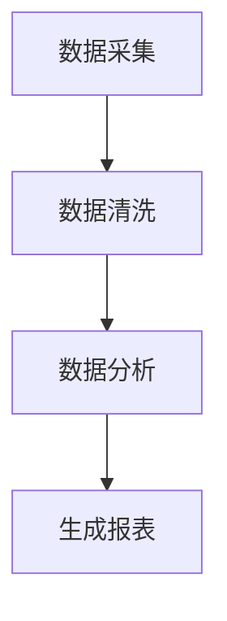
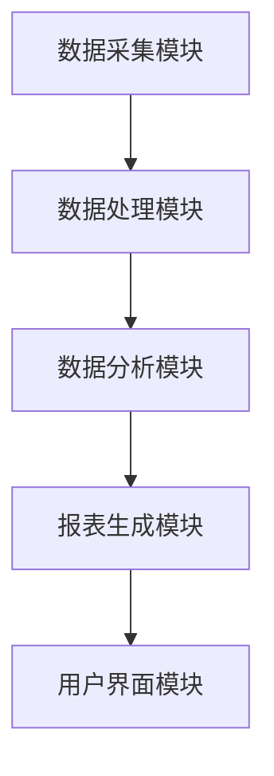

                 


# 智能化的企业财务报表生成系统

## 关键词：智能化财务报表生成，人工智能，机器学习，自然语言处理，数据处理，系统架构设计

## 摘要： 
智能化企业财务报表生成系统结合了人工智能技术，旨在实现财务报表的自动生成，减少人工干预，提高效率和准确性。本文从问题背景、核心概念、算法原理、系统架构设计、项目实战到最佳实践，全面阐述了智能化财务报表生成系统的构建过程。通过详细的理论分析和实际案例，展示了如何利用自然语言处理和机器学习模型来实现高效的财务数据处理和报表生成。

---

# 第一部分: 智能化企业财务报表生成系统概述

## 第1章: 问题背景与解决思路

### 1.1 问题背景
#### 1.1.1 传统财务报表生成的痛点
传统的财务报表生成过程依赖于人工操作，存在以下问题：
- 数据采集和处理效率低，容易出错。
- 报表格式标准化要求高，人工操作难以保证一致性。
- 人工生成报表耗时长，且容易受到主观因素影响。

#### 1.1.2 企业对智能化财务报表的需求
企业对智能化财务报表生成系统的需求主要体现在以下几个方面：
- 提高数据处理和报表生成的效率。
- 减少人为错误，确保数据的准确性和一致性。
- 实现财务数据的自动化分析和预测，为企业决策提供支持。

#### 1.1.3 智能化财务报表生成的边界与外延
智能化财务报表生成系统的边界主要集中在数据采集、处理、分析和生成环节，而系统的外延则包括与企业其他系统的集成，如ERP系统、数据仓库等。

### 1.2 问题描述
#### 1.2.1 财务数据采集与处理的复杂性
财务数据来源多样，包括ERP系统、财务软件、电子表格等，数据格式和结构差异大，导致数据采集和处理过程复杂。

#### 1.2.2 财务报表生成的标准化要求
财务报表需要遵循一定的格式和规范，如会计准则、行业标准等，这增加了报表生成的复杂性。

#### 1.2.3 人工操作的低效与错误率问题
人工操作不仅效率低，还容易出现错误，特别是在处理大量数据时，错误率难以控制。

### 1.3 问题解决思路
#### 1.3.1 智能化财务报表生成的核心目标
通过引入人工智能技术，实现财务数据的自动采集、处理、分析和报表生成，提高效率和准确性。

#### 1.3.2 系统实现的关键技术与方法
- 自然语言处理（NLP）技术用于文本数据的解析和处理。
- 机器学习模型用于数据预测和生成。
- 数据挖掘技术用于发现数据中的潜在规律。

#### 1.3.3 边界与可行性分析
系统边界主要集中在数据处理和报表生成环节，与其他系统的集成通过API或中间件实现。系统的可行性分析包括技术可行性、经济可行性和操作可行性。

### 1.4 本章小结
本章从问题背景、问题描述和解决思路三个方面，详细阐述了智能化财务报表生成系统的必要性和实现路径。

---

## 第2章: 核心概念与原理

### 2.1 核心概念解析
#### 2.1.1 智能化财务报表生成系统的组成模块
- 数据采集模块：负责从多种数据源采集财务数据。
- 数据处理模块：对采集到的数据进行清洗、转换和标准化处理。
- 数据分析模块：利用机器学习模型对数据进行分析和预测。
- 报表生成模块：根据分析结果生成标准化的财务报表。

#### 2.1.2 各模块之间的关系与作用
通过表格形式展示各模块之间的关系和作用：

| 模块 | 输入 | 输出 | 功能描述 |
|------|------|------|----------|
| 数据采集 | 各种数据源 | 清洗后的数据 | 从多种数据源采集财务数据并进行初步清洗 |
| 数据处理 | 清洗后的数据 | 标准化的数据 | 对数据进行格式转换和标准化处理 |
| 数据分析 | 标准化的数据 | 分析结果 | 利用机器学习模型对数据进行分析和预测 |
| 报表生成 | 分析结果 | 标准化报表 | 根据分析结果生成标准化的财务报表 |

### 2.2 数据流与信息处理流程
#### 2.2.1 数据采集与预处理
- 数据采集：从ERP系统、财务软件等数据源采集财务数据。
- 数据清洗：去除重复数据、处理缺失值和异常值。

#### 2.2.2 数据分析与特征提取
- 数据分析：利用机器学习模型对数据进行分析，提取关键特征。
- 特征提取：从数据中提取有助于模型预测的关键特征。

#### 2.2.3 数据生成与输出
- 报表生成：根据分析结果生成标准化的财务报表。
- 输出：将生成的报表输出到指定的格式或系统中。

### 2.3 核心算法与数学模型
#### 2.3.1 自然语言处理在财务报表生成中的应用
- 文本解析：利用NLP技术对财务文本进行解析，提取关键信息。
- 文本生成：利用NLP模型生成财务报表的文本内容。

#### 2.3.2 基于机器学习的预测与生成模型
- 预测模型：利用回归、分类等机器学习算法对财务数据进行预测。
- 生成模型：利用生成对抗网络（GAN）等模型生成财务报表内容。

#### 2.3.3 算法流程图（使用 Mermaid）


#### 2.3.4 算法实现代码示例
```python
import pandas as pd
from sklearn.model import LinearRegression

# 数据采集
data = pd.read_csv('financial_data.csv')

# 数据清洗
data.dropna(inplace=True)

# 数据分析
model = LinearRegression()
model.fit(data[['revenue', 'profit']], data['预测值'])

# 生成报表
predictions = model.predict(data[['revenue', 'profit']])
```

#### 2.3.5 数学模型与公式
- 预测模型的数学公式：
  $$ y = \beta_0 + \beta_1x_1 + \beta_2x_2 + \epsilon $$
- 生成模型的数学公式：
  $$ p = G(z) $$
  其中，\( z \) 是输入，\( G \) 是生成器网络。

### 2.4 系统架构与设计原则
#### 2.4.1 模块化设计原则
- 模块划分：系统划分为数据采集、数据处理、数据分析和报表生成四个模块。
- 模块交互：模块之间通过接口进行数据传递和交互。

#### 2.4.2 高可用性与可扩展性要求
- 高可用性：系统需要具备容错和冗余能力，确保在部分模块故障时仍能正常运行。
- 可扩展性：系统设计应支持模块的扩展和升级。

#### 2.4.3 安全性与数据隐私保护
- 数据安全：系统需要具备数据加密和访问控制功能，确保数据安全。
- 隐私保护：系统设计应遵循数据隐私保护法规，确保用户数据隐私。

### 2.5 本章小结
本章详细阐述了智能化财务报表生成系统的核心概念、数据流与信息处理流程、核心算法与数学模型，以及系统架构与设计原则。

---

## 第3章: 系统分析与架构设计

### 3.1 系统功能模块划分
#### 3.1.1 数据采集模块
- 功能描述：从多种数据源采集财务数据。
- 输入：数据源配置信息。
- 输出：清洗后的数据。

#### 3.1.2 数据处理模块
- 功能描述：对数据进行清洗、转换和标准化处理。
- 输入：清洗后的数据。
- 输出：标准化数据。

#### 3.1.3 数据分析模块
- 功能描述：利用机器学习模型对数据进行分析和预测。
- 输入：标准化数据。
- 输出：分析结果。

#### 3.1.4 报表生成模块
- 功能描述：根据分析结果生成标准化的财务报表。
- 输入：分析结果。
- 输出：标准化报表。

#### 3.1.5 用户界面模块
- 功能描述：提供用户友好的操作界面。
- 输入：用户操作指令。
- 输出：系统响应。

### 3.2 系统架构设计
#### 3.2.1 分层架构设计
- 分层结构：系统划分为数据层、业务逻辑层和表现层。
- 每层功能：
  - 数据层：负责数据的存储和管理。
  - 业务逻辑层：负责业务逻辑的实现。
  - 表现层：负责用户界面的展示和交互。

#### 3.2.2 微服务架构设计
- 模块划分：系统划分为多个微服务模块，每个模块负责特定的功能。
- 模块交互：模块之间通过API进行交互。

#### 3.2.3 数据库设计与优化
- 数据库选型：根据系统需求选择合适的数据库，如关系型数据库或NoSQL数据库。
- 数据库优化：通过索引优化、查询优化等技术提高数据库性能。

### 3.3 系统接口设计
#### 3.3.1 接口定义
- 数据采集模块接口：定义数据采集的API接口。
- 数据处理模块接口：定义数据处理的API接口。
- 数据分析模块接口：定义数据分析的API接口。
- 报表生成模块接口：定义报表生成的API接口。

#### 3.3.2 接口交互流程
- 数据采集模块通过API接口向数据处理模块传递清洗后的数据。
- 数据处理模块通过API接口向数据分析模块传递标准化数据。
- 数据分析模块通过API接口向报表生成模块传递分析结果。
- 报表生成模块通过API接口向用户界面模块传递生成的报表。

### 3.4 系统交互流程图（使用 Mermaid）


### 3.5 本章小结
本章详细介绍了智能化财务报表生成系统的功能模块划分、系统架构设计和接口设计，为系统的实现奠定了基础。

---

## 第4章: 项目实战

### 4.1 环境安装与配置
#### 4.1.1 安装Python环境
- 安装Python：建议使用Anaconda或miniconda。
- 安装必要的库：如pandas、numpy、scikit-learn、tensorflow等。

#### 4.1.2 安装数据库
- 选择数据库：如MySQL、PostgreSQL、MongoDB等。
- 安装数据库：根据选择的数据库类型安装相应的数据库软件。

### 4.2 系统核心实现
#### 4.2.1 数据采集模块实现
- 数据采集代码示例：
  ```python
  import pandas as pd
  def data_collection():
      # 从CSV文件中读取数据
      data = pd.read_csv('financial_data.csv')
      return data
  ```

#### 4.2.2 数据处理模块实现
- 数据处理代码示例：
  ```python
  def data_processing(data):
      # 删除缺失值
      data.dropna(inplace=True)
      # 数据标准化
      from sklearn.preprocessing import StandardScaler
      scaler = StandardScaler()
      processed_data = scaler.fit_transform(data)
      return processed_data
  ```

#### 4.2.3 数据分析模块实现
- 数据分析代码示例：
  ```python
  def data_analysis(processed_data):
      from sklearn.linear_model import LinearRegression
      model = LinearRegression()
      model.fit(processed_data[:, :-1], processed_data[:, -1])
      return model
  ```

#### 4.2.4 报表生成模块实现
- 报表生成代码示例：
  ```python
  def report_generation(model):
      predictions = model.predict(new_data)
      # 生成报表
      report = {
          '预测值': predictions.tolist()
      }
      return report
  ```

### 4.3 实际案例分析与解读
#### 4.3.1 案例背景
- 案例背景：某企业需要生成月度财务报表，数据来源包括销售数据、成本数据等。

#### 4.3.2 数据处理与分析
- 数据采集：从ERP系统中采集销售数据和成本数据。
- 数据处理：清洗数据并进行标准化处理。
- 数据分析：利用机器学习模型预测下个月的销售额和利润。

#### 4.3.3 报表生成
- 根据分析结果生成月度财务报表，包括销售额、利润、成本等关键指标。

### 4.4 项目小结
本章通过实际案例，详细展示了智能化财务报表生成系统的实现过程，包括环境配置、模块实现和案例分析。

---

## 第5章: 最佳实践与总结

### 5.1 最佳实践
#### 5.1.1 小结
- 系统设计：模块化设计和微服务架构是系统实现的关键。
- 技术选型：选择合适的数据库和机器学习模型是系统性能的关键。
- 接口设计：良好的接口设计是系统扩展和维护的基础。

#### 5.1.2 注意事项
- 数据安全：确保系统数据的安全性和隐私性。
- 系统性能：优化系统性能，确保系统的高效运行。
- 系统维护：定期维护和升级系统，确保系统的稳定性和先进性。

#### 5.1.3 拓展阅读
- 推荐阅读相关书籍和论文，深入了解机器学习和自然语言处理在财务领域的应用。

### 5.2 本章小结
本章总结了智能化财务报表生成系统的最佳实践，包括系统设计、技术选型和接口设计等方面的注意事项，并提出了拓展阅读的方向。

---

# 作者：AI天才研究院/AI Genius Institute & 禅与计算机程序设计艺术 /Zen And The Art of Computer Programming

