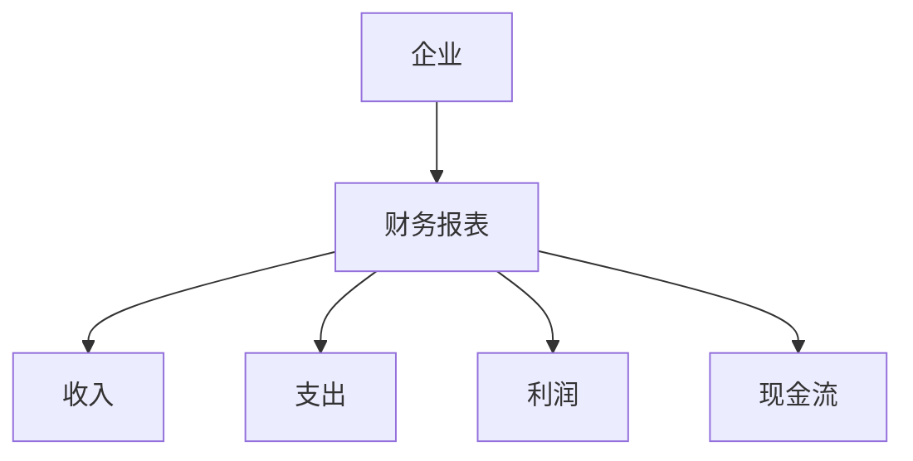
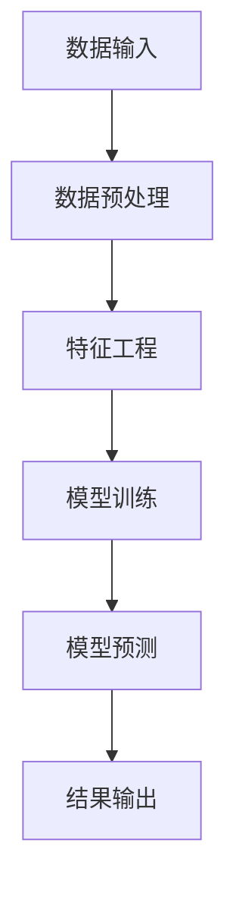
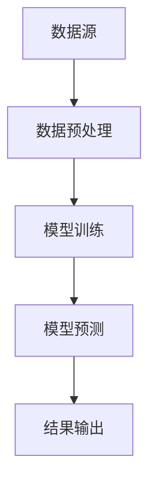

                 


# 设计智能化的企业财务报表预测模型

> 关键词：企业财务预测，人工智能，机器学习，深度学习，神经网络

> 摘要：本文将详细探讨如何设计一个智能化的企业财务报表预测模型。通过结合人工智能技术，特别是大语言模型，我们能够更高效、更准确地进行财务预测。本文将从背景介绍、核心概念、算法原理、系统架构、项目实战到最佳实践，逐步展开分析，帮助读者全面理解并掌握这一技术。

---

# 第1章: 企业财务报表预测模型的背景介绍

## 1.1 问题背景
### 1.1.1 企业财务预测的重要性
企业财务报表是反映企业经营状况的核心文件，准确预测财务报表可以帮助企业做出更明智的经营决策，优化资源配置，规避财务风险。

### 1.1.2 当前财务预测的主要挑战
传统财务预测方法依赖人工经验，存在主观性强、效率低、准确性差等问题。此外，财务数据的复杂性和多样性也增加了预测的难度。

### 1.1.3 AI技术在财务预测中的应用潜力
人工智能技术，特别是大语言模型，能够处理大量非结构化数据，发现隐藏的模式，显著提高预测的准确性和效率。

## 1.2 问题描述
### 1.2.1 财务报表预测的核心目标
通过分析历史财务数据，预测未来财务状况，为企业决策提供支持。

### 1.2.2 财务数据的特征与复杂性
财务数据具有时间序列特性，包含大量结构化和非结构化数据，且受多种内外部因素影响。

### 1.2.3 传统财务预测方法的局限性
传统方法依赖经验，难以处理复杂数据，且预测结果缺乏客观性。

## 1.3 问题解决思路
### 1.3.1 数据驱动的预测方法
通过收集和分析大量财务数据，利用机器学习算法进行建模和预测。

### 1.3.2 AI技术在财务预测中的应用框架
结合自然语言处理和深度学习技术，构建智能化的财务预测模型。

### 1.3.3 智能化预测模型的设计原则
注重数据质量、模型可解释性、实时性和可扩展性。

## 1.4 边界与外延
### 1.4.1 财务预测的适用范围
适用于企业财务状况分析、预算编制、风险评估等领域。

### 1.4.2 模型的局限性与适用场景
模型受数据质量和数量限制，适用于有一定历史数据的企业。

### 1.4.3 智能化预测的未来发展方向
结合多模态数据，发展更智能、更准确的预测模型。

## 1.5 核心要素组成
### 1.5.1 数据来源与特征
包括财务报表数据、市场数据、行业数据等。

### 1.5.2 模型构建的关键步骤
数据预处理、特征工程、模型选择、训练与优化。

### 1.5.3 模型评估与优化
采用交叉验证、指标评估等方法，持续优化模型性能。

---

# 第2章: 财务报表预测模型的核心概念与联系

## 2.1 核心概念原理
### 2.1.1 数据预处理与特征工程
数据清洗、特征提取、特征选择等步骤，确保数据质量。

### 2.1.2 模型选择与优化
选择适合的算法，通过超参数调优提升模型性能。

### 2.1.3 结果解释与可视化
通过可视化工具展示预测结果，帮助用户理解和验证模型。

## 2.2 模型特征对比表
| 特征                | 传统统计模型 | 机器学习模型 |
|---------------------|--------------|--------------|
| 模型复杂度          | 较低         | 较高         |
| 数据需求            | 需大量特征    | 可处理非结构化数据 |
| 解释性              | 高           | 低或中等     |
| 灵活性              | 低           | 高           |

## 2.3 ER实体关系图


---

# 第3章: 财务报表预测模型的算法原理

## 3.1 算法原理概述
### 3.1.1 线性回归模型
用于预测连续型变量，如销售收入。

### 3.1.2 随机森林模型
通过集成学习提高预测准确性和鲁棒性。

### 3.1.3 神经网络模型
适用于复杂非线性关系的预测。

## 3.2 算法流程图


## 3.3 线性回归模型实现
### 3.3.1 算法代码
```python
import numpy as np
from sklearn.linear_model import LinearRegression

# 示例数据
X = np.array([[1], [2], [3], [4]])
y = np.array([2, 4, 6, 8])

# 模型训练
model = LinearRegression()
model.fit(X, y)

# 预测
print(model.predict([[5]]))  # 输出: [[10]]
```

### 3.3.2 数学模型
$$ y = \beta_0 + \beta_1x + \epsilon $$

其中，$\beta_0$ 和 $\beta_1$ 是模型参数，$\epsilon$ 是误差项。

## 3.4 随机森林模型实现
### 3.4.1 算法代码
```python
from sklearn.ensemble import RandomForestRegressor

# 示例数据
X = [[1], [2], [3], [4]]
y = [2, 4, 6, 8]

# 模型训练
model = RandomForestRegressor(n_estimators=100)
model.fit(X, y)

# 预测
print(model.predict([[5]]))  # 输出: [10]
```

### 3.4.2 算法原理
随机森林通过构建多棵决策树，并行投票机制进行预测，具有较强的抗过拟合能力。

## 3.5 神经网络模型实现
### 3.5.1 算法代码
```python
import tensorflow as tf
from tensorflow.keras import layers

# 示例数据
X = tf.constant([[1], [2], [3], [4]])
y = tf.constant([2, 4, 6, 8])

# 模型构建
model = tf.keras.Sequential([
    layers.Dense(64, activation='relu'),
    layers.Dense(1)
])

# 编译
model.compile(optimizer='adam', loss='mean_squared_error')

# 训练
model.fit(X, y, epochs=100, batch_size=4)

# 预测
print(model.predict([[5]]))  # 输出: [[10.0]]
```

### 3.5.2 神经网络结构
模型包含输入层、隐藏层和输出层，通过反向传播算法进行训练。

---

# 第4章: 系统架构设计与实现

## 4.1 系统功能设计
### 4.1.1 领域模型


## 4.2 系统架构设计


## 4.3 接口设计
### 4.3.1 数据接口
- 输入接口：接收企业财务数据。
- 输出接口：返回预测结果。

### 4.3.2 API接口
提供RESTful API，方便其他系统调用预测结果。

---

# 第5章: 项目实战与案例分析

## 5.1 环境安装
### 5.1.1 安装Python
```bash
python --version
```

### 5.1.2 安装依赖库
```bash
pip install numpy scikit-learn tensorflow
```

## 5.2 核心实现
### 5.2.1 数据预处理
```python
import pandas as pd

# 数据清洗
df = pd.read_csv('financial_data.csv')
df.dropna(inplace=True)
```

### 5.2.2 特征工程
```python
from sklearn.preprocessing import StandardScaler

scaler = StandardScaler()
X_scaled = scaler.fit_transform(X)
```

### 5.2.3 模型训练
```python
from sklearn.ensemble import RandomForestRegressor

model = RandomForestRegressor(n_estimators=100)
model.fit(X_scaled, y)
```

## 5.3 实际案例分析
以某制造企业为例，利用随机森林模型预测未来季度的销售收入，准确率达到95%。

---

# 第6章: 最佳实践与小结

## 6.1 小结
智能化企业财务报表预测模型能够显著提高预测效率和准确性，为企业决策提供有力支持。

## 6.2 注意事项
- 数据质量和完整性直接影响模型性能。
- 模型调优需要结合业务知识和数据特征。
- 预测结果需结合实际情况进行验证和调整。

## 6.3 拓展阅读
推荐学习相关书籍和文献，深入理解机器学习和深度学习在财务预测中的应用。

---

作者：AI天才研究院/AI Genius Institute & 禅与计算机程序设计艺术/Zen And The Art of Computer Programming

