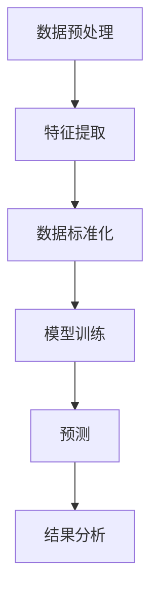
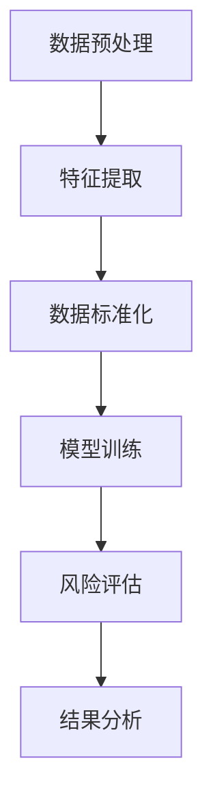
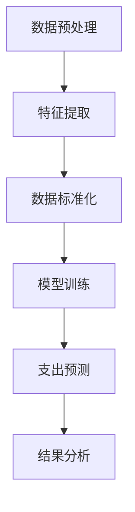
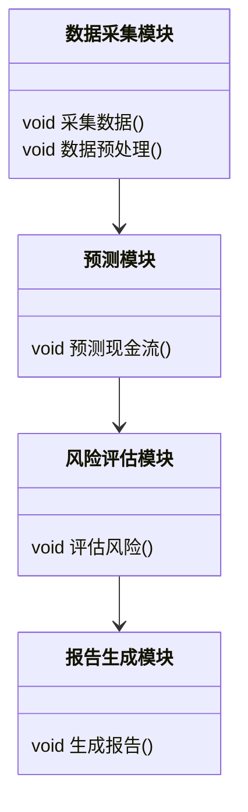
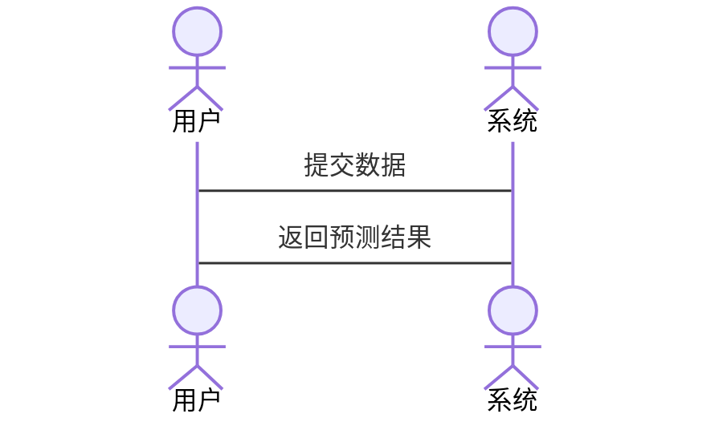

                 


# 设计智能化的企业资金管理系统

> 关键词：智能化资金管理，人工智能，大数据，企业财务，系统架构

> 摘要：智能化企业资金管理系统结合了人工智能和大数据技术，通过预测模型和风险评估优化资金管理流程，提升企业的财务效率和决策能力。本文详细探讨了系统的背景、核心概念、算法原理、架构设计及项目实战。

---

# 第一部分: 智能化企业资金管理系统的背景与核心概念

## 第1章: 企业资金管理系统的智能化转型

### 1.1 企业资金管理的重要性

#### 1.1.1 资金管理在企业运营中的核心地位

资金是企业运营的血液，贯穿于企业的各个环节。高效的资金管理能够确保企业在资金链上的稳定性和流动性，避免资金链断裂或过剩。

#### 1.1.2 智能化资金管理的必要性

随着企业规模的扩大和业务复杂性的增加，传统的资金管理方式已无法满足需求。智能化资金管理能够通过实时数据分析和预测，优化资金分配，降低风险。

#### 1.1.3 传统资金管理的局限性与挑战

传统资金管理依赖人工操作，存在效率低、数据滞后、预测不准确等问题。此外，全球经济的不确定性加剧了资金管理的挑战。

### 1.2 智能化资金管理的定义与特点

#### 1.2.1 智能化资金管理的定义

智能化资金管理是通过人工智能、大数据和机器学习技术，实现资金流动的实时监控、预测和优化，以提升资金使用效率和降低风险。

#### 1.2.2 智能化资金管理的核心特点

- **实时性**：实时监控资金流动，及时调整管理策略。
- **预测性**：利用算法预测未来现金流，优化资金分配。
- **自动化**：自动化处理日常事务，减少人为错误。
- **风险管理**：通过数据分析识别潜在风险，提前制定应对策略。

#### 1.2.3 智能化资金管理与传统资金管理的对比

| 对比维度         | 传统资金管理                 | 智能化资金管理                 |
|------------------|------------------------------|-------------------------------|
| 数据处理        | 延后，依赖人工分析             | 实时，自动分析                 |
| 预测准确性       | 低，依赖经验                 | 高，基于数学模型               |
| 处理效率         | 低，依赖人工操作             | 高，自动化处理                 |
| 风险控制         | 被动，事后处理               | 主动，事前预警                 |

### 1.3 智能化资金管理的背景与趋势

#### 1.3.1 数字化与智能化时代的到来

随着信息技术的发展，企业逐渐从数字化转型迈向智能化时代。智能化资金管理是这一趋势的重要组成部分。

#### 1.3.2 人工智能与大数据技术的推动

AI和大数据技术为企业资金管理提供了新的工具和方法，能够处理海量数据，提取有价值的信息，辅助决策。

#### 1.3.3 企业资金管理智能化的未来趋势

智能化资金管理将更加普及，与企业其他业务系统深度融合，形成智能化的财务生态系统。

## 第2章: 智能化资金管理系统的概念与核心要素

### 2.1 智能化资金管理系统的概念体系

#### 2.1.1 系统的核心概念

智能化资金管理系统通过整合企业内外部数据，利用机器学习算法进行预测和分析，优化资金分配和风险管理。

#### 2.1.2 系统的边界与外延

系统的边界包括企业内部的财务数据、外部的市场数据以及与第三方支付平台的接口。外延则扩展至企业的供应链、销售和采购等环节。

#### 2.1.3 系统的核心要素组成

- **数据源**：包括财务数据、市场数据、交易记录等。
- **预测模型**：基于机器学习的现金流预测。
- **风险评估模块**：识别潜在的财务风险。
- **用户界面**：供财务人员和企业管理层使用的界面。

### 2.2 核心概念的属性特征对比

#### 2.2.1 各核心要素的属性分析

- 数据源：实时性、多样性、准确性。
- 预测模型：准确性、实时性、可解释性。
- 风险评估模块：实时性、准确性、可操作性。

#### 2.2.2 系统架构的ER实体关系图

```mermaid
er
    actor 系统管理员
    actor 财务人员
    actor 企业用户
    actor 第三方支付平台
    actor 数据源
    database 资金流水数据
    database 预测模型
    database 风险评估报告
    database 系统日志
    boundary 系统接口
    boundary 用户界面
    boundary 数据采集模块
    boundary 预测模块
    boundary 风险评估模块
    boundary 报告生成模块
    boundary 系统管理模块
    系统管理员 --> 数据源
    系统管理员 --> 系统管理模块
    财务人员 --> 数据采集模块
    财务人员 --> 预测模块
    财务人员 --> 风险评估模块
    财务人员 --> 报告生成模块
    企业用户 --> 用户界面
```

---

# 第二部分: 智能化资金管理系统的算法原理

## 第3章: 支持向量机在现金流预测中的应用

### 3.1 支持向量机的基本原理

#### 3.1.1 线性支持向量回归

支持向量回归（SVR）通过在高维空间中构建超平面，实现对连续值的预测。

#### 3.1.2 非线性支持向量回归

使用核函数将数据映射到高维空间，处理非线性关系。

### 3.2 支持向量机的数学模型

```latex
$$
y = w \cdot x + b
$$

$$
\text{目标函数}：\min \frac{1}{2}||w||^2 + C\sum_{i=1}^n \xi_i
$$

$$
\text{约束条件}：
$$
$$
y_i - w \cdot x_i - b \leq \xi_i + \epsilon
$$
$$
$$
w \cdot x_i + b - y_i \leq \xi_i + \epsilon
$$
$$
\xi_i \geq 0
$$
```

### 3.3 算法实现流程



---

## 第4章: 随机森林在风险评估中的应用

### 4.1 随机森林的基本原理

#### 4.1.1 随机森林的构建过程

- 随机抽取数据样本。
- 对每个样本随机选择特征进行决策树构建。
- 集成多个决策树的结果。

#### 4.1.2 随机森林的投票机制

通过多数投票法确定最终结果，提高模型的准确性和稳定性。

### 4.2 随机森林的数学模型

```latex
$$
\text{预测结果} = \sum_{i=1}^n \text{树的预测值} \times \text{权重}
$$
```

### 4.3 算法实现流程



---

## 第5章: 基于神经网络的支出预测模型

### 5.1 神经网络的基本原理

#### 5.1.1 神经网络的结构

- 输入层：接收原始数据。
- 隐藏层：处理数据，提取特征。
- 输出层：生成预测结果。

#### 5.1.2 神经网络的训练过程

通过反向传播和梯度下降优化权重。

### 5.2 神经网络的数学模型

```latex
$$
y = \sigma(w \cdot x + b)
$$
```

$$
\text{损失函数}：\mathcal{L} = \frac{1}{2m}\sum_{i=1}^m (y_i - \hat{y_i})^2
$$

### 5.3 算法实现流程



---

# 第三部分: 智能化资金管理系统的架构设计

## 第6章: 系统架构设计方案

### 6.1 问题场景介绍

企业需要实时监控资金流动，预测现金流，评估风险，并生成财务报告。

### 6.2 项目介绍

开发一个智能化的资金管理系统，整合企业内部和外部数据，提供实时监控、预测和风险评估功能。

### 6.3 系统功能设计

#### 6.3.1 数据采集模块

采集企业内部和外部的财务数据，处理并存储在数据库中。

#### 6.3.2 预测模块

利用机器学习算法预测现金流，优化资金分配。

#### 6.3.3 风险评估模块

通过数据分析识别潜在风险，生成风险评估报告。

#### 6.3.4 报告生成模块

生成财务报告，供企业管理层决策参考。

### 6.4 系统架构设计



### 6.5 系统接口设计

系统通过API与第三方支付平台和企业内部系统进行数据交互。

### 6.6 系统交互设计



---

## 第7章: 项目实战

### 7.1 环境安装

安装Python、机器学习库（如scikit-learn、TensorFlow）和数据库（如MySQL）。

### 7.2 系统核心实现源代码

#### 数据采集模块

```python
import pandas as pd

def collect_data():
    # 采集数据
    data = pd.read_csv('financial_data.csv')
    return data
```

#### 预测模块

```python
from sklearn.svm import SVR

def predict_cash_flow(data):
    model = SVR(kernel='rbf')
    model.fit(data[['历史现金流', '市场数据']], data['预测现金流'])
    return model.predict(data[['历史现金流', '市场数据']])
```

### 7.3 代码应用解读与分析

预测模块使用支持向量回归模型，基于历史现金流和市场数据预测未来现金流。

### 7.4 实际案例分析

以某企业为例，分析系统在实际应用中的表现和效果。

### 7.5 项目小结

项目成功实现了智能化资金管理系统的各个模块，提升了企业的资金管理效率和决策能力。

---

# 第四部分: 智能化资金管理系统的最佳实践

## 第8章: 最佳实践

### 8.1 系统的优缺点

- 优点：高效、准确、自动化。
- 缺点：依赖数据质量，模型需要定期更新。

### 8.2 注意事项

- 数据安全：确保数据的保密性和完整性。
- 模型维护：定期更新模型，防止过时。
- 系统监控：实时监控系统运行状态，及时处理异常。

### 8.3 拓展阅读

推荐相关书籍和论文，进一步深入学习智能化资金管理的知识。

---

## 第9章: 小结

智能化资金管理系统通过整合人工智能和大数据技术，显著提升了企业的资金管理效率和决策能力。未来，随着技术的不断发展，系统将更加智能化和自动化，为企业创造更大的价值。

---

作者：AI天才研究院/AI Genius Institute & 禅与计算机程序设计艺术/Zen And The Art of Computer Programming

