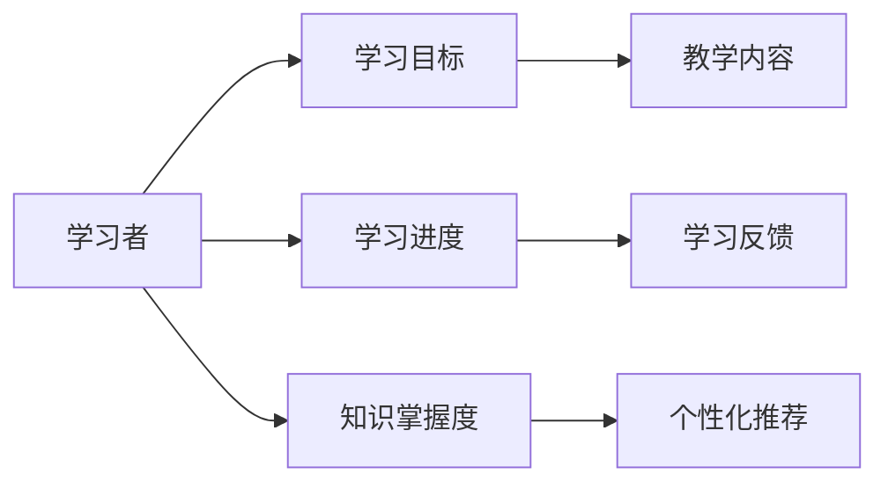

                 

# 《语言学习AI Agent：个性化外语教学助手》

---

## 关键词：
语言学习、AI Agent、个性化教学、自然语言处理、自适应学习、机器学习

---

## 摘要：
本文深入探讨了语言学习AI Agent的设计与实现，结合背景分析、核心概念、算法原理、系统架构和项目实战，全面解析了如何利用AI技术构建个性化外语教学助手。文章从语言学习的现状与挑战出发，结合AI技术的最新进展，详细阐述了AI Agent在语言学习中的核心作用，包括自然语言处理、推荐算法、自适应学习等技术。通过实际案例分析和系统设计，本文为教育技术开发者和AI工程师提供了理论基础和实践指导。

---

# 第一部分: 语言学习AI Agent的背景与核心概念

## 第1章: 语言学习AI Agent的背景与问题背景

### 1.1 语言学习的现状与挑战
#### 1.1.1 当前语言学习的主要问题
- 学习者个体差异大，传统教学难以满足个性化需求。
- 学习资源繁多，学习者难以选择适合自己的内容。
- 缺乏实时反馈，学习效果难以量化和优化。

#### 1.1.2 个性化学习的重要性
- 学习者的学习目标、学习风格和知识基础各不相同。
- 个性化学习能够提高学习效率和学习效果。
- 个性化学习是现代教育技术的核心趋势之一。

#### 1.1.3 AI技术在语言学习中的应用潜力
- AI技术能够通过数据分析和模式识别，为学习者提供个性化的学习建议。
- 自然语言处理技术能够帮助学习者提高语言理解和表达能力。
- 机器学习算法能够根据学习者的行为数据，动态调整教学策略。

### 1.2 AI在教育领域的应用现状
#### 1.2.1 AI在语言学习中的应用案例
- 智能对话系统（如语言学习App中的虚拟对话伙伴）。
- 基于自然语言处理的语法纠错工具。
- 基于机器学习的个性化推荐系统。

#### 1.2.2 AI技术对语言学习的潜在影响
- 提高学习效率，降低学习成本。
- 为学习者提供更灵活和多样化的学习方式。
- 支持教师进行更精准的教学设计和反馈。

#### 1.2.3 当前AI语言学习工具的局限性
- 数据不足或数据质量问题导致推荐不准确。
- 自然语言处理技术的局限性影响用户体验。
- 缺乏对学习者情感和动机的深度理解。

### 1.3 个性化外语教学的需求分析
#### 1.3.1 学习者的个性化需求
- 学习目标的多样性（如旅游、工作、学术等）。
- 学习风格的多样性（如视觉型、听觉型、动手型）。
- 知识基础的多样性。

#### 1.3.2 不同语言学习者的特征分析
- 初级学习者：需要基础语法和词汇的强化。
- 中级学习者：需要提高语感和表达能力。
- 高级学习者：需要拓展专业领域知识。

#### 1.3.3 个性化教学的目标与边界
- 目标：通过AI技术实现精准的个性化教学。
- 边界：避免过度依赖技术，保持教学的人文关怀。

### 1.4 本章小结
本章通过分析语言学习的现状和挑战，探讨了AI技术在语言学习中的应用潜力，明确了个性化外语教学的需求和目标。

---

## 第2章: 语言学习AI Agent的核心概念与联系

### 2.1 AI Agent的基本原理
#### 2.1.1 AI Agent的定义与特征
- AI Agent是一种智能体，能够感知环境并采取行动以实现目标。
- 语言学习AI Agent的核心特征包括：学习能力、适应性、交互性。

#### 2.1.2 语言学习AI Agent的核心要素
- 学习者模型：基于学习者的特征和行为数据，构建个性化学习者画像。
- 知识库：包含语言学习相关的内容，如语法、词汇、语料库。
- 推荐算法：根据学习者的需求和特征，推荐合适的学习资源和路径。
- 交互界面：提供友好的人机交互界面，支持多种输入和输出方式。

#### 2.1.3 AI Agent与传统教学工具的对比
| 特性             | AI Agent               | 传统教学工具         |
|------------------|------------------------|----------------------|
| 个性化能力       | 高                     | 低                   |
| 适应性           | 高                     | 低                   |
| 数据处理能力     | 强                     | 弱                   |
| 反馈机制         | 实时                   | 延时                 |

---

### 2.2 核心概念的属性特征对比
#### 2.2.1 学习者特征的属性对比
| 属性             | 初级学习者         | 中级学习者         | 高级学习者         |
|------------------|--------------------|--------------------|--------------------|
| 学习目标         | 基础语法和词汇     | 提高语感和表达能力 | 拓展专业领域知识   |
| 学习风格         | 以听觉和视觉为主    | 以实践为主         | 以自主学习为主     |

#### 2.2.2 教学内容的属性对比
| 内容类型         | 语法               | 词汇               | 语料库             |
|------------------|--------------------|--------------------|--------------------|
| 适用阶段         | 初级和中级         | 各阶段             | 高级               |

#### 2.2.3 AI Agent行为模式的属性对比
| 行为模式         | 基于规则的推荐     | 基于数据的推荐     | 基于反馈的推荐     |
|------------------|--------------------|--------------------|--------------------|
| 适用场景         | 简单需求           | 复杂需求           | 动态需求           |

---

### 2.3 实体关系图（ER图）设计

---

### 2.4 语言学习AI Agent的核心算法与模型
#### 2.4.1 基于协同过滤的推荐算法
- **协同过滤**：通过分析学习者的行为数据，找到相似的学习者，推荐相似的学习资源。
- **数学模型**：
  $$ sim(i,j) = \frac{\sum_{k} r_{ik} \cdot r_{jk}}{\sqrt{\sum_{k} r_{ik}^2} \cdot \sqrt{\sum_{k} r_{jk}^2}} $$
  其中，$sim(i,j)$ 表示学习者 $i$ 和 $j$ 的相似度，$r_{ik}$ 表示学习者 $i$ 对资源 $k$ 的评分。

---

## 总结
以上为《语言学习AI Agent：个性化外语教学助手》的目录大纲。后续文章将按照上述结构，逐一展开每个部分的内容，包括算法原理、系统架构设计、项目实战等，帮助读者全面理解如何设计和实现一个高效的个性化语言学习AI Agent。

---

**作者：AI天才研究院/AI Genius Institute & 禅与计算机程序设计艺术 /Zen And The Art of Computer Programming**

