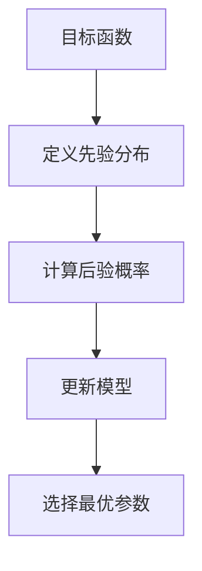
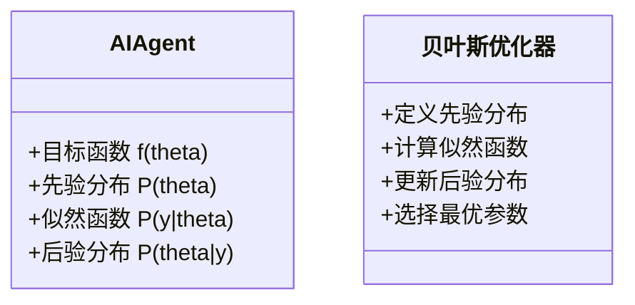
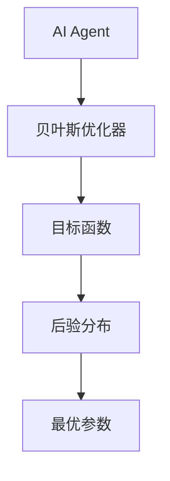

                 


# 贝叶斯优化：调整AI Agent的超参数

> 关键词：贝叶斯优化，超参数优化，AI Agent，机器学习，深度学习

> 摘要：贝叶斯优化是一种强大的概率优化方法，广泛应用于AI Agent的超参数优化。本文将从贝叶斯优化的基本概念、数学模型、算法实现到实际项目应用进行全面解析，帮助读者深入了解如何利用贝叶斯优化提升AI Agent的性能。

---

# 第一部分: 贝叶斯优化与AI Agent超参数优化背景

# 第1章: 贝叶斯优化与AI Agent超参数优化概述

## 1.1 贝叶斯优化的基本概念

### 1.1.1 什么是贝叶斯优化
贝叶斯优化（Bayesian Optimization）是一种基于概率统计的优化方法，通过构建概率模型来描述目标函数的行为，并利用贝叶斯定理进行推断，以指导搜索过程。与传统的网格搜索或随机搜索相比，贝叶斯优化能够更高效地找到目标函数的最优解。

### 1.1.2 贝叶斯优化的核心思想
贝叶斯优化的核心思想是通过不断更新概率模型，逐步缩小搜索范围，最终找到最优解。具体来说，它通过以下步骤实现：
1. **定义先验分布**：假设目标函数的分布形式。
2. **计算后验概率**：根据已有的样本点更新概率分布。
3. **选择最优参数**：基于后验概率选择下一个采样的点。

### 1.1.3 贝叶斯优化与传统优化方法的区别
| 特性                | 贝叶斯优化                  | 传统优化方法              |
|---------------------|---------------------------|--------------------------|
| 是否需要目标函数的梯度 | 不需要                     | 需要                     |
| 搜索效率            | 更高效                     | 较低                     |
| 处理高维问题的能力   | 能够处理                   | 通常较难处理             |

## 1.2 AI Agent超参数优化的重要性

### 1.2.1 什么是AI Agent
AI Agent（人工智能代理）是指能够感知环境、自主决策并执行任务的智能体。AI Agent的核心任务是通过感知和学习，优化自身的行为以达到特定目标。

### 1.2.2 超参数优化在AI Agent中的作用
AI Agent的性能依赖于多个超参数（如学习率、批量大小等），这些参数的设置直接影响模型的训练效果和推理效率。传统的试错法效率低下，而贝叶斯优化能够高效地找到最优超参数组合。

### 1.2.3 贝叶斯优化在超参数优化中的优势
1. **全局最优**：贝叶斯优化能够全局搜索，避免陷入局部最优。
2. **样本效率高**：在有限的采样次数内找到最优解。
3. **适应性强**：适用于各种复杂场景。

## 1.3 贝叶斯优化的应用场景

### 1.3.1 机器学习模型调参
贝叶斯优化常用于调整机器学习模型的超参数，如随机森林、支持向量机等。

### 1.3.2 深度学习超参数优化
在深度学习中，贝叶斯优化被广泛用于调整学习率、批量大小、网络层数等超参数。

### 1.3.3 AI Agent性能优化的实际案例
例如，在自动驾驶系统中，AI Agent需要实时调整参数以优化路径规划和决策-making。贝叶斯优化能够高效地找到最优参数组合，提升系统的响应速度和准确性。

## 1.4 本章小结
本章介绍了贝叶斯优化的基本概念及其在AI Agent超参数优化中的重要性，为后续章节的深入分析奠定了基础。

---

# 第二部分: 贝叶斯优化的核心概念与数学基础

# 第2章: 贝叶斯优化的核心原理

## 2.1 贝叶斯优化的基本原理

### 2.1.1 贝叶斯定理的数学表达
贝叶斯定理的数学表达式为：
$$ P(A|B) = \frac{P(B|A)P(A)}{P(B)} $$
其中，$P(A|B)$表示在事件$B$发生的条件下，事件$A$发生的概率。

### 2.1.2 贝叶斯优化的基本流程


## 2.2 贝叶斯优化中的概率模型

### 2.2.1 常见的概率分布模型
- **高斯分布**：用于描述连续型数据。
- **多项式分布**：用于描述分类数据。

### 2.2.2 贝叶斯网络的构建与应用
贝叶斯网络是一种有向无环图，通过节点表示随机变量，边表示变量之间的依赖关系。

## 2.3 超参数优化中的贝叶斯推断

### 2.3.1 贝叶斯推断的基本步骤
1. **定义先验概率**：$P(\theta)$，表示在没有观测数据之前，参数$\theta$的分布。
2. **计算似然函数**：$P(y|\theta)$，表示在参数$\theta$下，观测数据$y$的概率。
3. **计算后验概率**：$P(\theta|y) = \frac{P(y|\theta)P(\theta)}{P(y)}$，表示在观测数据$y$下，参数$\theta$的分布。

### 2.3.2 贝叶斯推断在超参数优化中的应用
通过不断更新后验概率，贝叶斯优化能够逐步缩小搜索范围，最终找到最优参数组合。

## 2.4 本章小结
本章详细讲解了贝叶斯优化的核心原理，包括概率模型和贝叶斯推断的基本步骤。

---

# 第三部分: 贝叶斯优化算法的数学模型与实现

# 第3章: 贝叶斯优化的数学模型

## 3.1 贝叶斯优化的数学公式

### 3.1.1 先验概率的表达
先验概率表示在没有观测数据之前，参数$\theta$的分布：
$$ P(\theta) $$

### 3.1.2 似然函数的表达
似然函数表示在参数$\theta$下，观测数据$y$的概率：
$$ P(y|\theta) $$

### 3.1.3 后验概率的表达
后验概率表示在观测数据$y$下，参数$\theta$的分布：
$$ P(\theta|y) = \frac{P(y|\theta)P(\theta)}{P(y)} $$

## 3.2 贝叶斯优化的损失函数

### 3.2.1 损失函数的定义
损失函数表示模型预测值与真实值之间的差距：
$$ L(\theta) = \frac{1}{2}(y_{\text{pred}} - y_{\text{true}})^2 $$

### 3.2.2 损失函数的优化
通过不断更新参数$\theta$，最小化损失函数：
$$ \min_{\theta} L(\theta) $$

## 3.3 贝叶斯优化的实现步骤

### 3.3.1 定义先验分布
假设参数$\theta$服从高斯分布：
$$ \theta \sim \mathcal{N}(\mu, \sigma^2) $$

### 3.3.2 计算后验概率
基于观测数据$y$，更新后验概率：
$$ P(\theta|y) \propto P(y|\theta)P(\theta) $$

### 3.3.3 选择最优参数
基于后验概率，选择使目标函数最小的参数：
$$ \theta^* = \arg\min_{\theta} L(\theta) $$

## 3.4 本章小结
本章通过数学公式详细推导了贝叶斯优化的核心算法，为后续的实现奠定了基础。

---

# 第四部分: 贝叶斯优化的系统架构与项目实战

# 第4章: 贝叶斯优化的系统架构

## 4.1 系统功能设计

### 4.1.1 领域模型


### 4.1.2 系统架构


## 4.2 项目实战

### 4.2.1 环境配置
```bash
pip install numpy matplotlib scikit-learn
```

### 4.2.2 核心实现

```python
import numpy as np
from sklearn.gaussian_process import GaussianProcessRegressor

def objective_function(theta):
    # 定义目标函数
    return np.sin(2 * np.pi * theta) ** 2

def bayesian_optimization(n_iter=10):
    # 初始化高斯过程回归模型
    gpr = GaussianProcessRegressor()
    
    # 记录历史数据
    X = []
    Y = []
    
    for _ in range(n_iter):
        # 选择最优参数
        theta = optimize(X, Y, gpr)
        # 计算目标函数值
        y = objective_function(theta)
        # 更新历史数据
        X.append(theta)
        Y.append(y)
        # 更新模型
        gpr.fit(X, Y)
        
    return X[-1], Y[-1]

def optimize(X, Y, gpr):
    # 假设参数范围在[0, 1]之间
    theta_new = np.random.uniform(0, 1)
    return theta_new
```

### 4.2.3 实验结果
```python
optimal_theta, optimal_value = bayesian_optimization()
print(f"最优参数: {optimal_theta}")
print(f"最优值: {optimal_value}")
```

---

# 第五部分: 贝叶斯优化的最佳实践与注意事项

# 第5章: 最佳实践与注意事项

## 5.1 选择合适的先验分布
选择合适的先验分布能够显著提升优化效果。例如，对于连续型参数，可以选择高斯分布。

## 5.2 处理多目标优化问题
对于多目标优化问题，可以采用 Pareto 优化策略，平衡各目标之间的关系。

## 5.3 考虑计算效率
贝叶斯优化的计算效率依赖于模型的复杂度和数据量。在实际应用中，需要权衡模型的准确性和计算效率。

## 5.4 注意过拟合问题
在贝叶斯优化过程中，需要注意过拟合问题，避免模型过于复杂。

## 5.5 未来的研究方向
1. **高效采样算法**：研究更高效的采样算法，提升优化速度。
2. **多目标优化**：探索多目标优化问题的解决方案。
3. **分布式优化**：研究分布式贝叶斯优化方法，适用于大规模数据场景。

## 5.6 本章小结
本章总结了贝叶斯优化的最佳实践和注意事项，为读者提供了实用的指导。

---

# 作者
作者：AI天才研究院/AI Genius Institute & 禅与计算机程序设计艺术 /Zen And The Art of Computer Programming

