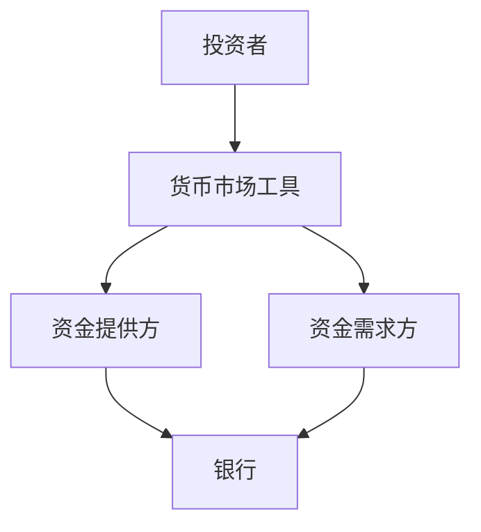
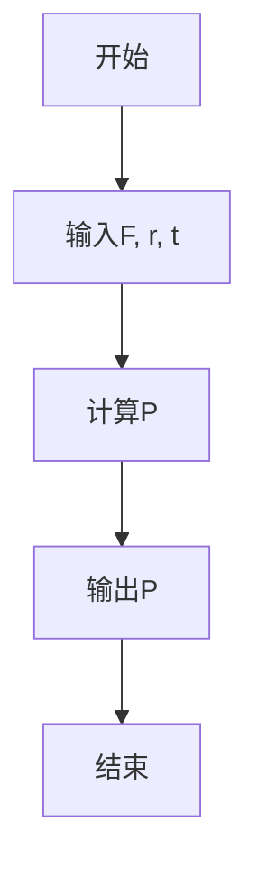
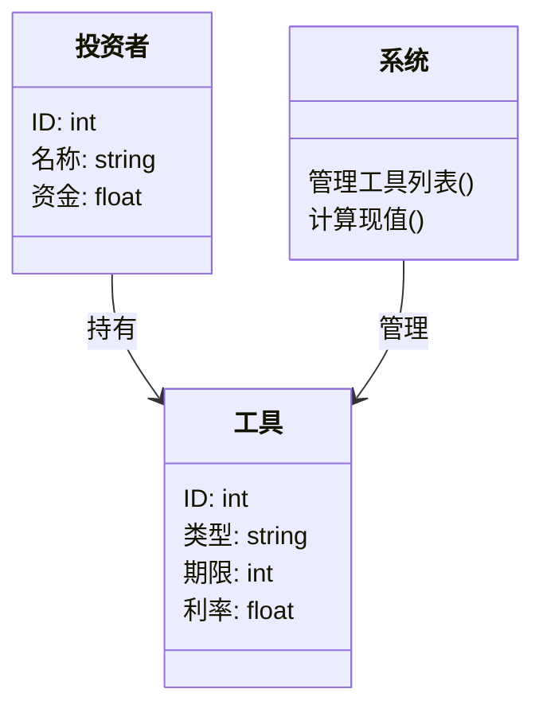
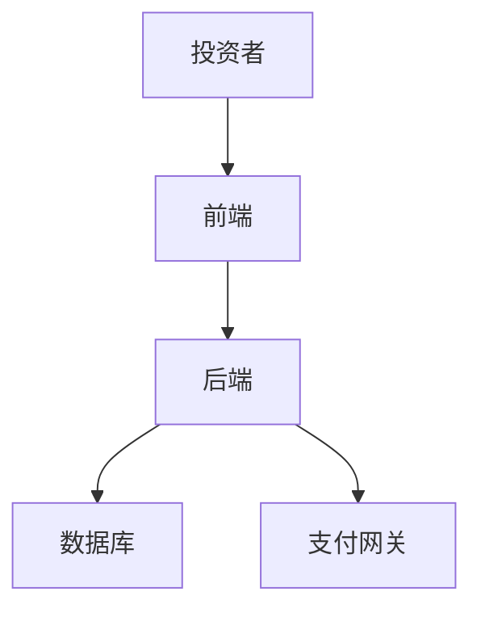
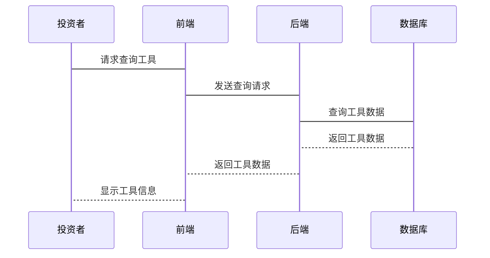

                 


# 货币市场工具：短期资金管理的安全港

## 关键词：
货币市场工具，短期资金管理，安全港，资金流动性，金融风险管理，投资策略

## 摘要：
货币市场工具是短期资金管理的重要手段，为投资者提供了资金流动性、安全性和收益性的平衡选择。本文从货币市场工具的基本概念、核心原理、定价模型、系统架构、项目实战等多个方面进行详细分析，帮助读者深入了解如何在短期资金管理中找到安全、高效的解决方案。

---

# 第1章: 货币市场工具的基本概念

## 1.1 货币市场工具的定义与特点

### 1.1.1 货币市场工具的定义
货币市场工具是指在货币市场上流通的短期金融工具，主要用于满足短期资金需求。这些工具具有期限短、流动性高、风险低的特点，常见类型包括短期国债、商业票据、银行同业拆借等。

### 1.1.2 货币市场工具的主要特点
- **期限短**：通常在1年以内，最长不超过1年。
- **流动性高**：可在货币市场上自由买卖，变现能力强。
- **风险低**：由于期限短，信用风险较低。
- **收益稳定**：收益通常与市场利率挂钩，波动较小。

### 1.1.3 货币市场工具的分类
- **国库券（T-Bills）**：由政府发行，期限通常为3个月、6个月或1年。
- **商业票据（Commercial Papers）**：由企业发行，期限通常为1到270天。
- **银行同业拆借（Interbank Loans）**：银行之间短期拆借资金。
- **回购协议（Repurchase Agreements）**：出售资产并承诺在未来以更高价格回购。

---

## 1.2 短期资金管理的重要性

### 1.2.1 短期资金管理的核心目标
- 确保资金流动性，避免资金短缺。
- 优化资金使用效率，提高投资回报率。
- 降低资金管理风险，保障资金安全。

### 1.2.2 短期资金管理的常见挑战
- **市场波动**：短期资金市场的利率波动会影响工具的收益。
- **流动性风险**：在某些情况下，货币市场工具可能难以快速变现。
- **信用风险**：部分工具的发行人可能存在信用问题。

### 1.2.3 短期资金管理的策略与方法
- **分散投资**：通过投资不同类型的货币市场工具分散风险。
- **关注市场利率**：根据市场利率变化调整投资组合。
- **选择高信用评级工具**：优先选择政府或AAA级企业发行的工具。

---

## 1.3 货币市场工具的发展历程

### 1.3.1 货币市场工具的历史演变
货币市场工具的历史可以追溯到古代，早期的货币市场主要依赖于实物货币和信用工具。随着资本主义的发展，货币市场逐渐成熟，工具种类不断增加。

### 1.3.2 货币市场工具的现代发展
20世纪以来，货币市场工具的种类和规模迅速扩大，尤其是在金融创新的推动下，出现了更多复杂的工具，如回购协议和结构性票据。

### 1.3.3 货币市场工具的未来趋势
随着科技的发展，货币市场工具将更加依赖于数字化和金融科技（FinTech）的应用，投资者可以通过在线平台进行实时交易和管理。

---

## 1.4 本章小结
本章介绍了货币市场工具的基本概念、特点、分类以及短期资金管理的重要性。通过了解这些内容，读者可以初步掌握货币市场工具的基本知识，并为后续章节的深入分析奠定基础。

---

# 第2章: 货币市场工具的核心概念与联系

## 2.1 货币市场工具的核心原理

### 2.1.1 货币市场工具的基本原理
货币市场工具的运作基于市场供求关系，利率由资金的供给和需求决定。工具的价格与市场利率密切相关，利率上升时，工具价格下降，反之亦然。

### 2.1.2 货币市场工具的运作机制
- 投资者购买工具，获得一定的收益。
- 发行者通过发行工具筹集资金，支付利息或回购本金。

### 2.1.3 货币市场工具的数学模型
货币市场工具的现值计算公式为：
$$ P = \frac{F}{(1 + r)^t} $$
其中，\( P \) 是现值，\( F \) 是终值，\( r \) 是利率，\( t \) 是期限。

---

## 2.2 货币市场工具的属性对比

### 2.2.1 安全性对比
| 工具类型         | 安全性 |
|------------------|--------|
| 国库券           | 高     |
| 商业票据         | 中     |
| 银行同业拆借     | 高     |
| 回购协议         | 中     |

### 2.2.2 流动性对比
| 工具类型         | 流动性 |
|------------------|--------|
| 国库券           | 高     |
| 商业票据         | 中     |
| 银行同业拆借     | 高     |
| 回购协议         | 高     |

### 2.2.3 收益性对比
| 工具类型         | 收益性 |
|------------------|--------|
| 国库券           | 中     |
| 商业票据         | 高     |
| 银行同业拆借     | 中     |
| 回购协议         | 中     |

---

## 2.3 货币市场工具的ER实体关系图



---

## 2.4 本章小结
本章通过对比分析货币市场工具的安全性、流动性和收益性，帮助读者更好地理解不同工具的特点及其适用场景。同时，ER实体关系图展示了工具的参与者及其相互关系。

---

# 第3章: 货币市场工具的定价模型

## 3.1 货币市场工具定价的基本原理

### 3.1.1 定价模型的概述
货币市场工具的定价主要基于市场利率和期限。利率上升时，工具的价格会下降，反之亦然。

### 3.1.2 定价模型的数学表达
$$ P = \frac{F}{(1 + r)^t} $$
其中，\( P \) 是现值，\( F \) 是终值，\( r \) 是利率，\( t \) 是期限。

---

## 3.2 货币市场工具定价的算法实现

### 3.2.1 算法流程图



### 3.2.2 Python代码实现

```python
def calculate_present_value(F, r, t):
    return F / (1 + r) ** t

# 示例
F = 1000
r = 0.05
t = 1
P = calculate_present_value(F, r, t)
print(f"现值 P = {P}")
```

---

## 3.3 本章小结
本章通过数学公式和Python代码展示了货币市场工具的定价原理和方法，帮助读者理解如何根据市场利率和期限计算工具的现值。

---

# 第4章: 系统分析与架构设计方案

## 4.1 问题场景介绍
假设我们正在开发一个货币市场基金管理系统，需要实现资金的短期管理功能，包括工具的发行、交易、结算等。

## 4.2 系统功能设计

### 4.2.1 领域模型类图



## 4.3 系统架构设计

### 4.3.1 系统架构图



---

## 4.4 系统接口设计

### 4.4.1 HTTP接口

```http
GET /api/tools
POST /api/tools
PUT /api/tools/{id}
DELETE /api/tools/{id}
```

---

## 4.5 系统交互流程图



---

## 4.6 本章小结
本章通过系统设计展示了如何构建一个货币市场基金管理系统，包括功能设计、架构设计和接口设计。系统架构图和交互流程图帮助读者更好地理解系统的实现方式。

---

# 第5章: 项目实战

## 5.1 环境安装

### 5.1.1 安装Python
```bash
python --version
pip install --upgrade pip
```

### 5.1.2 安装依赖库
```bash
pip install flask
pip install matplotlib
```

---

## 5.2 系统核心实现

### 5.2.1 工具管理模块

```python
from flask import Flask

app = Flask(__name__)

@app.route('/tools', methods=['GET'])
def get_tools():
    return "获取工具列表"

if __name__ == '__main__':
    app.run()
```

---

## 5.3 代码应用解读与分析
通过上述代码，我们可以实现一个简单的工具管理模块，包括工具的查询功能。后续可以根据需求扩展更多功能，如工具的添加、修改和删除。

---

## 5.4 实际案例分析
假设我们有一个商业票据，面值为1000元，利率为5%，期限为1年。现值计算如下：
$$ P = \frac{1000}{(1 + 0.05)^1} = 952.38 $$

---

## 5.5 项目小结
本章通过实际项目展示了如何将货币市场工具的理论应用于实践，从环境安装到代码实现，再到案例分析，帮助读者掌握系统的开发和应用。

---

# 第6章: 最佳实践、小结、注意事项和拓展阅读

## 6.1 最佳实践
- 定期评估工具组合的风险和收益。
- 根据市场变化调整投资策略。
- 选择高信用评级的工具以降低风险。

## 6.2 小结
本文详细介绍了货币市场工具的基本概念、定价模型、系统架构和项目实战。通过理论与实践相结合，帮助读者掌握短期资金管理的核心方法。

## 6.3 注意事项
- 避免过度集中投资，分散风险。
- 关注市场利率变化，及时调整投资组合。
- 注意工具的到期时间和流动性需求。

## 6.4 拓展阅读
- 《货币市场工具的投资策略》
- 《短期资金管理的创新方法》
- 《金融科技与货币市场工具》

---

# 作者：AI天才研究院/AI Genius Institute & 禅与计算机程序设计艺术 /Zen And The Art of Computer Programming

---

以上是《货币市场工具：短期资金管理的安全港》的技术博客文章的完整目录大纲及部分内容展示。通过分章节逐步展开，确保内容详实且逻辑清晰，帮助读者全面理解货币市场工具的核心概念和实际应用。

