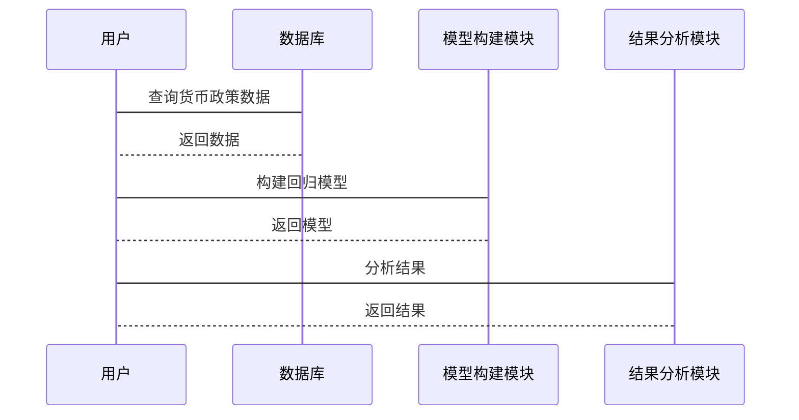

                 


# 货币政策对资产价格的影响机制

> 关键词：货币政策，资产价格，影响机制，利率政策，经济分析

> 摘要：本文深入探讨了货币政策如何通过多种机制影响资产价格。文章首先介绍了货币政策的基本概念和目标，分析了其对不同资产类别（如股票、债券和房地产）的影响路径，接着通过数学模型和实证分析验证了这些机制的有效性。最后，结合实际案例，总结了货币政策在资产价格调控中的实践意义。

---

## 第1章: 货币政策对资产价格的影响机制概述

### 1.1 货币政策的基本概念

#### 1.1.1 货币政策的定义与目标
货币政策是中央银行为了实现特定经济目标（如稳定物价、促进就业、维持经济增长）而采取的调节货币供应量和利率的政策工具。其主要目标包括：

- **价格稳定**：防止通货膨胀或通货紧缩。
- **促进就业**：通过调节经济活动，减少失业率。
- **经济增长**：通过支持投资和消费来推动经济扩张。
- **金融市场稳定**：维护金融市场的健康发展。

#### 1.1.2 资产价格的定义与分类
资产价格是指资产在市场上的交易价格，通常分为以下几类：

- **股票价格**：公司股份的市场价格。
- **债券价格**：债务证券的市场价格。
- **房地产价格**：土地和建筑物的市场价格。
- **黄金价格**：贵金属的市场价格。

#### 1.1.3 货币政策与资产价格的关系
货币政策直接影响市场利率和货币供应量，从而间接或直接地影响资产价格。例如，降低利率可以降低借款成本，刺激投资和消费，进而推高资产价格。

### 1.2 问题背景与研究意义

#### 1.2.1 货币政策对经济的影响
货币政策通过调整利率和货币供应量，影响企业和个人的借贷成本和投资行为，从而影响整体经济活动。

#### 1.2.2 资产价格波动的经济影响
资产价格波动对经济有重要影响。例如，股市波动会影响企业融资和投资者信心，房地产价格波动会影响消费和投资。

#### 1.2.3 研究货币政策对资产价格影响的重要性
理解货币政策如何影响资产价格，有助于政策制定者更好地调控经济，同时也有助于投资者做出更明智的决策。

### 1.3 问题解决与研究方法

#### 1.3.1 货币政策工具的选择
常用的货币政策工具包括利率政策、货币供应量调控、公开市场操作和存款准备金率。

#### 1.3.2 资产价格影响的路径分析
货币政策通过影响利率、货币供应量和资本流动来影响资产价格。

#### 1.3.3 研究方法与框架
本文采用理论分析与实证分析相结合的方法，通过建立数学模型和分析实际案例，验证货币政策对资产价格的影响机制。

---

## 第2章: 货币政策的工具与影响机制

### 2.1 货币政策的主要工具

#### 2.1.1 利率政策
利率政策是货币政策的核心工具之一。中央银行通过调整基准利率（如联邦基金利率）来影响市场利率。

- **直接影响**：降低利率会降低企业和个人的借贷成本，刺激投资和消费。
- **间接影响**：降低利率会降低储蓄收益，推动资金流入股市和其他高风险资产。

#### 2.1.2 货币供应量调控
中央银行通过调节货币供应量来影响经济活动。例如，通过公开市场操作买入或卖出政府债券，从而增加或减少市场上的货币供应量。

- **直接影响**：货币供应量增加会降低利率，刺激投资和消费。
- **间接影响**：货币供应量增加可能导致通货膨胀，进而影响资产价格。

#### 2.1.3 公开市场操作
公开市场操作是中央银行通过买卖政府债券来调节市场流动性的一种工具。

- **买入债券**：增加市场流动性，降低利率。
- **卖出债券**：减少市场流动性，提高利率。

#### 2.1.4 存款准备金率
存款准备金率是中央银行要求商业银行持有的存款准备金比例。

- **降低准备金率**：释放更多流动性，增加信贷供给。
- **提高准备金率**：减少流动性，降低信贷供给。

### 2.2 货币政策对资产价格的影响机制

#### 2.2.1 利率对资产价格的影响
利率是资产定价的重要因素。例如，债券价格与利率呈负相关关系，利率上升，债券价格下降。

- **股票市场**：低利率环境通常有利于股市，因为企业融资成本降低，投资者倾向于投资风险更高的资产。
- **房地产市场**：低利率会降低按揭贷款成本，刺激房地产需求，推高房价。

#### 2.2.2 货币供应量对资产价格的影响
货币供应量增加通常会导致资产价格上涨，尤其是在流动性驱动的市场中。

- **股市**：货币供应量增加会推高股价，因为更多的资金流入股市。
- **房地产市场**：货币供应量增加会导致房地产价格上涨，因为更多资金流入房地产市场。

#### 2.2.3 资本流动与资产价格的关系
资本流动是货币政策影响资产价格的重要渠道。例如，宽松的货币政策会吸引国际资本流入本国市场，推高资产价格。

- **资本流入**：外资流入股市或房地产市场，推高资产价格。
- **资本流出**：外资流出会导致资产价格下跌。

### 2.3 货币政策工具的比较分析

#### 2.3.1 不同货币政策工具的有效性
- **利率政策**：直接影响借贷成本，效果直接但可能受市场预期影响。
- **货币供应量调控**：通过调整流动性影响经济，效果较慢但持久。
- **公开市场操作**：灵活但影响较小。
- **存款准备金率**：影响信贷供给，效果较为显著。

#### 2.3.2 工具之间的协同与冲突
货币政策工具之间可能存在协同或冲突。例如，降低利率和增加货币供应量通常是协同的，但有时可能会产生冲突（如利率过低可能导致货币贬值）。

#### 2.3.3 工具选择的经济环境影响
货币政策工具的选择取决于经济环境。例如，在通货膨胀率高企时，中央银行可能更倾向于使用加息和减少货币供应量的工具。

---

## 第3章: 货币政策对不同资产价格的影响

### 3.1 股票价格的影响

#### 3.1.1 利率对股票价格的影响
- **低利率环境**：降低企业融资成本，提高企业盈利能力和股票估值。
- **高利率环境**：增加企业融资成本，降低企业盈利能力和股票估值。

#### 3.1.2 货币政策对投资者行为的影响
- **宽松货币政策**：投资者倾向于投资风险更高的资产，如股票。
- **紧缩货币政策**：投资者倾向于投资风险更低的资产，如债券。

#### 3.1.3 股票市场的波动性分析
- **货币政策宽松**：股市波动性降低，投资者信心增强。
- **货币政策紧缩**：股市波动性增加，投资者信心下降。

### 3.2 债券价格的影响

#### 3.2.1 利率对债券价格的直接作用
- **债券价格与利率呈负相关关系**：利率上升，债券价格下降；利率下降，债券价格上升。

#### 3.2.2 货币政策对债券需求的影响
- **宽松货币政策**：增加债券需求，推高债券价格。
- **紧缩货币政策**：减少债券需求，降低债券价格。

#### 3.2.3 债券市场的流动性分析
- **高流动性**：债券价格波动较小。
- **低流动性**：债券价格波动较大。

### 3.3 房地产价格的影响

#### 3.3.1 利率对房地产需求的影响
- **低利率环境**：降低按揭贷款成本，刺激房地产需求，推高房价。
- **高利率环境**：增加按揭贷款成本，抑制房地产需求，房价下跌。

---

## 第4章: 数学模型与实证分析

### 4.1 货币政策对资产价格的数学模型

#### 4.1.1 IS-LM模型
IS-LM模型是宏观经济学中常用的模型，用于分析货币政策对资产价格的影响。

- **IS曲线**：代表产品市场均衡，利率与收入的关系。
- **LM曲线**：代表货币市场均衡，利率与货币供应量的关系。

#### 4.1.2 凯恩斯模型
凯恩斯模型强调利率在货币政策中的作用，认为低利率会刺激投资和消费。

### 4.2 实证分析

#### 4.2.1 数据收集
- **数据来源**：选取某国的货币政策数据（如利率、货币供应量）和资产价格数据（如股票指数、房地产价格）。

#### 4.2.2 模型构建
- **回归分析**：建立货币政策变量与资产价格的回归模型，分析货币政策对资产价格的影响。

#### 4.2.3 结果分析
- **统计显著性**：检验货币政策变量是否对资产价格有显著影响。
- **影响程度**：量化货币政策对资产价格的影响程度。

---

## 第5章: 系统分析与架构设计

### 5.1 问题场景介绍
- **问题描述**：分析某国的货币政策对资产价格的影响。
- **项目介绍**：建立数学模型，收集数据，进行实证分析。

### 5.2 系统功能设计

#### 5.2.1 领域模型


#### 5.2.2 系统架构


#### 5.2.3 系统交互


---

## 第6章: 项目实战

### 6.1 环境安装
- **工具安装**：安装Python、Pandas、Matplotlib、Scikit-learn等工具。

### 6.2 核心实现

#### 6.2.1 数据收集
```python
import pandas as pd
data = pd.read_csv('policy_data.csv')
```

#### 6.2.2 模型构建
```python
from sklearn.linear_model import LinearRegression
model = LinearRegression()
model.fit(X, y)
```

#### 6.2.3 结果分析
```python
import matplotlib.pyplot as plt
plt.plot(y_true, y_pred)
plt.show()
```

### 6.3 实际案例分析

#### 6.3.1 案例介绍
- **案例背景**：分析某国的货币政策对股市的影响。

#### 6.3.2 数据分析
- **数据清洗**：处理缺失值和异常值。
- **特征选择**：选择相关货币政策变量。

#### 6.3.3 结果解读
- **模型显著性**：检验模型的显著性。
- **影响程度**：量化货币政策对股市的影响。

### 6.4 项目小结
- **项目总结**：货币政策对资产价格的影响显著，但影响程度因资产类别和经济环境而异。
- **经验教训**：数据质量和模型选择对结果影响较大。

---

## 第7章: 总结与展望

### 7.1 本章小结
- **总结**：本文分析了货币政策对资产价格的影响机制，探讨了不同货币政策工具对不同资产类别的影响。
- **主要结论**：货币政策通过利率、货币供应量和资本流动影响资产价格，不同资产类别的影响机制和程度不同。

### 7.2 未来研究方向
- **研究方向**：进一步研究货币政策对不同类型资产的长期影响，探讨全球化的背景下货币政策的跨境影响。

### 7.3 最佳实践 tips
- **数据收集**：确保数据的准确性和完整性。
- **模型选择**：根据具体情况选择合适的模型。
- **结果解读**：结合经济背景解读分析结果。

---

## 作者：AI天才研究院/AI Genius Institute & 禅与计算机程序设计艺术 /Zen And The Art of Computer Programming

---

### END

