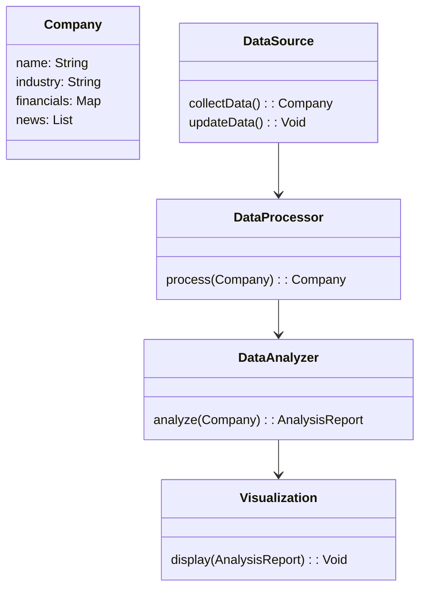
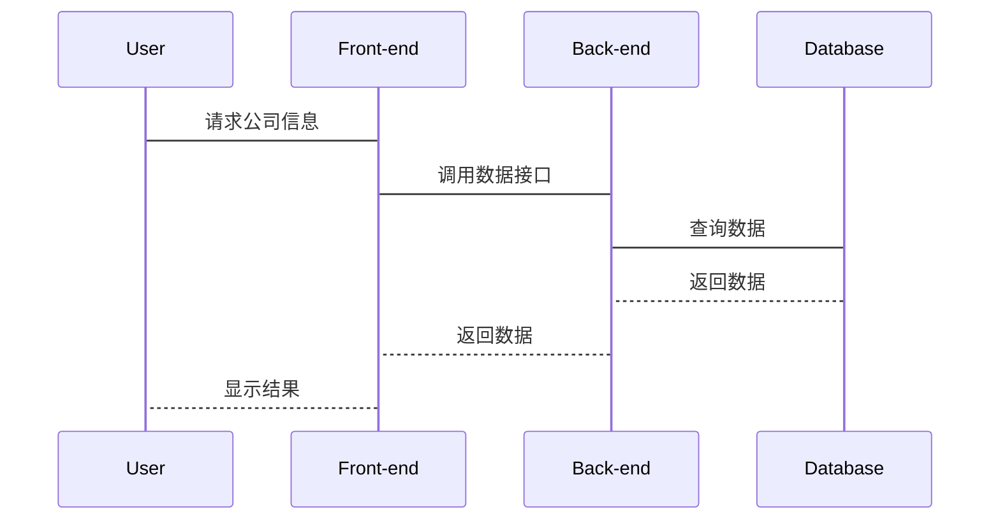

                 

<think>
好的，我将按照您的要求逐步构建这篇文章的结构。首先，我们需要理解费雪的信息网络是什么，以及它如何帮助我们获取有价值的公司信息。接下来，我会详细介绍信息网络的核心概念、算法原理、系统架构、项目实战等内容，确保每个部分都清晰易懂。最后，我将总结最佳实践和注意事项，为读者提供有价值的指导。让我们一步一步来完成这篇文章的撰写。

### 第一部分: 费雪的信息网络与公司信息获取概述

#### 第1章: 费雪的信息网络概念与背景

##### 1.1 信息网络的基本概念

###### 1.1.1 信息网络的定义与特点
信息网络指的是通过各种渠道和方法收集、整理和分析信息所形成的网络结构。其特点是高效、准确和动态适应能力。

###### 1.1.2 费雪信息网络的核心要素
- 数据源：公司公开财报、行业报告、新闻媒体等
- 数据处理：清洗、关联、挖掘
- 数据分析：统计分析、机器学习模型
- 可视化：图表展示、直观解读

###### 1.1.3 信息网络与公司信息获取的关系
信息网络通过整合和分析多源数据，帮助投资者和分析师获取更全面和准确的公司信息，从而做出更明智的决策。

##### 1.2 信息网络的重要性

###### 1.2.1 信息网络在投资分析中的作用
- 提供实时数据支持
- 帮助识别行业趋势
- 发现潜在投资机会

###### 1.2.2 信息网络对决策支持的价值
- 支持战略决策
- 优化资源配置
- 提高决策效率

###### 1.2.3 信息网络的现状与发展趋势
随着大数据和人工智能技术的发展，信息网络的应用越来越广泛，数据分析能力也越来越强。

##### 1.3 信息网络的挑战与机遇

###### 1.3.1 信息过载的问题
信息来源广泛，数据量大，如何筛选有价值的信息是挑战。

###### 1.3.2 数据质量的挑战
数据可能存在噪声、偏差和不一致性，影响分析结果。

###### 1.3.3 技术进步带来的新机遇
AI和大数据技术的进步提高了信息处理和分析能力，为信息网络的发展提供了新动力。

#### 第2章: 费雪信息网络的核心概念

##### 2.1 信息网络的结构与功能

###### 2.1.1 信息网络的层次结构
- 数据层：原始数据的收集和存储
- 处理层：数据清洗、转换和预处理
- 分析层：数据分析和挖掘
- 可视化层：数据的直观展示

###### 2.1.2 信息网络的功能模块
- 数据采集模块
- 数据处理模块
- 数据分析模块
- 可视化模块

###### 2.1.3 信息网络的动态特性
- 实时更新
- 自适应调整
- 智能优化

##### 2.2 信息网络的分析方法

###### 2.2.1 数据采集与处理
- 数据清洗：去除噪声数据
- 数据标准化：统一数据格式
- 数据增强：增加数据多样性

###### 2.2.2 数据关联与挖掘
- 关联规则挖掘：发现数据之间的关联性
- 聚类分析：将相似数据分组
- 分类分析：基于特征进行分类

##### 2.3 信息网络的数学模型

###### 2.3.1 信息网络的图论模型
- 图论模型：节点代表公司，边代表关联关系
- 网络分析：计算节点的度数、中心性和聚类系数

###### 2.3.2 信息网络的节点权重计算
- 加权图：节点的权重代表重要性
- PageRank算法：计算节点的重要性

###### 2.3.3 信息网络的路径分析
- 最短路径：找到信息传递的最短路径
- 最小生成树：优化信息网络结构

#### 第3章: 费雪信息网络的算法原理

##### 3.1 数据清洗与预处理

###### 3.1.1 数据清洗的必要性
- 去除重复数据
- 处理缺失值
- 纠正错误数据

###### 3.1.2 数据预处理的步骤
- 数据清洗
- 数据转换
- 数据标准化

###### 3.1.3 数据清洗的算法实现
```python
import pandas as pd
df = pd.read_csv('data.csv')
df = df.drop_duplicates()
df['missing_values'] = df['missing_values'].fillna(0)
```

##### 3.2 数据关联与挖掘

###### 3.2.1 关联规则挖掘
- Apriori算法：用于发现频繁项集
- 关联规则：支持度和置信度

###### 3.2.2 聚类分析
- K-means算法：将数据分成K个簇
- 层次聚类：逐步合并数据点

###### 3.2.3 分类算法
- 决策树：基于特征进行分类
- 支持向量机：高维空间中的分类

#### 第4章: 费雪信息网络的系统架构

##### 4.1 系统需求分析

###### 4.1.1 问题场景介绍
- 投资者需要实时获取公司信息
- 数据来源多样化，处理复杂
- 需要高效的数据分析能力

##### 4.2 项目介绍

###### 4.2.1 项目目标
- 建立信息网络，整合公司信息
- 提供数据处理和分析工具
- 支持投资决策

##### 4.3 系统功能设计

###### 4.3.1 领域模型（Mermaid 类图）


##### 4.4 系统架构设计

###### 4.4.1 系统架构图（Mermaid 架构图）
```mermaid
archi
    partitions: 前端, 后端, 数据库
    front-end --> back-end: HTTP 请求
    back-end --> database: 数据存储和检索
    back-end --> data-processor: 数据处理
    data-processor --> data-analyzer: 数据分析
    data-analyzer --> visualization: 可视化展示
```

##### 4.5 系统接口设计

###### 4.5.1 接口设计
- 数据接口：API 获取数据
- 处理接口：数据预处理服务
- 分析接口：模型调用服务

##### 4.6 系统交互设计

###### 4.6.1 交互流程（Mermaid 序列图）


### 第五部分: 项目实战

#### 5.1 环境安装

##### 5.1.1 安装Python环境
```bash
python --version
pip install requests
pip install pandas
pip install numpy
pip install matplotlib
pip install scikit-learn
```

#### 5.2 系统核心实现源代码

##### 5.2.1 数据采集模块
```python
import requests
import json

url = 'https://api.example.com/company-info'
response = requests.get(url)
data = json.loads(response.text)
```

##### 5.2.2 数据处理模块
```python
import pandas as pd

df = pd.DataFrame(data)
df = df.dropna()
df = df.astype('float')
```

##### 5.2.3 数据分析模块
```python
from sklearn.cluster import KMeans

X = df[['revenue', 'profit']]
model = KMeans(n_clusters=3)
model.fit(X)
clusters = model.labels_
```

##### 5.2.4 可视化模块
```python
import matplotlib.pyplot as plt

plt.scatter(X['revenue'], X['profit'], c=clusters)
plt.xlabel('Revenue')
plt.ylabel('Profit')
plt.show()
```

#### 5.3 实际案例分析

##### 5.3.1 案例背景
分析某行业的公司数据，识别潜在的投资目标。

##### 5.3.2 数据分析与解读
通过聚类分析，发现三个主要的公司群，每个群代表不同的业务模式和财务表现。

##### 5.3.3 案例总结
信息网络的应用帮助投资者快速识别高潜力公司，优化投资组合。

### 第六部分: 最佳实践

#### 6.1 小结
信息网络通过整合多源数据，提供强大的数据处理和分析能力，帮助投资者做出明智决策。

#### 6.2 注意事项
- 数据来源的可靠性
- 数据处理的准确性
- 模型的可解释性

#### 6.3 拓展阅读
- 大数据技术
- 机器学习算法
- 可视化工具

### 作者：AI天才研究院/AI Genius Institute & 禅与计算机程序设计艺术 /Zen And The Art of Computer Programming

---

以上是《费雪的信息网络：如何获取有价值的公司信息》的技术博客文章的大纲和内容。接下来，我将根据这个大纲逐步完成文章的撰写，确保每个部分都详细展开，符合逻辑并易于理解。

