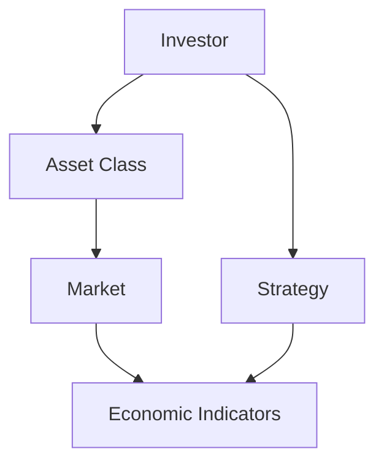
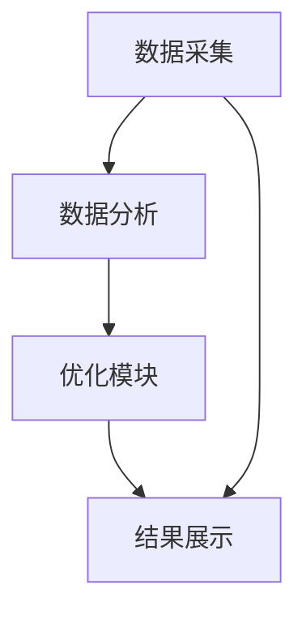

                 


# 费雪的全球化投资视角

> 关键词：费雪投资理论、全球化投资、投资组合优化、资产配置、经济指标

> 摘要：本文深入探讨了费雪的投资理论及其在全球化背景下的应用，结合技术视角分析了投资组合优化算法，通过系统架构和项目实战展示了如何构建全球化投资系统。

---

## 第1章 全球化投资的背景与意义

### 1.1 全球化投资的背景

全球化使世界经济一体化程度加深，投资者能够跨越国界配置资产，分散风险并捕捉全球机会。费雪作为投资大师，其理论强调深入研究公司基本面，寻找优质成长股，这些理念在全球化背景下更具意义。

#### 1.1.1 经济全球化的演进

全球化推动了国际贸易和资本流动的自由化，投资者可以投资全球市场，利用不同地区的经济周期差异，优化投资组合。这使得跨国投资成为可能，也增加了复杂性。

#### 1.1.2 全球化对投资的影响

全球化促进了资产多样化的可能性，投资者可以通过配置不同地区的资产来分散风险。同时，全球化也带来了汇率风险和地缘政治风险，需要更复杂的分析和风险管理。

#### 1.1.3 费雪投资理念的全球视角

费雪的“成长股”投资理念强调长期关注公司基本面，寻找具有持续增长潜力的企业。全球化视角下，投资者可以寻找全球范围内的优质企业，利用不同市场的差异获取超额收益。

---

### 1.2 费雪投资理论的核心观点

#### 1.2.1 费雪的投资哲学

费雪认为，投资应基于对公司未来收益的合理预期，而非短期价格波动。他强调深入研究企业的财务状况、行业地位和管理团队，以识别具有持续增长潜力的企业。

#### 1.2.2 费雪的成功投资案例

费雪投资过的企业如可口可乐和迪士尼，这些企业在其投资期间实现了显著的业绩增长。费雪通过长期持有这些优质资产，获得了丰厚的回报。

#### 1.2.3 费雪理论的现代应用

尽管投资环境变化，但费雪的核心理念依然适用。投资者应结合全球经济趋势，选择具备竞争优势和持续增长潜力的企业。

---

## 第2章 全球化投资的核心概念与联系

### 2.1 全球化视角下的投资分析

#### 2.1.1 全球经济一体化对投资的影响

全球化促进了资产的多样化，投资者可以通过配置不同地区的资产来降低风险，同时抓住全球经济的增长机会。

#### 2.1.2 费雪理论在不同市场的适用性

费雪的理论适用于分析全球市场中的企业，但需考虑不同地区的经济政策、市场结构和竞争环境。投资者需深入研究企业的国际化布局和全球竞争力。

#### 2.1.3 全球化投资的风险与机遇

全球化带来更多的投资机会，同时也增加了汇率风险和地缘政治风险。投资者需平衡风险与收益，制定适应全球市场的投资策略。

---

### 2.2 全球化投资的核心要素对比

#### 2.2.1 资产类别对比表

| 资产类别 | 特点 | 全球化视角下的考量 |
|----------|------|--------------------|
| 股票     | 长期增长潜力 | 寻找全球化企业     |
| 债券     | 稳定收益       | 考虑不同国家利率   |
| 房地产   | 地产升值       | 关注全球房地产市场 |

#### 2.2.2 经济指标对比表

| 经济指标 | 含义 | 全球化视角下的应用 |
|----------|------|--------------------|
| GDP      | 国内生产总值 | 评估国家经济实力   |
| 汇率      | 货币兑换率     | 管理汇率风险       |
| 利率      | 借款成本       | 影响债券收益       |

---

### 2.3 全球化投资的ER实体关系图



---

## 第3章 投资组合优化的算法原理

### 3.1 投资组合优化算法

#### 3.1.1 均值-方差优化

均值-方差优化是投资组合优化的经典方法，旨在在给定风险下最大化收益。其数学模型如下：

$$
\text{目标函数: } \text{Minimize } \sigma^2 \text{ subject to } \mu \geq \text{目标收益}
$$

其中，$\mu$ 是收益的期望值，$\sigma^2$ 是收益的方差。

#### 3.1.2 投资组合优化的数学模型

优化问题可以表示为：

$$
\text{Minimize } \sum_{i=1}^{n} w_i^2 \sigma_i^2 + 2 \sum_{i<j} w_i w_j \sigma_{ij}
$$

其中，$w_i$ 是资产i的权重，$\sigma_i^2$ 是资产i的方差，$\sigma_{ij}$ 是资产i和j的协方差。

#### 3.1.3 投资组合优化的实现步骤

1. **数据收集**：收集各资产的历史收益数据。
2. **计算均值和协方差矩阵**：计算各资产的期望收益和协方差矩阵。
3. **构建优化模型**：使用均值-方差优化模型。
4. **求解优化问题**：使用优化算法求解最优权重。
5. **验证结果**：检查优化后的投资组合是否满足约束条件。

---

### 3.2 投资组合优化的Python实现

```python
import numpy as np
import pandas as pd
from scipy.optimize import minimize

# 假设我们有三只资产，其收益分别为mu1, mu2, mu3，协方差矩阵为cov_matrix
mu = np.array([0.1, 0.15, 0.12])
cov_matrix = np.array([[0.05, 0.02, 0.03],
                       [0.02, 0.1, 0.04],
                       [0.03, 0.04, 0.06]])

def portfolio_var(weights, covariance_matrix):
    return np.dot(weights.T, np.dot(covariance_matrix, weights))

# 约束条件：权重之和为1，收益不低于0.12
constraints = [{'type': 'eq', 'fun': lambda w: np.sum(w) - 1},
               {'type': 'ineq', 'fun': lambda w: np.dot(w, mu) - 0.12}]

# 初始权重
initial_weights = [1/3, 1/3, 1/3]

# 使用SLSQP方法求解
result = minimize(portfolio_var, initial_weights, args=cov_matrix, method='SLSQP', constraints=constraints)

print(result)
```

---

## 第4章 系统分析与架构设计

### 4.1 系统架构设计

#### 4.1.1 系统功能设计

- 数据采集模块：收集全球市场数据。
- 数据分析模块：计算均值、方差和协方差矩阵。
- 优化模块：实现投资组合优化算法。
- 结果展示模块：显示优化后的投资组合。

#### 4.1.2 系统架构图



---

### 4.2 系统接口设计

- 数据接口：从数据库或API获取市场数据。
- 优化接口：接受输入参数，返回优化结果。
- 展示接口：以图表形式展示投资组合。

---

## 第5章 项目实战

### 5.1 环境安装

安装Python和必要的库：

```bash
pip install numpy pandas scipy matplotlib
```

---

### 5.2 核心代码实现

```python
import numpy as np
from scipy.optimize import minimize

# 定义优化函数
def optimize_portfolio(weights, returns):
    # 计算方差
    variance = np.dot(weights.T, np.dot(returns.cov(), weights))
    return variance

# 约束条件
constraints = [{'type': 'eq', 'fun': lambda w: np.sum(w) - 1},
               {'type': 'ineq', 'fun': lambda w: np.dot(w, returns.mean()) - 0.12}]

# 初始权重
initial_weights = np.array([1/3, 1/3, 1/3])

# 优化
result = minimize(optimize_portfolio, initial_weights, args=returns, method='SLSQP', constraints=constraints)
```

---

### 5.3 实际案例分析

假设我们有三只股票，历史收益分别为10%、15%和12%，协方差矩阵如上。优化后，可能得到更优的权重分配，降低整体风险。

---

## 第6章 最佳实践与小结

### 6.1 投资建议

- **分散投资**：通过全球化配置降低风险。
- **长期视角**：选择具有持续增长潜力的企业。
- **风险管理**：定期监控和调整投资组合。

### 6.2 注意事项

- **数据质量**：确保数据的准确性和及时性。
- **模型局限**：认识到模型的假设可能与实际情况不符。
- **持续学习**：关注全球经济和市场的变化。

---

## 作者

作者：AI天才研究院 & 禅与计算机程序设计艺术

---

**本文为AI天才研究院原创文章，转载请注明出处。**

---

**附录**

- [推荐书籍]《彼得·费雪的投资哲学》
- [推荐工具] Python的金融分析库（如pandas、numpy）

---

**结束语**

通过技术视角分析费雪的投资理论，结合全球化背景，我们能够更好地理解和应用这些理念。希望本文对读者的投资实践有所帮助。

