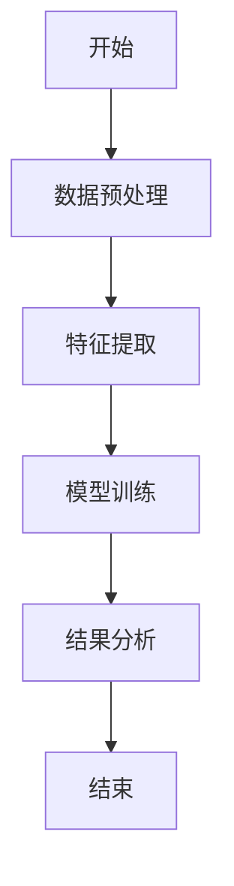
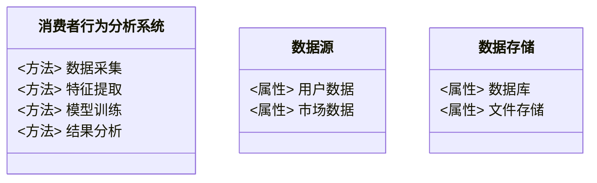
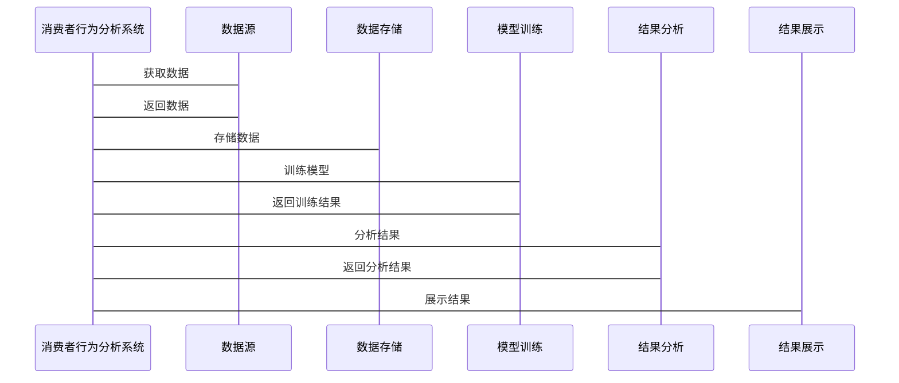

                 


# 费雪的消费者行为分析

> 关键词：消费者行为分析，费雪，需求理论，效用函数，消费者剩余

> 摘要：本文深入分析了费雪的消费者行为理论，探讨其在现代消费者行为分析中的应用。结合实际案例和算法原理，详细讲解了费雪理论的数学模型、系统架构和项目实战。

---

# 第1章: 费雪的消费者行为分析基础

## 1.1 消费者行为分析的背景与意义

### 1.1.1 消费者行为的定义与核心概念

消费者行为分析是指研究消费者在购买、使用和处置产品或服务时的决策过程和行为模式。其核心概念包括需求、偏好、效用、价格敏感性和决策过程。

### 1.1.2 费雪的消费者行为理论

费雪提出的需求法则表明，商品的需求量与其价格和收入呈反向关系。效用函数则描述了消费者对不同商品组合的偏好程度。消费者剩余是消费者在购买商品时获得的额外满足感。

### 1.1.3 消费者行为分析的重要性

消费者行为分析帮助企业预测市场趋势，优化产品设计和定价策略，提升营销效果。对于政策制定者，它有助于制定合理的经济政策。

## 1.2 费雪的消费者行为理论

### 1.2.1 需求法则

费雪的需求法则指出，价格上升，需求下降，反之亦然。需求弹性衡量了价格变化对需求量的影响程度。

### 1.2.2 效用函数

费雪的效用函数表示消费者对商品组合的偏好程度。效用函数是递增函数，当价格变化时，消费者会调整购买行为以保持效用最大化。

### 1.2.3 消费者剩余

消费者剩余是消费者愿意支付的最高价格与实际支付价格之间的差额。它反映了消费者在购买过程中获得的额外价值。

## 1.3 消费者行为分析的边界与外延

### 1.3.1 消费者行为的边界

消费者行为分析不包括生产者行为和市场结构分析。它主要关注消费者决策过程，不涉及企业的生产决策。

### 1.3.2 消费者行为的外延

消费者行为分析涉及心理学、经济学、社会学等多个学科。它不仅研究购买行为，还包括使用和处置行为。

### 1.3.3 消费者行为与其他学科的关系

消费者行为分析与心理学结合，研究消费者决策的心理过程；与社会学结合，研究社会因素对消费行为的影响。

---

# 第2章: 费雪的消费者行为分析核心概念与联系

## 2.1 核心概念原理

### 2.1.1 需求弹性对比

需求弹性衡量价格变化对需求量的影响。弹性大于1表示需求量对价格变化敏感，小于1则不敏感。

### 2.1.2 消费者偏好对比

消费者偏好影响购买决策，不同消费者群体的偏好差异需要通过市场细分来识别。

### 2.1.3 消费者决策过程对比

消费者决策过程包括确认需求、信息收集、评估选项、购买决策和购买后行为。

## 2.2 消费者行为分析的核心要素对比

### 2.2.1 需求弹性对比

使用表格对比不同商品的需求弹性，如奢侈品需求弹性高于日常用品。

### 2.2.2 消费者偏好对比

通过调查问卷收集消费者偏好数据，分析不同群体的偏好差异。

### 2.2.3 消费者决策过程对比

绘制决策过程图，展示不同阶段的影响因素和决策点。

## 2.3 ER实体关系图架构

```mermaid
erDiagram
    消费者 {
        <属性> 需求
        <属性> 偏好
        <属性> 决策
    }
    商品 {
        <属性> 价格
        <属性> 特性
        <属性> 品牌
    }
    市场 {
        <属性> 供给
        <属性> 需求
        <属性> 竞争
    }
    消费者 --> 商品 : 购买
    消费者 --> 市场 : 影响
    商品 --> 市场 : 反馈
```

---

# 第3章: 消费者行为分析的算法原理

## 3.1 算法原理概述

### 3.1.1 需求预测算法

使用线性回归模型预测需求量，公式为：$Q = aP + b$，其中Q为需求量，P为价格，a和b为回归系数。

### 3.1.2 偏好分析算法

采用聚类分析识别消费者群体的偏好差异，使用K-means算法将消费者分为不同类别。

### 3.1.3 决策树算法

使用ID3或C4.5算法构建决策树，用于分类消费者的行为模式。

## 3.2 算法流程图



## 3.3 算法实现代

### 3.3.1 需求预测的Python代码

```python
import numpy as np
from sklearn.linear_model import LinearRegression

# 数据准备
price = np.array([1, 2, 3, 4, 5]).reshape(-1, 1)
quantity = np.array([5, 4, 3, 2, 1])

# 模型训练
model = LinearRegression()
model.fit(price, quantity)

# 预测
predicted_quantity = model.predict([[6]])
print(predicted_quantity)
```

### 3.3.2 需求弹性计算公式

需求弹性公式为：$$E = \frac{\%ΔQ}{\%ΔP}$$

其中，$$\%ΔQ = \frac{Q2 - Q1}{(Q1 + Q2)/2}$$，$$\%ΔP = \frac{P2 - P1}{(P1 + P2)/2}$$

---

# 第4章: 系统分析与架构设计

## 4.1 系统功能设计

消费者行为分析系统包括数据采集、分析、预测和可视化模块。

## 4.2 系统架构设计



## 4.3 系统接口设计

消费者行为分析系统的接口包括数据输入接口、模型调用接口和结果展示接口。

## 4.4 系统交互流程图



---

# 第5章: 项目实战

## 5.1 电商用户行为分析案例

### 5.1.1 环境安装

安装Python和相关库，如numpy、pandas、scikit-learn。

### 5.1.2 数据预处理

清洗数据，处理缺失值和异常值。

### 5.1.3 特征提取

从用户行为数据中提取购买频率、浏览时间等特征。

### 5.1.4 模型训练

使用决策树模型进行用户行为分类，识别不同用户群体。

### 5.1.5 结果分析

分析不同用户群体的行为模式，制定针对性营销策略。

---

# 第6章: 总结与展望

## 6.1 最佳实践

建议企业结合费雪理论和现代算法，进行消费者行为分析。

## 6.2 小结

本文详细讲解了费雪的消费者行为理论，并结合实际案例进行了分析。

## 6.3 注意事项

注意数据质量和模型选择，避免过拟合和欠拟合问题。

## 6.4 拓展阅读

推荐阅读《消费者行为学》和《数据挖掘与机器学习》。

---

# 作者：AI天才研究院 & 禅与计算机程序设计艺术

---

通过以上步骤，您可以完成一篇详细且结构清晰的技术博客文章，深入探讨费雪的消费者行为分析。

