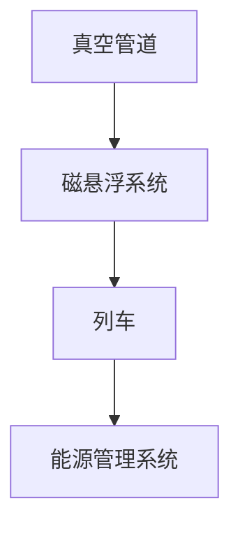
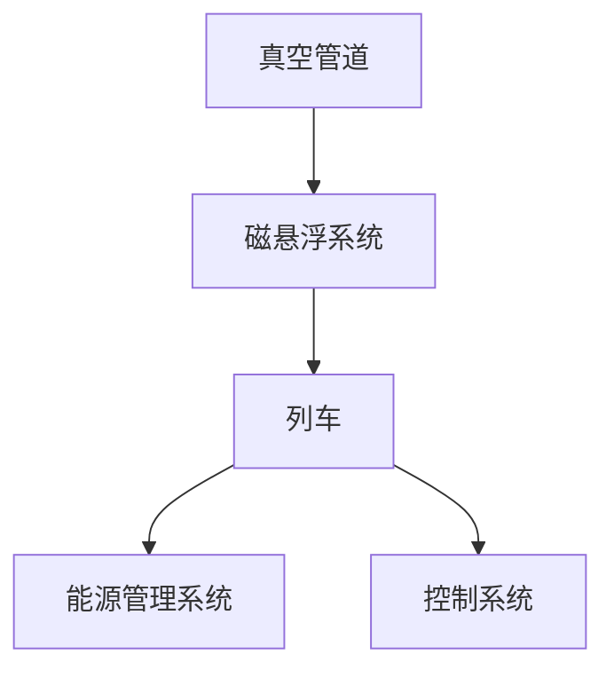

                 

# 超级高铁技术的发展与交通运输业投资机会

---

## 关键词：
超级高铁, 真空管道, 磁悬浮技术, 交通投资, 技术创新, 交通革命

---

## 摘要：
超级高铁作为一种革命性的交通技术，凭借其极高的速度和效率，正在重新定义现代交通运输业。本文从超级高铁的技术发展、系统架构、经济影响、投资机会、市场风险等多方面展开分析，探讨其在交通运输业中的潜力与挑战，并为投资者提供深入的洞察与建议。

---

## 第1章: 超级高铁的起源与技术背景

### 1.1 超级高铁的起源与发展
超级高铁（Hyperloop）的概念最早由埃隆·马斯克（Elon Musk）在2013年提出，旨在打造一种比飞机、火车、汽车更快速、更环保的交通工具。超级高铁的核心理念是通过真空管道和磁悬浮技术，实现接近音障的高速运行。

#### 1.1.1 超级高铁的定义与概念
超级高铁是一种基于真空管道和磁悬浮技术的高速交通系统，列车在封闭的真空管道中运行，通过去除空气阻力来实现极高的速度。

#### 1.1.2 超级高铁的技术背景与历史沿革
超级高铁的概念起源于20世纪初，但在技术成熟度和可行性方面，直到近年来才取得重大进展。马斯克的开源计划推动了超级高铁技术的快速发展。

#### 1.1.3 超级高铁与传统高铁的对比分析
| 对比维度         | 超级高铁                         | 传统高铁                         |
|------------------|----------------------------------|----------------------------------|
| 速度             | 最高时速可达1200公里            | 最高时速约350公里               |
| 运行环境         | 真空管道                         | 高速铁路                         |
| 投资成本         | 高                              | 较高                             |
| 运行效率         | 极高                             | 高                              |
| 技术复杂性       | 极高                             | 较高                             |

---

### 1.2 超级高铁的核心技术特点
超级高铁的核心技术包括真空管道、磁悬浮技术、高速列车设计和能源效率优化。

#### 1.2.1 真空管道技术
真空管道是超级高铁的核心基础设施，通过去除管道内的空气阻力，大幅降低列车的能耗和运行时间。

#### 1.2.2 磁悬浮技术
磁悬浮技术通过电磁力使列车悬浮于轨道上方，避免了传统轮轨摩擦，进一步提升了运行速度和效率。

#### 1.2.3 高速列车设计与优化
超级高铁列车采用流线型设计，优化空气动力学性能，同时配备先进的控制系统，确保高速运行的安全性和稳定性。

#### 1.2.4 能源效率与环保特性
超级高铁的能源消耗远低于传统高铁，且支持清洁能源（如电力）驱动，符合可持续发展的环保理念。

---

## 第2章: 超级高铁的技术实现与系统架构

### 2.1 超级高铁的技术原理
超级高铁的技术实现基于真空管道和磁悬浮系统的协同工作。

#### 2.1.1 真空管道的工作原理
真空管道通过抽气装置将管道内的气压降至接近真空状态，大幅减少空气阻力，使列车能够以极高速度运行。

#### 2.1.2 磁悬浮系统的实现机制
磁悬浮系统通过电磁铁与轨道之间的排斥力，使列车悬浮于轨道上方，从而实现无接触运行。

#### 2.1.3 列车与轨道的协同设计
列车与轨道的协同设计是超级高铁技术的关键，确保列车在真空管道中的稳定运行和高效能。

#### 2.1.4 能源系统的优化设计
超级高铁采用高效的能源管理系统，通过再生制动技术回收能量，进一步降低能耗。

#### 2.1.5 系统架构图

---

### 2.2 超级高铁的系统架构
超级高铁系统架构包括真空管道、磁悬浮系统、列车、能源系统和控制系统。

#### 2.2.1 系统整体架构图

#### 2.2.2 真空管道系统的模块划分
真空管道系统由管道、抽气装置、真空维持装置和监测系统组成。

#### 2.2.3 列车与轨道的协同设计
列车与轨道的协同设计是超级高铁技术的关键，确保列车在真空管道中的稳定运行和高效能。

---

## 第3章: 超级高铁对交通运输业的革命性影响

### 3.1 超级高铁对交通效率的提升
超级高铁的高速运行能力显著提升了交通效率。

#### 3.1.1 速度优势与时间成本的降低
超级高铁的时速可达1200公里，远超传统高铁和飞机。

#### 3.1.2 运载能力的显著增强
超级高铁的真空管道设计支持更高的运载能力，且发车间隔更短。

#### 3.1.3 对城市交通结构的优化作用
超级高铁的出现将重新定义城市间的交通网络，推动区域经济一体化。

#### 3.1.4 对交通成本的优化
超级高铁的能源效率高，运行成本低于传统高铁。

#### 3.1.5 对城市交通结构的优化作用
超级高铁将改变城市间的交通方式，推动区域经济一体化。

---

### 3.2 超级高铁对经济发展的推动作用
超级高铁的出现将推动相关产业链的发展，创造新的经济增长点。

#### 3.2.1 区域经济一体化的促进
超级高铁的高速运行能力将促进区域经济一体化，推动城市群的发展。

#### 3.2.2 新兴产业的带动效应
超级高铁的技术研发和应用将带动新材料、新能源、智能控制系统等相关产业的发展。

#### 3.2.3 投资回报率的分析与预测
超级高铁的投资回报周期较长，但随着技术成熟和市场需求增长，其经济效益将逐步显现。

---

## 第4章: 超级高铁的投资机会与市场分析

### 4.1 超级高铁市场的现状与发展趋势
超级高铁市场目前仍处于起步阶段，但未来增长潜力巨大。

#### 4.1.1 全球超级高铁项目的分布与进展
目前，美国、欧洲和亚洲的一些国家和地区已经开始超级高铁的试验和建设。

#### 4.1.2 市场需求的预测与分析
预计到2030年，超级高铁市场将呈现爆发式增长，市场需求将大幅超过当前水平。

#### 4.1.3 技术成熟度与商业化前景
超级高铁技术正在逐步成熟，未来5-10年内将进入商业化阶段。

---

### 4.2 超级高铁的投资机会分析
投资者可以从技术研发、基础设施建设、运营服务等多个方面寻找投资机会。

#### 4.2.1 技术研发领域的投资机会
超级高铁的核心技术包括真空管道、磁悬浮系统和列车设计，技术研发领域存在巨大潜力。

#### 4.2.2 基础设施建设的投资潜力
超级高铁的真空管道和站点建设需要大量的资金投入，基础设施建设领域也存在投资机会。

#### 4.2.3 运营服务领域的商业模式创新
超级高铁的运营模式可以借鉴航空和高铁行业的经验，探索新的商业模式。

---

## 第5章: 超级高铁投资的风险与挑战

### 5.1 技术层面的风险与挑战
技术层面的风险主要体现在技术研发的高投入和不确定性。

#### 5.1.1 技术研发的高投入与不确定性
超级高铁的技术研发需要大量的资金投入，且技术成熟度仍有待进一步验证。

#### 5.1.2 技术标准的统一与协调问题
超级高铁的技术标准尚未统一，不同项目之间的兼容性问题需要解决。

#### 5.1.3 技术创新的持续性与可行性
超级高铁的技术创新需要持续投入，且技术创新的可行性仍需进一步验证。

---

### 5.2 市场层面的风险与挑战
市场层面的风险主要体现在市场需求的波动性和行业竞争的加剧。

#### 5.2.1 市场需求的波动性与不确定性
超级高铁的市场需求受政策、经济和市场环境的影响较大，存在一定的波动性。

#### 5.2.2 行业竞争的加剧与价格压力
随着超级高铁技术的普及，行业竞争将加剧，价格压力也将增加。

#### 5.2.3 市场推广与用户接受度的问题
超级高铁的市场推广需要时间和大量的宣传，用户的接受度也是一个重要挑战。

---

## 第6章: 超级高铁的未来展望与投资建议

### 6.1 超级高铁的未来发展趋势
超级高铁的未来发展趋势将朝着技术创新、智能化和全球化方向发展。

#### 6.1.1 技术创新的未来方向
未来，超级高铁的技术创新将集中在新材料、智能控制系统和能源管理方面。

#### 6.1.2 智能化与自动化的发展趋势
超级高铁将更加智能化和自动化，实现无人驾驶和智能调度。

#### 6.1.3 可持续发展与环保技术的突破
超级高铁的可持续发展和环保技术将是未来研究的重点。

---

### 6.2 超级高铁的投资策略与风险管理

#### 6.2.1 技术驱动型投资策略
投资者应关注超级高铁的核心技术研发，选择具有技术优势的企业进行投资。

#### 6.2.2 市场导向型投资策略
投资者应关注超级高铁市场的市场需求变化，选择具有市场潜力的项目进行投资。

#### 6.2.3 风险控制与收益平衡
投资者需要在风险和收益之间找到平衡点，合理配置资产，分散投资风险。

---

## 作者：AI天才研究院/AI Genius Institute & 禅与计算机程序设计艺术 /Zen And The Art of Computer Programming

---

通过以上分析，超级高铁技术的发展将深刻影响交通运输业，并为投资者带来巨大的投资机会。然而，投资者也需要关注技术风险和市场风险，制定合理的投资策略，以实现长期稳定的收益。

