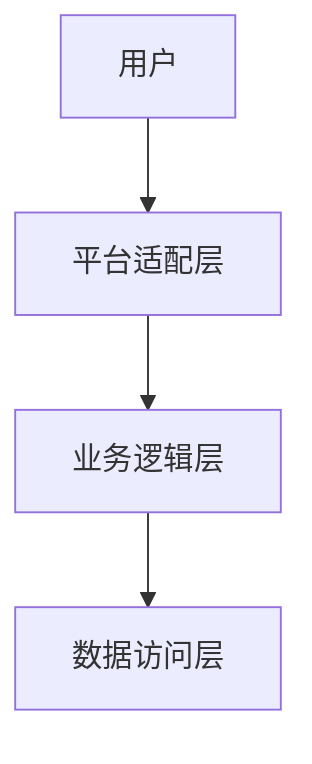
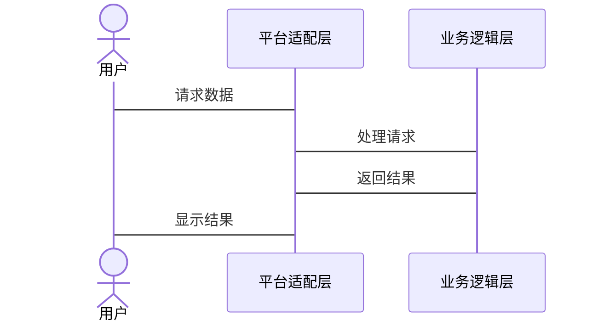

                 


# 跨平台兼容性

## 关键词
跨平台兼容性, 软件开发, 测试方法, 系统架构, 开发框架, 代码实现, 测试用例

## 摘要
跨平台兼容性是软件开发中的重要问题，涉及多平台支持、代码复用和测试优化。本文从背景、核心概念、技术实现、系统架构、项目实战和最佳实践等方面，系统阐述跨平台兼容性的实现方法和优化策略，帮助读者全面掌握相关知识。

---

## 第1章: 跨平台兼容性的背景与概念

### 1.1 跨平台兼容性的定义与背景

#### 1.1.1 跨平台兼容性的基本概念
跨平台兼容性指软件在不同操作系统、硬件或环境中正常运行的能力。它涉及代码复用、API调用和资源管理，是软件开发的重要目标。

#### 1.1.2 跨平台兼容性的重要性
随着软件需求的多样化，跨平台兼容性帮助企业降低开发成本，提升用户体验，扩展市场覆盖，同时优化维护效率。

#### 1.1.3 跨平台兼容性的发展历程
从早期的平台独立性到现代的多平台支持，跨平台兼容性经历了工具化、框架化和自动化的演变。

### 1.2 跨平台兼容性的问题背景

#### 1.2.1 跨平台开发中的常见问题
兼容性测试复杂、平台特性差异、资源管理困难和调试效率低下是跨平台开发的主要挑战。

#### 1.2.2 跨平台兼容性的核心挑战
API差异、资源适配和性能优化是实现跨平台兼容性的主要障碍。

#### 1.2.3 跨平台兼容性与软件开发的关系
跨平台兼容性贯穿整个软件开发生命周期，从需求分析到测试优化，确保软件在多平台上的稳定运行。

### 1.3 跨平台兼容性的解决思路

#### 1.3.1 跨平台兼容性的实现方法
选择合适框架、编写平台无关代码、处理平台特有逻辑和测试验证是实现跨平台兼容性的关键步骤。

#### 1.3.2 跨平台兼容性的技术选型
主流框架包括React Native、Flutter和Electron，需根据项目需求选择最优方案。

#### 1.3.3 跨平台兼容性的边界与外延
明确兼容性的范围和边界，聚焦核心功能，避免过度优化。

---

## 第2章: 跨平台兼容性的核心概念与联系

### 2.1 跨平台兼容性的核心原理

#### 2.1.1 跨平台兼容性的技术基础
跨平台框架通过抽象平台差异，提供统一接口，实现代码复用和功能扩展。

#### 2.1.2 跨平台兼容性的实现机制
跨平台兼容性通过代码适配、动态加载和配置管理，确保软件在不同平台上的正确运行。

#### 2.1.3 跨平台兼容性的核心要素
核心要素包括统一接口、动态配置和平台特性检测，确保兼容性和性能的平衡。

### 2.2 跨平台兼容性的核心概念对比

#### 2.2.1 跨平台兼容性与平台无关性的对比
跨平台兼容性关注代码复用，平台无关性强调API和数据结构的统一，两者相辅相成。

#### 2.2.2 跨平台兼容性与跨语言兼容性的对比
跨平台兼容性专注于同一平台，跨语言兼容性涉及不同语言和平台间的交互，各有侧重。

#### 2.2.3 跨平台兼容性与多平台支持的对比
跨平台兼容性强调代码复用，多平台支持注重功能扩展，两者结合实现灵活高效的系统。

### 2.3 跨平台兼容性的ER实体关系图

```mermaid
er
    Actor: 用户
    Platform: 平台
    Compatibility: 兼容性
    Feature: 功能
    Requirement: 需求
    Actor --> Platform: 使用
    Platform --> Compatibility: 支持
    Compatibility --> Feature: 实现
    Feature --> Requirement: 满足
```

---

## 第3章: 跨平台兼容性的技术实现

### 3.1 跨平台兼容性的实现方法

#### 3.1.1 跨平台开发框架的选择
选择React Native、Flutter或Electron等框架，考虑开发效率、性能和社区支持。

#### 3.1.2 跨平台兼容性的代码实现
编写平台无关的核心业务逻辑，使用框架提供的API处理平台差异。

#### 3.1.3 跨平台兼容性的测试方法
制定测试计划，采用自动化测试工具，确保各平台上的功能和性能一致。

### 3.2 跨平台兼容性的算法原理

#### 3.2.1 跨平台兼容性的算法模型
使用拉格朗日插值法预测平台性能差异，公式如下：
$$P_{\text{预测}} = \sum_{i=1}^{n} w_i \cdot P_i$$
其中，$w_i$是权重，$P_i$是各平台的性能指标。

#### 3.2.2 跨平台兼容性的实现步骤
1. 收集各平台的性能数据，2. 计算权重，3. 预测目标平台的性能，4. 调整代码实现。

### 3.3 跨平台兼容性的代码实现

#### 3.3.1 跨平台兼容性代码示例
```python
import platform

def platform_dependent_feature():
    if platform.system() == 'Windows':
        # Windows-specific implementation
        pass
    elif platform.system() == 'Linux':
        # Linux-specific implementation
        pass
    else:
        # Fallback implementation
        pass
```

#### 3.3.2 代码实现的优化技巧
- 使用抽象工厂模式处理平台差异，确保代码的可扩展性和可维护性。
- 通过动态加载模块，避免平台特有代码的冗余。

---

## 第4章: 跨平台兼容性的系统架构设计

### 4.1 跨平台兼容性的系统分析

#### 4.1.1 說明問題場景
系统需要在Windows、macOS和Linux上运行，支持核心功能和平台特定功能。

#### 4.1.2 系統功能設計
核心功能包括数据处理、用户界面和网络通信，平台特定功能包括通知和支付。

#### 4.1.3 預期成果
确保系统在各平台上的稳定运行和良好性能。

### 4.2 跨平台兼容性的系統架構設計

#### 4.2.1 系統架構設計
采用分层架构，核心业务逻辑在中间层实现，平台适配层处理差异。



#### 4.2.2 系統接口設計
定义统一的API接口，确保各层之间的通信高效可靠。

#### 4.2.3 系統交互設計
使用序列图展示用户与系统的交互流程，确保各平台上的交互一致。



### 4.3 跨平台兼容性的實現細節

#### 4.3.1 平台適配層實現
编写平台特有代码，处理不同操作系统的差异。

#### 4.3.2 业务邏輯層實現
实现核心业务逻辑，确保代码复用和功能扩展。

#### 4.3.3 資源管理
优化资源使用，确保各平台上的性能一致。

---

## 第5章: 跨平台兼容性的项目实战

### 5.1 說明實際專案

#### 5.1.1 項目簡介
开发一个跨平台移动应用，支持iOS、Android和Web平台。

#### 5.1.2 項目需求
实现用户认证、数据存储和文件上传功能，确保各平台上的兼容性。

### 5.2 說明環境建置

#### 5.2.1 開發環境建置
安装Node.js、React Native CLI和相关工具，配置开发环境。

#### 5.2.2 開發工具選擇
选择React Native框架，利用其跨平台特性。

### 5.3 說明核心實現

#### 5.3.1 核心實現細節
编写核心业务逻辑，使用React Native的组件和API。

#### 5.3.2 平台適配細節
处理平台特定功能，如通知和支付接口。

### 5.4 說明測試細節

#### 5.4.1 測試用例設計
制定功能测试、性能测试和兼容性测试用例。

#### 5.4.2 測試執行結果
展示各平台上的测试结果，分析问题根源。

#### 5.4.3 測試結果分析
总结测试中发现的问题，优化代码实现。

### 5.5 說明優化細節

#### 5.5.1 優化策略
优化资源使用，提升平台间的性能一致性。

#### 5.5.2 優化結果
展示优化后的性能提升，确保用户体验一致。

---

## 第6章: 跨平台兼容性的最佳實踐、小結與注意事項

### 6.1 跨平台兼容性的最佳實踐

#### 6.1.1 開發階段
选择合适的框架，制定详细的测试计划。

#### 6.1.2 測試階段
采用自动化测试工具，确保各平台上的功能和性能一致。

#### 6.1.3 維護階段
定期更新框架和工具，修复兼容性问题。

### 6.2 跨平台兼容性的應用與未來發展

#### 6.2.1 跨平台兼容性的實際應用
跨平台兼容性广泛应用于移动应用、桌面应用和Web开发。

#### 6.2.2 跨平台兼容性的未來發展
随着技术进步，跨平台兼容性将更加智能化和自动化。

### 6.3 跨平台兼容性的風險與挑戰

#### 6.3.1 跨平台兼容性的主要風險
兼容性测试复杂、平台更新快和技术债务积累。

#### 6.3.2 跨平台兼容性的挑戰
API差异、性能优化和资源管理。

### 6.4 跨平台兼容性的 future development

随着AI和自动化技术的发展，跨平台兼容性将更加智能，测试和优化将更加高效。

---

## 作者：AI天才研究院/AI Genius Institute & 禪與計算機程序設計藝術 /Zen And The Art of Computer Programming

