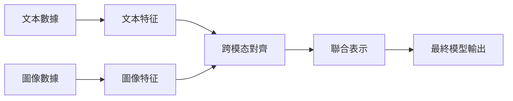
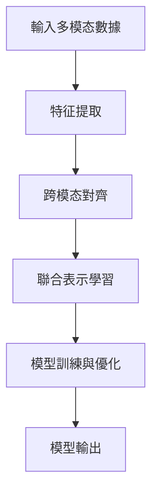

                 


# 跨模态學習：增強AI-Agent的理解能力

---

## 關鍵詞：
跨模态学习，多模态数据，AI Agent，深度学习，模态对齐，联合表示学习，跨模态模型

---

## 摘要：
跨模态学习是人工智能领域的重要研究方向，旨在通过整合文本、图像、语音等多种模态的数据，提升AI Agent的理解能力和应用场景的多样性。本文将从跨模态学习的背景、核心概念、算法原理、系统设计、项目实战等多方面展开，深入分析其在AI Agent中的应用价值和实现方法，帮助读者全面理解跨模态学习的技术细节和实际应用。

---

# 第1章：跨模态學習的背景與應用場景

## 1.1 多模态數據的定義與特徵
### 1.1.1 多模态數據的定義
多模态數據是指由多種信息載體（如文本、圖像、語音等）共同組成的數據集。這些數據具有豐富的信息表達能力，能夠更全面地描述現實世界中的.Scene.

| **數據模態** | **特征** | **優勢** |
|--------------|-----------|----------|
| 文本         | 綜合性強，可 semantic 分析 | 易於理解和表示 semantics |
| 圖像         | 視覺信息豐富，直觀 | 可捕獲 spatial 和 appearance 特征 |
| 語音         | 時間序列數據，信息豐富 | 可表達情感和語調 |

### 1.1.2 各種模态數據的挑戰
多模态數據的挑戰主要體現在數據格式多樣、特征空間差異大、數據對齊困難等方面。

### 1.1.3 多模態數據的機會
整合多模態數據可以顯著提升AI-Agent的理解能力，並拓寬其應用場景。

---

## 1.2 跨模态學習的基本概念
### 1.2.1 跨模态學習的定義
跨模态學習是指在多模態數據中，通過學習一種或多種模態的特征來提高模型在其他模態上的性能。這是一種模態間的知識遷移學習。

### 1.2.2 跨模态學習的核心目標
跨模态學習的核心目標是實現多模態數據之間的對齊與互補，並在交叉場景下提高模型的泛化能力。

### 1.2.3 跨模态學習的邊界與外延
跨模态學習的邊界在於不同模態數據的共享特征與獨有特征的劃分。其外延包括多模態數據融合、模態對齊、聯合學習等。

---

## 1.3 跨模态學習的應用場景
### 1.3.1 跨模态學習在AI-Agent中的應用
AI-Agent需要處理多種模態數據來完成任務，例如語音命令、圖像識別和文本理解。

### 1.3.2 其他典型應用場景
跨模态學習在廣告推薦、智能客服、智能助手等場景中有廣泛應用。

### 1.3.3 跨模态學習的未來發展方向
隨著大模型技術的進步，跨模态學習將更加智能化和自適應化。

---

## 1.4 本章小結
本章主要介紹了多模態數據的基本概念、挑戰與機會，並詳細闡述了跨模态學習的核心目標和應用場景。

---

# 第2章：跨模态學習的核心概念與原理

## 2.1 跨模态數據的特征分析
### 2.1.1 文本數據的特征
文本數據具有 semantic 和 context 的特性，並可以通過.embedding 給模型提供語義信息。

### 2.1.2 圖像數據的特征
圖像數據具有 spatial 和 appearance 的特性，並可以通過卷積網絡提取特征。

### 2.1.3 語音數據的特征
語音數據具有 temporal 和 spectral 的特性，並可以通過.rnn 給模型提供時序信息。

---

## 2.2 跨模态模型的核心要素
### 2.2.1 跨模态對齊的定義與方法
跨模态對齊是指將不同模態的數據映射到相同的表示空間中，並通過對齊學習實現信息互補。

### 2.2.2 跨模态表示學習的原理
跨模态表示學習的目標是學習一種聯合表示，使不同模態的數據可以在同一空間中對齊。

### 2.2.3 跨模态模型的優化策略
跨模态模型的優化策略包括 loss function 設計、權重共享、多任務學習等。

---

## 2.3 跨模态模型的實體關係圖


---

## 2.4 本章小結
本章詳細分析了跨模态數據的特征，並介紹了跨模态模型的核心要素和實體關係圖。

---

# 第3章：跨模态學習的算法原理

## 3.1 跨模态學習的核心算法
### 3.1.1 多模态對齊網絡(MANet)
MANet的核心思想是通過多模态數據的聯合學習來實現數據的對齊與融合。

### 3.1.2 跨模态注意力機制
跨模态注意力機制允許模型在不同模態之間進行注意力分配，以捕獲重要的信息。

### 3.1.3 多模态生成模型（如VAGAN）
VAGAN是一種基於生成對抗網絡的多模态生成模型，可以用於跨模态數據的生成與重建。

---

## 3.2 跨模态學習的算法流程


---

## 3.3 跨模态學習的數學模型
跨模态學習的數學模型通常基於以下公式：
$$
p(y|x_1, x_2, ..., x_n) = \prod_{i=1}^{n} p(y|x_i)
$$
其中，$x_i$ 表示第 $i$ 模態的數據，$y$ 是模型的輸出。

---

## 3.4 本章小結
本章詳細介紹了跨模态學習的核心算法和算法流程，並給出了數學模型的表達式。

---

# 第4章：跨模态學習的系統設計與實現

## 4.1 系統功能設計
### 4.1.1 功能需求
系統需要實現多模態數據的對齊、融合與模型訓練。

### 4.1.2 功能模塊劃分
系統主要由數據預處理模塊、模型訓練模塊、模型評估模塊等組成。

---

## 4.2 系統架構設計


---

## 4.3 系統接口設計
### 4.3.1 系統接口
系統提供RESTful API接口，供上層應用調用。

### 4.3.2 接口設計
接口設計基於JSON格式，並支持HTTPS协议。

---

## 4.4 本章小結
本章詳細介紹了跨模态學習系統的設計與實現，包括功能設計、架構設計和接口設計。

---

# 第5章：跨模态學習的項目實戰

## 5.1 項目環境安裝
### 5.1.1 系統需求
需要安裝Python 3.8以上版本，並安裝相關的深度學習庫（如TensorFlow、PyTorch）。

### 5.1.2 安裝步驟
```bash
pip install numpy
pip install tensorflow
pip install keras
```

---

## 5.2 項目核心實現
### 5.2.1 跨模态對齊實現
```python
def modal_alignment(text_feature, image_feature):
    # 計算相似性指標
    similarity = cosine_similarity(text_feature, image_feature)
    return similarity
```

### 5.2.2 联合表示學習實現
```python
def joint_representation(similarity):
    # 計算聯合表示
    joint_rep = np.mean(similarity, axis=1)
    return joint_rep
```

---

## 5.3 項目案例分析
### 5.3.1 案例介紹
以AI-Agent的語音-文本聯合學習為例，展示跨模态學習的實際應用。

### 5.3.2 案例實現
```python
# 加載語音數據
audio_data = load_audio()
# 加載文本數據
text_data = load_text()
# 設計模型
model = build_modal_alignment_model()
# 訓練模型
model.train(audio_data, text_data)
```

---

## 5.4 本章小結
本章通過實際項目案例，展示了跨模态學習的實現步驟和具體應用。

---

# 第6章：跨模态學習的未來發展與最佳實踐

## 6.1 未來發展方向
### 6.1.1 大模型技術的進一步融合
未來跨模态學習將與大模型技術深度融合，進一步提升模型的表徵能力。

### 6.1.2 跨模态學習的自適應化
跨模态學習將更加自適應化，能夠根據不同的場景自動調整學習策略。

---

## 6.2 最佳實踐Tips
### 6.2.1 模型訓練Tips
- 選擇合適的數據 augmentation 方法
- 選擇合適的 optimizer 和 learning rate

### 6.2.2 系統部署Tips
- 確保系統的可擴展性
- 確保系統的安全性

---

## 6.3 本章小結
本章對跨模态學習的未來發展進行了展望，並分享了最佳實踐的Tips。

---

## 總結
跨模态學習是一種前沿的人工智能技術，能夠顯著增強AI-Agent的理解能力和應用場景。本文通過詳細介紹跨模态學習的背景、核心概念、算法原理、系統設計和項目實戰，為讀者提供了一個全面的學習框架。

---

## 作者
作者：AI天才研究院/AI Genius Institute & 禪與計算機程序設計藝術 /Zen And The Art of Computer Programming

