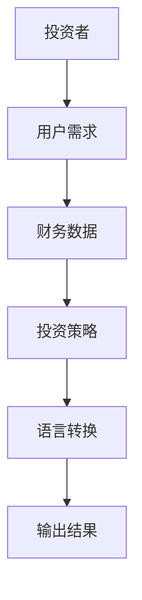
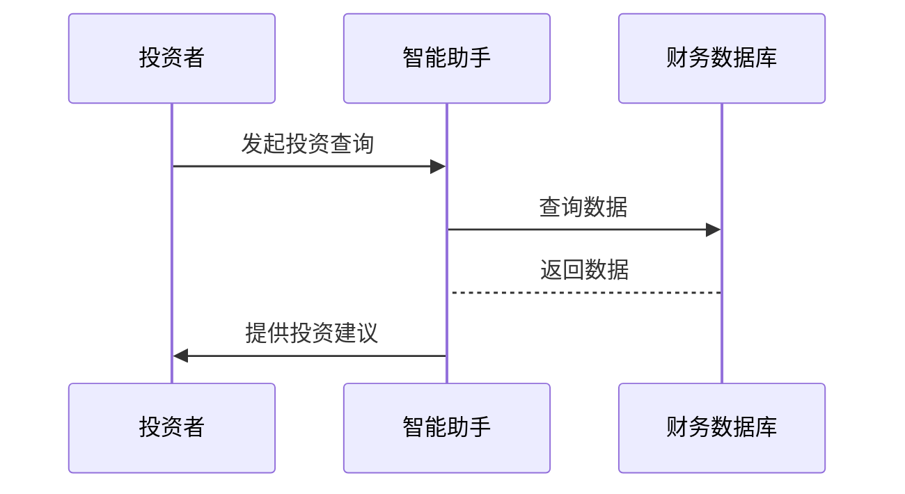

                 


# 跨语言投资理财智能助手的开发策略

> 关键词：跨语言, 投资理财, 智能助手, 自然语言处理, 机器学习

> 摘要：本文详细探讨了跨语言投资理财智能助手的开发策略，从背景需求、核心概念、算法原理到系统设计和项目实战，结合实际案例和最佳实践，为开发者提供全面的指导。

---

## 第1章: 背景与问题定义

### 1.1 背景介绍

#### 1.1.1 全球化投资趋势
随着全球经济一体化的深入，投资者 increasingly interact with financial services across different languages and cultures. 跨语言投资理财助手的出现，满足了这一需求。

#### 1.1.2 多语言用户需求
用户可能需要在同一平台使用多种语言进行投资咨询和策略分析，跨语言智能助手能够提供无缝体验。

#### 1.1.3 金融科技的融合
人工智能与金融科技的结合，使得智能助手能够处理复杂的财务数据和投资策略，但跨语言能力的加入进一步提升了其适用范围。

### 1.2 核心概念

#### 1.2.1 跨语言处理
- **多语言自然语言处理 (NLP)**：支持多种语言的文本理解和生成。
- **跨语言信息抽取**：从多语言文本中提取关键信息。
- **语义理解**：理解不同语言中的语义，提供一致的响应。

#### 1.2.2 投资理财策略
- **投资者行为分析**：分析用户的财务状况和投资偏好。
- **财务数据分析**：处理和分析多语言环境中的财务数据。
- **策略生成与优化**：基于分析结果生成个性化投资策略。

#### 1.2.3 边界与外延
- **边界**：专注于投资理财领域的跨语言助手，不涉及其他领域。
- **外延**：支持多种语言，但目前主要集中在常用投资语言上。

---

## 第2章: 核心概念与联系

### 2.1 跨语言处理的核心原理

#### 2.1.1 多语言NLP模型
使用预训练的多语言模型（如_mBert）进行跨语言理解。

#### 2.1.2 跨语言文本对齐
将不同语言的文本对齐，以便进行信息抽取和比较。

#### 2.1.3 跨语言语义理解
通过跨语言嵌入（Cross-lingual Embedding）来理解不同语言的语义。

### 2.2 投资理财策略的关键要素

#### 2.2.1 投资者行为分析
分析用户的语言偏好、投资风格和风险承受能力。

#### 2.2.2 财务数据处理
对多语言文本中的财务数据进行抽取和结构化处理。

#### 2.2.3 策略生成
基于用户需求和市场数据生成投资策略，并提供多语言的解释。

### 2.3 核心概念的ER实体关系图



---

## 第3章: 算法原理与数学模型

### 3.1 跨语言处理算法

#### 3.1.1 多语言NLP模型
使用多语言预训练模型进行文本表示。

#### 3.1.2 跨语言文本对齐
使用对齐算法将不同语言的文本对齐。

#### 3.1.3 跨语言语义相似度计算
计算不同语言文本之间的语义相似度。

### 3.2 投资理财策略生成算法

#### 3.2.1 数据预处理
清洗和结构化财务数据。

#### 3.2.2 机器学习模型训练
训练分类模型进行投资策略生成。

#### 3.2.3 策略优化
基于用户反馈优化投资策略。

### 3.3 数学模型与公式

#### 3.3.1 财务数据处理公式
$$ \text{净收益} = \text{总收入} - \text{总支出} $$

#### 3.3.2 语义相似度计算公式
$$ \text{余弦相似度} = \frac{\vec{A} \cdot \vec{B}}{|\vec{A}| |\vec{B}|} $$

---

## 第4章: 系统设计与架构

### 4.1 系统功能设计

#### 4.1.1 领域模型


#### 4.1.2 系统架构设计


#### 4.1.3 接口设计
定义RESTful API接口，支持多语言请求和响应。

#### 4.1.4 交互流程


---

## 第5章: 项目实战与实现

### 5.1 环境安装

#### 安装Python
```bash
python --version
```

#### 安装依赖
```bash
pip install transformers requests
```

### 5.2 核心代码实现

#### 财务数据处理
```python
import pandas as pd

# 读取CSV文件
data = pd.read_csv('financial_data.csv')
# 数据清洗
data.dropna(inplace=True)
# 数据分析
data['return'] = data['收盘价'].pct_change()
```

#### 策略生成
```python
from sklearn.model import LinearRegression

model = LinearRegression()
model.fit(X, y)
predictions = model.predict(X_test)
```

### 5.3 代码解读与分析

#### 财务数据处理
- 数据清洗：删除缺失值。
- 计算收益率：使用`pct_change()`方法计算收益率。

#### 策略生成
- 使用线性回归模型进行预测。
- 模型训练：使用训练数据拟合模型。
- 预测结果：生成投资策略。

### 5.4 实际案例分析

#### 案例：跨语言投资咨询
用户使用中文提问，系统理解并生成英文的投资建议，实现跨语言支持。

---

## 第6章: 最佳实践与总结

### 6.1 最佳实践 tips

- **模块化设计**：确保代码易于维护。
- **性能优化**：使用缓存和并行处理提高效率。
- **错误处理**：完善的错误处理机制。

### 6.2 小结

本文详细探讨了跨语言投资理财智能助手的开发策略，从背景需求到系统设计，结合实际案例和最佳实践，为开发者提供了全面的指导。

### 6.3 注意事项

- 确保数据安全和隐私保护。
- 定期更新模型和策略，以适应市场变化。

### 6.4 拓展阅读

- 多语言NLP领域的最新研究。
- 机器学习在金融投资中的应用。

---

## 作者信息

作者：AI天才研究院/AI Genius Institute & 禅与计算机程序设计艺术 /Zen And The Art of Computer Programming

---

这篇文章详细探讨了跨语言投资理财智能助手的开发策略，结合理论与实践，为开发者提供了全面的指导。

