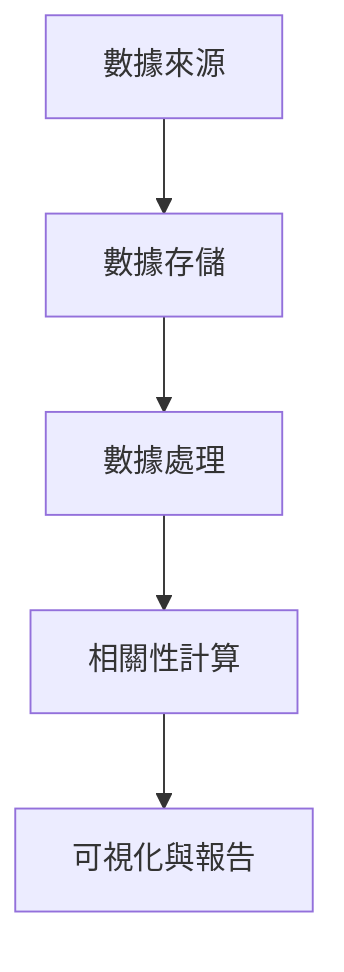

                 


# 跨資產相關性分析：優化多元化投資策略

**關鍵詞**：跨資產相關性分析，投資組合優化，風險管理，相關性，協方差，相關係數

**摘要**：本文探討跨資產相關性分析在投資組合優化中的應用，介紹相關性分析的數學模型、算法原理和實務操作，並通過實際案例展示如何利用相關性分析來降低風險、提高收益，從而實現多元化投資策略的優化。

---

# 第一部分：跨資產相關性分析的背景與核心概念

## 第1章：跨資產相關性分析概述

### 1.1 資產相關性分析的背景

#### 1.1.1 投資組合優化的歷史與發展

現代金融理論的基石是**馬科威茨均值-方差模型**，該模型提出投資者可以通过組合不同資產來降低風險，實現風險調整後的收益最優化。自此，投資組合優化成為金融領域的核心研究方向之一。

#### 1.1.2 資產相關性的問題描述

在實際投資中，不同資產的價格變動往往會受到共同因素的影響，導致這些資產之間存在一定程度的相關性。例如，股神巴菲特曾經指出，股票市場中某個板塊的股價齊漲齊跌往往與宏觀經濟指標密切相关。

#### 1.1.3 資產相關性的解決方案

通過對不同資產之間的相關性進行量化分析，投資者可以更好地理解這些資產在市場波動中的相互作用，從而更科學地配置資產，降低整體投資風險。

#### 1.1.4 資產相關性的邊界與外延

跨資產相關性分析的邊界主要在於數據質量和模型 assumptions。例如，數據可能存在缺失或異常值，模型可能受到 stationarity 確保等限制。

### 1.2 資產相關性的核心概念

#### 1.2.1 資產相關性的定義

**资产相关性**是指不同資產價格變動之間的相互關聯程度。簡單來說，如果資產A和資產B價格同步漲跌，那麼它們之間的相關性就很高。

#### 1.2.2 資產相關性的特性

- **正相關**：漲跌方向一致。
- **負相關**：漲跌方向相反。
- **零相關**：價格變動無明顯關聯。

#### 1.2.3 資產相關性與投資風險的關聯

相關性越高，投資組合的風險會越集中，抗風險能力越弱。因此，在投資組合管理中，需特別注意不同資產之間的相關性。

---

## 第2章：資產相關性分析的核心要素

### 2.1 資產相關性的數學模型

#### 2.1.1 協方差與相關係數的定義

**協方差**（Covariance）衡量兩個變量的變動方向是否一致。

**相關係數**（Correlation Coefficient）是衡量兩個變量之間相關程度的標準化指標。

#### 2.1.2 相關係數的公式與計算

$$\text{Correlation}(X,Y) = \frac{\text{Cov}(X,Y)}{\sqrt{\text{Var}(X)} \cdot \sqrt{\text{Var}(Y)}}$$

其中，$\text{Cov}(X,Y)$ 表示 $X$ 和 $Y$ 的協方差，$\text{Var}(X)$ 和 $\text{Var}(Y)$ 分別表示 $X$ 和 $Y$ 的方差。

---

# 第二部分：資產相關性分析的算法原理

## 第3章：相關性分析的算法流程

### 3.1 数据收集

- 收集不同資產的歷史價格數據，數據來源可以是股價、債市價格等。

### 3.2 数据清洗

- 處理缺失值、異常值等數據-quality問題。

### 3.3 計算協方差與相關係數

- 使用公式 $$\text{Cov}(X,Y) = \frac{1}{n-1} \sum_{i=1}^{n} (X_i - \bar{X})(Y_i - \bar{Y})$$
- 計算相關係數 $$\text{Correlation}(X,Y) = \frac{\text{Cov}(X,Y)}{\sqrt{\text{Var}(X)} \cdot \sqrt{\text{Var}(Y)}}$$

### 3.4 可視化與分析

- 用熱力圖等工具可視化相關性矩陣，幫助投資者直觀理解不同資產之間的關聯程度。

---

# 第三部分：跨資產相關性分析的系統設計與實現

## 第4章：系統分析與架構設計

### 4.1 系統功能設計

- 数据采集：實時獲取各類資產的價格數據。
- 数据清洗：處理缺失值和異常值。
- 相關性計算：計算任意兩資產之間的相關係數。
- 可視化：生成相關性熱力圖等可視化報表。

### 4.2 系統架構設計



### 4.3 系統接口設計

- API接口：提供RESTful API，讓其他系統可以訪問相關性數據。
- 前端界面：投資者可以通過簡單的界面查看相關性分析報告。

---

# 第四部分：項目實戰

## 第5章：環境安裝與核心實現

### 5.1 環境安裝

```bash
pip install numpy pandas seaborn matplotlib
```

### 5.2 核心代码實現

```python
import numpy as np
import pandas as pd
import seaborn as sns
import matplotlib.pyplot as plt

# 示例數據
data = {
    'Asset A': [10, 20, 30, 40, 50],
    'Asset B': [15, 25, 35, 45, 55],
    'Asset C': [5, 15, 25, 35, 45]
}

df = pd.DataFrame(data)

# 計算相關性矩陣
correlation_matrix = df.corr()

# 繪製熱力圖
plt.figure(figsize=(10, 8))
sns.heatmap(correlation_matrix, annot=True, cmap='coolwarm')
plt.title('_assets correlation matrix')
plt.show()
```

### 5.3 確保數據品質

- 檢查數據是否有缺失值。
- 處理異常值。

---

# 第五部分：最佳實踐與總結

## 第6章：最佳實踐

### 6.1 小結

跨資產相關性分析是優化投資組合的重要工具，幫助投資者降低風險、提高收益。

### 6.2 注意事項

- 選擇合適的數據來源和時間窗口。
- 定期更新相關性分析報告。

### 6.3 拓展閱讀

- 现代投资组合理论。
- 时间序列分析。

---

# 作者：AI天才研究院 & 禅與计算机程序設計藝術

