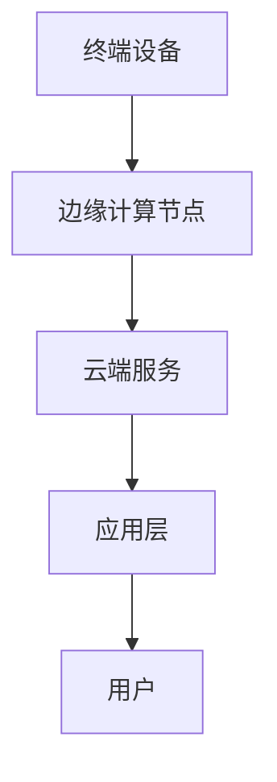

                 


# 边缘AI：将AI Agent能力下放到终端设备

> 关键词：边缘AI，AI Agent，边缘计算，终端设备，分布式智能

> 摘要：边缘AI是指将人工智能代理的能力直接部署在终端设备上，利用边缘计算的优势，实现低延迟、高效率的智能处理。本文将详细探讨边缘AI的核心概念、技术原理、系统架构设计以及实际应用案例，帮助读者全面理解边缘AI的潜力与挑战。

---

## 第1章: 边缘AI的背景与概念

### 1.1 边缘AI的背景
传统的人工智能技术依赖于强大的云端计算能力，数据需要通过网络传输到云端进行处理后再返回结果。这种方式虽然能够发挥出AI的强大能力，但也存在一些显著的局限性：
- 数据传输延迟高，影响实时性。
- 高昂的网络传输成本。
- 数据隐私和安全风险。

边缘AI的出现，正是为了解决这些问题。它将AI的能力直接部署在终端设备上，减少了对云端的依赖，提高了处理效率和安全性。

### 1.2 边缘AI的定义与特点
边缘AI是指在靠近数据源的终端设备上运行的人工智能技术。它的特点包括：
- **低延迟**：数据在本地处理，减少了网络传输的延迟。
- **高效率**：终端设备能够快速响应，提高处理效率。
- **隐私保护**：数据无需传输到云端，减少了隐私泄露的风险。

### 1.3 边缘AI的应用场景
边缘AI的应用场景非常广泛，包括：
- **智能家居**：通过边缘AI，智能家居设备可以实时感知环境并做出响应。
- **工业自动化**：在工厂中，边缘AI可以实现设备的实时监控和预测性维护。
- **智能交通**：在自动驾驶和智能交通系统中，边缘AI可以实现快速的决策和响应。

---

## 第2章: 边缘AI的核心概念与技术

### 2.1 边缘计算的基本原理
边缘计算是一种分布式计算范式，数据在靠近数据源的设备上进行处理，而不是像传统计算那样将所有数据都传输到云端。边缘计算的架构包括以下几个部分：
1. **设备层**：数据的采集和初步处理。
2. **网络层**：数据的传输和网络管理。
3. **计算层**：数据的处理和分析。
4. **应用层**：结果的展示和应用。

### 2.2 AI Agent在边缘计算中的作用
AI Agent是一种能够在边缘环境中自主决策和执行任务的智能实体。它具备以下核心能力：
- **感知能力**：通过传感器或其他输入设备感知环境。
- **推理能力**：基于感知到的信息进行逻辑推理。
- **执行能力**：根据推理结果执行相应的操作。

---

## 第3章: 边缘AI的算法基础

### 3.1 轻量化AI算法
为了能够在终端设备上运行，AI算法需要进行轻量化处理。常用的轻量化技术包括：
- **模型压缩**：通过剪枝、量化等技术减少模型的大小。
- **模型剪枝**：去除模型中冗余的部分，减少计算量。
- **模型量化**：将模型中的浮点数转换为整数，降低计算资源的消耗。

### 3.2 边缘AI的推理算法
边缘AI的推理算法需要在终端设备上高效运行。常用的推理算法包括：
- **基于规则的推理**：通过预定义的规则进行推理。
- **基于概率的推理**：通过概率模型进行推理。
- **基于知识图谱的推理**：通过知识图谱进行推理。

---

## 第4章: 边缘AI的系统架构设计

### 4.1 边缘AI系统的组成
边缘AI系统通常由以下几个部分组成：
1. **终端设备层**：数据的采集和初步处理。
2. **网络层**：数据的传输和网络管理。
3. **计算层**：数据的处理和分析。
4. **应用层**：结果的展示和应用。

### 4.2 边缘AI系统的架构图
以下是边缘AI系统的架构图：



---

## 第5章: 边缘AI的项目实战

### 5.1 项目背景与需求分析
以智能摄像头为例，边缘AI可以实现视频流的实时分析。项目需求包括：
- 实时检测视频中的异常行为。
- 低延迟的处理能力。
- 高度的隐私保护。

### 5.2 项目实施与代码实现
以下是实现边缘AI的智能摄像头的代码示例：

```python
import cv2
import numpy as np

# 加载预训练模型
model = cv2.dnn.loadModel("face_detection_model.onnx")

# 视频流采集
cap = cv2.VideoCapture(0)

while cap.isOpened():
    ret, frame = cap.read()
    if not ret:
        break

    # 模型推理
    blob = cv2.dnn.blobFromImage(frame, 1.0, (300, 300), (104.0, 117.0, 123.0))
    model.setInput(blob)
    output = model.forward()

    # 处理结果
    for detection in output[0, 0, :, :]:
        if detection[2] > 0.5:
            left = int(detection[3] * frame.shape[1])
            top = int(detection[4] * frame.shape[0])
            right = int(detection[5] * frame.shape[1])
            bottom = int(detection[6] * frame.shape[0])
            cv2.rectangle(frame, (left, top), (right, bottom), (0, 255, 0), 2)

    # 显示结果
    cv2.imshow("Face Detection", frame)
    if cv2.waitKey(1) & 0xFF == ord('q'):
        break

cap.release()
cv2.destroyAllWindows()
```

---

## 第6章: 边缘AI的最佳实践与未来展望

### 6.1 边缘AI的优化建议
- **算法优化**：进一步优化模型的轻量化技术，降低计算资源的消耗。
- **系统优化**：优化边缘设备的计算能力和网络传输效率。
- **安全优化**：加强数据加密和安全防护，确保数据的安全性。

### 6.2 边缘AI的未来展望
随着技术的不断进步，边缘AI将在更多领域得到广泛应用。未来的发展方向包括：
- **更高效的算法**：开发更高效的AI算法，提高处理能力。
- **更强大的设备**：开发更强大的边缘设备，支持更复杂的AI任务。
- **更智能的系统**：实现更加智能化的系统，提升用户体验。

---

## 作者：AI天才研究院/AI Genius Institute & 禅与计算机程序设计艺术 /Zen And The Art of Computer Programming

