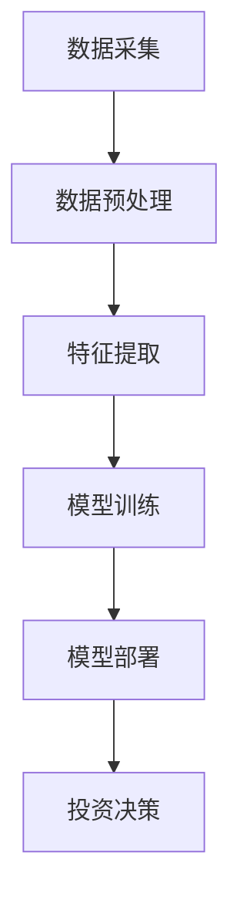
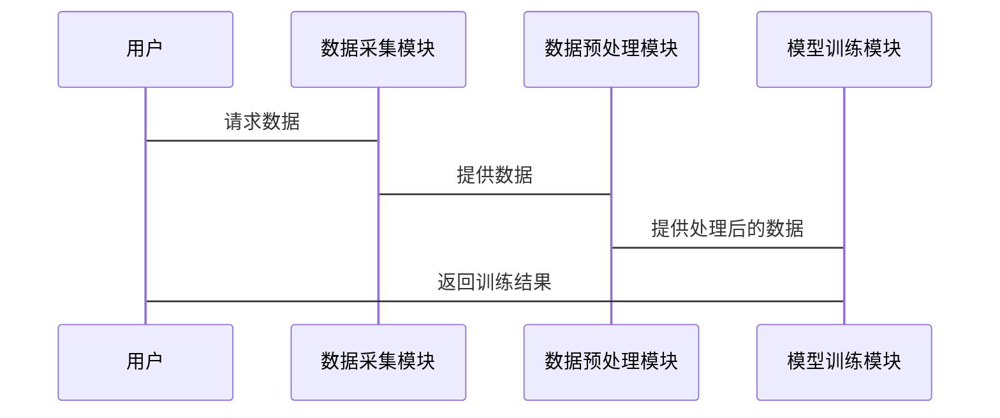

                 


# 迁移学习在跨市场投资模型中的应用

> 关键词：迁移学习，跨市场投资，机器学习，投资模型，深度学习，资产配置，风险管理

> 摘要：本文探讨了迁移学习在跨市场投资中的应用，详细分析了迁移学习的核心概念、算法原理及其在跨市场投资模型中的实现。通过系统架构设计和实际案例分析，展示了如何利用迁移学习解决跨市场数据不足和模型适应性问题，优化投资策略。

---

## 第一部分：背景介绍

### 第1章：迁移学习与跨市场投资概述

#### 1.1 迁移学习的基本概念
- **定义**：迁移学习是一种机器学习技术，通过将一个领域的知识迁移到另一个领域，以提高目标领域的模型性能。
- **核心思想**：利用源领域和目标领域之间的相似性，减少对目标领域数据的依赖。
- **与传统机器学习的区别**：传统机器学习依赖目标领域数据，而迁移学习通过利用源领域数据来弥补目标领域数据不足的问题。

#### 1.2 跨市場投資的基本概念
- **定义**：跨市场投资是指将资金分配到不同市场（如股票、债券、外汇等）进行投资，以分散风险并优化收益。
- **优势与挑战**：
  - 优势：分散风险，利用不同市场的差异性获取超额收益。
  - 挑战：不同市场之间存在差异性，导致模型难以直接迁移。
- **核心要素**：市场数据、资产配置、风险管理。

#### 1.3 迁移学习在跨市場投資中的应用背景
- **数据特性**：跨市场数据具有差异性，但存在某些共通性，适合迁移学习。
- **挑战**：目标市场数据不足，模型泛化能力差。
- **价值**：通过迁移学习优化跨市场投资模型，提升预测精度和投资收益。

---

## 第二部分：核心概念与原理

### 第2章：迁移学习的核心概念与原理

#### 2.1 迁移学习的核心概念
- **三要素**：源任务、目标任务、迁移策略。
- **任务类型**：完全迁移、自适应迁移、多任务迁移。
- **评价指标**：准确率、精确率、召回率、F1值。

#### 2.2 迁移学习的原理
- **数据分布的迁移**：通过变换数据分布，使源任务和目标任务的数据相似。
- **特征表示的迁移**：提取通用特征，降低数据域差异。
- **模型参数的迁移**：微调模型参数，适应目标任务。

#### 2.3 迁移学习的核心算法
- **基于特征遷移的方法**：使用特征提取器提取通用特征。
- **基于模型遷移的方法**：通过微调预训练模型参数。
- **基于知识遷移的方法**：利用先验知识增强模型性能。

### 第3章：跨市场投资模型的核心要素

#### 3.1 跨市場數據的特徵分析
- **差异性**：不同市场间数据分布差异。
- **共通性**：市场间存在某些相似性，适合迁移学习。
- **可遷移性**：数据特征的可迁移性。

#### 3.2 跨市場投資模型的任務定義
- **股票价格预测**：基于历史数据预测股票价格。
- **资产配置优化**：优化投资组合配置。
- **风险预警管理**：预测市场风险并提出预警。

#### 3.3 跨市場模型的遷移挑戰
- **市场环境差异**：不同市场的经济政策、市场结构差异。
- **数据量不足**：目标市场数据量少，难以训练可靠模型。
- **模型可解释性**：迁移模型的复杂性可能影响解释性。

---

## 第三部分：系统分析

### 第4章：迁移学习在跨市场模型中的算法实现

#### 4.1 数据预处理与特征提取
- **数据清洗与标准化**：去除异常值，标准化数据。
- **特征选择与降维**：选择重要特征，降低维度。
- **跨市场数据对齐**：统一不同市场的数据格式。

#### 4.2 基于深度学习的迁移学习
- **神经网络特征遷移**：使用预训练模型提取特征。
- **模型微调**：在目标任务上微调模型参数。
- **联合训练**：同时利用源任务和目标任务数据进行训练。

#### 4.3 基于传统机器学习的迁移学习
- **支持向量机（SVM）遷移**：通过参数调整实现迁移。
- **决策树遷移**：构建跨市场的决策树模型。
- **集成学习遷移**：结合多个模型进行迁移。

### 第5章：跨市场投资模型的系统架构设计

#### 5.1 系统功能设计
- **数据采集**：从多个市场收集数据。
- **模型训练**：利用迁移学习训练模型。
- **模型部署**：将模型应用于实际投资决策。

#### 5.2 系统架构设计（Mermaid架构图）


#### 5.3 系统接口设计
- **数据接口**：提供数据输入和输出接口。
- **模型接口**：提供模型训练和预测接口。
- **用户接口**：提供用户交互界面。

#### 5.4 系统交互设计（Mermaid序列图）


---

## 第四部分：项目实战

### 第6章：迁移学习在跨市场投资中的应用

#### 6.1 环境安装
- **Python环境**：安装Python 3.8及以上版本。
- **库安装**：安装TensorFlow、Keras、Scikit-learn等库。

#### 6.2 核心实现代码
```python
import tensorflow as tf
from tensorflow.keras import layers

# 定义迁移学习模型
def create_model(input_shape, num_classes):
    base_model = tf.keras.applications.VGG16(weights='imagenet', include_top=False, input_shape=input_shape)
    model = tf.keras.Sequential([
        base_model,
        layers.Flatten(),
        layers.Dense(256, activation='relu'),
        layers.Dense(num_classes, activation='softmax')
    ])
    return model

# 模型微调
model = create_model(input_shape=(224, 224, 3), num_classes=10)
model.trainable = False
model.compile(optimizer='adam', loss='sparse_categorical_crossentropy', metrics=['accuracy'])
```

#### 6.3 案例分析
- **案例选择**：使用股票价格预测模型。
- **数据准备**：收集不同市场的股票数据。
- **模型训练**：使用迁移学习训练模型。
- **结果分析**：评估模型性能，优化投资策略。

#### 6.4 项目总结
- **成果**：成功应用迁移学习优化跨市场投资模型。
- **经验**：迁移学习在数据不足时效果显著，但需注意模型调优和可解释性。

---

## 第五部分：最佳实践

### 第7章：迁移学习的最佳实践

#### 7.1 数据预处理的重要性
- **数据清洗**：确保数据质量。
- **特征选择**：选择关键特征。
- **数据增强**：增加数据多样性。

#### 7.2 模型选择与调优
- **选择合适的模型**：根据任务选择模型。
- **超参数调优**：优化模型性能。
- **模型评估**：使用交叉验证等方法评估模型。

#### 7.3 小结与注意事项
- **小结**：迁移学习在跨市场投资中具有巨大潜力。
- **注意事项**：注意模型过拟合，确保数据质量和模型可解释性。

---

## 第六部分：总结

### 第8章：总结与展望

#### 8.1 全文总结
- 迁移学习为跨市场投资提供了新的解决方案。
- 通过迁移学习，可以有效利用源市场数据，优化目标市场模型。

#### 8.2 未来展望
- 结合多模态数据，提升模型性能。
- 探索更高效的迁移学习算法。
- 结合强化学习，优化投资策略。

---

## 作者信息

作者：AI天才研究院 & 禅与计算机程序设计艺术

---

通过以上结构，文章详细探讨了迁移学习在跨市场投资中的应用，从理论到实践，为读者提供了全面的知识和指导。

