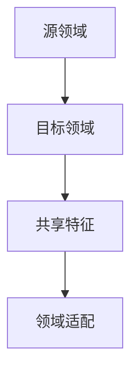
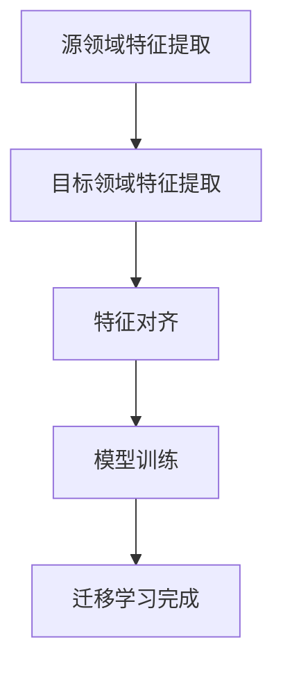
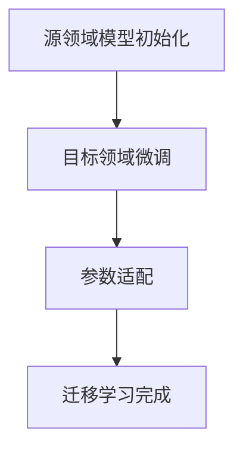
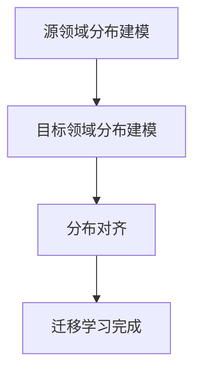
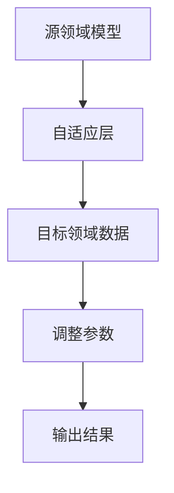
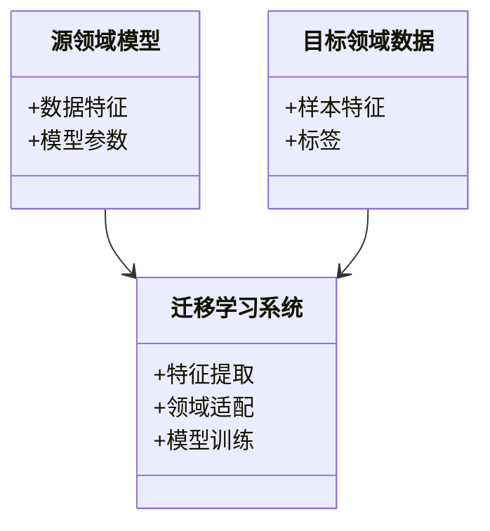

                 


# 迁移学习：快速适应新领域的AI Agent

## 关键词：迁移学习，AI Agent，机器学习，领域适应，深度学习

## 摘要：迁移学习是一种通过将已学习的知识应用于新领域来提升AI Agent适应能力的技术。本文从背景、核心算法、系统设计、项目实战到未来趋势，全面解析迁移学习，帮助读者快速掌握这一技术。

---

# 第一部分: 迁移学习的背景与概念

## 第1章: 迁移学习的核心概念

### 1.1 迁移学习的定义与背景

#### 1.1.1 机器学习的基本概念
机器学习是一种通过数据训练模型，使其能够从经验中学习并做出预测的技术。传统机器学习方法依赖于大量标注数据，但数据获取成本高，尤其是小样本领域。

#### 1.1.2 迁移学习的定义
迁移学习是通过将一个领域（源领域）的知识迁移到另一个领域（目标领域），以提高目标领域的学习效率和性能的技术。

#### 1.1.3 迁移学习的背景与重要性
在许多实际场景中，目标领域数据稀少，而源领域数据充足。迁移学习可以有效利用源领域知识，减少对目标领域数据的依赖。

---

### 1.2 迁移学习的核心概念与属性

#### 1.2.1 核心概念的结构与组成
迁移学习涉及源领域、目标领域、共享特征、领域适配等核心概念。

#### 1.2.2 迁移学习的属性对比表

| 属性                | 来源领域            | 目标领域            |
|---------------------|---------------------|---------------------|
| 数据量              | 充足               | 稀少               |
| 数据分布            | 稳定               | 可能不同           |
| 任务                | 相关               | 相关               |

#### 1.2.3 ER实体关系图（Mermaid）


---

## 第2章: 迁移学习的应用场景与挑战

### 2.1 迁移学习的主要应用场景

#### 2.1.1 数据不足的情况
当目标领域数据不足时，迁移学习可以帮助利用源领域的数据进行训练。

#### 2.1.2 领域间相似性分析
在自然语言处理中，可以将源领域的文本特征迁移到目标领域。

#### 2.1.3 实时适应新领域的需求
AI Agent需要快速适应新环境，如智能客服实时迁移至新客户群体。

---

### 2.2 迁移学习的挑战与边界

#### 2.2.1 数据异构性问题
源领域和目标领域的数据分布差异可能导致迁移失败。

#### 2.2.2 过度迁移与欠迁移风险
过度迁移可能降低源领域性能，欠迁移可能无法有效提升目标领域性能。

#### 2.2.3 计算资源与效率限制
复杂的迁移学习算法需要大量计算资源，可能影响实时性。

---

### 2.3 迁移学习与其他技术的联系与区别

#### 2.3.1 与传统机器学习的对比
传统机器学习需要大量目标领域数据，而迁移学习利用源领域数据。

#### 2.3.2 与深度学习的关系
深度学习提供了强大的特征提取能力，迁移学习进一步优化特征适配。

#### 2.3.3 与领域适应技术的异同
领域适应是迁移学习的一种，专注于数据分布的调整。

---

# 第二部分: 迁移学习的核心算法与原理

## 第3章: 基于特征的迁移学习算法

### 3.1 特征提取方法

#### 3.1.1 线性变换与非线性变换
线性变换如PCA，非线性变换如t-SNE。

#### 3.1.2 维度降维技术
使用主成分分析（PCA）降低数据维度。

#### 3.1.3 流形学习方法
通过流形学习捕捉数据分布。

---

### 3.2 基于特征的迁移学习流程（Mermaid）



---

### 3.3 特征对齐的数学模型

#### 3.3.1 最小化特征距离公式
$$d(x_i, x_j) = ||x_i - x_j||_2$$

#### 3.3.2 最大化特征相似性公式
$$s(x_i, x_j) = \frac{x_i \cdot x_j}{||x_i|| \cdot ||x_j||}$$

---

## 第4章: 基于参数的迁移学习算法

### 4.1 参数迁移方法

#### 4.1.1 参数初始化与微调
在源领域预训练模型，微调目标领域数据。

#### 4.1.2 参数共享机制
共享部分参数，减少参数数量。

#### 4.1.3 参数适配策略
动态调整参数以适应目标领域。

---

### 4.2 基于参数的迁移学习流程（Mermaid）



---

## 第5章: 基于分布的迁移学习算法

### 5.1 分布适配方法

#### 5.1.1 Kullback-Leibler散度
$$KL(p || q) = \sum p \log \frac{p}{q}$$

#### 5.1.2 最小化最大值差异
$$\min_{\theta} \max_{x_i \in S, x_j \in T} L(x_i, x_j, \theta)$$

---

### 5.2 基于分布的迁移学习流程（Mermaid）



---

## 第6章: 迁移学习的自适应策略

### 6.1 自适应层的设计

#### 6.1.1 智能体的自适应机制
通过自适应层动态调整模型参数。

#### 6.1.2 迁移策略的选择
根据目标领域数据选择合适的迁移策略。

---

### 6.2 迁移学习的自适应流程（Mermaid）



---

# 第三部分: 迁移学习的系统设计与实现

## 第7章: 迁移学习系统的总体架构

### 7.1 系统功能设计（Mermaid）



---

## 第8章: 迁移学习的系统实现

### 8.1 系统实现的关键技术

#### 8.1.1 数据预处理
归一化、特征选择等。

#### 8.1.2 模型选择
选择适合的迁移学习算法。

#### 8.1.3 评估指标
准确率、F1分数等。

---

## 第9章: 迁移学习的项目实战

### 9.1 项目环境安装

#### 9.1.1 Python环境
安装Python 3.8及以上版本。

#### 9.1.2 库依赖
安装TensorFlow、Keras、Scikit-learn等库。

---

### 9.2 项目核心实现（Python代码）

```python
import tensorflow as tf
from tensorflow.keras import layers

# 源领域模型
source_model = tf.keras.Sequential([
    layers.Dense(128, activation='relu'),
    layers.Dense(10, activation='softmax')
])

# 迁移学习模型
def build_transfer_model():
    model = tf.keras.Sequential()
    model.add(source_model.layers[:2])
    model.add(layers.Dense(2, activation='softmax'))
    return model

transfer_model = build_transfer_model()
transfer_model.compile(optimizer='adam', loss='sparse_categorical_crossentropy', metrics=['accuracy'])
```

---

### 9.3 代码应用解读

#### 9.3.1 源领域模型加载
加载预训练的源领域模型权重。

#### 9.3.2 迁移模型构建
复用源领域模型的特征提取部分，重新训练目标领域的分类器。

---

## 第10章: 迁移学习的系统优化与调优

### 10.1 系统优化策略

#### 10.1.1 参数调整
调整学习率、批量大小等超参数。

#### 10.1.2 模型优化
使用正则化技术防止过拟合。

---

### 10.2 迁移学习的调优步骤

#### 10.2.1 数据增强
增加数据多样性。

#### 10.2.2 模型微调
逐步冻结部分层，进行微调。

---

# 第四部分: 迁移学习的未来趋势与最佳实践

## 第11章: 迁移学习的未来趋势

### 11.1 迁移学习的前沿技术
元学习、自适应网络等。

---

### 11.2 迁移学习的发展方向
多领域迁移、在线迁移学习等。

---

## 第12章: 迁移学习的最佳实践

### 12.1 小结
迁移学习能够有效提升AI Agent的适应能力。

### 12.2 注意事项
选择合适的迁移策略，避免数据泄漏。

### 12.3 实战技巧
从简单场景入手，逐步扩展复杂场景。

---

## 第13章: 进一步阅读与学习

### 13.1 推荐书籍
《迁移学习》、《深度学习》等。

---

## 作者：AI天才研究院/AI Genius Institute & 禅与计算机程序设计艺术 /Zen And The Art of Computer Programming

---

感谢您的阅读！希望这篇文章能帮助您理解迁移学习的核心概念和实际应用。如果需要进一步探讨或有其他问题，请随时联系。

