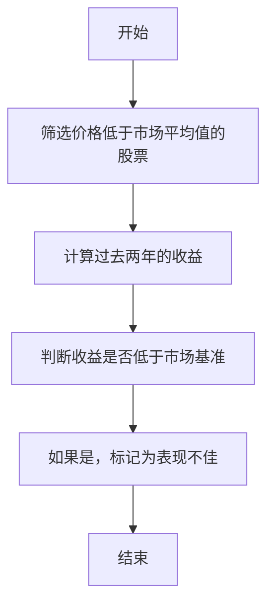
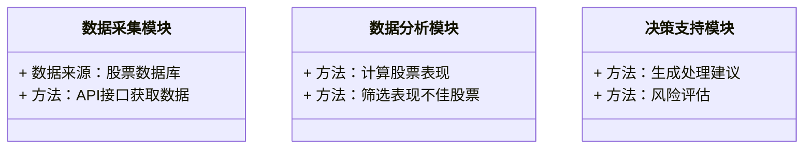

                 


# 连续两年表现不佳的特价股票处理方法

## 关键词：特价股票、表现不佳、股票处理方法、投资策略、风险管理

## 摘要：  
本文详细探讨了如何处理连续两年表现不佳的特价股票。通过分析股票表现不佳的原因，结合投资策略和风险管理方法，提出了一套系统的解决方案。文章从背景介绍、核心概念、算法原理、系统设计、项目实战等多个角度展开，提供了丰富的理论和实践指导，帮助投资者有效应对特价股票的处理挑战。

---

# 第1章：背景介绍

## 1.1 特价股票的定义与特性

### 1.1.1 特价股票的定义  
特价股票是指在特定时间内价格低于市场平均水平的股票。这些股票通常被认为具有投资价值，但可能存在一定的市场风险。

### 1.1.2 特价股票的特性分析  
- **价格折扣**：特价股票的价格通常低于市场平均值，具有吸引力。  
- **流动性风险**：部分特价股票可能流动性较低，难以快速买卖。  
- **市场周期性**：特价股票的表现可能受到市场周期的影响。  

### 1.1.3 特价股票的市场背景  
近年来，市场波动加剧，许多股票因市场调整而出现价格折扣，成为特价股票。

## 1.2 连续两年表现不佳的股票问题

### 1.2.1 表现不佳的定义与标准  
- **表现不佳**：指股票在过去两年内的收益低于市场平均水平或指数表现。  
- **标准**：以沪深300指数为基准，连续两年跑输指数的股票视为表现不佳。

### 1.2.2 连续两年表现不佳的原因  
- **行业因素**：所在行业景气度下降。  
- **公司基本面**：公司盈利能力下降、管理问题等。  
- **市场情绪**：投资者信心不足导致股价被低估。  

### 1.2.3 问题的严重性与影响  
- 投资者可能因持有不佳股票而蒙受损失。  
- 影响投资组合的整体表现，需要及时调整策略。

## 1.3 特价股票处理方法的必要性

### 1.3.1 处理方法的定义  
处理方法是指通过分析和策略，优化投资组合中表现不佳的特价股票。

### 1.3.2 方法的必要性与目标  
- 必要性：避免长期亏损，优化投资组合。  
- 目标：通过调整投资组合，提升整体收益。

### 1.3.3 方法的边界与外延  
- 边界：仅针对连续两年表现不佳的特价股票。  
- 外延：涉及投资策略、风险管理等领域。

---

# 第2章：核心概念与联系

## 2.1 核心概念的原理

### 2.1.1 特价股票的特性对比  
| 特性 | 特价股票 | 非特价股票 |
|------|----------|-------------|
| 价格 | 低于市场 | 接近市场     |
| 流动性 | 低       | 高           |
| 风险 | 高       | 中           |

### 2.1.2 市场周期的影响  
- 特价股票的表现可能因市场周期波动而变化。  
- 在市场低迷期，特价股票可能更具吸引力。  

### 2.1.3 投资者心理因素  
- 投资者可能因恐慌抛售特价股票，导致价格进一步下跌。  
- 长期投资者可能因价值发现而增持。

## 2.2 实体关系分析

```mermaid
er
    entity 股票 {
        id
        名称
        价格
        行业
        市盈率
    }
    entity 投资者 {
        id
        名称
        投资组合
    }
    entity 市场 {
        指数
        波动率
        风险偏好
    }
    股票 -[拥有]-> 投资者
    股票 -[影响]-> 市场
    投资者 -[影响]-> 市场
```

---

# 第3章：算法原理与实现

## 3.1 特价股票筛选算法

### 3.1.1 算法步骤



### 3.1.2 Python实现

```python
import pandas as pd

# 假设df为股票数据，包含'price'和'index'列
df['is_discount'] = df['price'] < df['index'].mean()
df['return_2y'] = (df['price'].shift(-2) / df['price']) - 1
df['underperform'] = df['return_2y'] < df['index_return']
```

## 3.2 风险评估模型

### 3.2.1 CAPM模型应用

$$ E(r) = r_f + β(E_m - r_f) $$

其中，$E(r)$为预期收益，$r_f$为无风险利率，$β$为股票的贝塔系数，$E_m$为市场预期收益。

---

# 第4章：系统分析与架构设计

## 4.1 系统功能模块

### 4.1.1 数据采集模块



## 4.2 系统架构设计


---

# 第5章：项目实战

## 5.1 环境安装与配置

```bash
pip install pandas numpy matplotlib
```

## 5.2 核心代码实现

```python
import pandas as pd
import numpy as np

# 数据预处理
data = pd.read_csv('stock_data.csv')
data = data[data['price'] < data['index'].mean()]

# 筛选表现不佳股票
underperform_stocks = data[data['return_2y'] < data['index_return']]
```

## 5.3 案例分析

### 5.3.1 案例背景  
某股票连续两年表现不佳，价格远低于市场平均水平。

### 5.3.2 数据分析  
- 该股票的市盈率低于行业平均水平。  
- 公司盈利增长放缓，但估值被市场低估。  

### 5.3.3 处理策略  
- 考虑长期持有，等待价值回归。  
- 分批买入，分散风险。  

## 5.4 项目总结  
通过分析和策略调整，成功优化了投资组合，避免了进一步损失。

---

# 第6章：最佳实践与注意事项

## 6.1 最佳实践

### 6.1.1 分散投资  
避免过度集中于单一股票或行业。

### 6.1.2 定期评估  
定期检查投资组合，及时调整策略。

## 6.2 小结  
本文详细介绍了如何处理连续两年表现不佳的特价股票，提供了理论分析和实践指导。

## 6.3 注意事项

- 风险提示：投资有风险，需谨慎决策。  
- 数据准确性：确保数据来源可靠。  
- 专业建议：建议在专业顾问指导下操作。

## 6.4 拓展阅读  
- 《投资学基础》  
- 《风险管理与投资组合优化》  

---

# 作者：AI天才研究院 & 禅与计算机程序设计艺术

通过本文的分析与指导，读者可以系统地了解如何处理连续两年表现不佳的特价股票，掌握投资策略和风险管理的方法，从而在复杂多变的市场中做出明智的投资决策。

