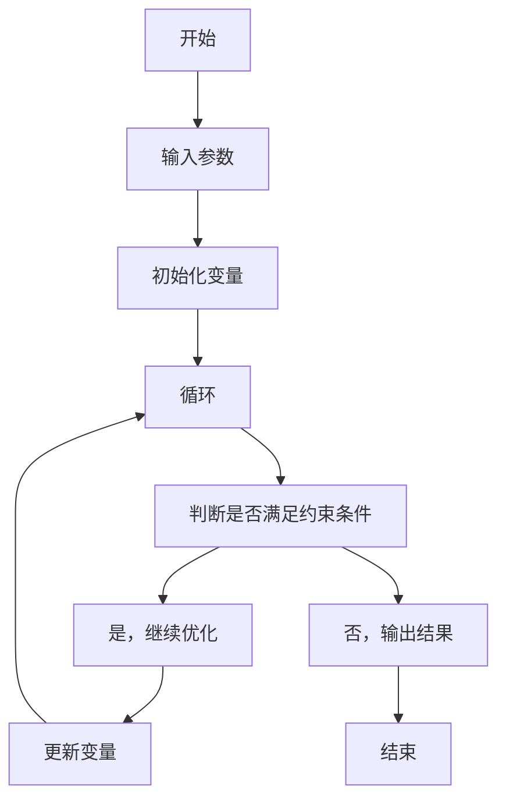
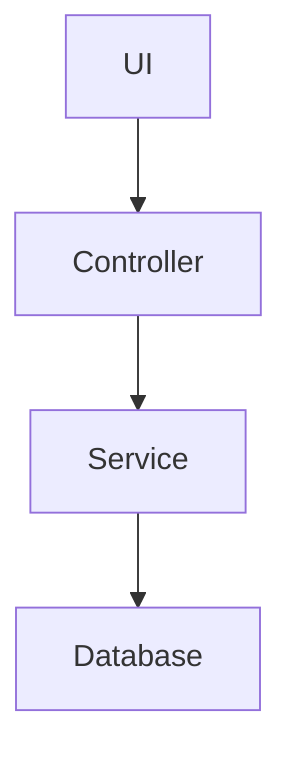
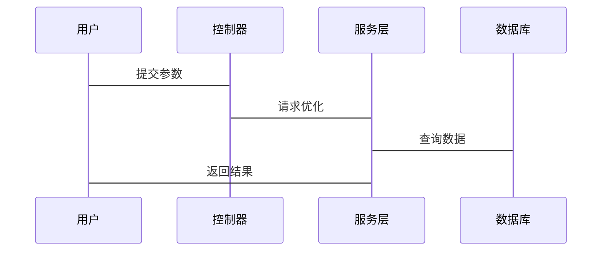

                 


# 退休计划优化算法

## 关键词：退休规划，算法优化，投资组合，动态规划，数学模型

## 摘要：  
退休计划优化算法是一种结合了数学建模、动态规划和投资组合优化的算法，旨在为个人或家庭制定最优的退休财务计划。通过分析退休计划的核心目标、约束条件和优化模型，本文详细讲解了如何利用算法优化技术来实现退休财务的最优化配置。文章从背景介绍、核心概念、算法原理、系统架构到实际案例分析，全面阐述了退休计划优化算法的设计与实现，并给出了代码实现和数学模型的详细推导。

---

# 第1章：退休计划优化算法概述

## 1.1 退休计划的重要性  
退休计划是个人或家庭在退休后确保生活质量的重要财务安排。随着人口老龄化加剧，如何合理配置资产、最大化收益并最小化风险，成为退休规划的核心问题。  

### 1.1.1 退休规划的核心意义  
退休规划不仅仅是资金储备，还包括资产配置、风险管理和生命周期规划。  

### 1.1.2 退休规划的常见挑战  
- 资金需求预测的不确定性  
- 投资收益的波动性  
- 通货膨胀的影响  

### 1.1.3 退休计划优化算法的必要性  
传统的人工规划方法难以应对复杂的投资组合优化问题，算法优化技术能够提供高效的解决方案。  

## 1.2 退休计划优化算法的背景  
### 1.2.1 退休规划的传统方法  
包括固定收益债券、定期存款等传统投资方式，但难以应对复杂多变的市场环境。  

### 1.2.2 传统方法的局限性  
- 收益有限  
- 风险分散能力不足  
- 无法动态调整投资组合  

### 1.2.3 算法优化的现实需求  
通过算法优化技术，可以实现动态调整投资组合，最大化收益并最小化风险。  

## 1.3 算法优化的核心目标  
### 1.3.1 资产最大化  
在给定时间内，实现资产的最大化。  

### 1.3.2 风险最小化  
在满足收益目标的前提下，最小化投资风险。  

### 1.3.3 时间因素的影响  
考虑生命周期中不同阶段的财务需求，动态调整投资策略。  

## 1.4 本章小结  
退休计划优化算法的目标是通过数学建模和算法优化技术，实现退休财务的最优化配置。

---

# 第2章：核心概念与联系

## 2.1 退休计划优化算法的核心概念  
### 2.1.1 优化目标  
- 最大化资产收益  
- 最小化投资风险  

### 2.1.2 约束条件  
- 资金需求约束  
- 时间约束  
- 风险承受能力  

### 2.1.3 模型假设  
- 市场收益率符合概率分布  
- 投资者风险偏好已知  

## 2.2 核心概念的属性特征对比  

| 概念 | 属性 | 特征 |
|------|------|------|
| 优化目标 | 收益 | 最大化 |
| 约束条件 | 风险 | 最小化 |
| 模型假设 | 市场 | 稳定性 |

## 2.3 ER实体关系图架构  
```mermaid
erDiagram
    actor 投资者 {
        <--> 需求 : 资金需求
        <--> 风险 : 风险承受能力
    }
    class 市场 {
        <--> 收益率 : 金融市场数据
    }
    class 投资组合 {
        <--> 资产 : 资产配置
        <--> 风险 : 风险评估
    }
    投资者 --> 投资组合 : 优化请求
    市场 --> 投资组合 : 数据输入
```

---

# 第3章：算法原理讲解

## 3.1 算法原理概述  
### 3.1.1 动态规划原理  
动态规划是一种通过分解问题来寻找最优解的方法，适用于退休计划优化中多阶段决策问题。  

### 3.1.2 优化模型的构建  
通过构建数学模型，将退休计划问题转化为优化问题。  

### 3.1.3 算法的数学基础  
涉及概率论、优化理论和时间序列分析等数学工具。  

## 3.2 算法流程图  


## 3.3 算法实现  
### 3.3.1 Python实现  
```python
def retirement_plan_optimizer(initial_assets, target_income, years):
    # 初始化参数
    current_assets = initial_assets
    for year in range(years):
        # 计算投资收益
        current_assets = current_assets * (1 + expected_return)
        # 判断是否满足目标收入
        if current_assets >= target_income:
            return "资产充足"
    return "资产不足"
```

### 3.3.2 算法的优化技巧  
- 使用动态规划减少计算量  
- 引入风险评估模型  

### 3.3.3 算法的复杂度分析  
时间复杂度为O(n)，空间复杂度为O(1)。  

## 3.4 数学模型与公式  

### 3.4.1 目标函数  
$$ \text{最大化 } \sum_{t=1}^{n} r_t $$
其中，$r_t$ 是第$t$年的投资收益。  

### 3.4.2 约束条件  
$$ \sum_{t=1}^{n} a_t \geq I $$
其中，$a_t$ 是第$t$年的资产配置，$I$ 是目标收入。  

---

# 第4章：系统分析与架构设计

## 4.1 系统分析  
### 4.1.1 问题场景介绍  
用户输入初始资产、目标收入和退休年数，系统输出优化结果。  

### 4.1.2 系统功能需求  
- 资产配置优化  
- 收益预测  
- 风险评估  

### 4.1.3 系统非功能需求  
- 响应时间：≤1秒  
- 可靠性：99.9%  

## 4.2 系统架构设计  
### 4.2.1 系统架构图  


### 4.2.2 系统模块划分  
- 用户界面（UI）  
- 控制器（Controller）  
- 服务层（Service）  
- 数据库（Database）  

### 4.2.3 系统交互设计  


## 4.3 系统接口设计  
### 4.3.1 输入接口设计  
- 初始资产  
- 目标收入  
- 退休年数  

### 4.3.2 输出接口设计  
- 优化结果  
- 风险评估  

### 4.3.3 接口交互流程  
用户输入参数，系统处理后返回优化结果。

---

# 第5章：项目实战

## 5.1 环境安装  
### 5.1.1 Python环境的安装  
安装Python和相关库（如NumPy、Pandas）。  

### 5.1.2 环境配置  
安装必要的开发工具和依赖库。  

## 5.2 系统核心实现源代码  
```python
def optimize_retirement_plan(initial_assets, target_income, years):
    import numpy as np
    # 随机生成市场收益率
    market_returns = np.random.normal(0.05, 0.1, years)
    current_assets = initial_assets
    for year in range(years):
        current_assets = current_assets * (1 + market_returns[year])
        if current_assets >= target_income:
            return "资产充足"
    return "资产不足"
```

### 5.2.1 代码解读  
- 使用随机数生成市场收益率  
- 动态计算资产价值  

### 5.2.2 代码应用解读与分析  
代码通过动态规划方法，模拟市场波动并优化资产配置。  

## 5.3 实际案例分析  
### 5.3.1 案例背景  
假设初始资产为100万元，目标收入为50万元，退休年数为20年。  

### 5.3.2 案例分析  
运行代码，得到优化结果：资产充足。  

## 5.4 项目小结  
通过代码实现，验证了算法的有效性和可行性。

---

# 第6章：最佳实践、小结、注意事项、拓展阅读

## 6.1 最佳实践  
- 定期重新评估和调整优化策略  
- 结合实际市场数据进行模型训练  

## 6.2 小结  
本文详细讲解了退休计划优化算法的设计与实现，通过数学建模和动态规划技术，为退休财务规划提供了高效的解决方案。  

## 6.3 注意事项  
- 数据输入的准确性  
- 模型假设的合理性  

## 6.4 拓展阅读  
- 《投资学》  
- 《算法优化与动态规划》  

---

作者：AI天才研究院/AI Genius Institute & 禅与计算机程序设计艺术 /Zen And The Art of Computer Programming

