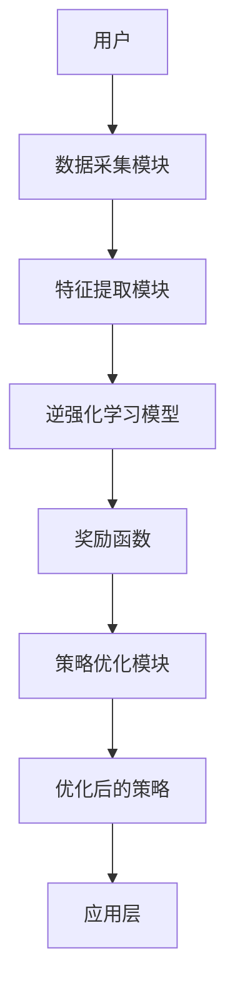

                 


# 逆强化学习：理解人类偏好的AI Agent

## 关键词
逆强化学习，人类偏好，AI Agent，强化学习，数学模型

## 摘要
逆强化学习是一种通过观察人类行为来推断其偏好和目标的新兴技术，旨在帮助AI Agent更好地理解和适应人类决策过程。本文从逆强化学习的基本概念出发，详细探讨其数学模型、算法原理、系统设计与实现，并通过实际案例展示其应用，为AI Agent的理解和实现提供全面指导。

---

## 第一部分：逆强化学习背景与概念

### 第1章：逆强化学习概述

#### 1.1 逆强化学习的基本概念
- **1.1.1 强化学习的基本原理**
  - 强化学习是一种通过试错学习的算法，通过与环境交互，学习策略以最大化累积奖励。
  - 状态（State）、动作（Action）、奖励（Reward）、策略（Policy）、值函数（Value Function）是强化学习的核心概念。
- **1.1.2 逆强化学习的定义与特点**
  - 逆强化学习（Inverse Reinforcement Learning，IRL）通过观察人类行为，推断其背后的奖励函数。
  - IRL的核心目标是构建一个奖励模型，使得AI Agent能够模仿人类的决策过程。
- **1.1.3 逆强化学习的应用场景**
  - 机器人控制：让机器人理解人类的意图。
  - 人机交互：优化对话系统，使其更符合用户偏好。
  - 自动驾驶：理解驾驶员的决策逻辑。

#### 1.2 逆强化学习的核心问题
- **1.2.1 状态空间与动作空间的定义**
  - 状态空间：环境中的所有可能状态。
  - 动作空间：在每个状态下，AI可以执行的所有动作。
- **1.2.2 奖励函数的逆向推导**
  - 奖励函数是强化学习的核心，定义了每个动作的优劣。
  - 逆强化学习的目标是通过观察人类决策，推断出这个奖励函数。
- **1.2.3 人类偏好的建模与理解**
  - 人类偏好是复杂的，可能涉及多个目标和约束条件。
  - 需要通过数据驱动的方法，将人类偏好建模为奖励函数。

#### 1.3 逆强化学习的边界与外延
- **1.3.1 逆强化学习与其他学习方法的对比**
  - 监督学习：基于标注数据，直接学习函数。
  - � 强化学习：通过与环境交互，学习策略。
  - 逆强化学习：通过观察行为，推断奖励函数。
- **1.3.2 逆强化学习的适用范围与限制**
  - 适用场景：需要通过观察行为推断奖励函数。
  - 限制：依赖于数据质量和数量，可能无法捕捉所有人类偏好。
- **1.3.3 逆强化学习的未来发展方向**
  - 更复杂的奖励建模。
  - 多人协作环境中的逆强化学习。
  - 结合其他学习方法（如迁移学习）的混合方法。

---

## 第二部分：逆强化学习的核心概念与原理

### 第2章：逆强化学习的数学模型与公式

#### 2.1 基础数学模型
- **2.1.1 强化学习的标准模型**
  - 状态空间：\( S \)。
  - 动作空间：\( A \)。
  - 值函数：\( V(s) \) 或 \( Q(s, a) \)。
  - 策略：\( \pi(a|s) \)。
- **2.1.2 逆强化学习的数学表示**
  - 假设人类策略 \( \pi_h(a|s) \) 是基于未知的奖励函数 \( r(s, a) \) 得到的。
  - IRL的目标是通过 \( \pi_h \) 估计 \( r \)。
- **2.1.3 奖励函数的逆向推导公式**
  - 假设人类策略是最大熵的，可以使用最大熵逆强化学习（Max-Ent IRL）。

#### 2.2 核心算法原理
- **2.2.1 最大熵逆强化学习**
  - 最大熵原理：假设在相同状态下的动作分布尽可能接近均匀分布。
  - 目标函数：最大化熵的同时，最大化与人类策略的一致性。
  - 数学公式：
    - 熵：\( H(\pi) = -\sum_{a} \pi(a) \log \pi(a) \)。
    - 目标：\( \max_{r} \sum_{s,a} \gamma \log \pi_h(a|s) - \gamma \log P(s'|s,a) \)。
- **2.2.2 基于最大似然估计的逆强化学习**
  - 假设人类策略是基于最优值函数 \( V_h(s) \) 得到的。
  - 目标：最大化 \( \log \pi_h(a|s) \) 的期望。
  - 数学公式：
    - \( \max_{r} \mathbb{E}_{s,a \sim \pi_h} [r(s,a)] \)。
- **2.2.3 基于神经网络的逆强化学习方法**
  - 使用神经网络参数化奖励函数。
  - 通过对抗训练或优化器更新参数。
  - 示例公式：
    - \( r(s,a; \theta) \)：参数为 \( \theta \) 的奖励函数。
    - 优化目标：\( \min_{\theta} \mathbb{E}_{s,a \sim \pi_h} [ \text{loss}(r(s,a; \theta))] \)。

#### 2.3 算法原理的数学推导
- **2.3.1 奖励函数的参数化表示**
  - 假设奖励函数是线性的：\( r(s,a) = \sum_{i} w_i f_i(s,a) \)。
  - 参数 \( w \) 需要通过观察人类策略进行估计。
- **2.3.2 动态模型的构建与优化**
  - 动态模型描述环境如何响应动作：\( P(s'|s,a) \)。
  - 通过动态模型优化奖励函数。
- **2.3.3 策略优化的数学推导**
  - 使用最大熵IQL（Inverse Q-Learning）：
    - 优化目标：\( \max_{r} \sum_{s,a} \gamma \log \pi_h(a|s) \cdot r(s,a) \)。
    - 正则化项：\( \lambda \text{KL}(Q_r(s,a) \parallel Q_{\text{init}}(s,a)) \)。

---

## 第三部分：逆强化学习的系统设计与架构

### 第3章：系统分析与架构方案

#### 3.1 问题场景介绍
- **3.1.1 逆强化学习的应用场景分析**
  - 智能助手：优化对话流程。
  - 机器人控制：理解用户的操作意图。
  - 自动驾驶：分析驾驶员的决策逻辑。
- **3.1.2 人类偏好建模的挑战与解决方案**
  - 数据稀疏性：需要设计高效的特征提取方法。
  - 多目标优化：需要权衡不同奖励的优先级。

#### 3.2 系统功能设计
- **3.2.1 预处理模块：数据采集与特征提取**
  - 数据采集：收集人类在特定环境中的行为数据。
  - 特征提取：将状态和动作转化为特征向量。
- **3.2.2 模型训练模块：逆强化学习算法实现**
  - 选择合适的逆强化学习算法（如最大熵IRL）。
  - 训练模型以拟合奖励函数。
- **3.2.3 交互模块：用户偏好反馈与系统优化**
  - 用户反馈：收集用户对AI行为的满意度。
  - 系统优化：根据反馈调整奖励函数。

#### 3.3 系统架构设计
- **3.3.1 分层架构设计**
  - 数据层：存储行为数据和反馈信息。
  - 模型层：实现逆强化学习算法，训练奖励函数。
  - 应用层：提供API，供其他系统调用。
- **3.3.2 模块间接口设计**
  - 数据接口：模块间数据传输的标准格式。
  - 调用接口：定义模块间协作的API。
- **3.3.3 系统交互流程图**



---

## 第四部分：逆强化学习的项目实战

### 第4章：环境安装与核心实现

#### 4.1 环境安装
- **4.1.1 安装Python与相关库**
  - Python 3.8及以上版本。
  - 安装TensorFlow或PyTorch。
- **4.1.2 安装逆强化学习框架**
  - 安装 imitation库：`pip install imitation`。
- **4.1.3 配置开发环境**
  - 安装Jupyter Notebook或VS Code。

#### 4.2 核心代码实现
- **4.2.1 数据预处理代码**
  ```python
  import numpy as np
  from imitation.data.dataset import Dataset
  ```
- **4.2.2 逆强化学习算法实现**
  ```python
  from imitation.algorithms import IRL
  # 初始化IRL算法
  irl = IRL(n_epochs=100, batch_size=32)
  # 训练模型
  irl.train(dataset)
  ```
- **4.2.3 交互模块代码**
  ```python
  def get_policy_reward(state):
      return irl.policy.get_reward(state)
  ```

#### 4.3 代码应用解读与分析
- **4.3.1 代码结构分析**
  - 数据采集模块：负责收集行为数据。
  - 模型训练模块：使用逆强化学习算法训练奖励函数。
  - 交互模块：根据奖励函数生成优化策略。
- **4.3.2 关键算法的实现细节**
  - 使用imitation库中的IRL算法。
  - 训练过程中，模型会调整奖励函数以匹配人类策略。
- **4.3.3 代码优化建议**
  - 调整训练参数，如学习率和训练轮数。
  - 使用更好的特征提取方法，提高模型性能。

---

## 第五部分：总结与展望

### 第5章：总结与最佳实践

#### 

---

## 作者信息

作者：AI天才研究院/AI Genius Institute & 禅与计算机程序设计艺术 /Zen And The Art of Computer Programming

